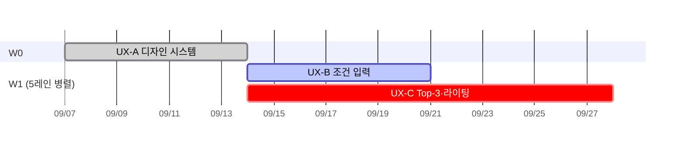

# 단계 오케스트레이션

근거 — `EXEC-ai-place-compressed-v1.0.md` §1·§3 (DAG·트랙) · `docs/issues-aiplace/P4b-dependency.md` §1

**순차 루프와 다른 점** — 순차는 한 번에 한 태스크를 돈다. 오케스트레이션은 **의존이 없는 태스크를 동시에** 굴리고 합류 지점에서 검증한다.
DAG의 같은 ES(최조 착수 시점)에 있는 태스크는 원래 병렬이다. 그걸 실제로 병렬로 만드는 것이 이 규격이다.

---

## 1. 웨이브와 레인

```
웨이브(wave)  = 같은 ES 를 갖는 태스크 묶음. 순서가 있다
레인(lane)    = 웨이브 안의 한 태스크. 서로 독립이다
합류(join)    = 여러 레인이 후행 태스크의 선행으로 모이는 지점
```

**웨이브는 순차, 레인은 병렬이다.** 웨이브를 건너뛰지 않는다.

## 2. 레인 격리 — 충돌을 구조로 막는다

병렬 작업의 실패 원인 1위는 **같은 파일을 두 레인이 만지는 것**이다.

| 규칙 | 내용 |
| --- | --- |
| **파일 소유권** | 레인 1개 = 산출 파일 1개. 두 레인이 같은 파일을 쓰면 레인을 잘못 나눈 것이다 |
| **공유 파일은 웨이브 종료 후** | 인덱스·요약·원장은 **디스패치 후 오케스트레이터가** 한 번에 갱신한다 |
| **브랜치는 웨이브 단위** | 레인마다 브랜치를 만들면 순차 체크아웃이 되어 병렬이 깨진다 |
| **읽기는 자유** | 선행 웨이브 산출물을 읽는 것은 제약하지 않는다 |

**브랜치 1개 · PR 1개 = 웨이브 1개.** 레인은 그 안의 파일이다.

## 3. 디스패치

오케스트레이터는 **작업하지 않는다.** 레인을 띄우고 결과를 검증한다.

```
웨이브 시작
  ├─ 선행 웨이브 전건 CLOSED 확인 (아니면 중단)
  ├─ 레인 N개를 한 번에 디스패치 — 한 응답에서 동시 호출
  ├─ 각 레인에 전달: 태스크 ID · 이슈번호 · 산출 파일 경로 · 규격 스킬 · 읽을 선행 산출물
  ├─ 전 레인 복귀 대기
  ├─ 합류 게이트 검증
  └─ 원장 갱신 · 커밋 · 다음 웨이브
```

| 규칙 | 이유 |
| --- | --- |
| **한 응답에서 전 레인 동시 호출** | 응답을 나눠 호출하면 순차가 된다 |
| **레인은 자기 파일만 쓴다** | 격리 규칙 |
| **레인이 실패하면 그 레인만 재시도** | 웨이브를 처음부터 돌리지 않는다 |
| **레인 2회 실패 시 웨이브 중단** | 같은 실패를 반복하지 않는다 |

## 4. 합류 게이트

레인이 다 돌아왔다고 웨이브가 끝난 게 아니다. **아래를 통과해야 다음 웨이브로 간다.**

| 검사 | 명령 성격 |
| --- | --- |
| 산출 파일이 레인 수만큼 존재 | `find ... \| wc -l` |
| 각 파일이 규격을 만족 | 절 개수·필수 항목 `grep -c` |
| **불변 규칙 위반 0건** | `/review-invariants` |
| 레인 간 모순 없음 | 교차 참조 확인 — 합류 웨이브에서만 |
| 이슈 상태 반영 | `gh issue list` |

**하나라도 실패하면 다음 웨이브를 시작하지 않는다.**

## 5. 진행 원장

`docs/goals/<stage>-LEDGER.md` 한 파일. **오케스트레이터만 쓴다.**

```markdown
# <단계> 진행 원장

WAVE: W1
LANES_DONE: 3
LANES_TOTAL: 8
DECISIONS: 2

## 웨이브 기록
| 웨이브 | 레인 | 상태 | 합류 게이트 |
| --- | --- | --- | --- |
| W0 | UX-A | DONE | PASS |
| W1 | UX-B UX-C UX-E UX-G UX-H | RUNNING | — |

## 결정 로그
- [MINOR] ...

STOP REASON:
```

**`grep` 가능한 카운터 줄을 유지한다** — `WAVE:` `LANES_DONE:` `LANES_TOTAL:` `DECISIONS:`.
종료 시 `STOP REASON:` 뒤에 코드를 채운다.

## 6. Gantt 갱신

원장에 **계획 대비 실제** Gantt를 둔다. 웨이브 종료마다 갱신한다.



- 완료 `done` · 진행 `active` · **임계 경로 `crit`**
- 레인이 같은 `after`를 가리키면 **동시 시작**으로 렌더된다 — 병렬이 눈에 보인다

## 7. 이 프로젝트에서 오케스트레이션이 되는 단계

| 단계 | 최대 병렬 폭 | 근거 |
| --- | --- | --- |
| **UX 설계** | **5레인** (`UX-A` 이후) | 아래 §8 |
| Phase 0 | 4~6레인 | 계약 7 · 플랫폼 4 · 데이터 5 · Mock 1 · 검증 1 |
| 계약 (`SPEC`) | 6레인 (`SPEC-001` 이후) | `SPEC-001`이 나머지 8건을 막는다 |
| 검증 (`TEST`) | 레인 다수 | 선행 구현이 끝난 것부터 |

**병렬이 안 되는 구간** — `IDX-A`→`IDX-B`→`IDX-C`, `EVD-A`→`B`→`C`, `RSV-A`→`C`→`D`, `MCH-A`→`AGT-A`→`B`→`C`.
인원을 넣어도 줄지 않는다. 오케스트레이션 대상이 아니다.

## 8. UX 단계 레인 편성 (실측)

```
W0  1레인   UX-A                                     0~1주
W1  5레인   UX-B UX-C UX-E | UX-G UX-H (phase2/)     1~3주
W3  2레인   UX-D(←UX-C) UX-F(←UX-B·UX-C)             3~4주
```

**UX 단계 임계 사슬 = `UX-A` → `UX-C` → `UX-D`/`UX-F` = 4주.** 5레인을 다 굴려도 4주 아래로 안 내려간다.
`UX-C`가 2주로 가장 길고 `UX-D`·`UX-F` 둘의 선행이므로 **`UX-C`를 먼저 디스패치한다.**

`UX-G`·`UX-H`는 **Phase 2 조건부**다. `docs/design/ux/phase2/`에 격리해 게이트 미통과 시 통째로 이월한다.
