# [설계 문서] AI-Place-Mate · Next.js 런타임 설계

# 소프트웨어 설계 문서 (SDD · 구현 제약 반영본)

**문서 ID:** SDD-AIPLACE-NEXT-001

**개정 버전:** 1.0

**날짜:** 2026-08-24

**상위 문서:** [`SRS-ai-place-nextjs-v1.0.md`](SRS-ai-place-nextjs-v1.0.md) (SRS-AIPLACE-NEXT-001) — `REQ-IMPL` 34건 · 제약 충돌 해소 11건

**관련 문서:** [`[SRS]ai-place -mate-SRSv1.0.md`](%5BSRS%5Dai-place%20-mate-SRSv1.0.md) (기준 요구사항 59건) · [`[DIAGRAMS]DESIGN-ai-place-v1.0.md`](%5BDIAGRAMS%5DDESIGN-ai-place-v1.0.md) (플랫폼 비종속 설계)

---

## 1. 서론

### 1.1 목적

본 문서는 `REQ-IMPL` 34건을 **Next.js·Vercel·Supabase 런타임에서 실제로 동작하는 구조**로 상세화한다. 런타임 경계, 캐시 계층, RLS 정책, 지연 평가 쿼리, Cron 작업, 컴포넌트 경계를 다룬다.

### 1.2 네 문서의 경계

문서가 넷이므로 **어디에 무엇이 있는지**를 먼저 못 박는다. 같은 내용을 두 곳에 두지 않는다.

| 문서 | 담는 것 | 담지 않는 것 |
| --- | --- | --- |
| `[SRS]ai-place -mate-SRSv1.0.md` | 무엇을 만족해야 하는가 — 요구사항 59건, 인수 기준 | 플랫폼, 구현 방식 |
| `[DIAGRAMS]DESIGN-ai-place-v1.0.md` | 플랫폼 비종속 설계 — 도메인 클래스, 논리 컴포넌트, 유스케이스 명세 | 런타임, 프레임워크 API |
| `SRS-ai-place-nextjs-v1.0.md` | 제약과 그 결과 — C-TEC·C-DRV, 충돌 해소 11건, Prisma 스키마, 디렉터리, 환경 변수, 모듈 의존 규칙 | 런타임 내부 동작, 정책 상세 |
| **본 문서** | **런타임 설계** — 실행 경계, 캐시 계층, RLS 정책 매트릭스, 지연 평가 쿼리, Cron 상세, 컴포넌트 경계, 오류 열화 | 요구사항, 제약 선언, 스키마 정의 |

**중복 회피를 위해 본 문서가 하지 않는 것** — Prisma 스키마 재게시(제약 SRS 8.2), 디렉터리 구조 재게시(제약 SRS 8.1), 환경 변수 목록 재게시(제약 SRS 8.4), 모듈 의존 그래프 재게시(제약 SRS 4.4), 도메인 클래스 재게시(SDD 3.1).

### 1.3 도식 목록

| # | 도식 | 유형 | 절 |
| --- | --- | --- | --- |
| 1 | 배포·런타임 토폴로지 | flowchart | 2.1 |
| 2 | 런타임 선택 결정 흐름 | flowchart | 2.2 |
| 3 | 요청 수명주기 | sequenceDiagram | 2.3 |
| 4 | 탐색 모듈 내부 클래스 | classDiagram | 3.1 |
| 5 | AI provider 추상화 | classDiagram | 3.2 |
| 6 | 캐시 계층 판정 | flowchart | 4.1 |
| 7 | RLS 접근 판정 | flowchart | 5.1 |
| 8 | 콘솔 인증·MFA | sequenceDiagram | 5.2 |
| 9 | 대화방 지연 평가 판정 | flowchart | 6.1 |
| 10 | Cron 작업 실행 | flowchart | 6.3 |
| 11 | 서버·클라이언트 컴포넌트 경계 | flowchart | 7.1 |
| 12 | 오류 열화 상태 | stateDiagram | 7.3 |
| 13 | PG 웹훅 멱등 처리 | sequenceDiagram | 8.1 |
| 14 | 근거 문장 스트리밍 | sequenceDiagram | 8.2 |

### 1.4 버전 종속 사항의 취급

Next.js의 캐시 기본값, Vercel 함수 실행 시간 상한, Cron 호출 빈도는 **버전·플랜에 따라 달라진다.** 본 설계는 이 값들에 의존하지 않는 방식을 택했고, 값을 특정해야 하는 곳에는 **"명시 지정"** 원칙을 적용한다 — 기본값에 기대지 않고 코드에서 캐시 동작·시한·재검증 주기를 언제나 명시한다. 근거는 제약 SRS의 **C-DRV-002**다.

---

## 2. 런타임 구조

### 2.1 배포·런타임 토폴로지

> **읽는 방법** — 실선은 요청 경로, 점선은 클라이언트가 서버를 거치지 않는 직접 연결이다. 색이 다른 상자는 실행 위치가 다르다.

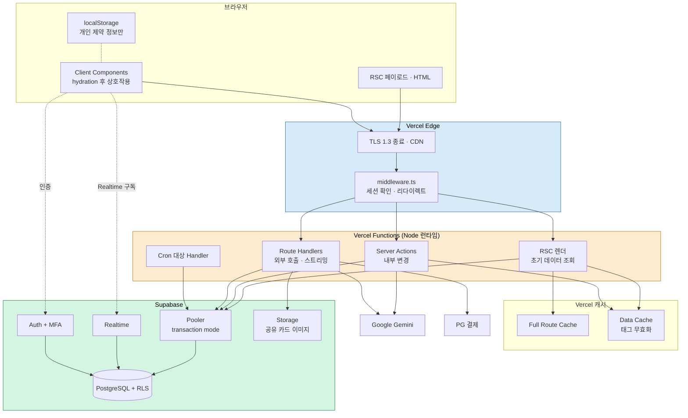

**배치 근거 4건**

| 결정 | 근거 |
| --- | --- |
| `middleware.ts`를 Edge에 둔다 | 세션 유무 확인과 리다이렉트만 하므로 DB 접근이 없다. Edge에서 처리하면 인증 실패 요청이 Function을 깨우지 않는다 |
| DB 접근 경로는 전부 **Node 런타임** | Prisma Client는 Edge 런타임에서 그대로 동작하지 않는다. DB에 닿는 모든 경로를 Node로 고정한다 |
| 개인 제약 정보를 `localStorage`에만 | `REQ-IMPL-029`. 서버 경로에 아예 도달하지 않게 해 옵트인 없는 전송을 구조적으로 차단한다 |
| 공유 카드 이미지를 Supabase Storage에 | Function 응답으로 바이너리를 흘리지 않는다. URL만 반환해 응답 크기와 시간을 줄인다 |

### 2.2 런타임 선택 결정 흐름

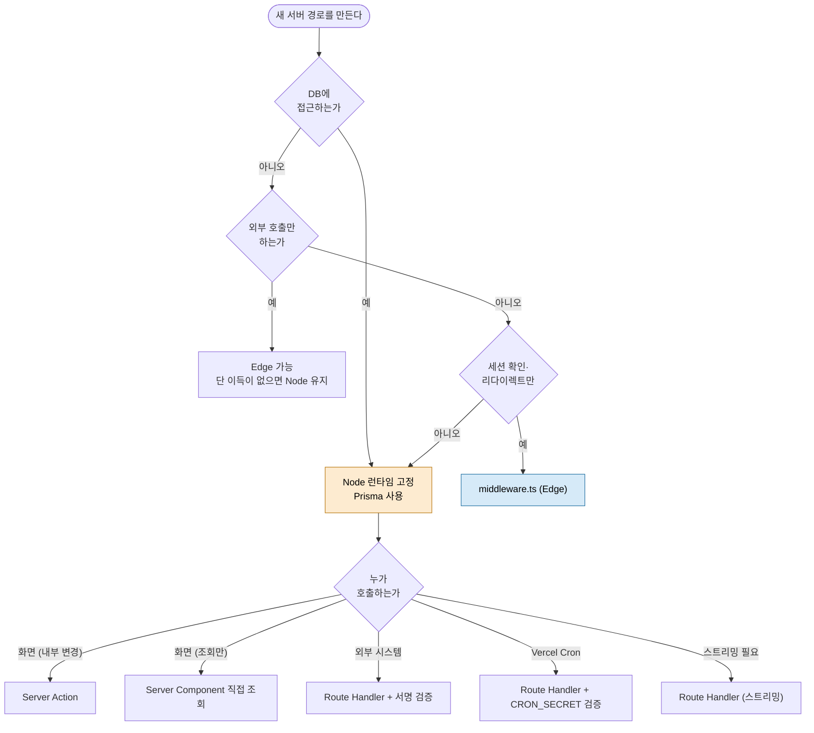

이 결정 흐름이 제약 SRS **3.2**의 선택 기준을 런타임 축과 결합한 것이다. **판정 순서가 중요하다** — 런타임(Node/Edge)을 먼저 정하고 호출자(Action/Handler)를 나중에 정한다. 반대로 하면 Server Action으로 정한 뒤 Prisma를 쓸 수 없다는 사실을 뒤늦게 발견한다.

### 2.3 요청 수명주기

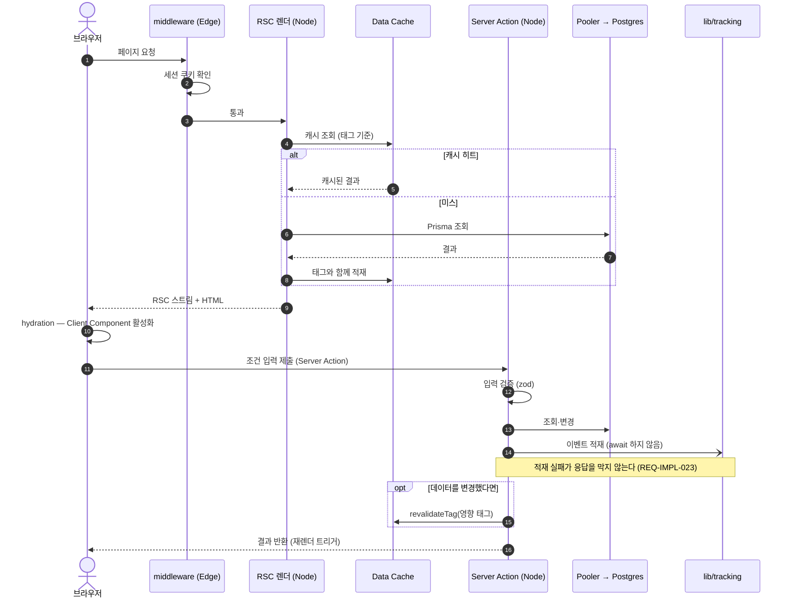

**설계 판단** — 이벤트 적재를 `await` 하지 않는다. `REQ-IMPL-023`이 응답 비차단을 요구하므로, 적재는 발행 후 결과를 기다리지 않고 실패 카운터만 올린다. 다만 **서버리스에서는 응답 후 실행이 보장되지 않으므로**, 적재 호출은 응답 반환 **이전에 시작**하되 완료를 기다리지 않는 형태로 둔다.

---

## 3. 계층 설계

### 3.1 탐색 모듈 내부 클래스

> SDD(비종속)의 도메인 클래스와 다른 층이다. 여기는 `lib/search`·`lib/evidence`의 **런타임 구현 단위**를 다룬다.

**비종속 SDD와 이름이 같은 요소** — 두 문서에 같은 이름이 나오면 같은 것으로 읽히므로 대응 관계를 밝힌다.

| 이름 | 비종속 SDD 3.2 (논리 계층) | 본 절 (Next.js 구현 단위) |
| --- | --- | --- |
| `EvidenceGate` | 근거 검증 책임을 가진 논리 클래스. `VerificationService`에 의존 | `RawCandidate[]` → `VerifiedCandidate[]` 변환 함수. `hasFourFields`·`staleFlag` 판정을 내포 |
| `RelevanceRanker` | 정렬 책임을 가진 논리 클래스 | `top3()` 단일 함수. 게이트 통과분만 받는다 |
| `ConditionParser` | interface + `NlConditionParser`/`StructuredFallback` 구현 | `ConditionParserPort` + `SdkConditionParser`로 접미를 붙여 구분했다. 분기 흡수는 `ConditionResolver`가 담당 |

**같은 이름을 유지한 이유** — 논리 설계와 구현이 1:1로 대응한다는 사실을 이름으로 표현했다. 대응이 깨지면 이름을 바꿔야 한다.

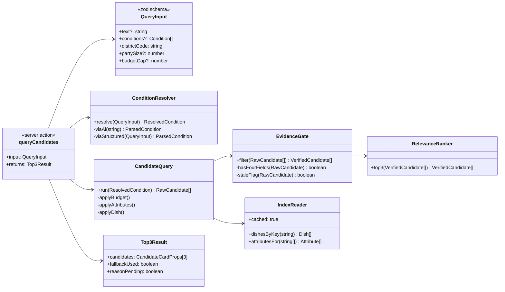

**세 가지를 명시한다.**

| 설계 | 근거 |
| --- | --- |
| `QueryInput`을 zod 스키마로 둔다 | Server Action은 클라이언트가 임의 페이로드를 보낼 수 있는 경계다. 타입만으로는 런타임 검증이 되지 않는다 |
| `ConditionResolver`가 AI/구조화 분기를 흡수한다 | 호출자는 파싱이 AI로 됐는지 폴백으로 됐는지 몰라도 된다. `REQ-IMPL-013`의 격리 지점 |
| `Top3Result.reasonPending`을 반환한다 | 근거 문장이 후행 도착하므로(`REQ-IMPL-015`) 화면이 그 사실을 알아야 한다. 응답 계약에 명시적으로 담는다 |

### 3.2 AI provider 추상화

`C-TEC-006`은 **환경 변수만으로 모델 교체**를 요구한다. 이를 구조로 강제한다.

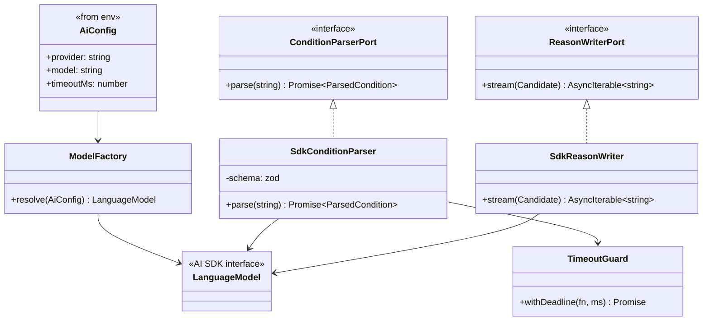

| 규칙 | 내용 |
| --- | --- |
| provider 결정을 `ModelFactory` 한 곳에 | `AI_PROVIDER`·`AI_MODEL`을 읽는 코드가 하나여야 교체가 환경 변수만으로 끝난다 (`REQ-IMPL-012`) |
| 도메인은 `Port` 인터페이스만 안다 | `lib/search`는 AI SDK 타입을 import하지 않는다. provider 교체가 도메인에 파급되지 않는다 |
| 구조화 출력은 스키마로 받는다 | 파싱 결과를 자유 텍스트로 받으면 후처리가 provider 특성에 묶인다. 스키마 기반 생성을 사용해 계약을 고정한다 |
| `TimeoutGuard`를 파싱에만 적용 | 파싱은 응답 경로에 있으므로 시한이 필수다(`REQ-IMPL-014`). 근거 문장은 스트리밍이라 시한 대신 중단 신호를 쓴다 |

**모델 교체 절차** — `AI_MODEL` 변경 → Preview 배포에서 파싱 정확도·지연 회귀 확인 → `main` 병합. 코드 변경 0건이 검증 항목이다.

### 3.3 데이터 접근 설계

`C-DRV-005`에 따라 Pooler(transaction mode)만 사용한다. 이 모드는 **세션 수준 기능을 쓸 수 없다.** 그로부터 따라오는 설계 규칙이다.

| 규칙 | 내용 | 근거 |
| --- | --- | --- |
| Prepared statement 비활성 | 연결 문자열에 풀러 모드를 명시해 Prisma가 prepared statement를 쓰지 않게 한다 | transaction mode 비호환 |
| 대화형 트랜잭션 금지 | 콜백 형태로 여러 왕복을 한 트랜잭션에 묶지 않는다. **배열 형태의 순차 실행**이나 단일 SQL로 표현한다 | 트랜잭션이 연결을 오래 붙잡으면 풀이 고갈된다 |
| Advisory lock 금지 | 세션에 묶이는 잠금을 쓰지 않는다. 동시성 제어는 유일 제약과 조건부 UPDATE로 표현한다 | 세션 미보장 |
| `SET LOCAL` 금지 | 세션 파라미터에 의존하지 않는다 | 동일 |
| 조회 폭 제한 | 후보 조회는 상권·반경으로 먼저 좁힌 뒤 속성을 일괄 조회한다. 후보별 개별 조회를 금지한다 | 왕복 수가 연결 점유 시간에 직결 |
| 마이그레이션만 직결 | 스키마 변경은 풀러를 우회한 직결 연결로만 실행한다 | DDL은 세션 기능을 요구한다 |

**동시성 제어의 구체 형태** — 제안 제출이 마감과 경쟁하는 경우를 잠금 없이 처리한다.

```sql
-- 마감 여부를 판정과 삽입을 한 문장에 담아 경쟁을 제거한다
INSERT INTO "Proposal" (id, "roomId", "placeId", headline, highlights, services)
SELECT $1, $2, $3, $4, $5, $6
WHERE EXISTS (
  SELECT 1 FROM "AgentRoom"
  WHERE id = $2 AND status = 'OPEN' AND "expiresAt" > now()
);
-- 영향 행 수가 0이면 마감된 것이다. 별도 잠금이 필요하지 않다
```

---

## 4. 캐싱 설계

### 4.1 캐시 계층 판정

`C-DRV-006`에 따라 별도 캐시 서버가 없다. Next.js 캐시 계층과 Postgres만으로 `REQ-NF-002`·`020`을 만족해야 한다.

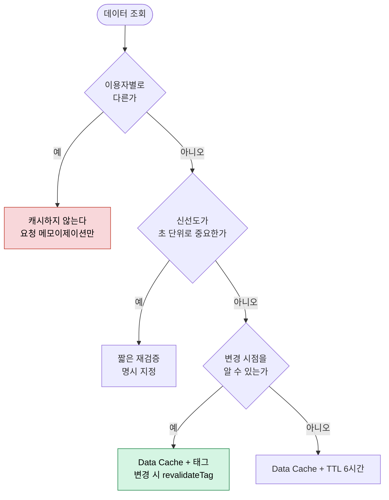

### 4.2 태그와 무효화 매트릭스

| 데이터 | 캐시 | 태그 | 무효화 계기 |
| --- | --- | --- | --- |
| 메뉴 색인 (`canonicalKey` 조회) | Data Cache · TTL 6h | `dish:{placeId}` · `dishkey:{canonicalKey}` | 메뉴 등록·수정 |
| 매장 속성 | Data Cache · TTL 6h | `attr:{placeId}` | 속성 등록·재확인 완료 |
| 가격 프로파일 | Data Cache · TTL 6h | `price:{placeId}` | 결제 편차 반영 배치 |
| 확인 상태 | **캐시하지 않음** | — | 불일치 신고가 즉시(60초 내) 반영돼야 한다 (`REQ-FUNC-013`) |
| Top-3 결과 | **캐시하지 않음** | — | 조건 조합이 이용자별이며 근거 상태에 종속된다 |
| 대화방·제안 | **캐시하지 않음** | — | 180초 수명이며 Realtime으로 갱신된다 |
| 매장 프로필 (콘솔) | **캐시하지 않음** | — | 이용자별 데이터 (RLS 적용) |
| KPI 스냅샷 | Data Cache · 집계 주기와 동기 | `kpi:{period}` | Cron 집계 완료 |

**두 가지를 명시한다.**

1. **확인 상태를 캐시하지 않는다.** 캐시하면 `REQ-FUNC-013`의 60초 반영을 지킬 수 없다. 속성 자체는 캐시하되 확인 상태는 매번 조회하는 분리 구조로 둔다.
2. **배포 시 캐시가 초기화된다.** 제약 SRS 4.3-8의 잔여 위험이다. 배포 직후 히트율 저하를 정상 동작으로 보고, 캐시 히트율 알림에서 배포 직후 구간을 제외한다.

---

## 5. 보안 설계

### 5.1 RLS 정책 매트릭스

`C-DRV-004`의 해소가 클라이언트의 직접 DB 구독이므로, **RLS가 유일한 방어선**이다(제약 SRS RN-2). 정책을 표로 고정한다.

| 테이블 | 익명 (anon) | 인증 이용자 | 매장 소유자 | service_role |
| --- | --- | --- | --- | --- |
| `Place` | SELECT (공개 필드) | SELECT | SELECT · UPDATE (소유 행) | 전권 |
| `Dish` | SELECT | SELECT | SELECT · INSERT · UPDATE (소유 매장) | 전권 |
| `PriceProfile` | SELECT | SELECT | SELECT · UPDATE (소유 매장) | 전권 |
| `Attribute` | SELECT | SELECT | SELECT · INSERT · UPDATE (소유 매장) | 전권 |
| `Verification` | SELECT | SELECT | SELECT | 전권 |
| `AgentRoom` | — | SELECT (본인 생성 행) | SELECT (소환된 방) | 전권 |
| `Proposal` | — | **SELECT (본인 방의 행만)** ← Realtime 구독 대상 | SELECT · INSERT (소유 매장) | 전권 |
| `Reservation` | — | SELECT (본인 행) | SELECT (소유 매장) | 전권 |
| `Payment` | — | SELECT (본인 행) | SELECT (소유 매장, 금액만) | 전권 |
| `TrackingEvent` | — | — | — | INSERT · SELECT |
| `AuditLog` | — | — | — | **INSERT · SELECT만.** UPDATE·DELETE 없음 |

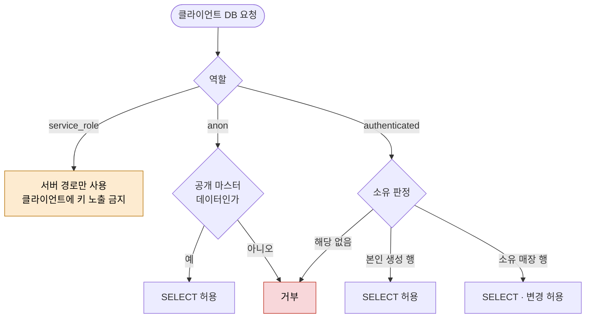

**정책 운영 규칙 3건**

| 규칙 | 내용 |
| --- | --- |
| 신규 테이블은 정책과 함께 | 테이블 생성 마이그레이션에 RLS 활성화와 정책을 **같은 파일**에 넣는다. 정책 없는 테이블이 배포되는 경로를 없앤다 (`REQ-IMPL-025`) |
| 기본 거부 | RLS를 켠 뒤 필요한 정책만 추가한다. 허용을 열거하는 방식이므로 누락은 거부로 귀결된다 |
| `service_role` 키는 서버 전용 | 클라이언트에 전달되면 RLS 전체가 무력해진다. 환경 변수 화이트리스트로 차단한다 (`REQ-IMPL-033`) |

### 5.2 콘솔 인증·MFA

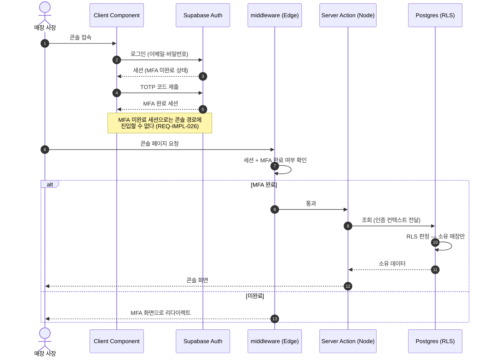

**Edge에서 MFA 완료 여부를 확인하는 이유** — DB 접근이 없는 판정이므로 Edge에서 가능하고, 미완료 요청이 Node Function을 깨우지 않는다. 다만 **Edge 판정을 신뢰 경계로 쓰지 않는다** — 실제 데이터 접근 통제는 RLS가 한다. 미들웨어는 사용성(리다이렉트)을 위한 것이다.

### 5.3 감사 로그 설계

`C-DRV-007`에 따라 별도 로그 저장소가 없다. Postgres 테이블로 `REQ-NF-025`(전량 감사 로그)와 `REQ-IMPL-027`을 만족한다.

| 항목 | 설계 |
| --- | --- |
| 기록 대상 | 내부 조회 — 운영자가 이용자·매장 데이터를 조회하는 모든 경로 |
| 기록 시점 | 조회 실행과 **같은 문장**에서 기록한다. 별도 호출로 분리하면 누락 경로가 생긴다 |
| 변경 불가성 | 애플리케이션 역할에 `AuditLog`의 UPDATE·DELETE 권한을 부여하지 않는다 |
| 누락 탐지 | 운영자 세션 수와 감사 레코드 수를 대조하는 Cron 점검을 둔다. 불일치 1건도 알림 |
| 보존 | 삭제하지 않는다. 파티셔닝으로 크기를 관리한다 |

**설계 판단** — 감사 기록을 애플리케이션 코드에 맡기면 새 조회 경로를 추가할 때 빠뜨린다. 조회 함수를 `lib/db/audit.ts`의 래퍼로만 노출하고, 래퍼를 우회한 직접 Prisma 호출을 정적 검사로 금지한다.

---

## 6. 상태 지연 평가 설계

제약 SRS 충돌 1·4의 해소를 쿼리 수준으로 상세화한다.

### 6.1 대화방 지연 평가 판정

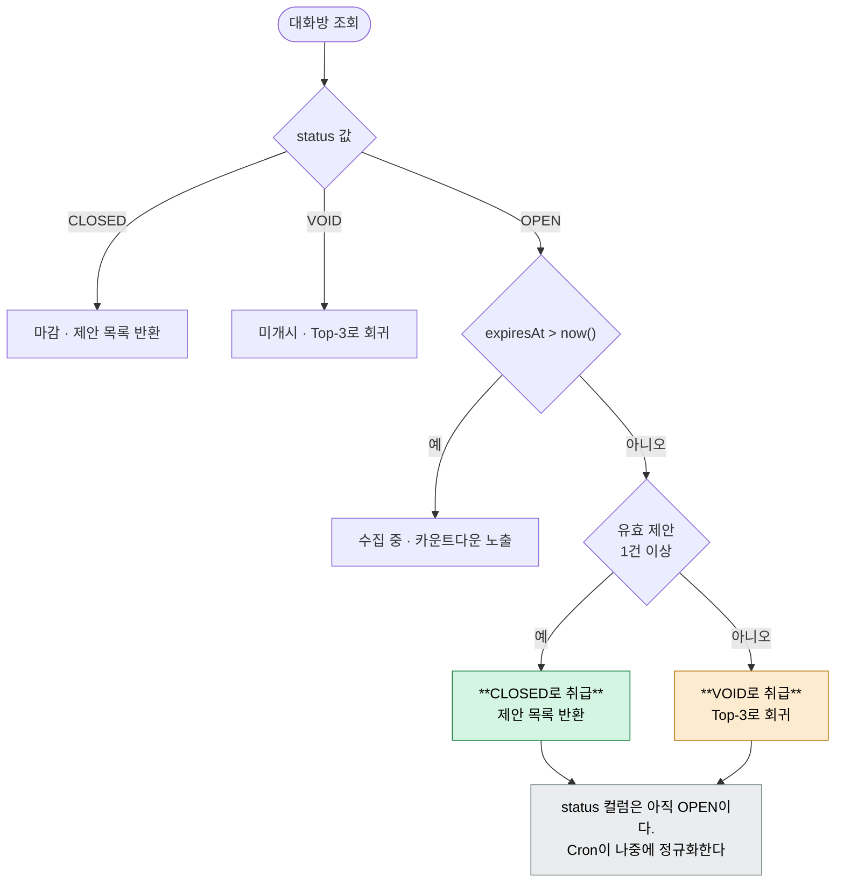

**판정을 SQL에 담는다.** 애플리케이션에서 `status`만 읽고 분기하면 정규화 전 레코드를 잘못 다룬다.

```sql
-- 조회 시점 판정 — status 컬럼을 신뢰하지 않는다
SELECT
  r.id,
  r."expiresAt",
  CASE
    WHEN r.status <> 'OPEN'                     THEN r.status
    WHEN r."expiresAt" > now()                  THEN 'OPEN'
    WHEN count(p.id) > 0                        THEN 'CLOSED'
    ELSE                                             'VOID'
  END AS effective_status,
  count(p.id) AS proposal_count
FROM "AgentRoom" r
LEFT JOIN "Proposal" p ON p."roomId" = r.id
WHERE r.id = $1
GROUP BY r.id, r."expiresAt", r.status;
```

**집계 쿼리도 같은 술어를 쓴다.** 제약 SRS 4.3-1의 잔여 위험("정규화 전 레코드가 OPEN으로 남아 집계에 섞인다")을 이렇게 막는다.

```sql
-- 보조 8: 3분 내 제안 도착률 — status가 아니라 시각으로 판정
SELECT
  count(*) FILTER (
    WHERE EXISTS (
      SELECT 1 FROM "Proposal" p
      WHERE p."roomId" = r.id
        AND p."submittedAt" <= r."expiresAt"
    )
  )::float / nullif(count(*), 0) AS arrival_rate
FROM "AgentRoom" r
WHERE r."expiresAt" BETWEEN $1 AND $2;
```

### 6.2 노쇼 판정

| 항목 | 설계 |
| --- | --- |
| 판정 조건 | `status = 'CONFIRMED'` AND `reservedAt + 유예 < now()` AND 방문 확인 이벤트 부재 |
| 유예 시간 | 방문 확인 신호가 늦게 도착할 수 있으므로 유예를 둔다. `REQ-FUNC-018`의 오판정률 1% 이하가 이 값의 근거다 |
| Cron 미실행 내성 | 조회 시 같은 술어로 판정한다. 화면에는 판정 결과가 보이고, 정산은 Cron이 실행될 때 일어난다 |
| 멱등성 | `status`를 `CONFIRMED`에서만 `NO_SHOW`로 바꾸는 **조건부 UPDATE**로 구현한다. 재실행이 중복 정산을 만들지 않는다 |

```sql
-- 조건부 UPDATE — 재실행 안전
UPDATE "Reservation"
SET status = 'NO_SHOW'
WHERE id = ANY($1)
  AND status = 'CONFIRMED'          -- 이미 바뀐 행은 건드리지 않는다
RETURNING id;
```

### 6.3 Cron 작업 실행 설계

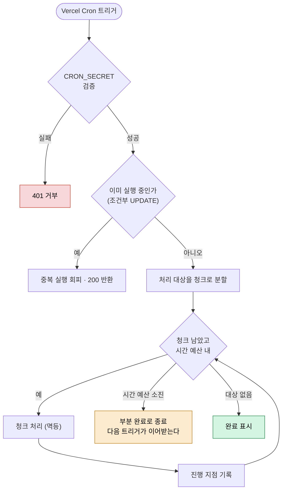

**핵심 — 함수 실행 시간 상한에 의존하지 않는다.** `C-DRV-002`에 따라 상한값을 모르는 상태로 설계해야 하므로, 모든 Cron 작업이 **부분 완료 가능**하고 **다음 트리거가 이어받는** 구조다.

| 작업 | 청크 기준 | 멱등 수단 | 부분 완료 시 |
| --- | --- | --- | --- |
| `normalize-rooms` | `expiresAt` 오래된 순 N건 | 조건부 UPDATE (`status = 'OPEN'` 전제) | 남은 방은 다음 회차. 조회는 이미 정확하다 |
| `judge-no-show` | `reservedAt` 오래된 순 N건 | 조건부 UPDATE (`status = 'CONFIRMED'` 전제) | 정산이 다음 회차로 미뤄진다 |
| `purge-origins` | 세션 종료 30일 경과 N건 | DELETE는 자연히 멱등 | 남은 건은 다음 회차. **파기 지연이 규제 위반이 되지 않도록 여유를 두고 실행** |
| `aggregate-kpi` | 집계 구간 단위 | 구간별 upsert | 미완 구간은 다음 회차. 구간 완료 표시로 재계산 방지 |
| `audit-reconcile` | 점검 구간 단위 | 읽기 전용 | 불일치 발견 시 즉시 알림 |

---

## 7. 화면 설계

### 7.1 서버·클라이언트 컴포넌트 경계

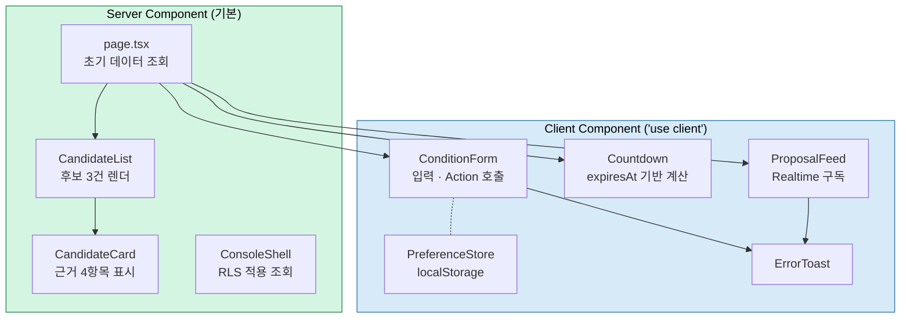

**경계 판단 규칙**

| 규칙 | 근거 |
| --- | --- |
| 기본은 Server Component | 번들 크기를 줄여 `REQ-NF-006`(LCP 2.5s)에 유리하다 |
| `'use client'`는 상태·구독·타이머가 필요할 때만 | `Countdown`(타이머 · `REQ-IMPL-019`), `ProposalFeed`(구독 · `REQ-IMPL-020`), `ConditionForm`(입력 상태), `PreferenceStore`(localStorage · `REQ-IMPL-029`) 넷뿐이다 |
| 카운트다운의 기준 시각은 서버가 준다 | 클라이언트 시각을 마감 판정 근거로 쓰지 않는다. 서버 `expiresAt`만 신뢰한다 (`REQ-IMPL-019`) |
| Realtime 구독 범위는 RLS가 정한다 | `ProposalFeed`는 본인 방의 행만 받는다. 범위 제한을 클라이언트 코드가 아니라 정책으로 강제한다 (`REQ-IMPL-020` · 5.1) |
| `CandidateCard`는 Server Component | 근거 4항목은 서버에서 확정된 값이다. 클라이언트로 내려 재계산할 이유가 없다 |
| 개인 제약 정보는 Client 전용 | 서버 컴포넌트에서 읽으면 서버로 전송된다. `REQ-IMPL-029`를 구조로 강제 |

### 7.2 후보 카드 컴포넌트 계약

`REQ-IMPL-010`은 "근거 4항목 중 하나라도 없으면 렌더되지 않아야 한다"를 요구한다. 이를 **타입 수준에서 강제**한다.

| 요소 | 설계 |
| --- | --- |
| props 필수화 | `reason`·`evidenceAttributes`·`verifiedAt`·`verifiedBy` 넷을 모두 필수(non-nullable)로 선언한다. 옵셔널로 두면 누락이 컴파일을 통과한다 |
| 조립 지점 단일화 | `CandidateCardProps`는 `EvidenceGate`만 생성한다. 다른 곳에서 조립하지 않는다 |
| 신선도 표기 | `verifiedAt`이 90일을 넘으면 경고 배지를 붙인다. **제외하지 않는다** (기준 SRS 8.3 규칙 3) |
| 판정 문구 금지 | 컴포넌트는 사실 값만 표시한다. "조용한 편" 같은 평가 문구를 만들지 않는다 |
| shadcn 준수 | `Card`·`Badge`·`Tooltip`을 사용하고 임의 CSS를 추가하지 않는다 (`REQ-IMPL-008`) |

### 7.3 오류 열화 상태

빈 화면을 반환하는 경로가 없어야 한다(기준 SRS 8.3 규칙 5). 열화 단계를 상태로 규정한다.

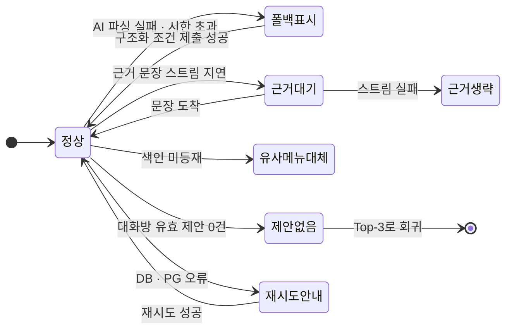

| 상태 | 화면 처리 | 관련 요구사항 |
| --- | --- | --- |
| 폴백표시 | 구조화 필터 UI + 전환 사실 고지. Top-3는 계속 표시 | `REQ-FUNC-009` |
| 근거대기 | 카드 골격과 사실 값은 표시하고 문장 자리만 로딩 | `REQ-IMPL-015` |
| 근거생략 | 문장 없이 근거 속성·확인 일자만 표시. **카드를 숨기지 않는다** | `REQ-FUNC-010` |
| 유사메뉴대체 | 대체 사실을 문구로 명시 | `REQ-FUNC-007` |
| 제안없음 | 빈 제안 화면 대신 제안 없는 Top-3 | `REQ-FUNC-025` |
| 재시도안내 | 사유와 재시도 수단 제시. 빈 화면 금지 | 기준 SRS 8.3 규칙 5 |

**`근거생략`이 `REQ-FUNC-010`과 충돌하지 않는 이유** — 요구사항이 요구하는 4항목은 선정 이유·근거 속성·확인 일자·확인 주체다. 이 중 **선정 이유 문장의 생성이 실패**한 경우, 사실 속성 3항목과 규칙 기반 기본 문구로 4항목을 채운다. AI 실패가 카드 소멸로 이어지지 않게 하는 것이 설계 의도다.

---

## 8. 시퀀스

### 8.1 PG 웹훅 멱등 처리

외부가 호출하는 유일한 변경 경로이므로 중복 수신을 전제한다.

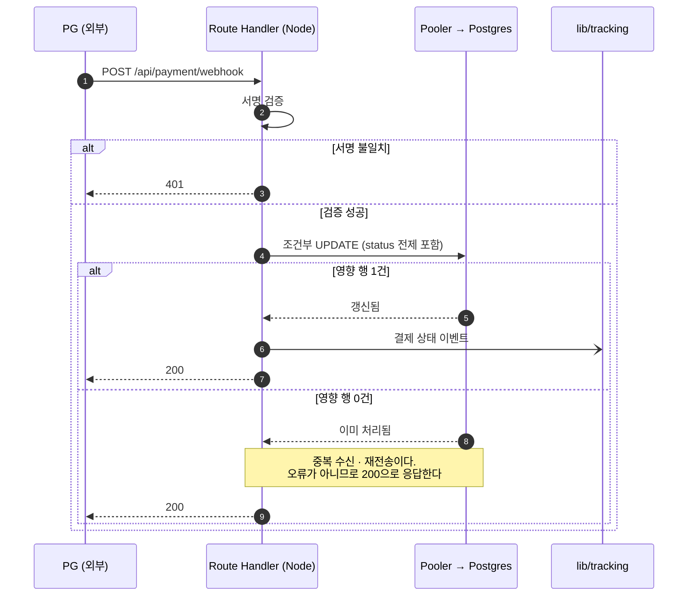

**200으로 응답하는 이유** — 오류를 반환하면 PG가 무한 재전송한다. 이미 처리된 이벤트는 성공으로 응답해 재전송을 끊는다. 조건부 UPDATE가 멱등성을 보장하므로 상태가 뒤집히지 않는다.

### 8.2 근거 문장 스트리밍

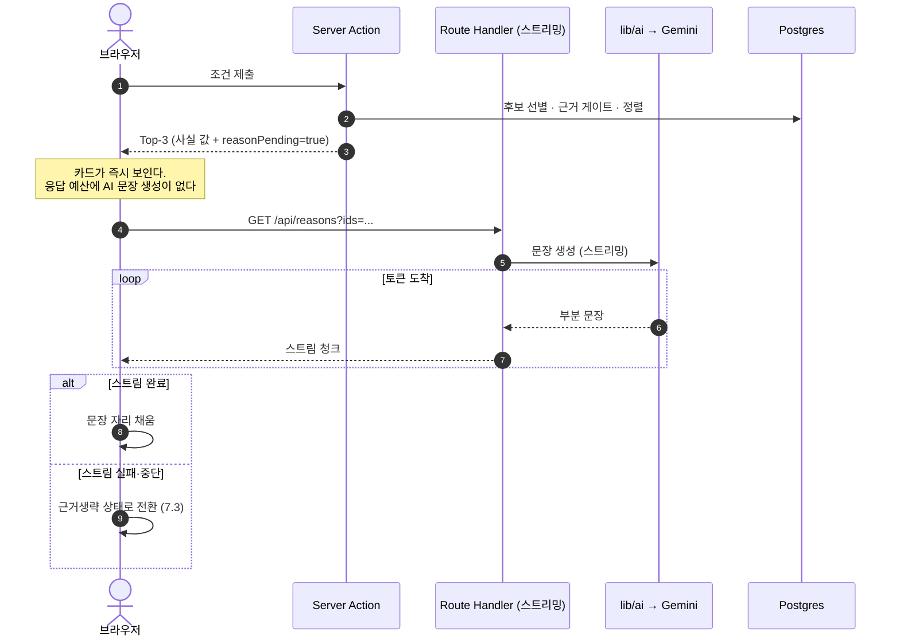

---

## 9. 추적성 — 설계 요소 ↔ 구현 요구사항

| 설계 요소 | 절 | 실현하는 요구사항 |
| --- | --- | --- |
| DB 접근 경로의 Node 런타임 고정 | 2.1 · 2.2 | `REQ-IMPL-001` · `REQ-IMPL-005` |
| `middleware.ts` Edge 배치 | 2.1 · 5.2 | `REQ-IMPL-026` |
| 런타임 선택 결정 흐름 | 2.2 | `REQ-IMPL-003` |
| 이벤트 적재 비차단 (응답 전 시작·미대기) | 2.3 | `REQ-IMPL-023` |
| `QueryInput` zod 검증 | 3.1 | `REQ-IMPL-003` |
| `ConditionResolver` AI/폴백 흡수 | 3.1 | `REQ-IMPL-013` |
| `Top3Result.reasonPending` | 3.1 · 8.2 | `REQ-IMPL-015` |
| `ModelFactory` 단일 provider 결정 | 3.2 | `REQ-IMPL-011` · `REQ-IMPL-012` |
| `Port` 인터페이스로 도메인 격리 | 3.2 | `REQ-IMPL-011` · `REQ-IMPL-013` |
| `TimeoutGuard` 파싱 시한 | 3.2 | `REQ-IMPL-014` |
| Prepared statement 비활성 · 대화형 트랜잭션 금지 | 3.3 | `REQ-IMPL-005` · `REQ-IMPL-006` |
| 조건부 INSERT로 마감 경쟁 제거 | 3.3 | `REQ-IMPL-017` · `REQ-IMPL-018` |
| 캐시 계층 판정 · 태그 매트릭스 | 4.1 · 4.2 | `REQ-IMPL-016` |
| 확인 상태 캐시 제외 | 4.2 | `REQ-FUNC-013` (기준 SRS) |
| RLS 정책 매트릭스 · 기본 거부 | 5.1 | `REQ-IMPL-025` |
| 테이블 생성과 정책을 같은 마이그레이션에 | 5.1 | `REQ-IMPL-025` · `REQ-IMPL-030` |
| `service_role` 서버 전용 | 5.1 | `REQ-IMPL-033` |
| MFA 완료 세션 검사 | 5.2 | `REQ-IMPL-026` |
| 조회 래퍼 단일화 · UPDATE·DELETE 권한 부재 | 5.3 | `REQ-IMPL-027` |
| `effective_status` SQL 판정 | 6.1 | `REQ-IMPL-018` |
| 집계 쿼리의 시각 기반 술어 | 6.1 | 제약 SRS 4.3-1 잔여 위험 |
| 조건부 UPDATE 멱등 노쇼 판정 | 6.2 | `REQ-IMPL-021` |
| Cron 시크릿 검증 | 6.3 | `REQ-IMPL-022` |
| 청크 분할 · 부분 완료 · 이어받기 | 6.3 | `REQ-IMPL-021` · `REQ-IMPL-024` · `C-DRV-002` |
| Server/Client 경계 규칙 | 7.1 | `REQ-IMPL-008` · `REQ-IMPL-029` |
| `Countdown` 클라이언트 계산 (서버 `expiresAt` 기준) | 7.1 | `REQ-IMPL-019` |
| `ProposalFeed` Realtime 구독 + `Proposal` RLS 행 제한 | 5.1 · 7.1 | `REQ-IMPL-020` |
| `CandidateCardProps` 필수화 · 조립 단일화 | 7.2 | `REQ-IMPL-010` |
| 열화 상태 6종 | 7.3 | `REQ-IMPL-013` · 기준 SRS 8.3 규칙 5 |
| 웹훅 조건부 UPDATE + 200 응답 | 8.1 | `REQ-IMPL-028` |
| 근거 문장 응답 경로 분리 | 8.2 | `REQ-IMPL-015` |

**본 문서가 다루지 않는 구현 요구사항 8건** — 아래 항목은 **코드 구조가 아니라 저장소·플랫폼 설정**으로 실현되므로 런타임 설계의 대상이 아니다. 실현 방식은 제약 SRS 4.4 · 4.5.3 · 8.1~8.4에 있다.

| 요구사항 | 내용 | 실현 위치 |
| --- | --- | --- |
| `REQ-IMPL-002` | 모듈 의존 방향 | 제약 SRS 4.4 + 정적 검사 설정 |
| `REQ-IMPL-004` | Prisma 스키마 단일 원천 | 제약 SRS 8.2 |
| `REQ-IMPL-007` | 로컬·운영 환경 동형성 | 마이그레이션 이력 + 시드 스크립트 |
| `REQ-IMPL-009` | 디자인 토큰 단일화 | `tailwind.config.ts` + shadcn 테마 |
| `REQ-IMPL-031` | 브랜치 보호 게이트 | 저장소 설정 |
| `REQ-IMPL-032` | Preview 데이터 격리 | Vercel 환경 변수 분리 |
| `REQ-IMPL-033` | 환경 변수 분리 | 제약 SRS 8.4 + `env.ts` |
| `REQ-IMPL-034` | PITR 복구 수단 | Supabase 프로젝트 설정 |

`REQ-IMPL-030`(마이그레이션 배포 분리)은 5.1의 정책 배포 규칙과 맞물리므로 본 문서 추적성 표에 포함했다.

---

*작성자: 개발팀 리드, 검토자: 개발 엔지니어, 승인자: 개발팀 리드*
