# [설계 문서] AI-Place-Mate

# 소프트웨어 설계 문서 (SDD)

**문서 ID:** SDD-AIPLACE-MVP-001

**개정 버전:** 1.0

**날짜:** 2026-08-24

**상위 문서:** [`SRS-ai-place-v1.0.md`](SRS-ai-place-v1.0.md) (SRS-AIPLACE-MVP-001, 개정 1.9)

---

## 1. 서론

### 1.1 목적

본 문서는 SRS에 명시된 요구사항 59건(REQ-FUNC 27 · REQ-NF 32)을 **어떻게 실현하는지**를 설계 관점으로 기술한다. 유스케이스·클래스·컴포넌트·시퀀스·상태 전이·논리 흐름 도식으로 구성한다.

### 1.2 SRS와의 경계

ISO/IEC/IEEE 29148:2018 **§9.6.10**은 요구사항에 설계 해법을 넣으면 "다른 설계 대안이 검토되지 못하고 배제될 위험"이 생긴다고 경고하고, **§5.2.5 Appropriate**는 "아키텍처·설계에 불필요한 제약을 두지 말라"고 규정한다. 따라서 두 문서의 역할을 아래와 같이 갈랐다.

| | SRS | 본 문서 (SDD) |
| --- | --- | --- |
| 답하는 질문 | **무엇을** 만족해야 하는가 | **어떻게** 실현하는가 |
| 도식 수준 | 블랙박스 — 외부에서 관찰 가능한 것 | 화이트박스 — 내부 구조와 호출 |
| 담는 도식 | 유스케이스 개요 · 여정 흐름 · 요구사항 의존성 · 상태 전이 · 블랙박스 시퀀스 · 엔터티 관계 | 유스케이스 상세 · 도메인/계층 클래스 · 물리 ERD · 컴포넌트 · 배포 · 내부 시퀀스 · 논리 흐름 |
| 변경 권한 | 기획 매니저 (PM) | 개발팀 리드 |

**같은 도식을 두 문서에 두지 않는다.** 중복은 한쪽만 갱신되는 순간 어긋나기 때문이다. 상태 전이도는 SRS 8.2(데이터 수명주기가 요구사항이므로), 클래스·컴포넌트 내부는 본 문서가 단일 원천이다.

### 1.3 도식 목록

| # | 도식 | 유형 | 절 |
| --- | --- | --- | --- |
| 1 | 유스케이스 — 수요 측 | flowchart | 2.1 |
| 2 | 유스케이스 — 공급 측 | flowchart | 2.2 |
| 3 | 도메인 클래스 (CLD) | classDiagram | 3.1 |
| 4 | 서비스 계층 클래스 | classDiagram | 3.2 |
| 5 | 물리 ERD | erDiagram | 3.3 |
| 6 | 컴포넌트 구조 | flowchart | 4.1 |
| 7 | 배포 구조 | flowchart | 4.2 |
| 8 | 시퀀스 — 조건 질의 → Top-3 | sequenceDiagram | 5.1 |
| 9 | 시퀀스 — 파싱 실패 → 폴백 | sequenceDiagram | 5.2 |
| 10 | 시퀀스 — 공유 카드 생성 | sequenceDiagram | 5.3 |
| 11 | 시퀀스 — 에이전트 소환 → 제안 수집 | sequenceDiagram | 5.4 |
| 12 | 시퀀스 — 제안 선택 → 예약 → 결제 | sequenceDiagram | 5.5 |
| 13 | 시퀀스 — 노쇼 판정 → 정산 | sequenceDiagram | 5.6 |
| 14 | 시퀀스 — 조건 불일치 신고 → 재확인 | sequenceDiagram | 5.7 |
| 15 | 논리 흐름 — 근거 4항목 검증 게이트 | flowchart | 6.1 |
| 16 | 논리 흐름 — 예산·조건 필터 판정 | flowchart | 6.2 |
| 17 | 논리 흐름 — KPI 집계 파이프라인 | flowchart | 6.3 |

---

## 2. 유스케이스

> **읽는 방법** — 타원이 유스케이스(시스템이 이용자에게 제공하는 하나의 완결된 가치), 사각형이 액터(시스템을 쓰는 사람 또는 외부 시스템)다. 점선 `<<include>>`는 "항상 포함", `<<extend>>`는 "조건이 맞을 때만 확장"을 뜻한다.

### 2.1 유스케이스 — 수요 측

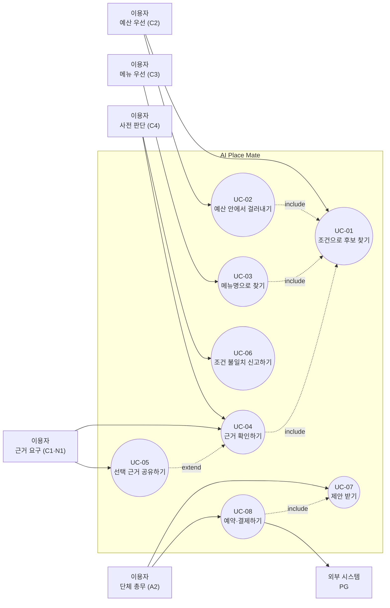

### 2.2 유스케이스 — 공급 측

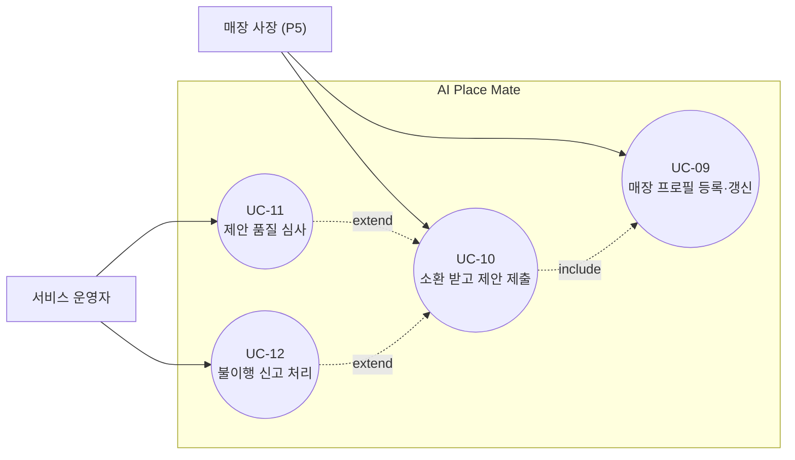

### 2.3 유스케이스 명세

| ID | 유스케이스 | 주 액터 | 사전 조건 | 주 흐름 | 대안·예외 흐름 | 사후 조건 | 요구사항 |
| --- | --- | --- | --- | --- | --- | --- | --- |
| **UC-01** | 조건으로 후보 찾기 | 이용자 | 상권 데이터 적재 완료 | 조건 입력 → 파싱 → 색인 질의 → 근거 검증 → Top-3 반환 | 파싱 실패 시 폴백 필터 (5.2) | Top-3가 렌더되고 `top3_render` 기록 | REQ-FUNC-001 · 008 · 009 · 014 |
| **UC-02** | 예산 안에서 걸러내기 | 이용자 (C2) | 인당 예산 상한 입력 | 상한 초과 매장 제외 → 인당가 범위 표기 → 초과 건수 요약 | 결제액 입력 시 편차를 다음 표기에 반영 | 모든 카드에 범위가 표기됨 | REQ-FUNC-002 · 003 · 005 |
| **UC-03** | 메뉴명으로 찾기 | 이용자 (C3) | 메뉴 색인에 `canonicalKey` 등재 | 메뉴명 1건 입력 → 취급 매장 Top-3 반환 | 미등재 시 유사 메뉴 3건 이상이면 대체 사실 명시 후 반환 | 업종 목록이 아닌 매장이 반환됨 | REQ-FUNC-006 · 007 |
| **UC-04** | 근거 확인하기 | 이용자 (C4·C1·N1) | Top-3 렌더됨 | 카드별 선정 이유·근거 속성·확인 일자·확인 주체 확인 | 90일 초과 속성은 경고 병기 | 근거 4항목이 노출됨 | REQ-FUNC-010 · 011 |
| **UC-05** | 선택 근거 공유하기 | 이용자 (C1) | 후보 1건 선택 | 공유 요청 → 카드 생성 → 이미지·링크 반환 | 근거 4항목 누락 시 `400` | 외부로 공유 가능한 카드 생성 | REQ-FUNC-012 |
| **UC-06** | 조건 불일치 신고하기 | 이용자 (C4) | 방문 완료 | 신고 접수 → 확인 상태 `RECHECK_REQUIRED` 전이 → 재확인 큐 등록 | — | 60초 내 상태 반영 | REQ-FUNC-013 |
| **UC-07** | 제안 받기 | 이용자 (A2) | 가맹점 프로필 등록됨 | 카테고리·지역 지정 → 3~5곳 소환 → 대화방(180초) → 제안 수집 → 적합도 정렬 | 소환 0곳이면 미개시. 마감 시 0건이면 Top-3 회귀 | 제안이 적합도 순으로 제시됨 | REQ-FUNC-020 · 022~025 |
| **UC-08** | 예약·결제하기 | 이용자 (A2·C2) | 제안 1건 선택 | 조건 승계 → 예약 생성 → 주문량 산출 → 결제 승인 → 매장 통보 | 2시간 전 취소는 전액 환불 | 예약이 `CONFIRMED`, 결제가 `AUTHORIZED` | REQ-FUNC-015~018 |
| **UC-09** | 매장 프로필 등록·갱신 | 매장 사장 (P5) | 가맹 온보딩 완료 | 분위기·강점·서비스·수용 조건 등록 → 1회 클릭으로 수정 | 근거 없는 강점 문구는 저장 거부 | 프로필이 소환 매칭에 반영됨 | REQ-FUNC-019 · 021 · 027 |
| **UC-10** | 소환 받고 제안 제출 | 매장 사장 (P5) | 수용 조건 충족 | 소환 알림 → 조건 확인 → 제안 제출 | 수용 조건 밖이면 소환되지 않음. 마감 후 제출은 거부 | 제안이 대화방에 등록됨 | REQ-FUNC-020 · 023 |
| **UC-11** | 제안 품질 심사 | 서비스 운영자 | 제안 등록됨 | 규칙 위반 자동 탐지 → 예외만 사람이 심사 | 가맹점 150곳당 1 FTE 상한 초과 시 온보딩 속도 조절 | 근거 없는 문구 0건 유지 | REQ-FUNC-021 · REQ-NF-022 |
| **UC-12** | 불이행 신고 처리 | 서비스 운영자 | 이용자 신고 접수 | 신고 확인 → 불이행 기록 → 소환 가중치 하향 | 48시간 내 처리 | 이행률 지표에 반영됨 | REQ-FUNC-026 |

---

## 3. 정적 구조

### 3.1 도메인 클래스 다이어그램 (CLD)

> **CLD** = Class Diagram(클래스 다이어그램). 시스템 사고의 Causal Loop Diagram과 약어가 겹치므로, 본 문서에서 CLD는 항상 UML 클래스 다이어그램을 뜻한다.
>
> **읽는 방법** — 사각형이 클래스(같은 성질의 데이터와 동작을 묶은 단위). 선 위의 숫자는 **다중도**로, `1` 대 `0..*`은 "하나가 여러 개를 가질 수 있고 없어도 된다"는 뜻이다. `◆`(composition)는 부모가 사라지면 자식도 사라지는 관계다.

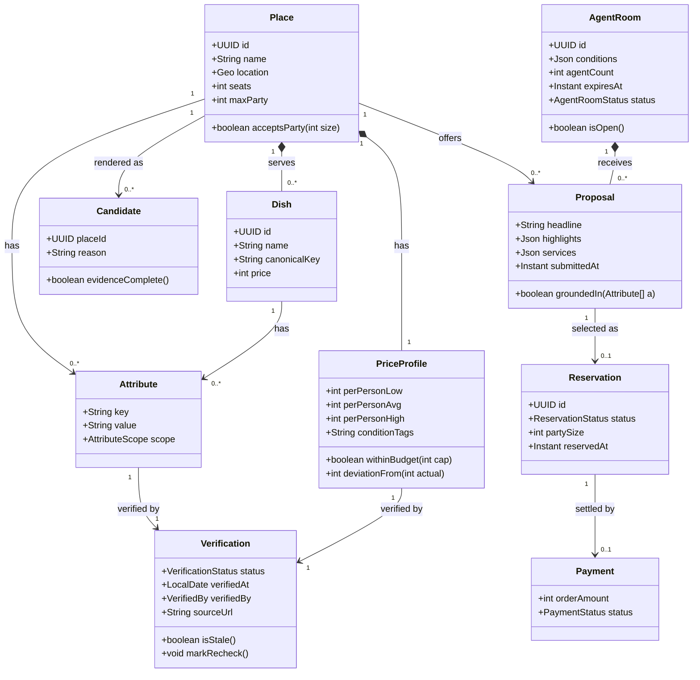

**설계 판단 3건**

| 판단 | 근거 |
| --- | --- |
| `Verification`을 독립 클래스로 분리 | 속성마다 확인 정보를 인라인으로 두면 REQ-FUNC-010(근거 4항목)의 검증을 속성 개수만큼 반복해야 한다 (ADR-002) |
| `Candidate`를 별도 클래스로 도입 | `Place`는 마스터 데이터이고 `Candidate`는 특정 질의에 대한 응답 단위다. `evidenceComplete()`가 질의 시점에 평가되어야 하므로 분리했다 |
| `PriceProfile`에 판정 메서드를 둠 | `withinBudget()`·`deviationFrom()`을 데이터와 같은 곳에 두어 REQ-FUNC-003·005의 판정 로직이 흩어지지 않게 했다 |

### 3.2 서비스 계층 클래스 다이어그램

> **읽는 방법** — `<<interface>>`는 구현을 갖지 않는 계약이다. 점선 화살표는 "이 인터페이스를 구현한다", 실선 화살표는 "이것을 사용한다"를 뜻한다.

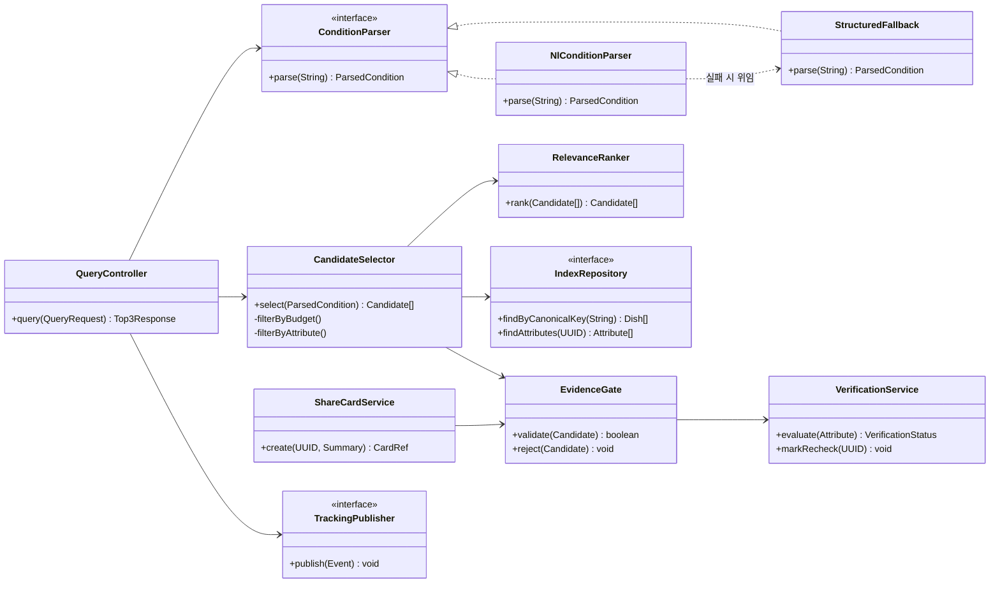

**핵심 설계 결정** — `EvidenceGate`를 `RelevanceRanker`보다 **앞에** 배치했다. 근거 없는 후보가 정렬 대상에 들어가면 REQ-FUNC-014("근거 4항목이 없는 후보는 반환하지 않는다")를 정렬 이후 필터로 지키게 되어, 후보가 3개 미만으로 떨어지는 경로가 생긴다. 게이트를 먼저 통과시키면 정렬은 항상 유효 후보만 다룬다.

`NlConditionParser`가 실패 시 `StructuredFallback`에 위임하는 구조는 REQ-FUNC-009의 폴백을 예외 처리가 아니라 **정상 경로의 분기**로 구현한다 — 빈 화면이 반환될 수 있는 코드 경로 자체를 없애기 위한 선택이다.

### 3.3 물리 ERD

> **읽는 방법** — `PK`는 기본키(행을 유일하게 식별), `FK`는 외래키(다른 표를 가리킴), `UK`는 유일 제약, `IDX`는 인덱스다. `||--o{`는 "왼쪽 1개 : 오른쪽 0개 이상"을 뜻한다.

```mermaid
erDiagram
    PLACES ||--o{ DISHES : ""
    PLACES ||--|| PRICE_PROFILES : ""
    PLACES ||--o{ ATTRIBUTES : ""
    DISHES ||--o{ ATTRIBUTES : ""
    ATTRIBUTES ||--|| VERIFICATIONS : ""
    PRICE_PROFILES ||--|| VERIFICATIONS : ""
    AGENT_ROOMS ||--o{ PROPOSALS : ""
    PLACES ||--o{ PROPOSALS : ""
    PROPOSALS ||--o| RESERVATIONS : ""
    RESERVATIONS ||--o| PAYMENTS : ""
    PLACES ||--o{ TRACKING_EVENTS : ""

    PLACES {
        uuid id PK
        string name
        geography location IDX
        int seats
        int max_party
        string district_code IDX
        timestamp deleted_at
    }
    DISHES {
        uuid id PK
        uuid place_id FK
        string name
        string canonical_key IDX
        int price
    }
    PRICE_PROFILES {
        uuid id PK
        uuid place_id FK
        int per_person_low
        int per_person_avg
        int per_person_high
        string condition_tags
        uuid verification_id FK
    }
    ATTRIBUTES {
        uuid id PK
        uuid place_id FK
        uuid dish_id FK
        string attr_key IDX
        string attr_value
        string scope
        uuid verification_id FK
    }
    VERIFICATIONS {
        uuid id PK
        string status IDX
        date verified_at IDX
        string verified_by
        string source_url
    }
    AGENT_ROOMS {
        uuid id PK
        json conditions
        int agent_count
        timestamp expires_at IDX
        string status
    }
    PROPOSALS {
        uuid id PK
        uuid room_id FK
        uuid place_id FK
        string headline
        json highlights
        json services
        timestamp submitted_at
    }
    RESERVATIONS {
        uuid id PK
        uuid proposal_id FK UK
        string status IDX
        int party_size
        timestamp reserved_at IDX
    }
    PAYMENTS {
        uuid id PK
        uuid reservation_id FK UK
        int order_amount
        string status
        string pg_token
    }
    TRACKING_EVENTS {
        bigint id PK
        string event_name IDX
        uuid session_id IDX
        uuid anon_user_id IDX
        uuid place_id FK
        json payload
        timestamp occurred_at IDX
        int schema_version
    }
```

**물리 설계 결정 5건**

| 결정 | 근거 |
| --- | --- |
| `dishes.canonical_key`에 인덱스 | REQ-FUNC-006의 메뉴명 질의가 최고 빈도 경로이며 p95 ≤ 400ms를 만족해야 한다 (SRS 8.6.2) |
| `verifications.verified_at`에 인덱스 | REQ-NF-011의 "90일 초과 속성 비율" 주간 집계와 재확인 큐 조회가 날짜 범위 스캔이다 |
| `places.district_code` 컬럼 도입 | 배포 단위가 상권이므로(SRS 3.1.6) 상권별 커버리지 집계와 적재 관리에 필요하다 |
| `reservations.proposal_id`에 유일 제약 | 하나의 제안이 두 예약을 만들 수 없다 (SRS 8.6.3 예약-제안 연결) |
| `tracking_events`를 `occurred_at` 파티셔닝 | 대량 append 패턴이며 KPI 집계가 시간 범위 질의다 (SRS 6.1.2) |
| `deleted_at` 컬럼 (논리 삭제) | 확인 상태 이력을 보존해야 한다 (SRS 8.3 규칙 12, 8.6.5) |

---

## 4. 컴포넌트 구조

### 4.1 컴포넌트 다이어그램

> **읽는 방법** — 큰 상자가 컴포넌트(독립 배포 단위), 그 안의 `[ ]`가 제공 인터페이스(다른 컴포넌트가 호출할 수 있는 창구)다. 화살표는 호출 방향이며, 점선은 이벤트 발행(호출한 쪽이 응답을 기다리지 않음)이다.

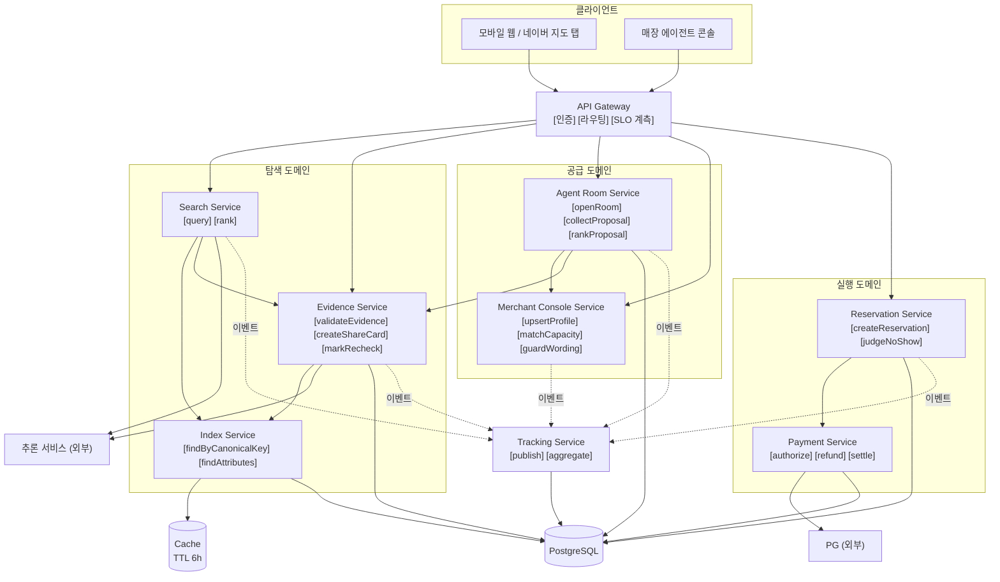

**컴포넌트 경계 판단**

| 판단 | 근거 |
| --- | --- |
| `Search`와 `Index`를 분리 | 색인은 읽기 편중·캐시 대상이고 질의 조합은 계산 로직이다. 스케일 특성이 달라 REQ-NF-005(3,000 RPS)를 각각 조정해야 한다 |
| `Evidence`를 `Search`에서 분리 | 근거 검증(REQ-FUNC-010)이 탐색과 제안(REQ-FUNC-024) 양쪽에서 재사용된다 |
| `Reservation`과 `Payment`를 분리 | 결제는 PCI-DSS 범위(REQ-NF-016)이며 오류율 임계가 다르다 (REQ-NF-008: 0.1% vs 0.3%) |
| `Tracking`을 이벤트 수신으로만 결합 | KPI 집계 장애가 이용자 경로를 막지 않아야 한다. 발행측은 응답을 기다리지 않는다 |

### 4.2 배포 구조

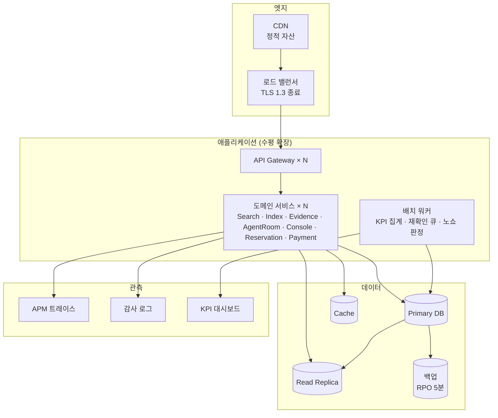

| 배치 결정 | 대응 요구사항 |
| --- | --- |
| TLS 1.3을 로드 밸런서에서 종료 | REQ-NF-026 |
| 읽기 복제본 분리 | REQ-NF-001·002 응답 목표를 읽기 부하와 분리해 확보 |
| 백업 주기를 RPO 5분에 맞춤 | REQ-NF-027 |
| 이중화 및 헬스체크 5분 간격 | REQ-NF-007 (가용성 99.5%) |
| 감사 로그를 별도 저장소로 | REQ-NF-025 (전량 감사 로그, 누락 1건도 알림) |
| 배치 워커를 서비스와 분리 | KPI 집계·노쇼 판정이 이용자 요청 경로의 지연에 영향을 주지 않게 |

---

## 5. 동적 흐름 — 시퀀스

> **읽는 방법** — 세로선은 참여자의 생존 기간, 가로 화살표는 메시지다. 실선 `->>`은 호출, 점선 `-->>`은 응답이다. `alt`는 조건 분기, `opt`는 선택적 수행, `loop`는 반복을 뜻한다.

### 5.1 조건 질의 → Top-3 (정상 경로 · UC-01)

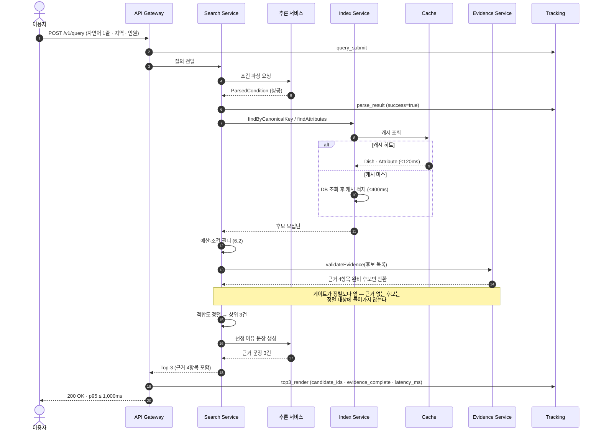

### 5.2 파싱 실패 → 폴백 (대안 경로 · REQ-FUNC-009)

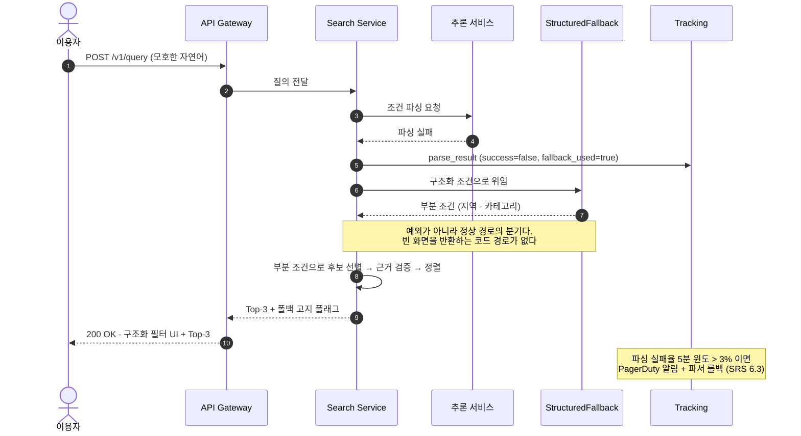

### 5.3 공유 카드 생성 (UC-05)

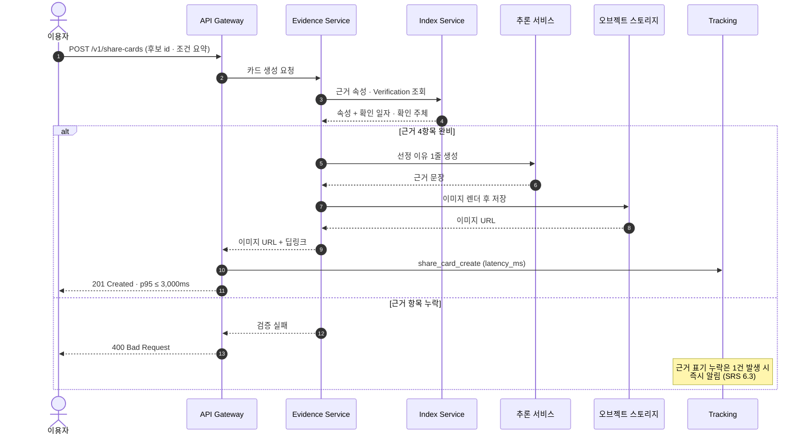

### 5.4 에이전트 소환 → 제안 수집 (UC-07 · UC-10)

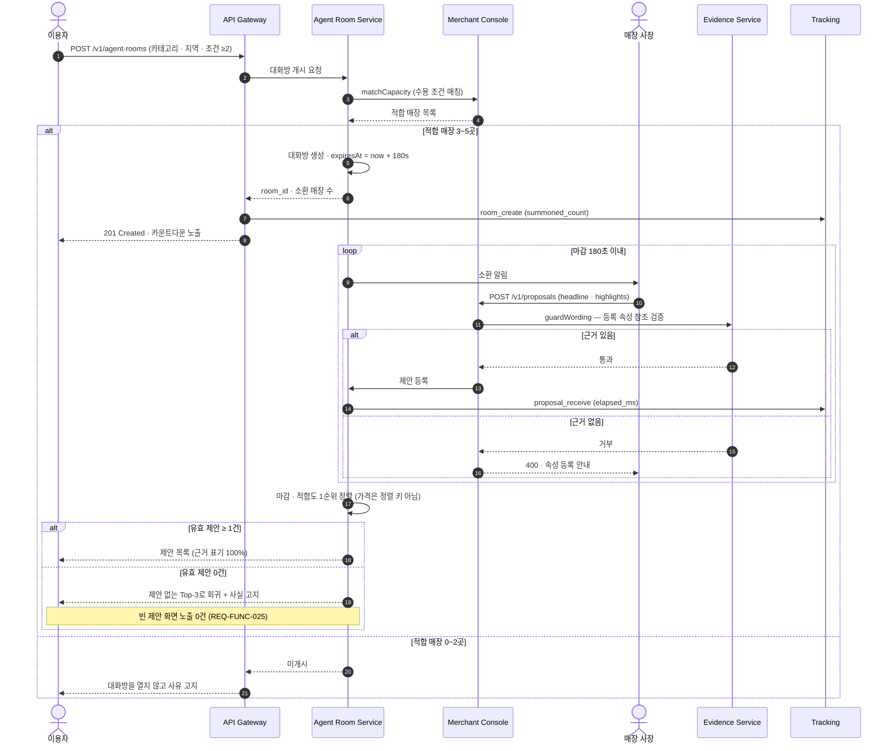

### 5.5 제안 선택 → 예약 → 결제 (UC-08)

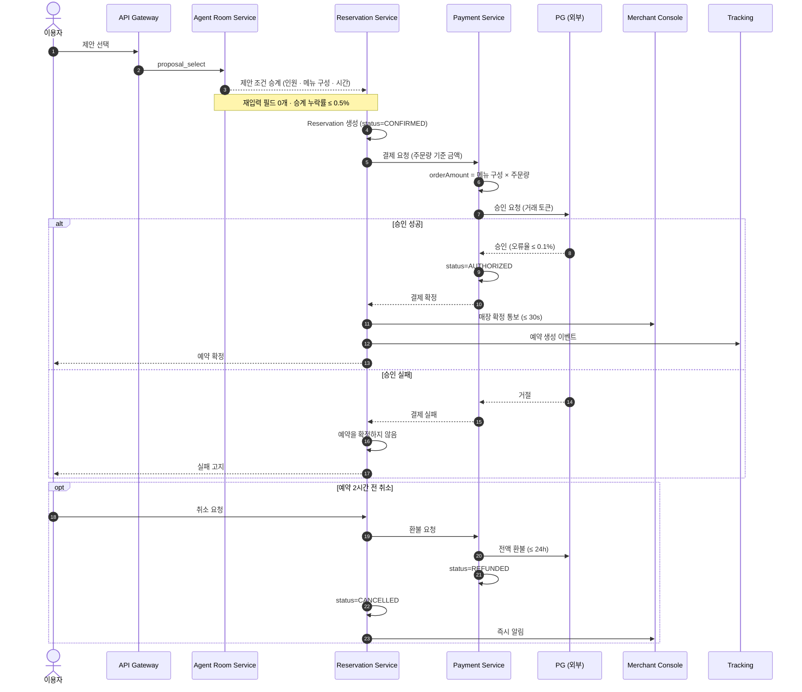

### 5.6 노쇼 판정 → 정산 (REQ-FUNC-018)

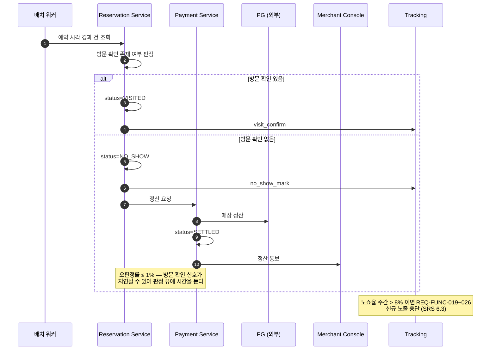

### 5.7 조건 불일치 신고 → 재확인 (UC-06)

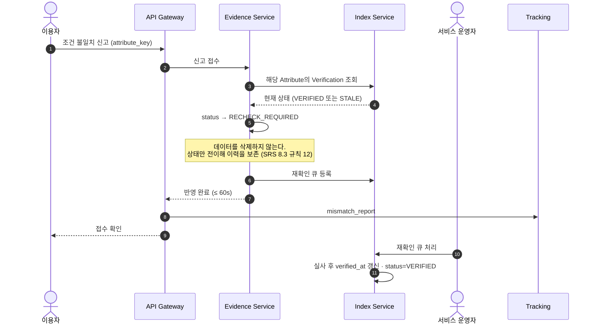

---

## 6. 논리 흐름

### 6.1 근거 4항목 검증 게이트

REQ-FUNC-010·014의 "근거 없는 후보는 반환하지 않는다"를 어디서 어떻게 판정하는지 밝힌다.

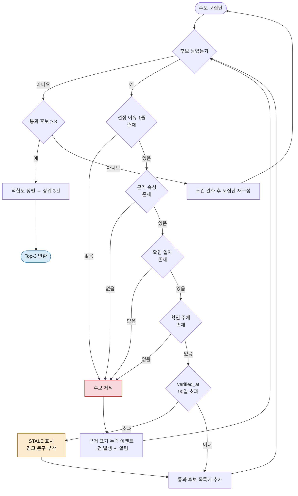

**핵심** — `STALE`은 제외 사유가 **아니다.** 90일 초과 속성은 경고를 붙여 노출한다. 판정을 시스템이 하지 않고 재료만 제공하는 원칙(SRS 8.3 규칙 3) 때문이다. 제외 사유는 4항목 중 하나라도 없는 경우뿐이다.

### 6.2 예산·조건 필터 판정

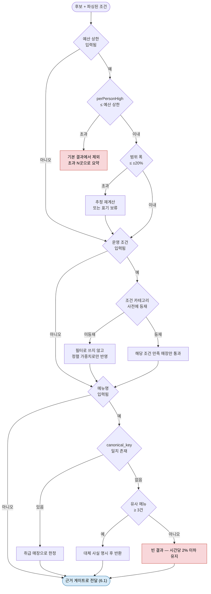

**설계 판단** — 사전에 없는 조건은 **하드 필터로 쓰지 않는다.** 미등재 조건을 필터로 쓰면 빈 결과가 늘어 REQ-NF-010(빈 결과 ≤ 2%)을 깨뜨린다. 정렬 가중치로만 반영해 후보는 유지하고 순위로 표현한다.

### 6.3 KPI 집계 파이프라인

SRS 6.1의 계측 계획을 파이프라인으로 옮긴 것이다.

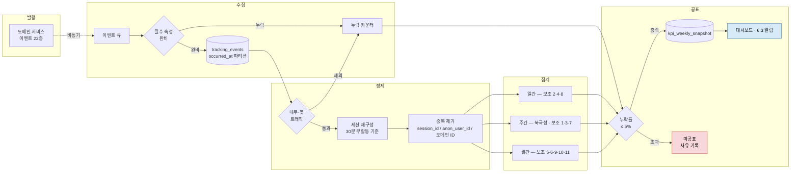

**핵심** — 이벤트 발행은 **비동기**다. 집계 파이프라인이 멈춰도 이용자 경로가 막히지 않는다. 대신 누락률 게이트를 두어, 5%를 넘으면 그 주 지표를 신뢰 구간 없이 공표하지 않는다 (SRS 6.1.3).

---

## 7. 추적성 — 설계 요소 ↔ 요구사항

| 설계 요소 | 절 | 실현하는 요구사항 |
| --- | --- | --- |
| `Index Service` · `dishes.canonical_key` 인덱스 | 4.1 · 3.3 | REQ-FUNC-001 · 006 · REQ-NF-002 · 020 |
| `PriceProfile.withinBudget()` · `deviationFrom()` | 3.1 | REQ-FUNC-002 · 003 · 005 |
| `NlConditionParser` → `StructuredFallback` 위임 | 3.2 · 5.2 | REQ-FUNC-009 · REQ-NF-009 |
| `EvidenceGate` (정렬 앞) · 근거 게이트 흐름 | 3.2 · 6.1 | REQ-FUNC-010 · 011 · 014 |
| `ShareCardService` · 오브젝트 스토리지 | 4.1 · 5.3 | REQ-FUNC-012 · REQ-NF-003 |
| `Verification` 상태 전이 · 재확인 큐 | 5.7 | REQ-FUNC-013 · REQ-NF-011 |
| `AgentRoom.expiresAt` · 마감 루프 | 3.1 · 5.4 | REQ-FUNC-022 · 023 · 025 · REQ-NF-004 |
| `Merchant Console.guardWording()` | 4.1 · 5.4 | REQ-FUNC-021 |
| `matchCapacity()` | 4.1 · 5.4 | REQ-FUNC-020 |
| 적합도 1순위 정렬 (가격 비정렬 키) | 5.4 | REQ-FUNC-024 |
| 조건 승계 → `Reservation` → `Payment` | 5.5 | REQ-FUNC-015 · 016 · 017 |
| 배치 워커 노쇼 판정 | 5.6 | REQ-FUNC-018 |
| 소환 가중치 하향 | 2.3 (UC-12) | REQ-FUNC-026 |
| 읽기 복제본 · 캐시 TTL 6h | 4.2 | REQ-NF-001 · 002 · 005 · 020 |
| LB TLS 1.3 종료 · 감사 로그 저장소 | 4.2 | REQ-NF-018 · 025 · 026 |
| 백업 주기 · 이중화 | 4.2 | REQ-NF-007 · 012 · 027 |
| `deleted_at` 논리 삭제 | 3.3 | REQ-NF-011 · SRS 8.6.5 |
| `places.district_code` | 3.3 | SRS 3.1.6 지역 적응 · R2 |
| 비동기 이벤트 발행 · 누락률 게이트 | 4.1 · 6.3 | SRS 6.1.2 · 6.1.3 |
| `tracking_events` 파티셔닝 | 3.3 | SRS 8.6.2 |

**미포함 요구사항** — REQ-NF-013 · 014 · 015 · 031 · 032(개인정보), REQ-NF-019 · 021 · 022 · 023(비용), REQ-NF-028 · 029 · 030(사용성)은 코드 구조가 아니라 **정책·운영·측정**으로 실현되므로 본 문서의 설계 대상이 아니다. 실현 방식은 SRS 4.4(표준·규제 준수)와 6.1(계측 계획)에 있다.

---

*작성자: 개발팀 리드, 검토자: 기획 매니저 (PM), 승인자: 개발팀 리드*
