# [압축 실행] AI-Place-Mate — 최대 병렬 편성 일정

**문서 ID:** EXEC-AIPLACE-COMPRESSED-001
**개정 버전:** 1.0
**날짜:** 2026-08-26
**기준 문서:** [`EXEC-ai-place-v1.0.md`](EXEC-ai-place-v1.0.md) (EXEC-AIPLACE-MVP-001) — **대외 약속은 그 문서가 정본이다**
**태스크 본문:** [`docs/issues-aiplace/tasks/`](docs/issues-aiplace/tasks/) 84건 · GitHub 이슈 `#94`~`#178`
**작성 관점:** Technical Project Manager / System Architect

> **이 문서는 기준 일정을 대체하지 않는다.** 기준 문서는 **선언된 의존 관계를 그대로 지킨** 일정이고,
> 이 문서는 **일부 의존을 의도적으로 느슨하게 만들어** 얼마나 당길 수 있는지 계산한 것이다.
> 압축 수단마다 **무엇을 미리 확정해야 하고 무엇이 재작업 위험으로 남는지** §2에 적었다.

---

## 0. 결과 요약

| 구간 | 기준 일정 | **압축 일정** | 단축 | 최소 병렬도 |
| --- | --- | --- | --- | --- |
| **Phase 0 + 1 + 1말** | 16주 | **12주** | **−4주 (25%)** | 6.1명 → **8.1명** |
| 전체 (Phase 2 포함) | 16주 | **14주** | −2주 | 6.7명 → **8.6명** |
| Phase 0 | 9주 | **7주** | −2주 | 3.2 → 4.1명 |
| Phase 1 | 12주 | **10주** | −2주 | 4.4 → 5.2명 |
| Phase 1 말 | 8주 | 8주 | — | 2.0명 |
| Phase 2 | 11주 | 11주 | — | 2.1명 |

**총 공수는 120.5 인·주로 변하지 않는다.** 일을 줄인 것이 아니라 **동시에 굴린 것**이다.
그래서 필요 인원이 6.1명 → 8.1명으로 늘어난다. **인원을 못 늘리면 이 일정은 성립하지 않는다.**

| 항목 | 기준 | 압축 |
| --- | --- | --- |
| 노드 | 84 | **91** (7건 분할) |
| 하드 의존 간선 | 198 | **211** |
| 순환 | 0 | **0** |

### 이 분석의 가장 중요한 결과

**가장 크고 위험해 보였던 압축 수단이 실제로는 이득이 0이다.**

기준 문서 §2.3은 *"단축 후보는 근거 3연쇄(`EVD-A`→`B`→`C`)"* 라고 적었고, `SPEC-008` 계약을 확대하면 이 5주를 병렬화할 수 있다고 봤다.
**계산해보니 그렇게 해도 12주에서 더 줄지 않는다.** 이유는 §2.4에 있다 — **검색 경로가 정확히 같은 12주로 균형을 이루고 있어서**,
근거 쪽만 풀면 병목이 검색 쪽으로 옮겨갈 뿐이다.

> **따라서 `SPEC-008` 범위 확대는 하지 않는다.** 계약 리스크를 지면서 얻는 게 없다.
> 이 문서가 권하는 압축은 **태스크 분할(§2.1)과 Mock 기반 분리(§2.3) 둘뿐**이다.

### 세 가지 사실

1. **Phase 1 말과 Phase 2는 줄지 않았다.** 예약 사슬과 에이전트 사슬은 손대지 않았다. 이유는 §4.
2. **Phase 0의 2주 선언은 압축해도 못 맞춘다.** 9주 → 7주로 줄었을 뿐이다 (§4.3).
3. **임계 경로가 두 개로 갈라져 12주에서 만난다.** 어느 한쪽만 줄여도 전체는 안 줄어든다 (§2.4).

---

## 1. 압축 후 임계 경로 — 12주

```mermaid
graph LR
  INA1["IN-A1 · 계측·인증 규약<br/>1주 · 분할"]:::crit
  IDXA1["IDX-A1 · 색인 스키마 확정<br/>1주 · 분할"]:::crit
  IDXD["IDX-D · Verification 엔터티<br/>2주"]:::crit
  EVDA["EVD-A · 근거 4항목 검증기<br/>2주"]:::crit
  EVDB["EVD-B · 문장 생성·판정형 차단<br/>1주"]:::crit
  EVDC1["EVD-C1 · 카드 파이프라인<br/>1주 · 분할"]:::crit
  EVDC2["EVD-C2 · 근거 문장 결합<br/>1주 · 분할"]:::crit
  CLIC2["CLI-C2 · 실 API 통합<br/>1주 · 분할"]:::crit
  T007["TEST-007 · 신선도·판정형 검증<br/>2주"]:::crit

  INA1 --> IDXA1 --> IDXD --> EVDA --> EVDB --> EVDC1 --> EVDC2 --> CLIC2 --> T007

  IDXB["IDX-B · 정규화 2주"]:::tie
  IDXE["IDX-E · dishes 1주"]:::tie
  SRCC["SRC-C · 메뉴 질의 2주"]:::tie
  SRCD["SRC-D · Top-3 정렬 2주"]:::tie
  IDXA1 --> IDXB --> IDXE --> SRCC --> SRCD --> CLIC2

  classDef crit fill:#fde2e2,stroke:#b60205,stroke-width:2px,color:#1a1a1a
  classDef tie fill:#fff4d6,stroke:#bf8700,stroke-width:1.5px,color:#1a1a1a
```



**빨간 경로 9마디 12주.** 노란 경로(검색)도 `IDX-A1`에서 갈라져 `CLI-C2`에서 다시 만나는데 **역시 12주다.**

| 마디 | 압축 여부 |
| --- | --- |
| `IN-A1` → `IDX-A1` | **분할로 각 1주.** 색인 스키마는 게이트웨이 *구축*이 아니라 *계측 규약*만 필요하다 |
| `IDX-A1` → `IDX-D` | **분할로 당김.** `Verification` 엔터티는 스키마 확정만 필요하고 마이그레이션 완료를 기다리지 않는다 |
| `IDX-D` → `EVD-A` → `EVD-B` | **압축 못 함.** ADR-002 — 근거 4항목이 `Verification` 상태를 읽는다 |
| `EVD-B` → `EVD-C1` → `EVD-C2` | **`EVD-C` 분할로 2주 유지.** 파이프라인과 결합을 나눠 `CLI-C1`을 앞당겼다 |
| `EVD-C2` → `CLI-C2` | **`CLI-C` 분할로 1주만 남음.** 화면은 Mock으로 먼저 만들고 여기서 실 API만 붙인다 |
| `CLI-C2` → `TEST-007` | 압축 못 함 |

---

## 2. 압축 수단 — 무엇을 당겼고 대가가 무엇인가

**일을 줄이거나 범위를 빼지 않았다.** 공수 120.5 인·주는 보존된다.

### 2.1 ① 태스크 분할 (Fast-tracking) — 7건 → 14건 · **적용**

큰 태스크의 **앞부분 산출물만으로 후행이 착수 가능한 경우** 둘로 나눴다.

| 원본 | 분할 A | 분할 B | 당겨진 후행 | 대가 |
| --- | --- | --- | --- | --- |
| `IN-A` (H·2주) | `IN-A1` 계측·인증 규약 (1주) | `IN-A2` 게이트웨이 구축 (1주) | `IDX-A1` | 규약이 구축 중 바뀌면 색인 스키마 재검토 |
| `IDX-A` (H·2주) | `IDX-A1` 색인 스키마 확정 (1주) | `IDX-A2` 마이그레이션·PriceProfile·Attribute (1주) | `IDX-B` `IDX-C` `IDX-D` | **스키마 확정이 곧 되돌리기 불가 지점**이 된다 (ADR-001) |
| `SRC-A` (H·2주) | `SRC-A1` 조건 파서 연동 (1주) | `SRC-A2` 폴백 전환·실패율 경보 (1주) | — | 원장 §6이 명시적으로 허용한 분리 |
| `EVD-C` (H·2주) | `EVD-C1` 카드 생성 파이프라인 (1주) | `EVD-C2` 근거 문장 결합·검증 (1주) | `CLI-C1` | 파이프라인이 문장 형식을 가정한다 |
| `CLI-C` (H·2주) | `CLI-C1` Top-3 카드 화면 (Mock 기반, 1주) | `CLI-C2` 실 API 통합·공유·신고 (1주) | `CLI-E1` | Mock과 실 API가 어긋나면 `CLI-C1` 재작업 |
| `CLI-E` (M·1주) | `CLI-E1` 이벤트 계측 삽입 (3일) | `CLI-E2` RUM·LCP 최적화 (3일) | `TRK-C` 실효성 | — |
| `TEST-014a` (H·2주) | `TEST-014a1` 부하 시나리오 작성 (1주) | `TEST-014a2` 실행·판정 (1주) | — | 구현 전 작성이므로 실행 시 스크립트 수정 발생 |

> **`IDX-A` 분할이 가장 큰 이득이자 가장 큰 위험이다.** 후행 3건을 한꺼번에 당기지만 **스키마를 1주 만에 얼려야 한다.**
> 원장 §4가 *"사후 변경 = 전면 재색인"* 이라 경고한 그 태스크다.

### 2.2 ② 계약 확대 (Contract widening) — **분석했으나 적용하지 않음**

`SPEC-008`에 **검증 결과 스키마 · 문장 생성 규칙 · 카드 표기 규격**을 추가하면 `EVD-B`·`EVD-C1`이 `EVD-A` 완료를 기다리지 않게 된다.

| 적용 | Phase 0+1+1말 임계 경로 |
| --- | --- |
| ① + ③ (계약 확대 없음) | **12.0주** |
| ① + ② + ③ (계약 확대 포함) | **12.0주** |

**이득 0주.** 근거 사슬을 풀면 병목이 검색 경로로 옮겨가고, 그 길이가 정확히 같다 (§2.4).

> **`SPEC-008`은 소비처 4곳이 공유하는 태스크이고, 평가서 §4가 *"정의가 갈리면 통합에서 터진다"* 고 지목한 항목이다.**
> **얻는 게 없으므로 범위를 넓히지 않는다.** 다만 §2.4의 검색 경로를 나중에 압축하게 되면 이 수단이 다시 유효해진다.

### 2.3 ③ Mock 기반 분리 (Decoupling) — **적용**

| 변경 | 내용 |
| --- | --- |
| **`CLI-C1` 선행** | `EVD-C` `SRC-D` 제거 → **`UX-C` `UX-D` `UX-F` + `MOCK-002`~`005` + `SPEC-003` `004` `008`** |
| **`CLI-C2` 선행** | `CLI-C1` + `SRC-D` + `EVD-C2` + `EVD-D` — 실 API 통합만 |
| **`CLI-E1` 선행** | `CLI-C1` + `TRK-B` + `UX-A` + `SPEC-009` — 계측은 화면만 있으면 삽입 가능 |

**이것은 원래 설계 의도의 실행이다.** 평가서 §1이 *"Mock 8건을 넣는 목적은 프론트엔드가 백엔드를 기다리지 않게 하는 것"* 이라고 적었는데,
기준 일정에서는 `CLI-C`가 여전히 `EVD-C`·`SRC-D`를 하드 선행으로 갖고 있어 **Mock이 실제로 그 역할을 못 했다.**

**대가** — Mock과 실 API가 어긋나면 `CLI-C1`을 다시 만진다.
`MOCK-00x`의 DoD에 *"응답이 OpenAPI 스키마 검증을 **자동으로** 통과"* 가 이미 있으니, **그 자동 검증이 실제로 돌아가야 이 압축이 성립한다.**

### 2.4 왜 12주에서 멈추는가 — 두 경로의 균형

`IDX-A1` 이후 경로가 둘로 갈라져 `CLI-C2`에서 만난다. **둘의 길이가 같다.**

| 경로 | 구성 | 길이 |
| --- | --- | --- |
| **근거 경로** | `IDX-D`(2) → `EVD-A`(2) → `EVD-B`(1) → `EVD-C1`(1) → `EVD-C2`(1) | 7주 |
| **검색 경로** | `IDX-B`(2) → `IDX-E`(1) → `SRC-C`(2) → `SRC-D`(2) | 7주 |

**한쪽만 줄이면 다른 쪽이 병목이 된다.** 12주 아래로 내려가려면 **두 경로를 동시에** 압축해야 한다.

검색 경로를 줄이려면 `SPEC-002`(query 계약)와 `SPEC-003`(dishes 계약)이 **정렬 규칙과 캐시 정책까지** 미리 못박아야 하고,
그때는 §2.2의 계약 확대도 함께 해야 한다. **두 계약을 동시에 넓히는 것은 이 단계에서 권하지 않는다.**

---

## 3. 압축 Gantt — 트랙별 최대 병렬 편성

`◨` 표시가 분할된 태스크다. 빨간 막대가 임계 경로(§1의 근거 경로)다. 라벨의 `P0`·`P1`·`P1말`·`P2`가 Phase다.

**소요 산정은 기준 문서와 같다** — H 2주 · M 1주 · L 3일, 분할 시 합이 보존되도록 배분. 시작일 2026-09-07(월).

```mermaid
gantt
    title 압축 실행 일정 — 91건 · 임계 경로 12주 (Phase 0+1+1말) · 14주 (Phase 2 포함)
    dateFormat YYYY-MM-DD
    axisFormat %m/%d
    section A 계약·Mock
    SPEC-001 · P0 공통 응답 · 에러 규약 :SPEC-001, 2026-09-07, 1w
    MOCK-001 · P0 Mock 서버 기반 구성 :MOCK-001, 2026-09-14, 1w
    SPEC-003 · P0 GET /v1/places/id/dishes 계약 :SPEC-003, 2026-09-14, 1w
    SPEC-005 · P2 POST /v1/agent-rooms 계약 :SPEC-005, 2026-09-14, 1w
    SPEC-007 · P0 PG 연동 계약 :SPEC-007, 2026-09-14, 2w
    SPEC-008 · P0 근거 4항목 계약 :SPEC-008, 2026-09-14, 2w
    MOCK-008 · P2 매장 콘솔 Mock :MOCK-008, 2026-09-21, 1w
    SPEC-006 · P2 POST /v1/proposals 계약 :SPEC-006, 2026-09-21, 1w
    MOCK-006 · P2 대화방 Mock :MOCK-006, 2026-09-28, 1w
    MOCK-007 · P1 예약·결제 Mock :MOCK-007, 2026-09-28, 1w
    SPEC-002 · P0 POST /v1/query 계약 :SPEC-002, 2026-09-28, 2w
    SPEC-004 · P0 POST /v1/share-cards 계약 :SPEC-004, 2026-09-28, 1w
    SPEC-009 · P0 계측 이벤트 스키마 :SPEC-009, 2026-09-28, 2w
    MOCK-005 · P1 공유 카드 Mock :MOCK-005, 2026-10-05, 3d
    MOCK-002 · P1 Top-3 조회 Mock :MOCK-002, 2026-10-12, 1w
    MOCK-003 · P1 근거 4항목 완비/누락 Mock :MOCK-003, 2026-10-12, 1w
    MOCK-004 · P1 신선도 3상태 Mock :MOCK-004, 2026-10-12, 1w
    section B 플랫폼
    IN-A1 · P0 ◨계측·인증 규약 확정 :crit, IN-A1, 2026-09-07, 1w
    IN-A2 · P0 ◨게이트웨이 구축 :IN-A2, 2026-09-14, 1w
    IN-B · P0 보안 공통 계층 :IN-B, 2026-09-21, 1w
    IN-C · P0 관측성 계층 :IN-C, 2026-09-21, 1w
    IN-D · P1 수평 확장 구성 :IN-D, 2026-09-21, 2w
    IN-F · P0 캐시 계층 및 파티셔닝 :IN-F, 2026-09-21, 1w
    IN-E · P1 이중화·장애 복구 및 백업 :IN-E, 2026-10-05, 2w
    IN-G · P1 부하 테스트 환경 :IN-G, 2026-10-05, 1w
    section C 데이터
    IDX-A1 · P0 ◨색인 스키마 확정 :crit, IDX-A1, 2026-09-14, 1w
    IDX-A2 · P0 ◨마이그레이션·PriceProfile·Attribute :IDX-A2, 2026-09-21, 1w
    IDX-B · P0 canonical_key 메뉴명 정규화 :IDX-B, 2026-09-21, 2w
    IDX-D · P1 Verification 엔터티 및 상태 전이 :crit, IDX-D, 2026-09-21, 2w
    TRK-A · P0 이벤트 스키마 22종 :TRK-A, 2026-09-28, 2w
    IDX-C · P0 색인 파이프라인 및 초기 적재 :IDX-C, 2026-10-05, 2w
    IDX-E · P1 dishes 조회 API 및 캐시 :IDX-E, 2026-10-05, 1w
    TRK-B · P0 수집 파이프라인 :TRK-B, 2026-10-12, 2w
    TRK-C · P1 KPI 배치 집계 및 파생 지표 :TRK-C, 2026-10-26, 2w
    TRK-D · P1 결측 처리 및 리포트 :TRK-D, 2026-11-09, 1w
    TRK-E · P1 비용 및 단위 경제 지표 :TRK-E, 2026-11-09, 1w
    section D 도메인 로직
    MCH-A · P2 매장 프로필 및 수용 조건 매칭 :MCH-A, 2026-09-28, 2w
    RSV-A · P1말 Reservation 엔터티 및 조건 승계 :RSV-A, 2026-09-28, 1w
    SRC-B · P1 예산 필터 및 조건 카테고리 필터 :SRC-B, 2026-09-28, 1w
    EVD-A · P1 근거 4항목 검증기 :crit, EVD-A, 2026-10-05, 2w
    EVD-D · P1 불일치 신고 및 재확인 큐 :EVD-D, 2026-10-05, 1w
    RSV-C · P1말 PG 결제 승인 연동 :RSV-C, 2026-10-05, 2w
    AGT-A · P2 대화방 개시 및 소환 :AGT-A, 2026-10-12, 2w
    SRC-A1 · P1 ◨조건 파서 연동 :SRC-A1, 2026-10-12, 1w
    SRC-C · P1 메뉴 질의 및 유사 대체 :SRC-C, 2026-10-12, 2w
    EVD-B · P1 문장 생성 · 신선도 경고 · 판정형 차단 :crit, EVD-B, 2026-10-19, 1w
    PRV-B · P1말 개인 제약 정보 단말 저장 및 옵트인 :PRV-B, 2026-10-19, 1w
    RSV-B · P1말 결제 금액 산출 및 확정 통보 :RSV-B, 2026-10-19, 1w
    RSV-D · P1말 취소·환불 및 노쇼 정산 :RSV-D, 2026-10-19, 2w
    SRC-A2 · P1 ◨폴백 전환·실패율 경보 :SRC-A2, 2026-10-19, 1w
    AGT-B · P2 대화방 수명주기 및 단방향 채널 :AGT-B, 2026-10-26, 2w
    EVD-C1 · P1 ◨카드 생성 파이프라인 :crit, EVD-C1, 2026-10-26, 1w
    PRV-A · P1말 서버 측 개인정보 처리 :PRV-A, 2026-10-26, 1w
    SRC-D · P1 Top-3 정렬 및 POST /v1/query :SRC-D, 2026-10-26, 2w
    EVD-C2 · P1 ◨근거 문장 결합·검증 :crit, EVD-C2, 2026-11-02, 1w
    AGT-C · P2 제안 등록 · 정렬 · 회귀 · 불이행 기록 :AGT-C, 2026-11-09, 2w
    section E 제품 표면
    UX-A · P0 디자인 시스템 및 모바일 성능 가이드 :UX-A, 2026-09-07, 1w
    UX-B · P1 조건 입력 및 폴백 필터 설계 :UX-B, 2026-09-14, 1w
    UX-C · P1 Top-3 카드 · 신선도 경고 · 근거 라이팅 가이드 :UX-C, 2026-09-14, 2w
    UX-E · P1말 예약·결제 플로우 및 옵트인 동의 :UX-E, 2026-09-14, 2w
    UX-G · P2 대화방 및 제안 비교 화면 설계 :UX-G, 2026-09-14, 2w
    UX-H · P2 매장 콘솔 설계 :UX-H, 2026-09-14, 2w
    UX-D · P1 공유 카드 템플릿 및 신고 플로우 :UX-D, 2026-09-28, 1w
    UX-F · P1 빈 화면 금지 상태 설계 :UX-F, 2026-09-28, 1w
    CLI-A · P1 앱 셸 · 라우팅 · 지도 내 탭 진입 :CLI-A, 2026-10-12, 1w
    CLI-G · P2 매장 콘솔 화면 :CLI-G, 2026-10-12, 2w
    CLI-B · P1 조건 입력 및 폴백 필터 UI :CLI-B, 2026-10-19, 1w
    CLI-C1 · P1 ◨Top-3 카드 화면 (Mock 기반) :CLI-C1, 2026-10-19, 1w
    CLI-E1 · P1 ◨이벤트 계측 삽입 :CLI-E1, 2026-10-26, 3d
    CLI-D · P1말 예약·결제 및 취소·환불 화면 :CLI-D, 2026-11-02, 2w
    CLI-C2 · P1 ◨실 API 통합·공유·신고 :crit, CLI-C2, 2026-11-09, 1w
    CLI-E2 · P1 ◨RUM·LCP 최적화 :CLI-E2, 2026-11-16, 3d
    CLI-F · P2 대화방 및 제안 비교 화면 :CLI-F, 2026-11-23, 2w
    section F 검증
    TEST-003 · P1 조건 필터 검증 :TEST-003, 2026-10-05, 1w
    TEST-014a1 · P1 ◨부하 시나리오·스크립트 작성 :TEST-014a1, 2026-10-12, 1w
    TEST-001 · P0 색인·정규화 검증 :TEST-001, 2026-10-19, 1w
    TEST-004 · P1 메뉴 질의·유사 대체 검증 :TEST-004, 2026-10-26, 1w
    TEST-005 · P1 파싱·폴백·무조건 검색 검증 :TEST-005, 2026-10-26, 1w
    TEST-011 · P2 콘솔 및 근거 없는 문구 차단 검증 :TEST-011, 2026-10-26, 1w
    TEST-014b · P1 데이터·결과 품질 검증 :TEST-014b, 2026-10-26, 1w
    TEST-014c · P1말 보안·개인정보 검증 :TEST-014c, 2026-11-02, 2w
    TEST-002 · P1 가격 표기·예산 필터 검증 :TEST-002, 2026-11-16, 1w
    TEST-006 · P1 근거 4항목 무결성 검증 :TEST-006, 2026-11-16, 2w
    TEST-007 · P1 신선도 경고 및 판정형 문구 검증 :crit, TEST-007, 2026-11-16, 2w
    TEST-008 · P1 공유 카드·불일치 신고 검증 :TEST-008, 2026-11-16, 1w
    TEST-009 · P1말 예약 승계·주문량 결제 검증 :TEST-009, 2026-11-16, 1w
    TEST-010 · P1말 취소·환불·노쇼 정산 검증 :TEST-010, 2026-11-16, 1w
    TEST-014d · P1 비용·KPI 검증 :TEST-014d, 2026-11-16, 1w
    TEST-014a2 · P1 ◨실행·판정 :TEST-014a2, 2026-11-19, 1w
    TEST-012 · P2 소환·180초 마감·0건 회귀 검증 :TEST-012, 2026-12-07, 1w
    TEST-013 · P2 제안 정렬·불이행 검증 :TEST-013, 2026-12-07, 1w
```



### 3.1 트랙별 활동 구간

| 트랙 | 건수 | 공수 | 압축 후 구간 | 폭 |
| --- | --- | --- | --- | --- |
| **A 계약·Mock** | 17 | 20.5 인·주 | 0~6주 | 6주 |
| **B 플랫폼** | 8 | 10.0 인·주 | 0~6주 | 6주 |
| **C 데이터** | 11 | 17.0 인·주 | 1~10주 | 9주 |
| **D 도메인 로직** | 20 | 29.0 인·주 | 3~11주 | 8주 |
| **E 제품 표면** | 17 | 23.0 인·주 | 0~13주 | 13주 |
| **F 검증** | 18 | 21.0 인·주 | 4~14주 | 10주 |

**기준 일정과 비교**

| 트랙 | 기준 폭 | 압축 폭 | 변화 |
| --- | --- | --- | --- |
| A 계약·Mock | 6주 | 6주 | — |
| B 플랫폼 | 6주 | 6주 | — (분할로 건수만 7→8) |
| C 데이터 | 9주 | 9주 | 구간이 2~11주 → **1~10주로 1주 앞당겨짐** |
| D 도메인 로직 | 9주 | **8주** | −1주 |
| E 제품 표면 | 15주 | **13주** | **−2주** |
| F 검증 | 11주 | **10주** | −1주 |

**E 제품 표면이 15주 → 13주로 가장 크게 줄었다.** Mock 기반 분리(§2.3)의 직접 효과다.
**A·B 트랙은 변하지 않는다** — 계약과 플랫폼은 이미 앞 6주에 몰려 있어 더 당길 데가 없다.

### 3.2 착수 분포 — 병렬 폭

| 착수 주 | 건수 | 누적 |
| --- | --- | --- |
| 0.0주 | 3 | 3 |
| 1.0주 | 12 | 15 |
| 2.0주 | 9 | 24 |
| 3.0주 | 11 | 35 |
| 4.0주 | 9 | 44 |
| 5.0주 | 10 | 54 |
| 6.0주 | 8 | 62 |
| 7.0주 | 10 | 72 |
| 8.0주 | 3 | 75 |
| 9.0주 | 4 | 79 |
| 10.0주 | 8 | 87 |
| 10.5주 | 1 | 88 |
| 11.0주 | 1 | 89 |
| 13.0주 | 2 | 91 |

**0~5주에 54건이 착수 상태가 된다** (91건의 59%). 기준 일정은 같은 구간에 43/84건(51%)이었다.
**압축은 앞당기는 것이므로 전반부 인원 부담이 커진다.** §5.2를 본다.

---

## 4. 압축하지 않은 구간 — 이유

### 4.1 Phase 1 말 예약 사슬 (8주 · 변화 없음)

```
RSV-A(2) → RSV-C(2) → RSV-D(2) → CLI-D(2) = 8주
```

**`RSV-C`(PG 결제 승인)가 외부 계약에 걸려 있다.** 분할해도 PG사 선정·멱등키 규약 확정이 앞당겨지지 않으므로 **일정상 이득이 없다.**
이 구간을 줄이는 방법은 기술적 압축이 아니라 **PG 계약을 Phase 0에 시작하는 것**이다 (기준 문서 §5.3).

또한 `RSV-A`는 **Phase 2의 `Proposal`을 참조**하는 미해소 결함을 갖고 있어(기준 문서 §6.4), **구조가 확정되기 전에 쪼개면 재작업 위험이 크다.**

### 4.2 Phase 2 에이전트 사슬 (10주 · 변화 없음)

```
MCH-A(2) → AGT-A(2) → AGT-B(2) → AGT-C(2) → CLI-F(2) = 10주
```

**Phase 2는 조건부 이월 단위다.** 게이트 미통과 시 15건이 통째로 버려지므로 **압축 설계에 공을 들일 대상이 아니다.**

또한 `AGT-A`~`C`는 **소환 선정 규칙 · 적합도 산출식 · 가중치 하향 규칙이 전부 미정**이라(기준 문서 §6),
지금 분할 설계를 해도 규칙 확정 시 다시 그려야 한다. **게이트 통과가 확정된 뒤에 이 사슬만 따로 압축하는 것이 맞다.**

### 4.3 Phase 0의 2주 선언 — 압축해도 못 맞춘다

| | 기준 | 압축 |
| --- | --- | --- |
| Phase 0 임계 경로 | 9주 | **7주** |
| 원장 §5 선언 | 2주 | 2주 |
| 격차 | +7주 | **+5주** |

압축 후 Phase 0 최장 사슬은 이렇다.

```
IN-A1(1) → IDX-A1(1) → IDX-B(2) → IDX-C(2) → TEST-001(1) = 7주
```

**2주 안에 넣는 것은 어떤 압축으로도 불가능하다.** 기준 문서 §4.1의 선택지 3안 중
**③ 사슬 분리를 이 문서가 실행한 결과가 7주**다. 여전히 ①(기간 재선언)이 필요하다.

---

## 5. 압축 일정을 성립시키는 조건

**셋 다 갖춰지지 않으면 기준 일정으로 돌아가는 것이 안전하다.**

| # | 조건 | 없으면 |
| --- | --- | --- |
| **1** | **인원 8.1명 상시 투입** (기준 6.1명) | 공수 120.5인·주가 그대로이므로 일정이 그만큼 늘어난다. **압축의 전제** |
| **2** | **Mock의 OpenAPI 자동 검증 가동** | §2.3의 `CLI-C1`이 재작업 위험에 노출. Mock이 실 API와 어긋나면 화면을 다시 만든다 |
| **3** | **`IDX-A1` 스키마 1주 확정** | §2.1 최대 이득이 무효. 후행 3건이 다시 대기 |

> **`SPEC-008` 범위 확대는 조건에서 빠졌다.** §2.2에서 이득 0으로 판정됐다.

### 5.1 단계적 적용 — 부분 적용이 가능하다

압축 수단은 독립적이라 골라 쓸 수 있다. 아래는 Phase 0+1+1말 임계 경로다.

| 적용 범위 | 임계 경로 | 필요 조건 |
| --- | --- | --- |
| 기준 일정 (압축 없음) | **16주** | — |
| ① 분할만 | **13주** | 조건 1 · 3 |
| **① + ③ (분할 + Mock 분리) — 권장** | **12주** | 조건 1 · 2 · 3 |
| ① + ② + ③ (계약 확대 추가) | **12주** | + `SPEC-008` 확대 — **이득 없음** |

**① 분할만으로 3주를 산다.** 조건 2(Mock 자동 검증)를 갖추면 1주를 더 산다.
**조건 2에 투자할 가치가 있는지는 그 1주와 `CLI-C1` 재작업 위험을 어떻게 보느냐에 달렸다.**

### 5.2 전반부 인원 피크

| 구간 | 동시 진행 | 필요 인원 |
| --- | --- | --- |
| 0주 | 3 | 3 |
| **1~5주** | **51건 착수** | **8~10명 (피크)** |
| 6~10주 | 34 | 6~8 |
| 11~14주 | 3 | 3~4 |

**1~5주 피크가 기준 일정의 40건에서 51건으로 커졌다.** 이 구간이 압축의 실제 부담이다.
다만 계약(리드) · Mock(백엔드) · 디자인(디자이너) · 플랫폼(운영)으로 **담당이 갈리므로 병렬화 자체는 가능하다.**

---

## 6. 두 일정을 언제 쓰나

| 상황 | 쓸 문서 |
| --- | --- |
| **착수 승인 · 계약 · 대외 약속** | **기준 일정** (`EXEC-ai-place-v1.0.md`) — 선언된 의존 관계를 지킨다 |
| 인원을 더 확보할 수 있는지 판단 | 이 문서 §5 — 8.1명이면 4주를 산다 |
| Mock 자동 검증에 투자할지 판단 | 이 문서 §5.1 — 1주를 산다 |
| `SPEC-008` 범위를 넓힐지 판단 | **이 문서 §2.2 — 넓히지 않는다. 이득 0** |
| Phase 0 기간 재선언 근거 | 이 문서 §4.3 — **압축해도 7주** |
| 12주 아래로 더 줄일 수 있는지 | 이 문서 §2.4 — 두 경로를 동시에 압축해야 한다 |

> **압축 일정을 대외 약속으로 쓰지 않는다.** 조건 3개 중 하나만 깨져도 기준 일정으로 되돌아간다.
> 이 문서의 용도는 **"인원과 계약 범위를 어디까지 투자하면 몇 주를 사는가"** 를 정량으로 보여주는 것이다.

---

## 부록 A · 압축 스케줄 전수 (91건)

`분할` 열은 원본 태스크다. ES/EF는 압축 그래프(91노드·211간선) 기준, 선행 완료 즉시 착수·무제한 병렬 가정. 단위는 주차 오프셋.

| 태스크 | 내용 | Phase | 주차 | 분할 출처 |
| --- | --- | --- | --- | --- |
| `IN-A1` | 계측·인증 규약 확정 | 0 | 0~1 | `IN-A` |
| `SPEC-001` | 공통 응답 · 에러 규약 | 0 | 0~1 | — |
| `UX-A` | 디자인 시스템 및 모바일 성능 가이드 | 0 | 0~1 | — |
| `IDX-A1` | 색인 스키마 확정 | 0 | 1~2 | `IDX-A` |
| `IN-A2` | 게이트웨이 구축 | 0 | 1~2 | `IN-A` |
| `MOCK-001` | Mock 서버 기반 구성 | 0 | 1~2 | — |
| `SPEC-003` | GET /v1/places/{id}/dishes 계약 | 0 | 1~2 | — |
| `SPEC-005` | POST /v1/agent-rooms 계약 | 2 | 1~2 | — |
| `SPEC-007` | PG 연동 계약 | 0 | 1~3 | — |
| `SPEC-008` | 근거 4항목 계약 | 0 | 1~3 | — |
| `UX-B` | 조건 입력 및 폴백 필터 설계 | 1 | 1~2 | — |
| `UX-C` | Top-3 카드 · 신선도 경고 · 근거 라이팅 가이드 | 1 | 1~3 | — |
| `UX-E` | 예약·결제 플로우 및 옵트인 동의 | 1말 | 1~3 | — |
| `UX-G` | 대화방 및 제안 비교 화면 설계 | 2 | 1~3 | — |
| `UX-H` | 매장 콘솔 설계 | 2 | 1~3 | — |
| `IDX-A2` | 마이그레이션·PriceProfile·Attribute | 0 | 2~3 | `IDX-A` |
| `IDX-B` | canonical_key 메뉴명 정규화 | 0 | 2~4 | — |
| `IDX-D` | Verification 엔터티 및 상태 전이 | 1 | 2~4 | — |
| `IN-B` | 보안 공통 계층 | 0 | 2~3 | — |
| `IN-C` | 관측성 계층 | 0 | 2~3 | — |
| `IN-D` | 수평 확장 구성 | 1 | 2~4 | — |
| `IN-F` | 캐시 계층 및 파티셔닝 | 0 | 2~3 | — |
| `MOCK-008` | 매장 콘솔 Mock | 2 | 2~3 | — |
| `SPEC-006` | POST /v1/proposals 계약 | 2 | 2~3 | — |
| `MCH-A` | 매장 프로필 및 수용 조건 매칭 | 2 | 3~5 | — |
| `MOCK-006` | 대화방 Mock | 2 | 3~4 | — |
| `MOCK-007` | 예약·결제 Mock | 1 | 3~4 | — |
| `RSV-A` | Reservation 엔터티 및 조건 승계 | 1말 | 3~4 | — |
| `SPEC-002` | POST /v1/query 계약 | 0 | 3~5 | — |
| `SPEC-004` | POST /v1/share-cards 계약 | 0 | 3~4 | — |
| `SPEC-009` | 계측 이벤트 스키마 | 0 | 3~5 | — |
| `SRC-B` | 예산 필터 및 조건 카테고리 필터 | 1 | 3~4 | — |
| `TRK-A` | 이벤트 스키마 22종 | 0 | 3~5 | — |
| `UX-D` | 공유 카드 템플릿 및 신고 플로우 | 1 | 3~4 | — |
| `UX-F` | 빈 화면 금지 상태 설계 | 1 | 3~4 | — |
| `EVD-A` | 근거 4항목 검증기 | 1 | 4~6 | — |
| `EVD-D` | 불일치 신고 및 재확인 큐 | 1 | 4~5 | — |
| `IDX-C` | 색인 파이프라인 및 초기 적재 | 0 | 4~6 | — |
| `IDX-E` | dishes 조회 API 및 캐시 | 1 | 4~5 | — |
| `IN-E` | 이중화·장애 복구 및 백업 | 1 | 4~6 | — |
| `IN-G` | 부하 테스트 환경 | 1 | 4~5 | — |
| `MOCK-005` | 공유 카드 Mock | 1 | 4~4 | — |
| `RSV-C` | PG 결제 승인 연동 | 1말 | 4~6 | — |
| `TEST-003` | 조건 필터 검증 | 1 | 4~5 | — |
| `AGT-A` | 대화방 개시 및 소환 | 2 | 5~7 | — |
| `CLI-A` | 앱 셸 · 라우팅 · 지도 내 탭 진입 | 1 | 5~6 | — |
| `CLI-G` | 매장 콘솔 화면 | 2 | 5~7 | — |
| `MOCK-002` | Top-3 조회 Mock | 1 | 5~6 | — |
| `MOCK-003` | 근거 4항목 완비/누락 Mock | 1 | 5~6 | — |
| `MOCK-004` | 신선도 3상태 Mock | 1 | 5~6 | — |
| `SRC-A1` | 조건 파서 연동 | 1 | 5~6 | `SRC-A` |
| `SRC-C` | 메뉴 질의 및 유사 대체 | 1 | 5~7 | — |
| `TEST-014a1` | 부하 시나리오·스크립트 작성 | 1 | 5~6 | `TEST-014a` |
| `TRK-B` | 수집 파이프라인 | 0 | 5~7 | — |
| `CLI-B` | 조건 입력 및 폴백 필터 UI | 1 | 6~7 | — |
| `CLI-C1` | Top-3 카드 화면 (Mock 기반) | 1 | 6~7 | `CLI-C` |
| `EVD-B` | 문장 생성 · 신선도 경고 · 판정형 차단 | 1 | 6~7 | — |
| `PRV-B` | 개인 제약 정보 단말 저장 및 옵트인 | 1말 | 6~7 | — |
| `RSV-B` | 결제 금액 산출 및 확정 통보 | 1말 | 6~7 | — |
| `RSV-D` | 취소·환불 및 노쇼 정산 | 1말 | 6~8 | — |
| `SRC-A2` | 폴백 전환·실패율 경보 | 1 | 6~7 | `SRC-A` |
| `TEST-001` | 색인·정규화 검증 | 0 | 6~7 | — |
| `AGT-B` | 대화방 수명주기 및 단방향 채널 | 2 | 7~9 | — |
| `CLI-E1` | 이벤트 계측 삽입 | 1 | 7~8 | `CLI-E` |
| `EVD-C1` | 카드 생성 파이프라인 | 1 | 7~8 | `EVD-C` |
| `PRV-A` | 서버 측 개인정보 처리 | 1말 | 7~8 | — |
| `SRC-D` | Top-3 정렬 및 POST /v1/query | 1 | 7~9 | — |
| `TEST-004` | 메뉴 질의·유사 대체 검증 | 1 | 7~8 | — |
| `TEST-005` | 파싱·폴백·무조건 검색 검증 | 1 | 7~8 | — |
| `TEST-011` | 콘솔 및 근거 없는 문구 차단 검증 | 2 | 7~8 | — |
| `TEST-014b` | 데이터·결과 품질 검증 | 1 | 7~8 | — |
| `TRK-C` | KPI 배치 집계 및 파생 지표 | 1 | 7~9 | — |
| `CLI-D` | 예약·결제 및 취소·환불 화면 | 1말 | 8~10 | — |
| `EVD-C2` | 근거 문장 결합·검증 | 1 | 8~9 | `EVD-C` |
| `TEST-014c` | 보안·개인정보 검증 | 1말 | 8~10 | — |
| `AGT-C` | 제안 등록 · 정렬 · 회귀 · 불이행 기록 | 2 | 9~11 | — |
| `CLI-C2` | 실 API 통합·공유·신고 | 1 | 9~10 | `CLI-C` |
| `TRK-D` | 결측 처리 및 리포트 | 1 | 9~10 | — |
| `TRK-E` | 비용 및 단위 경제 지표 | 1 | 9~10 | — |
| `CLI-E2` | RUM·LCP 최적화 | 1 | 10~10 | `CLI-E` |
| `TEST-002` | 가격 표기·예산 필터 검증 | 1 | 10~11 | — |
| `TEST-006` | 근거 4항목 무결성 검증 | 1 | 10~12 | — |
| `TEST-007` | 신선도 경고 및 판정형 문구 검증 | 1 | 10~12 | — |
| `TEST-008` | 공유 카드·불일치 신고 검증 | 1 | 10~11 | — |
| `TEST-009` | 예약 승계·주문량 결제 검증 | 1말 | 10~11 | — |
| `TEST-010` | 취소·환불·노쇼 정산 검증 | 1말 | 10~11 | — |
| `TEST-014d` | 비용·KPI 검증 | 1 | 10~11 | — |
| `TEST-014a2` | 실행·판정 | 1 | 10~12 | `TEST-014a` |
| `CLI-F` | 대화방 및 제안 비교 화면 | 2 | 11~13 | — |
| `TEST-012` | 소환·180초 마감·0건 회귀 검증 | 2 | 13~14 | — |
| `TEST-013` | 제안 정렬·불이행 검증 | 2 | 13~14 | — |

---

*작성: Technical Project Manager / System Architect*
*기준: EXEC-AIPLACE-MVP-001 · TASKS-AIPLACE-MVP-001 v1.1 · SRS-AIPLACE-MVP-001 v1.9*
*산출 방법: 하드 의존 198간선에 분할 7건·재배선 33간선(①+③)을 적용 → 91노드·211간선 → 위상 정렬 → 최장 경로*
