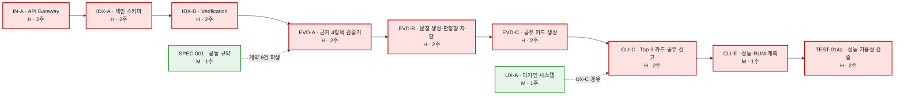
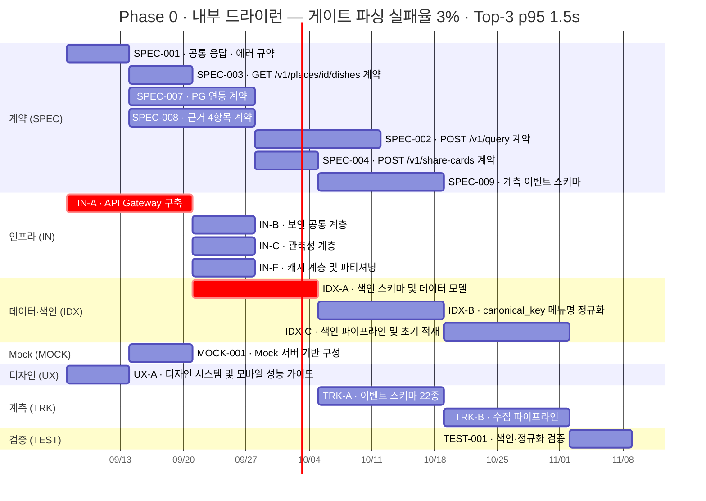
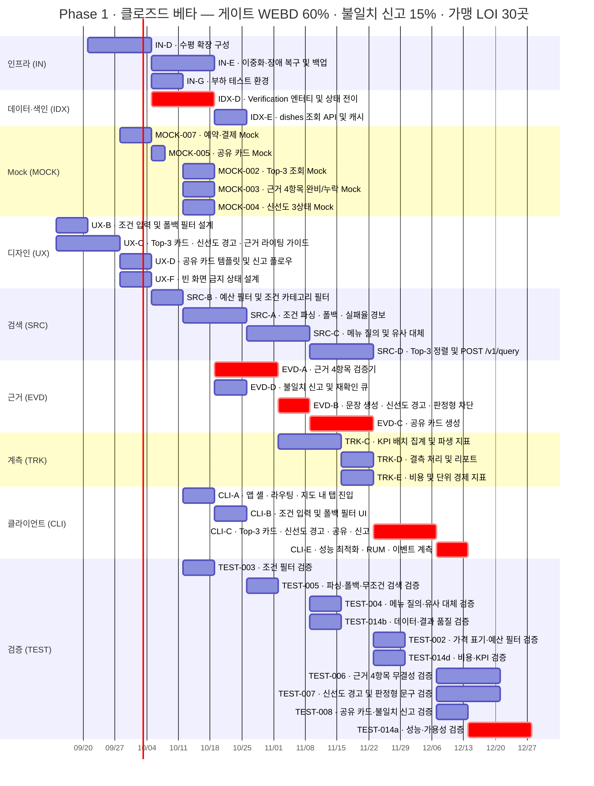
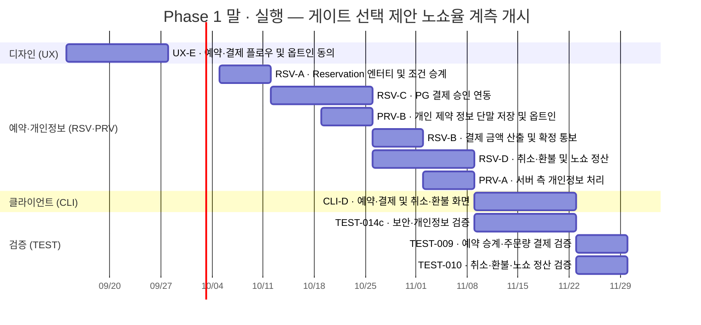
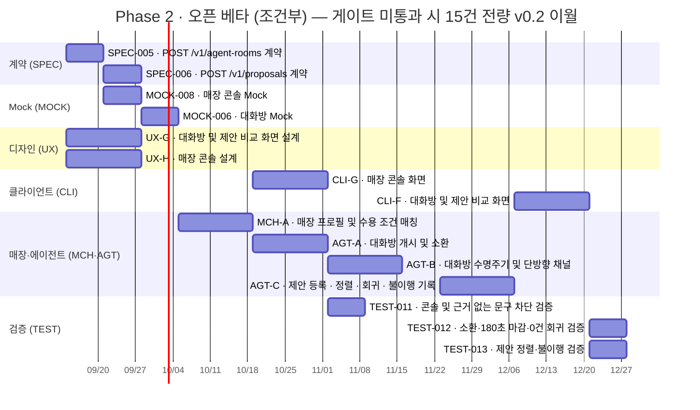

# [실행 총괄] AI-Place-Mate — 개발 착수 전략 · 의존성 · 일정

**문서 ID:** EXEC-AIPLACE-MVP-001
**개정 버전:** 1.0
**날짜:** 2026-08-26
**상위 문서:** [`SRS-ai-place-v1.0.md`](SRS-ai-place-v1.0.md) (SRS-AIPLACE-MVP-001 v1.9) · [`TASKS-ai-place-v1.0.md`](TASKS-ai-place-v1.0.md) (TASKS-AIPLACE-MVP-001 v1.1 · 50건)
**제작 순서 근거:** [`docs/task-extraction-assessment-aiplace.md`](docs/task-extraction-assessment-aiplace.md) §3 · [`docs/issues-aiplace/P4b-dependency.md`](docs/issues-aiplace/P4b-dependency.md)
**태스크 본문:** [`docs/issues-aiplace/tasks/`](docs/issues-aiplace/tasks/) 84건 (대조표 [`INDEX.md`](docs/issues-aiplace/tasks/INDEX.md)) · GitHub 이슈 `#94`~`#178`
**작성 관점:** Technical Project Manager / System Architect

> **이 문서의 목적** — 앞선 문서들은 *무엇을 만들지*(SRS) · *어떤 단위로 쪼갤지*(원장) · *어떤 순서로 본문을 쓸지*(평가서 §3)를 정했다.
> 이 문서는 **그 84건을 실제로 언제·누가·어떤 순서로 착수하는지**를 정한다.
> 태스크 본문 84개에 선언된 `Depends on` / `Blocks`를 전수 파싱해 DAG를 만들고, 임계 경로와 병렬 일정을 산출했다.

---

## 0. 한 장 요약

| 항목 | 값 |
| --- | --- |
| 태스크 | **84건** (원장 50 + 신규 34) · GitHub `#94`~`#178` |
| 의존 그래프 | **84 노드 · 198 간선** (하드 의존) · **순환 0건** |
| 임계 경로 | **16주** — `IN-A` → `IDX-A` → `IDX-D` → `EVD-A` → `EVD-B` → `EVD-C` → `CLI-C` → `CLI-E` → `TEST-014a` |
| 총 공수 | **120.5 인·주** |
| 최소 병렬도 | **7.5명** (16주에 끝내려면 평균 이 인원이 동시에 붙어야 한다) |
| 즉시 착수 가능 | **3건** — `IN-A` · `SPEC-001` · `UX-A` (선행 없음) |
| **최대 리스크** | 원장 §5가 선언한 **Phase 0 = 2주**를 의존 사슬이 수용하지 못한다 (실측 **9주**) |

**세 가지 판단**

1. **착수는 지금 가능하다.** 선행이 없는 3건이 있고, 그중 `SPEC-001`은 "미정을 드러내는 것이 산출물"이라 확정 대기 항목이 있어도 시작된다.
2. **일정은 선언대로 되지 않는다.** Phase 0·1·2 모두 의존 사슬이 선언 기간을 넘는다 (§4).
3. **병렬화가 전부다.** 총 공수 120.5인·주를 16주에 밀어넣는 것이므로, 스트림을 쪼개 동시에 굴리지 못하면 일정이 아니라 순서만 남는다 (§5).

---

## 1. 실행 전략

### 1.1 3단 원칙 — 계약이 먼저, Mock이 다음, 구현은 병행

이 프로젝트의 실행 전략은 원장 축약이나 문서 편성이 아니라 **직렬 구조를 끊은 것**에 있다.

```
[기존 구조]  계약 없음 → 백엔드 구현 → 프론트엔드가 대기        (직렬)
[현 구조]    계약 확정 → Mock 발행 ─┬─ 백엔드 구현              (병행)
                                    ├─ 프론트엔드 구현
                                    └─ 디자인
```

| 단 | 무엇 | 왜 이 순서인가 |
| --- | --- | --- |
| **1단** | `SPEC-001`~`009` 계약 9건 | 계약이 흔들리면 구현·Mock·테스트를 전부 다시 쓴다. **`SPEC-001`이 나머지 8건을 막는다** |
| **2단** | `MOCK-001`~`008` 8건 | 계약에서 파생된다. **여기까지 끝나면 프론트엔드가 백엔드를 기다리지 않는다** |
| **3단** | 구현 3스트림 병행 | SRS §4.3.3이 전제한 3스트림 병행이 이 지점에서 비로소 성립한다 |

> **계약은 "쓰는" 것이 아니라 "정하는" 것이다.** `SPEC-` 9건의 산출물은 코드가 아니라 합의다.
> Phase 0의 실질 병목은 인프라가 아니라 **계약 합의 7건**이다 (`P4b` §2.2).

### 1.2 스트림 편성 — 6개 트랙

84건을 담당·도구가 갈리는 단위로 묶었다. 괄호는 그 트랙의 태스크 계열이다.

| 스트림 | 계열 | 건수 | 공수 | 성격 |
| --- | --- | --- | --- | --- |
| **A 계약·Mock** | `SPEC` `MOCK` | 17 | 20.5 인·주 | 합의와 스텁. 코드 산출물이 적다 |
| **B 플랫폼** | `IN` | 7 | 10.0 인·주 | 게이트웨이·보안·관측성·캐시·부하 환경 |
| **C 데이터** | `IDX` `TRK` | 10 | 17.0 인·주 | 색인 스키마·정규화·이벤트 파이프라인 |
| **D 도메인 로직** | `SRC` `EVD` `RSV` `PRV` `MCH` `AGT` | 18 | 29.0 인·주 | 검색·근거·예약·개인정보·매장·에이전트 |
| **E 제품 표면** | `UX` `CLI` | 15 | 23.0 인·주 | 디자인 8 + 클라이언트 7. **섞지 않는다** |
| **F 검증** | `TEST` | 17 | 21.0 인·주 | 도구가 영역마다 다르다 (부하·보안·집계) |
| **합계** | | **84** | **120.5 인·주** | |

> **E 스트림 내부에서 디자인과 클라이언트는 분리 유지한다.** `UX-` 8건은 `CLI-`·`IN-`과 섞이지 않으며,
> 모든 `CLI-` 태스크는 대응 `UX-` 태스크를 선행으로 갖는다 (`CLI-A`←`UX-A`·`UX-F`, `CLI-B`←`UX-B`·`UX-F` …).

### 1.3 게이트와 이월 규칙

| Phase | 통과 게이트 (원장 §5) | 미달 시 |
| --- | --- | --- |
| **Phase 0** | 파싱 실패율 ≤ 3% · Top-3 p95 ≤ 1.5s | Phase 1 착수 보류 |
| **Phase 1** | WEBD ≥ 목표 60% · 불일치 신고 ≤ 15% · 가맹 LOI ≥ 30곳 | Phase 2 미착수 |
| **Phase 1 말** | 선택 제안 노쇼율 계측 개시 | — |
| **Phase 2** *(조건부)* | 제안 도착률 ≥ 70% · 선택 제안 노쇼 ≤ 8% | — |

> **Phase 2 15건은 통째로 이월 가능한 단위다.** SRS §6.2 게이트 1의 세 조건이 **모두** 충족될 때만 착수한다.
> 미충족 시 v0.2로 넘어가며, 이 15건을 제거해도 Phase 1은 완결된다 (`P4b` §2.4에서 검증).
> **따라서 Phase 2 태스크에 Phase 1 태스크를 의존시켜서는 안 된다.**

---

## 2. 의존성 구조

### 2.1 그래프 실측

태스크 본문 84개의 `Depends on` / `Blocks` 선언을 전수 파싱한 결과다.

| 항목 | 값 |
| --- | --- |
| 노드 | 84 |
| 하드 의존 간선 (`Depends on`) | **198** |
| 합집합 간선 (`Blocks` 역방향 포함) | 238 |
| **순환** | **0건** — 위상 정렬 84/84 완료 |
| 선행 없는 노드 | 3 |
| 최대 진입 차수 | `CLI-C` 9건 · `TEST-014a`·`TEST-014b`·`AGT-C` 각 6건 |

**일정 산출은 하드 의존 198간선으로 한다.** `Blocks`에만 있고 상대의 `Depends on`에 없는 40간선은
*"`CLI-E`가 `TRK-C` KPI 산출의 **실효성**을 막는다"* 처럼 **서술형 경고**가 섞여 있어 착수 차단으로 볼 수 없다.
다만 이 40간선을 하드로 간주하면 임계 경로가 **16주 → 18주**로 늘어난다. **§4의 격차는 이 40간선을 빼고도 발생한다.**

### 2.2 즉시 착수 3건 — 확정 대기 없이 시작

| 태스크 | 복잡도 | 근거 |
| --- | --- | --- |
| **`IN-A`** API Gateway | H | 선행 없음. 전 서비스의 계측·인증 지점 (`REQ-NF-001` `005` `008`의 측정 기준점) |
| **`SPEC-001`** 공통 응답·에러 규약 | M | **미정을 드러내는 것이 산출물**이다. SRS에 상태 코드가 `400`·`5xx`만 있어 체계를 여기서 만든다 |
| **`UX-A`** 디자인 시스템 | M | 선행 없음. **단, `UX-001` 인정 여부 PM 승인이 먼저** (SRS에 대응 요구사항이 없는 유일 항목) |

### 2.3 임계 경로 — 16주



**경로가 9마디이고 그중 8개가 H다.** 원장 §6이 경고한 *"H 비중 58%"* 가 임계 경로에서 그대로 나타난다.

| 마디 | 왜 끊을 수 없는가 |
| --- | --- |
| `IN-A` → `IDX-A` | 색인 스키마가 게이트웨이의 계측 기준을 전제한다 |
| `IDX-A` → `IDX-D` | ADR-002 — `Verification` 없이는 근거 4항목이 성립하지 않는다 |
| `IDX-D` → `EVD-A` → `EVD-B` → `EVD-C` | **근거 계열 3연쇄.** 검증기 → 문장 생성 → 카드 생성이 각각 앞을 소비한다 |
| `EVD-C` → `CLI-C` | 카드 생성 API 없이 카드 화면을 완결할 수 없다 |
| `CLI-E` → `TEST-014a` | 성능 검증이 RUM 계측 산출물을 쓴다 |

> **단축 후보는 근거 3연쇄다.** `EVD-A`~`C`가 6주를 차지한다. 세 건을 병렬화하려면
> `SPEC-008`(근거 4항목 계약)이 **문장 생성 규칙과 카드 규격까지** 미리 못박아야 한다. 계약 범위를 넓히는 대가로 6주를 줄이는 거래다.

### 2.4 DAG 웨이브 — ES(최조 착수 시점) 기준

선행이 모두 끝나는 즉시 착수한다고 가정한 착수 시점 분포다. **같은 주에 묶인 태스크는 동시에 굴릴 수 있다.**

| 착수 주 | 건수 | 착수 주 | 건수 | 착수 주 | 건수 |
| --- | --- | --- | --- | --- | --- |
| 0주 | 3 | 6주 | 9 | 11주 | 6 |
| 1주 | 10 | 7주 | 4 | 13주 | 5 |
| 2주 | 7 | 8주 | 6 | 14주 | 1 |
| 3주 | 6 | 9주 | 6 | 15주 | 2 |
| 4주 | 10 | 10주 | 2 | | |
| 5주 | 7 | | | | |

**1~5주 구간에 40건이 몰린다.** 0주 3건을 더하면 5주 안에 43건(51%)이 착수 상태가 된다. 이 구간의 인력 배치가 일정 전체를 결정한다.

---

## 3. 일정 — DAG 기반 병렬 Gantt

### 3.1 소요 산정 규칙

| 복잡도 | 소요 | 근거 |
| --- | --- | --- |
| **H** | 2주 | 원장 §0.1 — 최소 단위는 **1스프린트(2주) 안에 완료 판정 가능한 크기**. H는 스프린트를 다 쓴다 |
| **M** | 1주 | 표준 구현 |
| **L** | 3일 | 단순 CRUD·설정 (84건 중 `MOCK-005` 1건뿐) |

**시작일은 2026-09-07(월)을 기준으로 잡았다.** 날짜는 주차 오프셋을 보이기 위한 것이며,
실제 착수일이 바뀌면 상대 간격만 유지하면 된다. 빨간 막대가 임계 경로다.

### 3.2 트랙별 전체 일정 — 병렬 가능 구간 한눈에

§1.2가 편성한 6개 트랙을 그대로 축으로 쓴 차트다. **같은 트랙 안에서 막대가 겹치면 그만큼 인원이 필요하고, 트랙끼리는 담당이 달라 항상 병렬이다.** 라벨의 `P0`·`P1`·`P1말`·`P2`가 Phase다.

| 트랙 | 건수 | 공수 | 활동 구간 | 폭 | 임계 경로 포함 |
| --- | --- | --- | --- | --- | --- |
| **A 계약·Mock** | 17 | 20.5 인·주 | 0~6주 | 6주 | — |
| **B 플랫폼** | 7 | 10.0 인·주 | 0~6주 | 6주 | 1건 |
| **C 데이터** | 10 | 17.0 인·주 | 2~11주 | 9주 | 2건 |
| **D 도메인 로직** | 18 | 29.0 인·주 | 4~13주 | 9주 | 3건 |
| **E 제품 표면** | 15 | 23.0 인·주 | 0~15주 | 15주 | 2건 |
| **F 검증** | 17 | 21.0 인·주 | 5~16주 | 11주 | 1건 |

**트랙마다 성격이 다르게 드러난다.**

- **A·B는 앞 6주에 몰려 끝난다.** 계약과 플랫폼은 전반부 집중 투입 후 빠진다. 상시 인원이 아니다.
- **E 제품 표면은 0주부터 15주까지 15주간 계속 돈다.** 폭이 가장 넓다 — 디자이너와 클라이언트 개발자는 **처음부터 끝까지 상시 배치**가 필요하다.
- **F 검증은 5주에 시작해 마지막까지 간다.** 검증 인력을 후반에 투입하면 늦다.
- **D 도메인 로직이 임계 경로 3건을 갖는다.** 여기가 지연되면 전체가 밀린다.

```mermaid
gantt
    title 트랙별 전체 일정 — 84건 · 임계 경로 16주 (빨강)
    dateFormat YYYY-MM-DD
    axisFormat %m/%d
    section A 계약·Mock
    SPEC-001 · P0 공통 응답 · 에러 규약 :SPEC-001, 2026-09-07, 1w
    MOCK-001 · P0 Mock 서버 기반 구성 :MOCK-001, 2026-09-14, 1w
    SPEC-003 · P0 GET /v1/places/id/dishes 계약 :SPEC-003, 2026-09-14, 1w
    SPEC-005 · P2 POST /v1/agent-rooms 계약 :SPEC-005, 2026-09-14, 1w
    SPEC-007 · P0 PG 연동 계약 :SPEC-007, 2026-09-14, 2w
    SPEC-008 · P0 근거 4항목 계약 :SPEC-008, 2026-09-14, 2w
    MOCK-008 · P2 매장 콘솔 Mock :MOCK-008, 2026-09-21, 1w
    SPEC-006 · P2 POST /v1/proposals 계약 :SPEC-006, 2026-09-21, 1w
    MOCK-006 · P2 대화방 Mock :MOCK-006, 2026-09-28, 1w
    MOCK-007 · P1 예약·결제 Mock :MOCK-007, 2026-09-28, 1w
    SPEC-002 · P0 POST /v1/query 계약 :SPEC-002, 2026-09-28, 2w
    SPEC-004 · P0 POST /v1/share-cards 계약 :SPEC-004, 2026-09-28, 1w
    MOCK-005 · P1 공유 카드 Mock :MOCK-005, 2026-10-05, 3d
    SPEC-009 · P0 계측 이벤트 스키마 :SPEC-009, 2026-10-05, 2w
    MOCK-002 · P1 Top-3 조회 Mock :MOCK-002, 2026-10-12, 1w
    MOCK-003 · P1 근거 4항목 완비/누락 Mock :MOCK-003, 2026-10-12, 1w
    MOCK-004 · P1 신선도 3상태 Mock :MOCK-004, 2026-10-12, 1w
    section B 플랫폼
    IN-A · P0 API Gateway 구축 :crit, IN-A, 2026-09-07, 2w
    IN-B · P0 보안 공통 계층 :IN-B, 2026-09-21, 1w
    IN-C · P0 관측성 계층 :IN-C, 2026-09-21, 1w
    IN-D · P1 수평 확장 구성 :IN-D, 2026-09-21, 2w
    IN-F · P0 캐시 계층 및 파티셔닝 :IN-F, 2026-09-21, 1w
    IN-E · P1 이중화·장애 복구 및 백업 :IN-E, 2026-10-05, 2w
    IN-G · P1 부하 테스트 환경 :IN-G, 2026-10-05, 1w
    section C 데이터
    IDX-A · P0 색인 스키마 및 데이터 모델 :crit, IDX-A, 2026-09-21, 2w
    IDX-B · P0 canonical_key 메뉴명 정규화 :IDX-B, 2026-10-05, 2w
    IDX-D · P1 Verification 엔터티 및 상태 전이 :crit, IDX-D, 2026-10-05, 2w
    TRK-A · P0 이벤트 스키마 22종 :TRK-A, 2026-10-05, 2w
    IDX-C · P0 색인 파이프라인 및 초기 적재 :IDX-C, 2026-10-19, 2w
    IDX-E · P1 dishes 조회 API 및 캐시 :IDX-E, 2026-10-19, 1w
    TRK-B · P0 수집 파이프라인 :TRK-B, 2026-10-19, 2w
    TRK-C · P1 KPI 배치 집계 및 파생 지표 :TRK-C, 2026-11-02, 2w
    TRK-D · P1 결측 처리 및 리포트 :TRK-D, 2026-11-16, 1w
    TRK-E · P1 비용 및 단위 경제 지표 :TRK-E, 2026-11-16, 1w
    section D 도메인 로직
    MCH-A · P2 매장 프로필 및 수용 조건 매칭 :MCH-A, 2026-10-05, 2w
    RSV-A · P1말 Reservation 엔터티 및 조건 승계 :RSV-A, 2026-10-05, 1w
    SRC-B · P1 예산 필터 및 조건 카테고리 필터 :SRC-B, 2026-10-05, 1w
    RSV-C · P1말 PG 결제 승인 연동 :RSV-C, 2026-10-12, 2w
    SRC-A · P1 조건 파싱 · 폴백 · 실패율 경보 :SRC-A, 2026-10-12, 2w
    AGT-A · P2 대화방 개시 및 소환 :AGT-A, 2026-10-19, 2w
    EVD-A · P1 근거 4항목 검증기 :crit, EVD-A, 2026-10-19, 2w
    EVD-D · P1 불일치 신고 및 재확인 큐 :EVD-D, 2026-10-19, 1w
    PRV-B · P1말 개인 제약 정보 단말 저장 및 옵트인 :PRV-B, 2026-10-19, 1w
    RSV-B · P1말 결제 금액 산출 및 확정 통보 :RSV-B, 2026-10-26, 1w
    RSV-D · P1말 취소·환불 및 노쇼 정산 :RSV-D, 2026-10-26, 2w
    SRC-C · P1 메뉴 질의 및 유사 대체 :SRC-C, 2026-10-26, 2w
    AGT-B · P2 대화방 수명주기 및 단방향 채널 :AGT-B, 2026-11-02, 2w
    EVD-B · P1 문장 생성 · 신선도 경고 · 판정형 차단 :crit, EVD-B, 2026-11-02, 1w
    PRV-A · P1말 서버 측 개인정보 처리 :PRV-A, 2026-11-02, 1w
    EVD-C · P1 공유 카드 생성 :crit, EVD-C, 2026-11-09, 2w
    SRC-D · P1 Top-3 정렬 및 POST /v1/query :SRC-D, 2026-11-09, 2w
    AGT-C · P2 제안 등록 · 정렬 · 회귀 · 불이행 기록 :AGT-C, 2026-11-23, 2w
    section E 제품 표면
    UX-A · P0 디자인 시스템 및 모바일 성능 가이드 :UX-A, 2026-09-07, 1w
    UX-B · P1 조건 입력 및 폴백 필터 설계 :UX-B, 2026-09-14, 1w
    UX-C · P1 Top-3 카드 · 신선도 경고 · 근거 라이팅 가이드 :UX-C, 2026-09-14, 2w
    UX-E · P1말 예약·결제 플로우 및 옵트인 동의 :UX-E, 2026-09-14, 2w
    UX-G · P2 대화방 및 제안 비교 화면 설계 :UX-G, 2026-09-14, 2w
    UX-H · P2 매장 콘솔 설계 :UX-H, 2026-09-14, 2w
    UX-D · P1 공유 카드 템플릿 및 신고 플로우 :UX-D, 2026-09-28, 1w
    UX-F · P1 빈 화면 금지 상태 설계 :UX-F, 2026-09-28, 1w
    CLI-A · P1 앱 셸 · 라우팅 · 지도 내 탭 진입 :CLI-A, 2026-10-12, 1w
    CLI-B · P1 조건 입력 및 폴백 필터 UI :CLI-B, 2026-10-19, 1w
    CLI-G · P2 매장 콘솔 화면 :CLI-G, 2026-10-19, 2w
    CLI-D · P1말 예약·결제 및 취소·환불 화면 :CLI-D, 2026-11-09, 2w
    CLI-C · P1 Top-3 카드 · 신선도 경고 · 공유 · 신고 :crit, CLI-C, 2026-11-23, 2w
    CLI-E · P1 성능 최적화 · RUM · 이벤트 계측 :crit, CLI-E, 2026-12-07, 1w
    CLI-F · P2 대화방 및 제안 비교 화면 :CLI-F, 2026-12-07, 2w
    section F 검증
    TEST-003 · P1 조건 필터 검증 :TEST-003, 2026-10-12, 1w
    TEST-005 · P1 파싱·폴백·무조건 검색 검증 :TEST-005, 2026-10-26, 1w
    TEST-001 · P0 색인·정규화 검증 :TEST-001, 2026-11-02, 1w
    TEST-011 · P2 콘솔 및 근거 없는 문구 차단 검증 :TEST-011, 2026-11-02, 1w
    TEST-004 · P1 메뉴 질의·유사 대체 검증 :TEST-004, 2026-11-09, 1w
    TEST-014b · P1 데이터·결과 품질 검증 :TEST-014b, 2026-11-09, 1w
    TEST-014c · P1말 보안·개인정보 검증 :TEST-014c, 2026-11-09, 2w
    TEST-002 · P1 가격 표기·예산 필터 검증 :TEST-002, 2026-11-23, 1w
    TEST-009 · P1말 예약 승계·주문량 결제 검증 :TEST-009, 2026-11-23, 1w
    TEST-010 · P1말 취소·환불·노쇼 정산 검증 :TEST-010, 2026-11-23, 1w
    TEST-014d · P1 비용·KPI 검증 :TEST-014d, 2026-11-23, 1w
    TEST-006 · P1 근거 4항목 무결성 검증 :TEST-006, 2026-12-07, 2w
    TEST-007 · P1 신선도 경고 및 판정형 문구 검증 :TEST-007, 2026-12-07, 2w
    TEST-008 · P1 공유 카드·불일치 신고 검증 :TEST-008, 2026-12-07, 1w
    TEST-014a · P1 성능·가용성 검증 :crit, TEST-014a, 2026-12-14, 2w
    TEST-012 · P2 소환·180초 마감·0건 회귀 검증 :TEST-012, 2026-12-21, 1w
    TEST-013 · P2 제안 정렬·불이행 검증 :TEST-013, 2026-12-21, 1w
```



> **이 차트가 §3.3~3.6(Phase별)과 다른 점** — 같은 84건을 트랙 축으로 재배열한 것이다.
> Phase별 차트는 *게이트 판정 단위*를 보고, 이 차트는 *인력 배치 단위*를 본다.

### 3.3 Phase 0 — 내부 드라이런 (19건 · 임계 경로 9주 · 29.0 인·주)



> **Phase 0의 실질 시작은 `SPEC-001`·`IN-A`·`UX-A` 3건이다.** 나머지 16건은 이 셋에서 갈라진다.
> `TEST-001`(색인·정규화 검증)이 8주차에 붙는 것은 `IDX-C` 완료를 기다리기 때문이며,
> **정규화 92% 평가셋이 없으면 이 태스크는 착수 자체가 불가능하다** (§6 블로커 1번).

### 3.4 Phase 1 — 클로즈드 베타 (39건 · 임계 경로 12주 · 52.5 인·주)



> **Mock 5건이 9월 말~10월 중순에 몰려 있다.** 이 구간이 프론트엔드 착수의 관문이다.
> `MOCK-002`~`004`가 같은 주에 착수 가능하므로 **한 사람이 순차로 만들면 3주, 나눠 만들면 1주**다.

### 3.5 Phase 1 말 — 예약·결제·개인정보 (11건 · 임계 경로 8주 · 16.0 인·주)



> **`RSV-C`(PG 결제 승인)가 외부 계약에 걸려 있다.** 원장 §4가 임계 경로 5순위로 지목한 항목이고,
> PG사 선정은 자사 통제 밖이다. **Phase 0 착수와 동시에 계약 협의를 시작해야** 이 구간에서 병목이 되지 않는다.
> `TEST-014c`(보안·개인정보 검증)가 이 Phase에 있는 이유는 선행 `PRV-A`·`PRV-B`·`RSV-C`가 전부 여기 있기 때문이다.

### 3.6 Phase 2 — 오픈 베타 *(조건부)* (15건 · 임계 경로 11주 · 23.0 인·주)



> **이 15건은 게이트 통과 전에 착수하지 않는다.** 미통과 시 통째로 버려진다.
> 다만 `SPEC-005`·`SPEC-006`(대화방·제안 계약)은 1주차에 착수 가능한 상태로 남겨뒀다 —
> **계약만 미리 확정해두면 게이트 통과 시 구현이 즉시 시작된다.** 계약은 버려도 손실이 작다.

---

## 4. 선언 기간과의 격차 — 최대 리스크

원장 §5가 선언한 Phase 기간과 DAG 실측 임계 경로를 나란히 놓으면 이렇다.

| Phase | 원장 선언 | DAG 임계 경로 | 격차 | 총 공수 | 최소 병렬도 |
| --- | --- | --- | --- | --- | --- |
| **Phase 0** | **2주** | **9주** | **+7주** | 29.0 인·주 | 3.2명 |
| **Phase 1** | **8주** | **12주** | **+4주** | 52.5 인·주 | 4.4명 |
| **Phase 1 말** | (Phase 1 후반) | 8주 | — | 16.0 인·주 | 2.0명 |
| **Phase 2** | **8주** | **11주** | **+3주** | 23.0 인·주 | 2.1명 |

### 4.1 Phase 0의 2주는 성립하지 않는다

이것이 가장 큰 격차다. Phase 0 내부의 최장 사슬만 보면 —

```
IN-A(H,2주) → IDX-A(H,2주) → IDX-B(H,2주) → IDX-C(H,2주) → TEST-001(M,1주) = 9주
```

**인원을 아무리 늘려도 이 9주는 줄지 않는다.** 네 마디가 전부 H이고 서로가 앞의 산출물을 소비한다.

> **소요 산정을 바꿔도 결론은 같다.** H를 1주로 낮춰도 이 사슬은 5주이며, 여전히 2주를 넘는다.
> 즉 이 격차는 산정 방식의 문제가 아니라 **의존 구조의 문제**다.

**선택지 세 가지 — PM 판단 사항**

| 선택지 | 내용 | 대가 |
| --- | --- | --- |
| **① Phase 0 기간 재선언** | 2주 → 9~10주 | 전체 일정이 뒤로 밀린다. **가장 정직한 안** |
| **② Phase 0 범위 축소** | `IDX-C`(초기 적재)·`TEST-001`을 Phase 1로 이월 | 게이트 판정 기준(파싱 실패율·p95)을 **Phase 0에서 잴 수 없게 된다** |
| **③ 사슬 분리** | `IDX-A`를 스키마/마이그레이션으로 쪼개 `IDX-B` 조기 착수 | 원장 §6의 완화 선택지(50 → 53건)와 같은 성격. 복잡도는 나뉘지만 총량은 그대로 |

**②는 게이트를 무력화한다.** Phase 0의 존재 이유가 "파싱 실패율 3%·p95 1.5s를 실측해 Phase 1 진입을 판정하는 것"인데,
그 측정 대상인 색인 적재와 검증 태스크를 빼면 **통과 판정을 할 수 없다.** ①이나 ③을 권한다.

### 4.2 총 공수 대비 병렬도

**120.5 인·주를 16주에 넣으려면 평균 7.5명이 상시 투입돼야 한다.** 다만 이는 평균이고, 실제 피크는 다르다.

| 구간 | 동시 착수 건수 | 필요 인원 (추정) |
| --- | --- | --- |
| 0주 | 3 | 3 |
| **1~5주** | **40건 착수** | **6~8명 (피크)** |
| 6~10주 | 27 | 5~6 |
| 11~15주 | 14 | 4~5 |

**1~5주 구간이 피크다.** 계약 8건 · Mock 8건 · 디자인 7건 · 인프라 6건이 이 구간에 겹치는데, 넷 다 **담당이 다르다** —
계약은 개발팀 리드, Mock은 백엔드, 디자인은 디자이너, 인프라는 운영이다. **역할이 갈리므로 병렬화가 실제로 가능한 구간이다.**

---

## 5. 병렬화 계획

### 5.1 스트림별 상시 인원

| 스트림 | 공수 | 권장 인원 | 근거 |
| --- | --- | --- | --- |
| **A 계약·Mock** | 20.5 인·주 | 1~2 | 계약은 리드 1명이 정하고, Mock은 계약 확정 후 병렬 생성 가능 |
| **B 플랫폼** | 10.0 인·주 | 1 | `IN-A` 이후 `IN-B`·`IN-C`·`IN-F`가 동시 착수 가능 |
| **C 데이터** | 17.0 인·주 | 1~2 | `IDX` 사슬은 직렬이라 인원을 늘려도 안 줄어든다. `TRK`는 별도 |
| **D 도메인 로직** | 29.0 인·주 | 2~3 | 최대 스트림. `SRC`·`EVD`·`RSV` 세 갈래가 독립적 |
| **E 제품 표면** | 23.0 인·주 | 2 | 디자이너 1 + 클라이언트 개발 1. **디자인이 항상 한 발 앞서야 한다** |
| **F 검증** | 21.0 인·주 | 1~2 | 도구가 영역마다 달라 후반에 인원이 필요하다 |
| **합계** | **120.5** | **8~12** | |

### 5.2 병렬화가 듣지 않는 구간

인원을 넣어도 줄지 않는 곳을 미리 알아둬야 한다.

| 구간 | 길이 | 왜 |
| --- | --- | --- |
| `IN-A` → `IDX-A` → `IDX-B` → `IDX-C` | 8주 | 스키마 → 정규화 → 적재. 앞의 산출물이 뒤의 입력 |
| `EVD-A` → `EVD-B` → `EVD-C` | 6주 | 검증기 → 문장 생성 → 카드. **§2.3의 단축 후보** |
| `RSV-A` → `RSV-C` → `RSV-D` | 6주 | 예약 → 결제 승인 → 취소·정산. **`RSV-C`는 외부 PG 계약에도 걸린다** |
| `MCH-A` → `AGT-A` → `AGT-B` → `AGT-C` | 8주 | Phase 2 사슬 |

### 5.3 조기 착수 대상

의존 그래프상 나중이지만 **지금 시작해야 하는 것**들이다. 리드타임이 자사 통제 밖에 있다.

| 항목 | 언제 | 왜 |
| --- | --- | --- |
| **PG사 선정** (`RSV-C` 선행) | Phase 0과 동시 | 외부 계약. 후행 8건이 걸린다 |
| **법령 검토 3건** (`TEST-014c` 선행) | Phase 0과 동시 | 법무 리드타임. `UX-E` 동의 카피가 막혀 있다 |
| **정규화 평가셋** (`IDX-C`·`TEST-001` 선행) | Phase 0과 동시 | 레이블링 작업 자체에 시간이 든다. **Phase 0 게이트** |
| **`IN-G` 부하 테스트 환경** | 1~2단계와 병행 | 원장 §4·평가서 §3 — 통합 후 시작하면 고칠 시간이 없다 |

---

## 6. 착수 전 확정 필요 — 블로커

`P4b` §3의 22건 중 **일정에 직접 영향을 주는 것**만 골랐다. 전체 목록은 `P4b` §3을 본다.

### 6.1 Phase 0 게이트를 막는 것 — 3건

| # | 항목 | 막는 태스크 | 담당 |
| --- | --- | --- | --- |
| 1 | **정규화 92% 평가셋 부재** | `IDX-C` `TEST-001` — **게이트 판정 불가** | PM + 데이터 |
| 2 | **세션 정의 · 제외 트래픽** | `TRK-B` + KPI 12건 전부 | 개발팀 리드 + PM |
| 3 | **`SPEC-009` ↔ `TRK-A` 중복 해소** | 원장 정합 | 개발팀 리드 |

### 6.2 Phase 1 착수 전 — 5건

| # | 항목 | 막는 태스크 | 담당 |
| --- | --- | --- | --- |
| 4 | **`SPEC-008` `STALE` 후보 유효성** | `EVD-A` `TEST-006` + 소비처 4곳 | 개발팀 리드 |
| 5 | **판정형 어휘 기준** | `EVD-B` `CLI-C` `TEST-007` — **임계 경로상** | PM + 디자인 |
| 6 | **예산 판정 기준값** | `SRC-B` `TEST-002` | PM |
| 7 | **정렬 동점 규칙** | `SRC-D` | 개발팀 리드 |
| 8 | **인앱 브라우저 제약 실측** | `CLI-A` `CLI-C` `CLI-D` `PRV-B` | 개발팀 리드 |

> **5번이 임계 경로에 걸려 있다.** `EVD-B`는 §2.3 임계 경로의 5번째 마디이므로, 판정형 어휘 기준이 늦어지면 **전체 일정이 그만큼 밀린다.**

### 6.3 일괄 해소 가능 — 1건이 7건을 대체

| # | 항목 | 대체 범위 |
| --- | --- | --- |
| 9 | **임계값 경계 규약** — "모든 임계값은 이하/이상을 포함한다" | 파싱 실패율 3% · 누락률 5% · 신선도 90일 · 취소 2시간 · 예산 기준값 · 수용 조건 상한 · 유사도 기준 — **최소 7건** |

**비용 대비 효과가 가장 크다.** 개별 확정은 7번의 논의가 필요하지만 규약 하나로 정리된다.

### 6.4 미해소 구조 결함 2건 — PM 확정 대기

| 항목 | 내용 |
| --- | --- |
| **`RSV-A`의 `Proposal` 참조** | 예약(Phase 1 말)이 참조하는 `Proposal`이 Phase 2에 있다. 계약만 있고 대상이 없다 |
| **`TRK-E`의 `FR-082` Phase 모순** | 온보딩은 Phase 1, 매장 프로필 등록(`MCH-A`)은 Phase 2 |

---

## 7. 이 문서를 쓰는 법

| 상황 | 볼 곳 |
| --- | --- |
| 지금 뭘 시작하나 | §2.2 즉시 착수 3건 |
| 이 태스크 선행이 뭔가 | §부록 A 또는 `docs/issues-aiplace/tasks/<ID>.md` |
| 일정이 왜 안 맞나 | §4 선언 기간과의 격차 |
| Phase 게이트 단위로 보고 싶다 | §3.3~3.6 Phase별 일정 |
| 사람을 어디 넣나 | **§3.2 트랙별 일정** · §5.1 스트림별 인원 · §5.2 병렬화 안 되는 구간 |
| 착수가 막혔다 | §6 블로커 |
| 태스크 본문·이슈 번호 | `docs/issues-aiplace/tasks/INDEX.md` |

> **이 문서는 의존 선언에서 기계적으로 산출됐다.** 태스크 본문의 `Depends on` / `Blocks`를 고치면
> 임계 경로와 일정이 바뀐다. **본문을 고쳤으면 이 문서의 §2~§5를 다시 계산해야 한다.**

---

## 부록 A · 태스크별 착수·종료 시점 (전 84건)

ES/EF는 하드 의존 198간선 기준, 선행 완료 즉시 착수·무제한 병렬 가정이다. 단위는 주차 오프셋.

| 태스크 | 내용 | Phase | 복잡도 | 주차 | 선행 |
| --- | --- | --- | --- | --- | --- |
| `IN-A` | API Gateway 구축 | 0 | H | 0~2 | — |
| `SPEC-001` | 공통 응답 · 에러 규약 | 0 | M | 0~1 | — |
| `UX-A` | 디자인 시스템 및 모바일 성능 가이드 | 0 | M | 0~1 | — |
| `MOCK-001` | Mock 서버 기반 구성 | 0 | M | 1~2 | `SPEC-001` |
| `SPEC-003` | GET /v1/places/{id}/dishes 계약 | 0 | M | 1~2 | `SPEC-001` |
| `SPEC-005` | POST /v1/agent-rooms 계약 | 2 | M | 1~2 | `SPEC-001` |
| `SPEC-007` | PG 연동 계약 | 0 | H | 1~3 | `SPEC-001` |
| `SPEC-008` | 근거 4항목 계약 | 0 | H | 1~3 | `SPEC-001` |
| `UX-B` | 조건 입력 및 폴백 필터 설계 | 1 | M | 1~2 | `UX-A` |
| `UX-C` | Top-3 카드 · 신선도 경고 · 근거 라이팅 가이드 | 1 | H | 1~3 | `UX-A` |
| `UX-E` | 예약·결제 플로우 및 옵트인 동의 | 1말 | H | 1~3 | `UX-A` |
| `UX-G` | 대화방 및 제안 비교 화면 설계 | 2 | H | 1~3 | `UX-A` |
| `UX-H` | 매장 콘솔 설계 | 2 | H | 1~3 | `UX-A` |
| `IDX-A` | 색인 스키마 및 데이터 모델 | 0 | H | 2~4 | `IN-A` |
| `IN-B` | 보안 공통 계층 | 0 | M | 2~3 | `IN-A` |
| `IN-C` | 관측성 계층 | 0 | M | 2~3 | `IN-A` |
| `IN-D` | 수평 확장 구성 | 1 | H | 2~4 | `IN-A` |
| `IN-F` | 캐시 계층 및 파티셔닝 | 0 | M | 2~3 | `IN-A` |
| `MOCK-008` | 매장 콘솔 Mock | 2 | M | 2~3 | `MOCK-001` |
| `SPEC-006` | POST /v1/proposals 계약 | 2 | M | 2~3 | `SPEC-001` `SPEC-005` |
| `MOCK-006` | 대화방 Mock | 2 | M | 3~4 | `MOCK-001` `SPEC-005` `SPEC-006` |
| `MOCK-007` | 예약·결제 Mock | 1 | M | 3~4 | `MOCK-001` `SPEC-007` |
| `SPEC-002` | POST /v1/query 계약 | 0 | H | 3~5 | `SPEC-001` `SPEC-008` |
| `SPEC-004` | POST /v1/share-cards 계약 | 0 | M | 3~4 | `SPEC-001` `SPEC-008` |
| `UX-D` | 공유 카드 템플릿 및 신고 플로우 | 1 | M | 3~4 | `UX-C` |
| `UX-F` | 빈 화면 금지 상태 설계 | 1 | M | 3~4 | `UX-B` `UX-C` |
| `IDX-B` | canonical_key 메뉴명 정규화 | 0 | H | 4~6 | `IDX-A` |
| `IDX-D` | Verification 엔터티 및 상태 전이 | 1 | H | 4~6 | `IDX-A` |
| `IN-E` | 이중화·장애 복구 및 백업 | 1 | H | 4~6 | `IN-D` |
| `IN-G` | 부하 테스트 환경 | 1 | M | 4~5 | `IN-D` |
| `MCH-A` | 매장 프로필 및 수용 조건 매칭 | 2 | H | 4~6 | `IDX-A` |
| `MOCK-005` | 공유 카드 Mock | 1 | L | 4~4 | `MOCK-001` `SPEC-004` |
| `RSV-A` | Reservation 엔터티 및 조건 승계 | 1말 | M | 4~5 | `IDX-A` |
| `SPEC-009` | 계측 이벤트 스키마 | 0 | H | 4~6 | `IDX-A` `SPEC-001` |
| `SRC-B` | 예산 필터 및 조건 카테고리 필터 | 1 | M | 4~5 | `IDX-A` |
| `TRK-A` | 이벤트 스키마 22종 | 0 | H | 4~6 | `IDX-A` |
| `CLI-A` | 앱 셸 · 라우팅 · 지도 내 탭 진입 | 1 | M | 5~6 | `IN-A` `SPEC-002` `UX-A` `UX-F` |
| `MOCK-002` | Top-3 조회 Mock | 1 | M | 5~6 | `MOCK-001` `SPEC-002` |
| `MOCK-003` | 근거 4항목 완비/누락 Mock | 1 | M | 5~6 | `MOCK-001` `SPEC-002` `SPEC-008` |
| `MOCK-004` | 신선도 3상태 Mock | 1 | M | 5~6 | `MOCK-001` `SPEC-002` |
| `RSV-C` | PG 결제 승인 연동 | 1말 | H | 5~7 | `IN-B` `RSV-A` `SPEC-007` |
| `SRC-A` | 조건 파싱 · 폴백 · 실패율 경보 | 1 | H | 5~7 | `IN-A` `IN-C` `SPEC-001` `SPEC-002` |
| `TEST-003` | 조건 필터 검증 | 1 | M | 5~6 | `SRC-B` |
| `AGT-A` | 대화방 개시 및 소환 | 2 | H | 6~8 | `MCH-A` `SPEC-005` |
| `CLI-B` | 조건 입력 및 폴백 필터 UI | 1 | M | 6~7 | `CLI-A` `SPEC-002` `UX-B` `UX-F` |
| `CLI-G` | 매장 콘솔 화면 | 2 | H | 6~8 | `IN-B` `MCH-A` `UX-H` |
| `EVD-A` | 근거 4항목 검증기 | 1 | H | 6~8 | `IDX-D` `SPEC-008` |
| `EVD-D` | 불일치 신고 및 재확인 큐 | 1 | M | 6~7 | `IDX-D` |
| `IDX-C` | 색인 파이프라인 및 초기 적재 | 0 | H | 6~8 | `IDX-A` `IDX-B` |
| `IDX-E` | dishes 조회 API 및 캐시 | 1 | M | 6~7 | `IDX-B` `IN-F` `SPEC-003` |
| `PRV-B` | 개인 제약 정보 단말 저장 및 옵트인 | 1말 | M | 6~7 | `CLI-A` `UX-E` |
| `TRK-B` | 수집 파이프라인 | 0 | H | 6~8 | `IN-F` `SPEC-009` `TRK-A` |
| `RSV-B` | 결제 금액 산출 및 확정 통보 | 1말 | M | 7~8 | `IN-C` `RSV-A` `RSV-C` |
| `RSV-D` | 취소·환불 및 노쇼 정산 | 1말 | H | 7~9 | `RSV-C` |
| `SRC-C` | 메뉴 질의 및 유사 대체 | 1 | H | 7~9 | `IDX-B` `IDX-E` |
| `TEST-005` | 파싱·폴백·무조건 검색 검증 | 1 | M | 7~8 | `CLI-B` `SPEC-002` `SRC-A` |
| `AGT-B` | 대화방 수명주기 및 단방향 채널 | 2 | H | 8~10 | `AGT-A` |
| `EVD-B` | 문장 생성 · 신선도 경고 · 판정형 차단 | 1 | M | 8~9 | `EVD-A` `UX-C` |
| `PRV-A` | 서버 측 개인정보 처리 | 1말 | M | 8~9 | `IDX-A` `IN-B` `IN-F` `TRK-B` |
| `TEST-001` | 색인·정규화 검증 | 0 | M | 8~9 | `IDX-B` `IDX-C` |
| `TEST-011` | 콘솔 및 근거 없는 문구 차단 검증 | 2 | M | 8~9 | `CLI-G` `IN-B` `MCH-A` `UX-H` |
| `TRK-C` | KPI 배치 집계 및 파생 지표 | 1 | H | 8~10 | `EVD-D` `TRK-B` |
| `CLI-D` | 예약·결제 및 취소·환불 화면 | 1말 | H | 9~11 | `RSV-C` `RSV-D` `SPEC-007` `UX-E` |
| `EVD-C` | 공유 카드 생성 | 1 | H | 9~11 | `EVD-A` `EVD-B` `SPEC-004` `SPEC-008` |
| `SRC-D` | Top-3 정렬 및 POST /v1/query | 1 | H | 9~11 | `EVD-A` `SPEC-002` `SPEC-008` `SRC-B` `SRC-C` |
| `TEST-004` | 메뉴 질의·유사 대체 검증 | 1 | M | 9~10 | `SRC-C` |
| `TEST-014b` | 데이터·결과 품질 검증 | 1 | M | 9~10 | `EVD-A` `EVD-B` `IDX-C` `SRC-A` `SRC-C` `TRK-B` |
| `TEST-014c` | 보안·개인정보 검증 | 1말 | H | 9~11 | `IN-B` `PRV-A` `PRV-B` `RSV-C` |
| `TRK-D` | 결측 처리 및 리포트 | 1 | M | 10~11 | `TRK-B` `TRK-C` |
| `TRK-E` | 비용 및 단위 경제 지표 | 1 | M | 10~11 | `IDX-A` `TRK-B` `TRK-C` |
| `AGT-C` | 제안 등록 · 정렬 · 회귀 · 불이행 기록 | 2 | H | 11~13 | `AGT-B` `EVD-A` `MCH-A` `SPEC-006` `SPEC-008` `SRC-D` |
| `CLI-C` | Top-3 카드 · 신선도 경고 · 공유 · 신고 | 1 | H | 11~13 | `EVD-C` `EVD-D` `SPEC-003` `SPEC-004` `SPEC-008` `SRC-D` `UX-C` `UX-D` `UX-F` |
| `TEST-002` | 가격 표기·예산 필터 검증 | 1 | M | 11~12 | `IDX-A` `SRC-B` `TRK-E` |
| `TEST-009` | 예약 승계·주문량 결제 검증 | 1말 | M | 11~12 | `CLI-D` `RSV-A` `RSV-B` `RSV-C` `SPEC-007` |
| `TEST-010` | 취소·환불·노쇼 정산 검증 | 1말 | M | 11~12 | `CLI-D` `RSV-D` |
| `TEST-014d` | 비용·KPI 검증 | 1 | M | 11~12 | `IN-F` `TRK-C` `TRK-D` `TRK-E` |
| `CLI-E` | 성능 최적화 · RUM · 이벤트 계측 | 1 | M | 13~14 | `CLI-C` `SPEC-009` `TRK-B` `UX-A` |
| `CLI-F` | 대화방 및 제안 비교 화면 | 2 | H | 13~15 | `AGT-B` `AGT-C` `SPEC-005` `SPEC-006` `UX-G` |
| `TEST-006` | 근거 4항목 무결성 검증 | 1 | H | 13~15 | `CLI-C` `EVD-A` `EVD-C` `SPEC-008` `SRC-D` |
| `TEST-007` | 신선도 경고 및 판정형 문구 검증 | 1 | H | 13~15 | `CLI-C` `EVD-B` `UX-C` |
| `TEST-008` | 공유 카드·불일치 신고 검증 | 1 | M | 13~14 | `CLI-C` `EVD-C` `EVD-D` |
| `TEST-014a` | 성능·가용성 검증 | 1 | H | 14~16 | `CLI-E` `IN-C` `IN-D` `IN-E` `IN-G` `SRC-D` |
| `TEST-012` | 소환·180초 마감·0건 회귀 검증 | 2 | M | 15~16 | `AGT-A` `AGT-B` `AGT-C` `CLI-F` |
| `TEST-013` | 제안 정렬·불이행 검증 | 2 | M | 15~16 | `AGT-C` `CLI-F` `EVD-A` |

---

*작성: Technical Project Manager / System Architect*
*근거: SRS-AIPLACE-MVP-001 v1.9 · TASKS-AIPLACE-MVP-001 v1.1 · ASSESS-AIPLACE-EXTRACT-001 §3 · P4b-dependency*
*산출 방법: `docs/issues-aiplace/tasks/` 84개 본문의 의존 선언 전수 파싱 → 위상 정렬 → 최장 경로*
