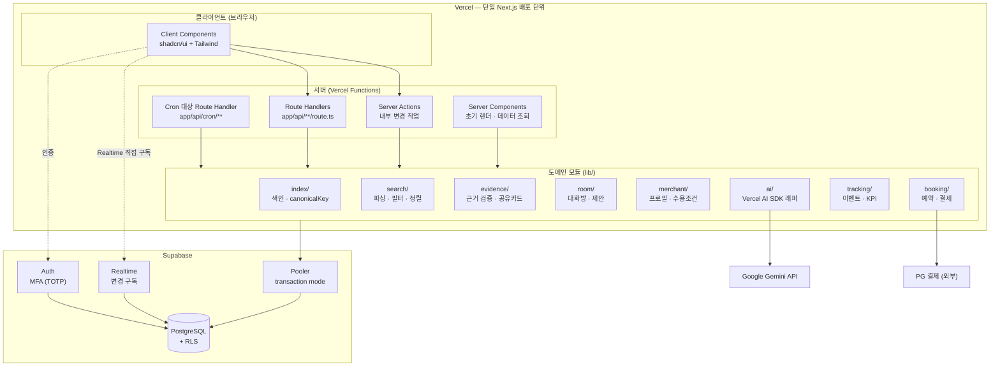
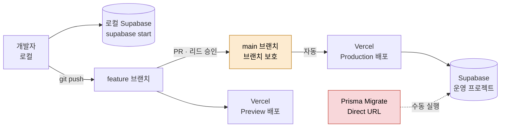
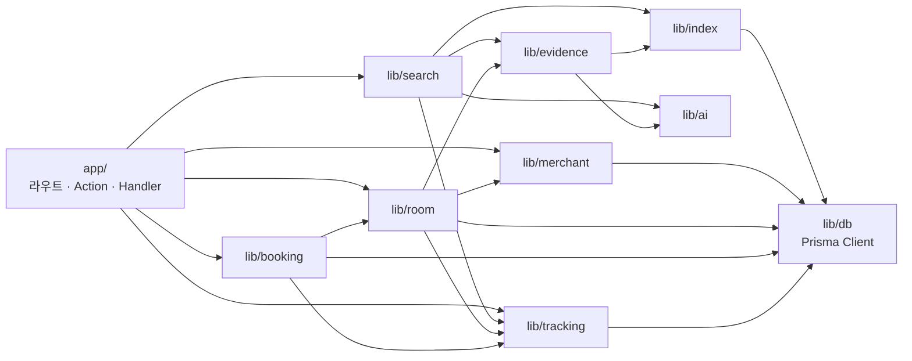
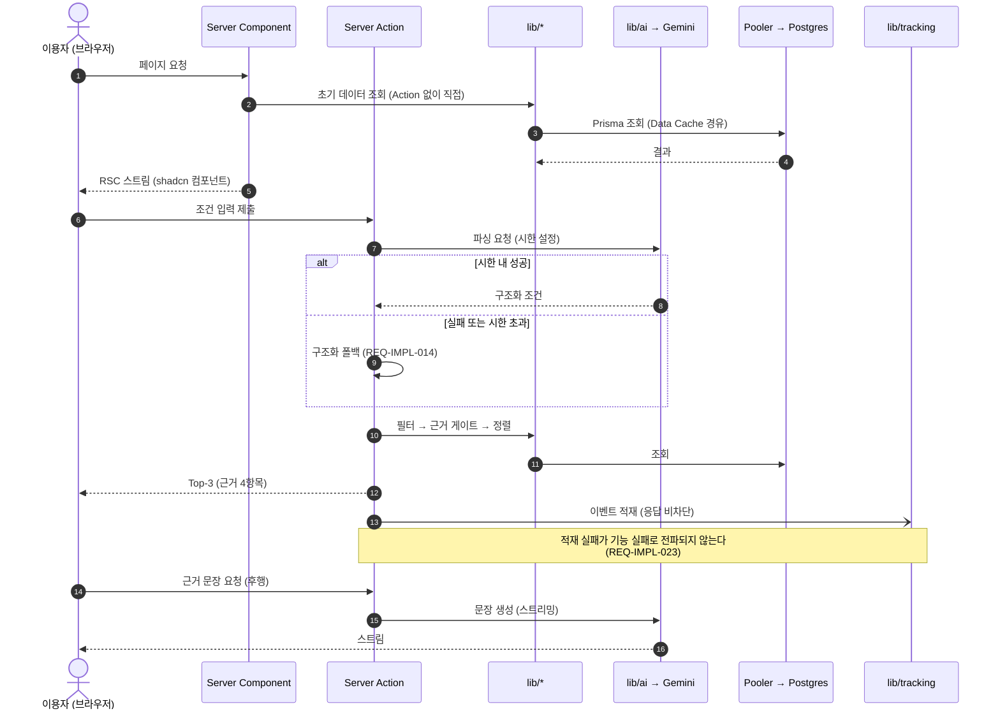
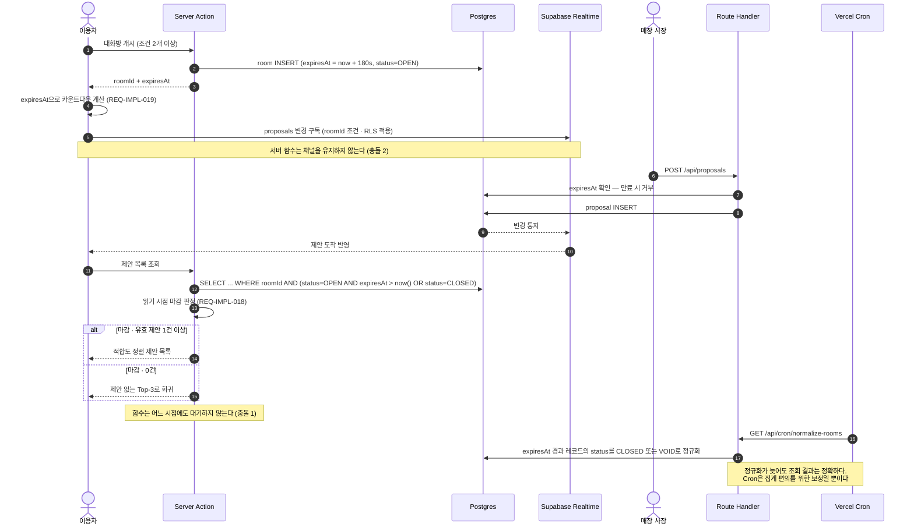

# [SRS 문서] AI-Place-Mate · Next.js 단일 프레임워크 구현안

# 소프트웨어 요구사항 명세서 (SRS · 구현 제약 반영본)

**문서 ID:** SRS-AIPLACE-NEXT-001

**개정 버전:** 1.0

**날짜:** 2026-08-24

**표준:** ISO/IEC/IEEE 29148:2018 (§9.6 Software requirements specification content)

**기준 문서:** [`SRS-ai-place-v1.0.md`](SRS-ai-place-v1.0.md) (SRS-AIPLACE-MVP-001, 개정 1.9) — 요구사항 59건

**관련 문서:** [`DESIGN-ai-place-v1.0.md`](DESIGN-ai-place-v1.0.md) (SDD-AIPLACE-MVP-001) — 플랫폼 비종속 설계

---

## 1. 서론

### 1.1 목적

본 문서는 기준 SRS의 요구사항 59건을 **Next.js 단일 풀스택 프레임워크와 Vercel·Supabase 플랫폼 제약(C-TEC-001~007) 아래에서 실제로 구현 가능한 형태**로 재정의한다.

기준 SRS는 플랫폼을 특정하지 않는다. 29148 **§5.2.5 Appropriate**가 "아키텍처·설계에 불필요한 제약을 두지 말라"고 규정하므로 의도적으로 그렇게 작성했다. 본 문서는 그 반대편에 선다 — **플랫폼을 확정했을 때 무엇이 가능하고 무엇이 불가능해지는지**를 밝히는 것이 목적이다.

**본 문서는 기준 SRS를 대체하지 않는다.** 두 문서의 역할은 아래와 같다.

| | 기준 SRS (MVP-001) | 본 문서 (NEXT-001) |
| --- | --- | --- |
| 답하는 질문 | 무엇을 만족해야 하는가 | **이 스택에서 어떻게 만족시키는가 · 무엇이 불가능한가** |
| 플랫폼 | 비종속 | Next.js · Vercel · Supabase 확정 |
| 요구사항 ID | `REQ-FUNC` · `REQ-NF` | `REQ-IMPL` (구현 요구사항) |
| 요구사항 수 | 59건 | 34건 + 제약 충돌 해소 11건 |
| 변경 권한 | 기획 매니저 (PM) | 개발팀 리드 |

기준 SRS의 요구사항을 본 문서가 **재서술하지 않는다.** 모든 `REQ-IMPL` 항목은 출처 열에서 기준 요구사항을 참조하며, 본 문서는 그 실현 방식만 규정한다.

### 1.2 범위

**포함**

- Next.js App Router 단일 애플리케이션의 모듈 경계와 요청 처리 경로
- Server Actions와 Route Handlers의 사용 기준
- Prisma 스키마와 Supabase 연결 구성 (로컬 개발 / 배포 이원화)
- Vercel AI SDK를 통한 Gemini 호출 구조와 모델 교체 경로
- Tailwind CSS · shadcn/ui 기반 UI 컴포넌트 규격
- Vercel 단일 배포 파이프라인 (Git Push 기반)
- **제약과 기준 요구사항의 충돌 11건 및 그 해소 방식**

**제외**

| 제외 항목 | 근거 |
| --- | --- |
| 문제 정의 · 목표 · KPI 정의 | 기준 SRS 1.4에 있다. 본 문서에서 재서술하지 않는다 |
| 이용자 클래스 · 페르소나 | 기준 SRS 2.2 |
| 기능·비기능 요구사항의 인수 기준 | 기준 SRS 4.1 · 4.2. 본 문서는 실현 방식만 다룬다 |
| 플랫폼 비종속 설계 도식 | SDD에 있다. 본 문서는 플랫폼 종속 부분만 다룬다 |
| 자체 백엔드 서버 · 컨테이너 · 오케스트레이션 | C-TEC-001 · 002 · 007에 의해 배제 |
| 마이크로서비스 분리 배포 | C-TEC-001에 의해 배제 (3.2에서 모듈 경계로 대체) |

### 1.3 정의, 약어, 축약어

| 용어 | 정의 |
| --- | --- |
| App Router | Next.js 13 이후의 파일 기반 라우팅 방식. `app/` 디렉터리 구조가 URL과 렌더 경계를 결정한다 |
| Server Action | 클라이언트에서 직접 호출하는 서버 실행 함수. `'use server'` 지시어로 선언하며 별도 엔드포인트를 만들지 않는다 |
| Route Handler | `app/api/**/route.ts`에 정의하는 HTTP 엔드포인트. 외부 시스템이 호출하는 경로에 쓴다 |
| RSC | React Server Component. 서버에서 렌더되어 클라이언트로 직렬화 전송되는 컴포넌트 |
| Data Cache | Next.js가 `fetch`·`unstable_cache` 결과를 보관하는 서버 측 캐시. `revalidateTag`로 무효화한다 |
| Vercel Function | Vercel에 배포되는 서버리스 실행 단위. **최대 실행 시간이 플랜·런타임 설정에 종속된다** |
| Vercel Cron | `vercel.json`에 선언하는 스케줄 트리거. 지정 경로의 Route Handler를 호출한다. **호출 빈도가 플랜에 종속된다** |
| Pooler | Supabase가 제공하는 연결 풀러(PgBouncer 계열). 서버리스의 연결 고갈을 막는다 |
| Transaction mode | Pooler 모드 중 트랜잭션 단위로 연결을 반납하는 방식. Prepared statement를 쓸 수 없다 |
| Direct URL | 풀러를 우회하는 직결 연결 문자열. Prisma 마이그레이션에만 쓴다 |
| RLS | Row Level Security. Postgres 행 단위 접근 제어. Supabase의 기본 보안 수단 |
| PITR | Point-In-Time Recovery. 임의 시점 복구. Supabase 유료 애드온이다 |
| Realtime | Supabase가 제공하는 Postgres 변경 구독 채널. 클라이언트가 DB에 직접 연결한다 |
| Lazy evaluation | 상태를 미리 갱신하지 않고 **읽는 시점에 판정**하는 방식. 상주 프로세스가 없는 환경의 대안이다 |
| C-TEC | 발주자가 지정한 기술 제약 |
| C-DRV | C-TEC에서 파생된 제약. 본 문서가 도출했다 |
| REQ-IMPL | 구현 요구사항. 기준 SRS의 요구사항을 이 스택에서 실현하는 방식 |

### 1.4 문제 정의 및 목표

기준 SRS **1.4**를 참조한다. 본 문서는 문제 정의와 KPI를 재서술하지 않는다.

다만 제약이 KPI 계측에 직접 영향을 주는 지점 하나를 밝힌다 — 기준 SRS 6.1의 이벤트 22종은 **별도 이벤트 수집 서버를 전제하지 않는다**. 본 문서는 이를 Server Action 내부 호출 + Postgres 테이블 적재로 실현하며, 상세는 4.5.4에 있다.

### 1.5 가정 및 제약

#### 1.5.1 지정 기술 제약 (C-TEC)

발주자가 지정한 제약이다. **협상 대상이 아니며 본 문서의 모든 설계는 이를 전제한다.**

| ID | 제약 | 영역 |
| --- | --- | --- |
| **C-TEC-001** | 모든 서비스를 Next.js (App Router) 기반 **단일 풀스택 프레임워크**로 구현한다. 프론트엔드와 백엔드를 별도 분리하지 않는다 | 시스템 내부 |
| **C-TEC-002** | 서버 측 로직(DB 접근, API 호출)은 **Server Actions 또는 Route Handlers**로 구현하며 별도 백엔드 서버를 두지 않는다 | 시스템 내부 |
| **C-TEC-003** | 데이터베이스는 **Prisma + 로컬 Supabase**로 개발 환경을 구성하고, 배포 시 **Supabase(PostgreSQL)** 를 사용해 인프라 설정 복잡도를 최소화한다 | 시스템 내부 |
| **C-TEC-004** | UI·스타일링은 **Tailwind CSS + shadcn/ui**를 사용해 일관된 디자인 코드 생성을 강제한다 | 시스템 내부 |
| **C-TEC-005** | AI 기능은 자체 서버 구축 없이 **Vercel AI SDK**로 Next.js에서 외부 API를 호출하는 형태로 구현한다 | 외부 연결 |
| **C-TEC-006** | 외부 AI 호출은 **Google Gemini API**를 기본으로 하며, **환경 변수 설정만으로 모델 교체**가 가능하도록 SDK 표준 인터페이스를 준수한다 | 외부 연결 |
| **C-TEC-007** | 배포·인프라 관리는 **Vercel 플랫폼으로 단일화**하며, CI/CD 설정 없이 **Git Push만으로 배포를 자동화**한다 | 외부 연결 |

#### 1.5.2 파생 제약 (C-DRV)

C-TEC에서 논리적으로 따라오는 제약이다. 발주자가 명시하지 않았으나 **위 제약을 지키면 반드시 성립한다.**

| ID | 파생 제약 | 출처 | 영향 |
| --- | --- | --- | --- |
| **C-DRV-001** | **상주 프로세스를 둘 수 없다.** 요청 없이 도는 워커·스케줄러·인메모리 타이머가 존재하지 않는다 | C-TEC-002 · 007 | 대화방 180초 대기, 노쇼 판정 배치, KPI 집계 배치 |
| **C-DRV-002** | **서버 함수의 최대 실행 시간에 상한이 있다.** 상한값은 플랜·런타임 설정에 종속되므로 **어떤 요구사항도 장시간 실행 함수에 의존해서는 안 된다** | C-TEC-007 | 대화방 마감 대기, 대량 적재 |
| **C-DRV-003** | **함수 간 인메모리 상태 공유가 불가능하다.** 모든 상태는 Postgres 또는 클라이언트에 있다 | C-TEC-002 · 007 | 카운트다운, 소환 대기 상태 |
| **C-DRV-004** | **서버에서 클라이언트로 상시 푸시 채널을 열 수 없다.** 서버리스 함수는 WebSocket을 유지하지 못한다 | C-TEC-002 · 007 | 대화방 제안 실시간 갱신 |
| **C-DRV-005** | **DB 연결이 요청 수에 비례해 증가한다.** 연결 풀러 없이는 고갈된다 | C-TEC-003 · 007 | 피크 처리량 요구사항 |
| **C-DRV-006** | **별도 캐시 서버가 없다.** 캐시는 Next.js Data Cache 또는 Postgres로 구현한다 | C-TEC-001 · 003 | 캐시 히트율 요구사항 |
| **C-DRV-007** | **별도 로그·감사 저장소가 없다.** 감사 추적은 Postgres 테이블로 구현한다 | C-TEC-001 · 003 | 전량 감사 로그 요구사항 |
| **C-DRV-008** | **자체 인증 시스템을 구축하지 않는다.** 인증·MFA는 Supabase Auth에 위임한다 | C-TEC-003 | 콘솔 2FA 요구사항 |
| **C-DRV-009** | **AI 호출의 지연을 자사가 통제할 수 없다.** 외부 API 왕복 시간이 응답 예산에 포함된다 | C-TEC-005 · 006 | 첫 결과 응답 시간 요구사항 |
| **C-DRV-010** | **배포 전 검증 게이트가 없다.** Git Push가 곧 배포이므로 릴리스 통제를 브랜치 전략으로만 구현한다 | C-TEC-007 | 릴리스 게이트 요구사항 |
| **C-DRV-011** | **복구 시점 목표가 Supabase 백업 정책에 종속된다.** 분 단위 복구는 PITR 애드온을 전제한다 | C-TEC-003 | RPO 요구사항 |

#### 1.5.3 가정

| ID | 가정 | 확인 방법 |
| --- | --- | --- |
| A-N1 | Vercel 플랜의 함수 실행 시간 상한이 **단일 요청 처리(수 초 규모)** 에는 충분하다 | 계정 플랜 확인. 설계는 상한값에 의존하지 않는다 (C-DRV-002) |
| A-N2 | Vercel Cron의 호출 빈도가 **노쇼 판정과 KPI 집계 주기**를 충족한다 | 계정 플랜 확인. 미달 시 4.3의 지연 평가 병행안으로 대체 |
| A-N3 | Supabase Pooler(transaction mode)가 피크 요청의 연결 수요를 흡수한다 | 부하 테스트로 확인 (6.1) |
| A-N4 | Gemini API 응답 지연의 p95가 조건 파싱에 허용 가능한 범위다 | 계측 후 4.3의 응답 예산 배분 재조정 |
| A-N5 | Supabase PITR 애드온 도입이 승인된다 | 미승인 시 RPO 요구사항을 재협상한다 (4.3-11) |

---

## 2. 이해관계자

기준 SRS **2.1**의 역할 체계를 따른다. 제약으로 인해 책임이 변경된 역할만 밝힌다.

| 역할 | 기준 SRS의 책임 | 본 구현안에서의 변경 |
| --- | --- | --- |
| 개발 엔지니어 | 구현 및 단위 테스트 | 프론트·백 분리가 없으므로 **동일 인원이 화면과 서버 로직을 함께 담당**한다 (C-TEC-001) |
| 시스템 운영자 | 배포·모니터링·복구 | 인프라 프로비저닝이 사라진다. **Vercel·Supabase 콘솔 설정과 플랜 관리**로 대체된다 (C-TEC-007) |
| 개발팀 리드 | 설계 검토·승인 | **브랜치 보호 규칙이 유일한 배포 게이트**이므로 병합 승인 권한을 갖는다 (C-DRV-010) |
| 데이터 엔지니어 | 색인 파이프라인·데이터 적재 | 별도 파이프라인 런타임이 없으므로 **Prisma 스크립트와 Supabase SQL**로 적재한다 |

**신설 없음.** 제약이 인프라 역할을 줄이지만 새 역할을 요구하지는 않는다.

---

## 3. 시스템 맥락 및 인터페이스

### 3.1 단일 애플리케이션 구성

> **읽는 방법** — 큰 상자 하나가 배포 단위 전체다. 기준 SRS의 마이크로서비스 8개가 **디렉터리와 함수 경계**로 바뀌었다. 점선은 클라이언트가 서버를 거치지 않고 직접 연결하는 경로다.



**모듈 경계를 디렉터리로 옮긴 근거** — C-TEC-001이 분리 배포를 금지하므로 기준 SRS의 서비스 경계를 배포 단위로 유지할 수 없다. 그러나 경계 자체를 버리면 근거 검증 로직이 탐색과 제안 양쪽에 중복된다(기준 SRS 4.1의 REQ-FUNC-010·024). `lib/` 하위 모듈로 경계를 보존하고, **모듈 간 직접 import 규칙**을 4.4에 규정해 의존 방향을 강제한다.

### 3.2 Server Action과 Route Handler의 사용 기준

C-TEC-002는 둘 중 하나를 쓰라고만 규정한다. 아무 기준 없이 섞으면 외부 연동과 내부 변경이 같은 경로에 놓여 인증·검증이 이중화된다. 아래 기준으로 갈랐다.

| 조건 | 선택 | 근거 |
| --- | --- | --- |
| 화면에서 발생하는 내부 변경 (조건 입력, 후보 선택, 신고, 프로필 수정) | **Server Action** | 엔드포인트를 만들지 않아 표면적이 줄고, 폼 제출과 낙관적 갱신을 그대로 쓸 수 있다 |
| 외부 시스템이 호출하는 경로 (PG 웹훅, 매장 제안 제출) | **Route Handler** | HTTP 계약이 필요하고 서명 검증을 해야 한다 |
| Vercel Cron이 호출하는 경로 | **Route Handler** (`app/api/cron/**`) | Cron은 URL을 호출한다. Server Action을 트리거할 수 없다 |
| 응답을 스트리밍하는 경로 (근거 문장 생성) | **Route Handler** | 스트리밍 응답 제어가 명시적이다 |
| 조회만 하는 초기 렌더 | **Server Component 직접 조회** | 왕복을 없앤다. Action·Handler를 두지 않는다 |

### 3.3 외부 인터페이스

| 대상 | 연결 방식 | 제약 |
| --- | --- | --- |
| Google Gemini | `lib/ai/` → Vercel AI SDK → provider | 모델·키를 환경 변수로만 지정한다 (C-TEC-006). SDK 표준 인터페이스 외 provider 고유 API를 직접 쓰지 않는다 |
| Supabase PostgreSQL | Prisma Client → Pooler | 애플리케이션은 **Pooler URL만** 사용한다. Direct URL은 마이그레이션 전용 (C-DRV-005) |
| Supabase Auth | 클라이언트 SDK + 서버 세션 검증 | 콘솔 접근에 MFA를 요구한다 (C-DRV-008) |
| Supabase Realtime | **클라이언트가 직접 구독** | 서버를 경유하지 않는다. C-DRV-004의 유일한 해소 경로 |
| PG 결제 | Route Handler ↔ PG (웹훅 포함) | 카드 정보를 Vercel Function에 전달하지 않는다 |

### 3.4 배포 파이프라인



**두 가지를 명시한다.**

1. **`main` 브랜치 보호가 유일한 릴리스 게이트다.** C-TEC-007이 CI/CD 설정을 배제하므로 자동 검증 단계가 없다. 게이트는 사람의 승인뿐이다 (C-DRV-010, 6.2).
2. **스키마 마이그레이션은 자동화하지 않는다.** Git Push에 마이그레이션을 묶으면 되돌릴 수 없는 변경이 배포와 함께 나간다. Prisma Migrate를 **Direct URL로 수동 실행**하고, 배포는 그 뒤에 한다 (4.3-9).

---

## 4. 구체적 요구사항

### 4.1 구현 요구사항

기준 SRS의 요구사항을 이 스택에서 실현하는 방식이다. **출처 열의 기준 요구사항이 인수 기준의 원천**이며, 본 표는 실현 방식만 규정한다.

| ID | 제목 | 출처 (기준 SRS) | 우선순위 | 유형 | 검증 방식 | 인수 기준 | 상태 | 담당자 |
| --- | --- | --- | --- | --- | --- | --- | --- | --- |
| **REQ-IMPL-001** | App Router 단일 배포 단위 | C-TEC-001 | Must Have | Architecture | 1) 배포 산출물 단일성 확인<br>2) 별도 서버 프로세스 부재 검증<br>3) QA 검증 | 애플리케이션은 하나의 Next.js App Router 프로젝트로 배포되어야 하며, 별도 백엔드 서버 프로세스를 갖지 않아야 한다 | Proposed | 개발팀 리드 |
| **REQ-IMPL-002** | 도메인 모듈 경계 유지 | REQ-FUNC-010 · 024 · C-TEC-001 | Must Have | Maintainability | 1) 모듈 간 import 방향 정적 검사<br>2) 순환 의존 부재 검증<br>3) 코드 리뷰 | 도메인 로직은 `lib/<module>/`에 위치해야 하며, 모듈 간 의존은 4.4의 허용 방향만 따라야 한다. 순환 의존은 0건이어야 한다 | Proposed | 개발팀 리드 |
| **REQ-IMPL-003** | Server Action · Route Handler 선택 기준 준수 | C-TEC-002 | Must Have | Architecture | 1) 경로별 분류 감사<br>2) 외부 호출 경로의 서명 검증 확인<br>3) QA 검증 | 서버 로직은 3.2의 기준에 따라 Server Action 또는 Route Handler로만 구현해야 한다. 외부에서 호출되는 경로는 Route Handler여야 한다 | Proposed | 개발 엔지니어 |
| **REQ-IMPL-004** | Prisma 스키마 단일 원천 | C-TEC-003 | Must Have | Maintainability | 1) 스키마 대조<br>2) 수동 DDL 부재 확인<br>3) 코드 리뷰 | 데이터 구조는 `prisma/schema.prisma`를 단일 원천으로 해야 하며, 마이그레이션 외의 수동 DDL을 적용하지 않아야 한다 | Proposed | 데이터 엔지니어 |
| **REQ-IMPL-005** | Pooler 경유 연결 | REQ-NF-005 · C-DRV-005 | Must Have | Scalability | 1) 연결 문자열 감사<br>2) 피크 부하 시 연결 수 측정<br>3) 연결 고갈 부재 확인 | 애플리케이션 런타임은 Supabase Pooler(transaction mode) URL로만 접속해야 한다. Direct URL은 마이그레이션 전용이어야 한다 | Proposed | 시스템 운영자 |
| **REQ-IMPL-006** | Prisma transaction mode 호환 | C-DRV-005 | Must Have | Reliability | 1) prepared statement 비활성 확인<br>2) 트랜잭션 경계 테스트<br>3) QA 검증 | Prisma 클라이언트는 transaction mode 풀러와 호환되도록 구성해야 하며, prepared statement에 의존하지 않아야 한다 | Proposed | 개발 엔지니어 |
| **REQ-IMPL-007** | 로컬·운영 환경 동형성 | C-TEC-003 | Must Have | Maintainability | 1) 로컬 Supabase 스키마 대조<br>2) 시드 데이터 재현성 확인<br>3) QA 검증 | 로컬 Supabase와 운영 Supabase는 동일 마이그레이션 이력을 가져야 하며, 로컬에서 재현되지 않는 스키마 상태가 존재하지 않아야 한다 | Proposed | 데이터 엔지니어 |
| **REQ-IMPL-008** | shadcn/ui 컴포넌트 기반 UI | C-TEC-004 | Must Have | Maintainability | 1) 컴포넌트 출처 감사<br>2) 임의 CSS 파일 부재 확인<br>3) 코드 리뷰 | UI는 shadcn/ui 컴포넌트와 Tailwind 유틸리티로만 구성해야 하며, 컴포넌트 외부의 임의 CSS 파일을 추가하지 않아야 한다 | Proposed | 개발 엔지니어 |
| **REQ-IMPL-009** | 디자인 토큰 단일화 | C-TEC-004 | Should Have | Maintainability | 1) 하드코딩 색상·간격 정적 검사<br>2) 테마 변경 회귀 테스트 | 색상·간격·타이포는 Tailwind 설정과 shadcn 테마 변수로만 지정해야 하며, 컴포넌트 내 하드코딩 값이 0건이어야 한다 | Proposed | 개발 엔지니어 |
| **REQ-IMPL-010** | 후보 카드 컴포넌트 규격 | REQ-FUNC-010 · 011 · C-TEC-004 | Must Have | Functional | 1) 근거 4항목 렌더 검증<br>2) 경고 표기 분기 테스트<br>3) QA 검증 | 후보 카드 컴포넌트는 선정 이유·근거 속성·확인 일자·확인 주체를 필수 props로 요구해야 하며, 하나라도 없으면 렌더되지 않아야 한다 | Proposed | 개발 엔지니어 |
| **REQ-IMPL-011** | Vercel AI SDK 표준 인터페이스 준수 | C-TEC-005 · 006 | Must Have | Maintainability | 1) provider 고유 API 직접 호출 정적 검사<br>2) 모델 교체 회귀 테스트<br>3) 코드 리뷰 | AI 호출은 Vercel AI SDK의 표준 인터페이스만 사용해야 하며, provider 고유 API를 직접 호출하지 않아야 한다 | Proposed | 개발 엔지니어 |
| **REQ-IMPL-012** | 환경 변수 기반 모델 교체 | C-TEC-006 | Must Have | Maintainability | 1) 환경 변수만 변경한 교체 테스트<br>2) 코드 변경 부재 확인<br>3) QA 검증 | 모델·provider는 환경 변수로만 지정해야 하며, 교체 시 애플리케이션 코드 변경이 0건이어야 한다 | Proposed | 개발팀 리드 |
| **REQ-IMPL-013** | AI 호출 격리 | REQ-NF-009 · C-DRV-009 | Must Have | Reliability | 1) AI 실패 주입 테스트<br>2) 폴백 경로 검증<br>3) QA 검증 | AI 호출은 `lib/ai/`를 통해서만 수행해야 하며, 호출 실패·시한 초과 시 폴백 경로로 전환하고 빈 화면을 반환하지 않아야 한다 | Proposed | 개발 엔지니어 |
| **REQ-IMPL-014** | AI 호출 시한 설정 | REQ-NF-001 · C-DRV-009 | Must Have | Performance | 1) 시한 초과 시 폴백 전환 측정<br>2) 응답 예산 배분 검증 | 조건 파싱 AI 호출에는 시한을 설정해야 하며, 초과 시 구조화 폴백으로 전환해 전체 응답이 기준 SRS REQ-NF-001의 예산을 넘지 않아야 한다 | Proposed | 개발 엔지니어 |
| **REQ-IMPL-015** | 근거 문장 생성의 응답 경로 분리 | REQ-NF-001 · 003 | Must Have | Performance | 1) Top-3 반환 시각과 문장 도착 시각 분리 측정<br>2) 스트리밍 동작 검증 | 근거 문장 생성은 Top-3 반환을 지연시키지 않아야 하며, 스트리밍 또는 후행 요청으로 전달해야 한다 | Proposed | 개발 엔지니어 |
| **REQ-IMPL-016** | Next.js Data Cache 기반 캐싱 | REQ-NF-002 · 020 · C-DRV-006 | Must Have | Performance | 1) 캐시 히트율 계측<br>2) 태그 무효화 동작 검증<br>3) QA 검증 | 메뉴·속성 조회는 Data Cache로 캐싱하고 TTL 6시간을 적용해야 하며, 데이터 변경 시 해당 태그를 무효화해야 한다 | Proposed | 개발 엔지니어 |
| **REQ-IMPL-017** | 대화방 상태의 DB 단일 보관 | REQ-FUNC-022 · C-DRV-003 | Must Have | Reliability | 1) 인메모리 상태 부재 확인<br>2) 함수 인스턴스 간 일관성 테스트<br>3) QA 검증 | 대화방의 소환 목록·마감 시각·제안 목록은 Postgres에만 보관해야 하며, 서버 함수의 인메모리 상태에 의존하지 않아야 한다 | Proposed | 개발 엔지니어 |
| **REQ-IMPL-018** | 마감 판정의 지연 평가 | REQ-FUNC-023 · 025 · C-DRV-001 · 002 | Must Have | Reliability | 1) 대기 없는 마감 판정 검증<br>2) Cron 미실행 시 정확성 테스트<br>3) QA 검증 | 대화방 마감은 함수가 대기하는 방식으로 구현하지 않아야 한다. 읽기 시점에 `expiresAt`으로 판정하고, Cron은 상태 정규화만 담당해야 한다 | Proposed | 개발 엔지니어 |
| **REQ-IMPL-019** | 클라이언트 카운트다운 | REQ-FUNC-023 · C-DRV-003 | Must Have | Functional | 1) 서버 시각 기준 계산 검증<br>2) 클라이언트 시각 조작 내성 테스트 | 카운트다운은 서버가 전달한 `expiresAt`을 기준으로 클라이언트가 계산해야 하며, 마감 판정의 근거로 클라이언트 시각을 쓰지 않아야 한다 | Proposed | 개발 엔지니어 |
| **REQ-IMPL-020** | Realtime 기반 제안 갱신 | REQ-FUNC-023 · C-DRV-004 | Must Have | Functional | 1) 제안 도착 반영 지연 측정<br>2) 서버 경유 부재 확인<br>3) QA 검증 | 제안 도착은 클라이언트가 Supabase Realtime으로 구독해 반영해야 하며, 서버 함수가 푸시 채널을 유지하지 않아야 한다 | Proposed | 개발 엔지니어 |
| **REQ-IMPL-021** | Cron 기반 노쇼 판정 | REQ-FUNC-018 · C-DRV-001 | Must Have | Functional | 1) Cron 트리거 동작 검증<br>2) 미실행 시 지연 평가 대체 테스트<br>3) QA 검증 | 노쇼 판정은 Vercel Cron이 호출하는 Route Handler에서 수행해야 하며, Cron이 지연되어도 조회 시점 판정으로 결과가 일치해야 한다 | Proposed | 개발 엔지니어 |
| **REQ-IMPL-022** | Cron 경로 인증 | C-TEC-007 | Must Have | Security | 1) 비인가 호출 차단 테스트<br>2) 시크릿 검증 확인 | `app/api/cron/**` 경로는 Vercel Cron 시크릿을 검증해야 하며, 외부 임의 호출로 실행되지 않아야 한다 | Proposed | 시스템 운영자 |
| **REQ-IMPL-023** | 이벤트 적재의 응답 비차단 | REQ-NF-001 · SRS 6.1 | Must Have | Performance | 1) 이벤트 적재 실패 주입 테스트<br>2) 응답 지연 영향 측정 | 계측 이벤트 적재는 이용자 응답을 차단하지 않아야 하며, 적재 실패가 기능 실패로 전파되지 않아야 한다 | Proposed | 개발 엔지니어 |
| **REQ-IMPL-024** | Cron 기반 KPI 집계 | SRS 6.1.2 · C-DRV-001 | Should Have | Functional | 1) 집계 주기 동작 검증<br>2) 재집계 멱등성 테스트 | KPI 집계는 Cron이 호출하는 Route Handler에서 SQL 집계로 수행해야 하며, 동일 구간 재집계가 멱등이어야 한다 | Proposed | 데이터 분석가 |
| **REQ-IMPL-025** | RLS 기반 접근 제어 | REQ-NF-018 · C-TEC-003 | Must Have | Security | 1) 타 매장 데이터 접근 차단 테스트<br>2) 정책 커버리지 감사<br>3) 보안 검토 | 매장 데이터는 RLS 정책으로 소유 매장만 접근 가능해야 하며, 정책이 없는 테이블이 존재하지 않아야 한다 | Proposed | 개발팀 리드 |
| **REQ-IMPL-026** | Supabase Auth MFA | REQ-NF-018 · C-DRV-008 | Must Have | Security | 1) MFA 강제 적용 검증<br>2) 미등록 계정 접근 차단 테스트 | 매장 콘솔 접근에는 Supabase Auth의 MFA(TOTP)를 요구해야 한다 | Proposed | 시스템 운영자 |
| **REQ-IMPL-027** | Postgres 감사 테이블 | REQ-NF-025 · C-DRV-007 | Must Have | Security | 1) 감사 레코드 누락 탐지<br>2) 변경 불가성 검증<br>3) 보안 검토 | 내부 조회는 감사 테이블에 전량 기록해야 하며, 애플리케이션 역할로 해당 레코드를 수정·삭제할 수 없어야 한다 | Proposed | 개발 엔지니어 |
| **REQ-IMPL-028** | 카드 정보 비경유 | REQ-NF-016 | Must Have | Security | 1) 요청 본문 감사<br>2) 로그 내 카드 정보 부재 확인<br>3) 보안 검토 | 카드 정보는 Vercel Function을 경유하지 않아야 하며, PG가 직접 수집한 결과 토큰만 취급해야 한다 | Proposed | 사업관리 및 계약 담당자 |
| **REQ-IMPL-029** | 개인 제약 정보 클라이언트 보관 | REQ-NF-014 · 032 | Must Have | Security | 1) 서버 전송 부재 확인<br>2) 옵트인 플로우 테스트 | 식이·이동 제약 정보는 클라이언트 저장소에만 보관해야 하며, 옵트인 없이 Server Action·Route Handler로 전송되지 않아야 한다 | Proposed | 개발 엔지니어 |
| **REQ-IMPL-030** | 마이그레이션 배포 분리 | C-TEC-007 · C-DRV-010 | Must Have | Reliability | 1) 배포 파이프라인에 마이그레이션 부재 확인<br>2) 순서 준수 검증 | 스키마 마이그레이션은 배포 자동화에 포함하지 않아야 하며, Direct URL로 선행 실행한 뒤 배포해야 한다 | Proposed | 데이터 엔지니어 |
| **REQ-IMPL-031** | 브랜치 보호 기반 릴리스 게이트 | C-DRV-010 | Must Have | Reliability | 1) 직접 push 차단 확인<br>2) 승인 없는 병합 차단 테스트 | `main` 브랜치는 직접 push를 차단하고 개발팀 리드 승인을 요구해야 한다 | Proposed | 개발팀 리드 |
| **REQ-IMPL-032** | Preview 환경 데이터 격리 | C-TEC-007 | Must Have | Security | 1) 연결 대상 감사<br>2) 운영 데이터 접근 부재 확인 | Preview 배포는 운영 Supabase 프로젝트에 접속하지 않아야 한다 | Proposed | 시스템 운영자 |
| **REQ-IMPL-033** | 환경 변수 분리 | C-TEC-006 · 007 | Must Have | Security | 1) 환경별 변수 세트 감사<br>2) 클라이언트 노출 변수 검증 | 비밀 값은 서버 전용 환경 변수로만 관리해야 하며, `NEXT_PUBLIC_` 접두어를 갖지 않아야 한다 | Proposed | 시스템 운영자 |
| **REQ-IMPL-034** | 복구 목표 수단 확보 | REQ-NF-027 · C-DRV-011 | Should Have | Reliability | 1) PITR 활성 확인<br>2) 복구 훈련 시 유실 구간 측정 | 분 단위 복구 시점 목표는 Supabase PITR로 확보해야 한다. 미확보 시 4.3-11에 따라 목표를 재협상해야 한다 | Proposed | 시스템 운영자 |

> **유형 어휘** — 기준 SRS의 어휘에 `Architecture`를 추가했다. C-TEC-001·002가 규정하는 것은 품질 속성이 아니라 **구조 자체**이므로 기존 유형에 담기지 않는다.

### 4.2 기준 요구사항의 실현 대응

기준 SRS 요구사항 59건이 이 스택에서 어떻게 실현되는지의 요약이다. **구현 방식이 자명한 항목은 "표준 경로"로 묶었다.**

| 기준 요구사항 | 실현 방식 | 구현 요구사항 |
| --- | --- | --- |
| REQ-FUNC-001~007 (색인·필터·메뉴) | Server Component 조회 + `lib/index` · `lib/search` + Data Cache | REQ-IMPL-016 |
| REQ-FUNC-008 · 009 (입력·폴백) | Server Action + `lib/ai` 시한 설정 + 구조화 폴백 | REQ-IMPL-013 · 014 |
| REQ-FUNC-010 · 011 (근거·경고) | `lib/evidence` 게이트 + 후보 카드 컴포넌트 필수 props | REQ-IMPL-010 |
| REQ-FUNC-012 (공유 카드) | Route Handler (스트리밍) + Supabase Storage | REQ-IMPL-015 |
| REQ-FUNC-013 (불일치 신고) | Server Action + 상태 전이 | 표준 경로 |
| REQ-FUNC-014 (Top-3) | `lib/search` 정렬 + 근거 게이트 선행 | REQ-IMPL-002 |
| REQ-FUNC-015~018 (예약·결제·노쇼) | Server Action(예약) + Route Handler(PG 웹훅) + Cron(노쇼) | REQ-IMPL-021 · 028 |
| REQ-FUNC-019 · 021 · 027 (콘솔) | Server Action + RLS + MFA | REQ-IMPL-025 · 026 |
| REQ-FUNC-020 (소환 배제) | `lib/merchant` 수용 조건 매칭 | 표준 경로 |
| REQ-FUNC-022~026 (대화방·제안) | DB 상태 + 지연 평가 + Realtime 구독 + Cron 정규화 | REQ-IMPL-017~020 |
| REQ-NF-001~006 (성능) | Data Cache + AI 호출 격리·시한 + 근거 문장 후행 | REQ-IMPL-014 · 015 · 016 |
| REQ-NF-007 · 008 (가용성·오류율) | Vercel·Supabase 플랫폼 SLA + 헬스체크 Route Handler | 표준 경로 |
| REQ-NF-009 · 010 (파싱·빈 결과) | 폴백 경로 + 유사 메뉴 대체 | REQ-IMPL-013 |
| REQ-NF-011 (신선도) | `verifiedAt` 인덱스 + Cron 재확인 큐 | REQ-IMPL-024 |
| REQ-NF-012 · 027 (RTO·RPO) | Vercel 즉시 롤백 + Supabase PITR | REQ-IMPL-034 |
| REQ-NF-013~015 · 031 · 032 (개인정보) | 클라이언트 보관 + 스키마 필드 부재 + 파기 Cron | REQ-IMPL-029 |
| REQ-NF-016 · 017 · 026 (결제·암호화) | PG 위탁 + Supabase 저장 암호화 + Vercel Edge TLS | REQ-IMPL-028 |
| REQ-NF-018 · 025 (인증·감사) | Supabase Auth MFA + RLS + 감사 테이블 | REQ-IMPL-025~027 |
| REQ-NF-019~023 (비용) | Gemini 토큰 계측 + Vercel·Supabase 사용량 모니터 | REQ-IMPL-023 |
| REQ-NF-024 (스키마 확장성) | Prisma 스키마 단일 원천 + `scope` 필드 사전 확보 | REQ-IMPL-004 |
| REQ-NF-028~030 (사용성) | shadcn 컴포넌트 규격 + 계측 이벤트 | REQ-IMPL-008 · 023 |

### 4.3 제약 충돌 분석 및 해소

**본 문서의 핵심 절이다.** 지정 제약과 기준 요구사항이 충돌하는 11건을 숨기지 않고 해소 방식과 잔여 위험을 함께 밝힌다.

| # | 충돌 | 제약 | 해소 | 잔여 위험 |
| --- | --- | --- | --- | --- |
| **1** | 대화방 180초 마감을 **함수가 대기해서 구현할 수 없다** | C-DRV-001 · 002 | 대기하지 않는다. `expiresAt`을 DB에 기록하고 **읽기 시점에 판정**한다. Cron은 만료 상태를 정규화할 뿐이며, Cron이 지연되어도 조회 결과는 정확하다 | 정규화 전 레코드가 `OPEN`으로 남아 집계에 섞일 수 있다 → 집계 쿼리에도 `expiresAt` 조건을 포함한다 |
| **2** | 제안 도착을 **서버가 클라이언트로 푸시할 수 없다** | C-DRV-004 | 클라이언트가 **Supabase Realtime으로 `proposals` 변경을 직접 구독**한다. 서버 함수는 채널을 유지하지 않는다 | 클라이언트가 DB에 직접 연결하므로 RLS 정책이 유일한 방어선이다 → REQ-IMPL-025를 Must로 고정 |
| **3** | 카운트다운을 **서버 상태로 유지할 수 없다** | C-DRV-003 | 서버가 `expiresAt`(서버 시각)만 전달하고 **클라이언트가 계산**한다. 마감 판정에는 클라이언트 시각을 쓰지 않는다 | 클라이언트 표시와 서버 판정이 어긋날 수 있다 → 마감 직전 제출은 서버 판정을 따르고 그 사실을 UI에 고지 |
| **4** | 노쇼 판정 **배치 워커가 없다** | C-DRV-001 | Vercel Cron → Route Handler → Prisma 일괄 처리. **Cron 빈도가 플랜에 종속**되므로 조회 시점 판정을 병행해 Cron 지연에 내성을 둔다 | Cron 빈도가 낮으면 정산 시점이 늦어진다 → 정산 지연 허용 범위를 사업 측과 합의 (A-N2) |
| **5** | KPI 집계 **배치 런타임이 없다** | C-DRV-001 | Cron → Route Handler → **Postgres SQL 집계**. 애플리케이션에서 대량 데이터를 끌어오지 않는다 | 함수 실행 시간 상한에 걸릴 수 있다 → 구간을 나눠 멱등 재실행 가능하게 설계 (REQ-IMPL-024) |
| **6** | 첫 결과 응답 예산에 **외부 AI 왕복이 포함된다** | C-DRV-009 | 응답 예산을 재배분한다 — **조건 파싱만 응답 경로에 두고, 근거 문장 생성은 스트리밍·후행으로 분리**한다. 색인 질의는 AI를 거치지 않는다 | Gemini p95가 예산을 넘으면 파싱조차 위험하다 → 시한 초과 시 구조화 폴백으로 전환 (REQ-IMPL-014). 계측 후 재조정 (A-N4) |
| **7** | 피크 처리량에서 **DB 연결이 고갈된다** | C-DRV-005 | Supabase **Pooler(transaction mode)** 를 애플리케이션의 유일한 접속 경로로 강제한다. Prisma는 prepared statement에 의존하지 않게 구성한다 | transaction mode는 세션 수준 기능을 못 쓴다 → advisory lock·`SET LOCAL` 의존 코드를 금지 |
| **8** | **별도 캐시 서버가 없다** | C-DRV-006 | Next.js **Data Cache**로 대체하고 `revalidateTag`로 무효화한다 | Data Cache는 배포 시 초기화된다 → 배포 직후 히트율 저하를 정상 동작으로 간주하고 알림 임계에서 제외 |
| **9** | Git Push가 곧 배포라 **스키마 변경이 되돌릴 수 없게 나간다** | C-TEC-007 · C-DRV-010 | 마이그레이션을 **배포에서 분리**한다. Direct URL로 수동 선행 실행하고, 스키마는 항상 **이전 버전 코드와 호환되게** 변경한다(컬럼 추가 우선, 삭제는 배포 뒤 별도 회차) | 사람이 순서를 어길 수 있다 → 절차를 4.5.3에 규정하고 리드 승인 항목에 포함 |
| **10** | **자동 검증 게이트가 없다** | C-DRV-010 | `main` 브랜치 보호 + 리드 승인을 유일한 게이트로 명시한다. 기준 SRS 6.2의 Phase 게이트는 **배포 차단이 아니라 기능 노출 차단**으로 구현한다(플래그) | 승인이 형식화되면 게이트가 무력해진다 → 6.2에 승인 시 확인 항목을 명시 |
| **11** | **RPO 5분을 기본 백업으로 달성할 수 없다** | C-DRV-011 | Supabase **PITR 애드온**을 전제한다. 미승인 시 이 요구사항은 달성 불가이므로 **목표를 재협상**한다 — 본 문서는 미승인 상태에서 RPO 5분을 충족한다고 주장하지 않는다 | 플랜 승인이 사업 결정이다 → REQ-IMPL-034를 Should로 두고 A-N5로 추적 |

**충돌 1·2·3이 이 스택 선택의 실질 대가다.** 기준 SRS는 대화방을 "180초 동안 열려 있는 서버 자원"으로 서술했으나, 서버리스에서는 **"만료 시각이 적힌 DB 레코드 + 클라이언트가 직접 구독하는 변경 스트림"** 으로 재해석해야 한다. 관찰 가능한 행동(REQ-FUNC-022~025의 인수 기준)은 동일하게 만족하지만, 구현 모델은 다르다.

### 4.4 모듈 의존 규칙

C-TEC-001이 분리 배포를 금지하므로 경계 위반이 컴파일 오류로 드러나지 않는다. 아래 방향만 허용하고 정적 검사로 강제한다 (REQ-IMPL-002).



| 규칙 | 내용 |
| --- | --- |
| 단방향 | 화살표 역방향 import를 금지한다. 순환 의존 0건 |
| `lib/db` 독점 | Prisma Client는 `lib/db`만 노출한다. 다른 모듈이 직접 인스턴스화하지 않는다 |
| `lib/ai` 독점 | Gemini 호출은 `lib/ai`만 수행한다 (REQ-IMPL-011 · 013) |
| `lib/evidence` 공유 | 근거 검증은 `search`와 `room` 양쪽이 사용한다. 중복 구현을 금지한다 |
| `app/` 순수성 | `app/`에는 라우팅·검증·직렬화만 둔다. 도메인 판정 로직을 두지 않는다 |

### 4.5 기능 처리 규격

#### 4.5.1 요청 처리 경로



#### 4.5.2 대화방 — 서버리스 구현

충돌 1·2·3의 해소를 흐름으로 밝힌다.



#### 4.5.3 마이그레이션 절차

Git Push가 곧 배포이므로 순서를 사람이 지켜야 한다 (충돌 9).

| 순서 | 작업 | 실행 주체 |
| --- | --- | --- |
| 1 | 로컬 Supabase에서 마이그레이션 작성·검증 | 개발 엔지니어 |
| 2 | **이전 버전 코드와 호환되는지** 확인 — 컬럼 추가는 허용, 삭제·이름 변경은 별도 회차로 분리 | 개발팀 리드 |
| 3 | 운영 Supabase에 **Direct URL로 마이그레이션 수동 실행** | 데이터 엔지니어 |
| 4 | 마이그레이션 성공 확인 후 `main` 병합 → 자동 배포 | 개발팀 리드 |
| 5 | 컬럼 삭제가 필요하면 배포 안정화 후 **다음 회차**에 실행 | 데이터 엔지니어 |

#### 4.5.4 계측 이벤트 적재

기준 SRS 6.1의 이벤트 22종을 별도 수집 서버 없이 실현한다.

| 항목 | 구현 |
| --- | --- |
| 발행 지점 | Server Action · Route Handler 내부에서 `lib/tracking` 호출 |
| 비차단 | 이용자 응답을 기다리게 하지 않는다. 적재 실패를 삼키고 실패 카운터만 올린다 (REQ-IMPL-023) |
| 적재 대상 | `tracking_events` 테이블. `occurredAt` 파티셔닝 |
| 공통 속성 | `sessionId` · `anonUserId` · `occurredAt` · `schemaVersion` (기준 SRS 6.1.1) |
| 집계 | Cron → Route Handler → SQL 집계 → `kpi_snapshot` (REQ-IMPL-024) |
| 누락률 | 실패 카운터를 집계에 함께 기록해 5% 초과 시 미공표 (기준 SRS 6.1.3) |

---

## 5. 추적성 매트릭스

### 5.1 제약 → 구현 요구사항

| 제약 | 구현 요구사항 |
| --- | --- |
| C-TEC-001 | REQ-IMPL-001 · 002 |
| C-TEC-002 | REQ-IMPL-003 |
| C-TEC-003 | REQ-IMPL-004 · 005 · 007 · 025 |
| C-TEC-004 | REQ-IMPL-008 · 009 · 010 |
| C-TEC-005 | REQ-IMPL-011 · 013 |
| C-TEC-006 | REQ-IMPL-011 · 012 · 033 |
| C-TEC-007 | REQ-IMPL-022 · 030 · 031 · 032 · 033 |
| C-DRV-001 | REQ-IMPL-018 · 021 · 024 |
| C-DRV-002 | REQ-IMPL-018 · 024 |
| C-DRV-003 | REQ-IMPL-017 · 019 |
| C-DRV-004 | REQ-IMPL-020 |
| C-DRV-005 | REQ-IMPL-005 · 006 |
| C-DRV-006 | REQ-IMPL-016 |
| C-DRV-007 | REQ-IMPL-027 |
| C-DRV-008 | REQ-IMPL-026 |
| C-DRV-009 | REQ-IMPL-013 · 014 · 015 |
| C-DRV-010 | REQ-IMPL-030 · 031 |
| C-DRV-011 | REQ-IMPL-034 |

### 5.2 구현 요구사항 → 코드 위치 → 테스트

| 구현 요구사항 | 코드 위치 | 테스트 케이스 ID |
| --- | --- | --- |
| REQ-IMPL-001 · 002 | 프로젝트 루트 · `lib/**` | TC-IMPL-001 · 002 |
| REQ-IMPL-003 | `app/**/actions.ts` · `app/api/**/route.ts` | TC-IMPL-003 |
| REQ-IMPL-004 · 007 · 030 | `prisma/schema.prisma` · `prisma/migrations/**` | TC-IMPL-004 |
| REQ-IMPL-005 · 006 | `lib/db/client.ts` · 환경 변수 | TC-IMPL-005 |
| REQ-IMPL-008 · 009 | `components/ui/**` · `tailwind.config.ts` | TC-IMPL-008 |
| REQ-IMPL-010 | `components/candidate-card.tsx` | TC-IMPL-010 |
| REQ-IMPL-011~015 | `lib/ai/**` | TC-IMPL-011 ~ 015 |
| REQ-IMPL-016 | `lib/index/cache.ts` | TC-IMPL-016 |
| REQ-IMPL-017~020 | `lib/room/**` · `components/room/**` | TC-IMPL-017 ~ 020 |
| REQ-IMPL-021 · 024 | `app/api/cron/**` | TC-IMPL-021 · 024 |
| REQ-IMPL-022 | `app/api/cron/_auth.ts` | TC-IMPL-022 |
| REQ-IMPL-023 | `lib/tracking/**` | TC-IMPL-023 |
| REQ-IMPL-025 | `prisma/migrations/**` (RLS 정책) | TC-IMPL-025 |
| REQ-IMPL-026 | `lib/auth/**` | TC-IMPL-026 |
| REQ-IMPL-027 | `lib/db/audit.ts` | TC-IMPL-027 |
| REQ-IMPL-028 | `app/api/payment/**` | TC-IMPL-028 |
| REQ-IMPL-029 | `lib/preferences/local.ts` | TC-IMPL-029 |
| REQ-IMPL-031 · 032 | 저장소 설정 · Vercel 환경 설정 | TC-IMPL-031 |
| REQ-IMPL-033 | `env.ts` (스키마 검증) | TC-IMPL-033 |
| REQ-IMPL-034 | Supabase 프로젝트 설정 | TC-IMPL-034 |

---

## 6. 검증 및 릴리스

### 6.1 검증 계획

기준 SRS 6.1의 KPI 계측 계획을 따른다. 본 문서는 **제약 특이 검증** 항목만 추가한다.

| 검증 항목 | 방법 | 통과 기준 |
| --- | --- | --- |
| 연결 고갈 내성 | Pooler 경유로 피크 수준 동시 요청 부하 | 연결 오류 0건, 응답 목표 유지 (A-N3) |
| Gemini 지연 분포 | 조건 파싱 호출의 응답 시간 계측 | p95가 응답 예산 내. 초과 시 4.3-6 재조정 (A-N4) |
| AI 실패 폴백 | Gemini 오류·시한 초과 주입 | 빈 화면 0건, 구조화 폴백 전환 100% |
| 함수 실행 시간 | 전 경로의 실행 시간 분포 측정 | 어떤 경로도 플랜 상한에 근접하지 않음 (C-DRV-002) |
| Cron 지연 내성 | Cron 미실행 상태에서 조회·정산 정확성 확인 | 조회 결과가 Cron 실행 시와 동일 (REQ-IMPL-018 · 021) |
| Realtime + RLS | 타 대화방·타 매장 데이터 구독 시도 | 차단 100% (충돌 2의 유일 방어선) |
| 배포 후 캐시 | 배포 직후 캐시 히트율 회복 곡선 측정 | 알림 임계에서 배포 직후 구간 제외 (4.3-8) |
| 마이그레이션 호환성 | 이전 버전 코드로 신규 스키마 접근 | 오류 0건 (4.5.3 순서 2) |
| PITR 복구 훈련 | 임의 시점 복구 실행 | 유실 구간이 목표 이내. 미확보 시 재협상 (4.3-11) |

### 6.2 릴리스 게이트

C-DRV-010에 따라 **배포 게이트와 기능 노출 게이트를 분리**한다.

| 게이트 | 구현 | 판정 |
| --- | --- | --- |
| 배포 게이트 | `main` 브랜치 보호 + 개발팀 리드 승인 | 승인 시 확인 항목 — ① 마이그레이션 선행 실행 완료 ② 이전 버전 호환성 ③ 환경 변수 추가분 반영 ④ 신규 경로의 인증 적용 |
| 기능 노출 게이트 | 환경 변수 기반 기능 플래그 | 기준 SRS 6.2의 Phase 게이트를 **배포 차단이 아니라 플래그 off**로 구현한다 |
| Phase 2 노출 조건 | 기준 SRS 6.2 게이트 1 조건 충족 시 플래그 on | 노쇼율 초과 시 플래그를 off로 되돌린다 |

**Vercel 즉시 롤백을 복구 수단으로 삼는다.** 이전 배포로 되돌리는 것이 코드 수정보다 빠르므로, RTO는 롤백 시간으로 확보한다 (REQ-NF-012). 단 **스키마는 롤백되지 않으므로** 4.5.3의 호환성 규칙이 RTO의 전제다.

---

## 7. 리스크 및 설계 결정

### 7.1 제약에서 오는 리스크

| ID | 리스크 | 영향도 · 가능성 | 완화 |
| --- | --- | --- | --- |
| **RN-1** | 플랜 상한(함수 실행 시간·Cron 빈도)이 요구사항에 미달 | 치명 · 中 | 설계가 상한값에 의존하지 않게 했다 (C-DRV-002, 충돌 1·4·5). 남은 영향은 정산·집계 지연이며 허용 범위를 사업 측과 합의 |
| **RN-2** | Realtime + RLS가 유일한 방어선인데 정책 누락 | 치명 · 中 | 정책 없는 테이블 부재를 검증 항목으로 고정 (REQ-IMPL-025). 신규 테이블 추가 시 정책 작성을 마이그레이션에 포함 |
| **RN-3** | Gemini 지연·장애가 첫 결과 응답을 깨뜨림 | 중대 · 中 | 파싱만 응답 경로에 두고 시한 초과 시 폴백 (REQ-IMPL-014). 색인 질의는 AI 비경유 |
| **RN-4** | 자동 검증 게이트 부재로 회귀가 운영에 직행 | 중대 · 中 | 브랜치 보호 + 승인 확인 항목 4건을 6.2에 명문화. 기능 플래그로 노출을 분리 |
| **RN-5** | 마이그레이션 순서 위반으로 되돌릴 수 없는 변경 | 중대 · 中 | 4.5.3 절차 + 컬럼 삭제를 별도 회차로 분리. 승인 항목에 포함 |
| **RN-6** | PITR 미승인으로 RPO 목표 미달 | 중대 · 中 | 미승인 상태에서 목표를 충족한다고 주장하지 않는다. 재협상 경로를 4.3-11에 명시 |
| **RN-7** | 단일 배포 단위라 한 모듈의 장애가 전체에 파급 | 중대 · 中 | 모듈 의존 규칙(4.4)으로 결합을 제한. Vercel 즉시 롤백을 1차 복구 수단으로 |
| **RN-8** | 프론트·백 미분리로 역할 경계가 흐려져 리뷰 품질 저하 | 보통 · 中 | `app/` 순수성 규칙(4.4)으로 도메인 로직 위치를 고정. 정적 검사로 강제 |

### 7.2 설계 결정 기록

| ID | 결정 | 근거 | 되돌리기 비용 |
| --- | --- | --- | --- |
| **ADR-N1** | 도메인 경계를 **`lib/` 모듈**로 보존한다 | C-TEC-001이 분리 배포를 막지만 경계를 버리면 근거 검증이 중복된다 | 모듈 재배치 + import 정리 |
| **ADR-N2** | 마감 판정을 **지연 평가**로 구현한다 | 상주 프로세스와 장시간 함수가 없다 (C-DRV-001 · 002) | 조회 쿼리 전면 수정 |
| **ADR-N3** | 제안 갱신을 **클라이언트 Realtime 직접 구독**으로 구현한다 | 서버가 푸시 채널을 유지할 수 없다 (C-DRV-004) | 폴링 전환 + RLS 재검토 |
| **ADR-N4** | 애플리케이션은 **Pooler URL만** 사용한다 | 서버리스 연결 고갈 회피 (C-DRV-005) | 연결 구성 변경 + prepared statement 재검토 |
| **ADR-N5** | 마이그레이션을 **배포에서 분리**한다 | Git Push가 곧 배포이므로 되돌릴 수 없는 변경이 자동으로 나간다 | 절차 재수립 |
| **ADR-N6** | Phase 게이트를 **기능 플래그**로 구현한다 | 배포 차단 수단이 없다 (C-DRV-010) | 플래그 제거 + 브랜치 전략 변경 |
| **ADR-N7** | AI 호출을 **`lib/ai` 단일 창구**로 제한한다 | 환경 변수만으로 모델 교체 (C-TEC-006) + 실패 격리 | 호출 지점 전수 수정 |
| **ADR-N8** | 근거 문장 생성을 **응답 경로에서 분리**한다 | 외부 AI 왕복이 응답 예산을 잠식한다 (C-DRV-009) | 응답 계약 변경 |

---

## 8. 부록

### 8.1 디렉터리 구조

```
ai-place-mate/
├── app/
│   ├── (search)/                  # 탐색 — RSC 조회 + Server Action
│   │   ├── page.tsx
│   │   └── actions.ts
│   ├── (room)/                    # 대화방 — Phase 2
│   │   ├── [roomId]/page.tsx
│   │   └── actions.ts
│   ├── (booking)/                 # 예약·결제
│   │   └── actions.ts
│   ├── console/                   # 매장 콘솔 — MFA 보호
│   │   └── actions.ts
│   └── api/
│       ├── proposals/route.ts     # 매장 제안 제출 (외부 호출)
│       ├── payment/webhook/route.ts
│       ├── share-cards/route.ts   # 스트리밍
│       └── cron/
│           ├── _auth.ts           # Cron 시크릿 검증
│           ├── normalize-rooms/route.ts
│           ├── judge-no-show/route.ts
│           ├── purge-origins/route.ts
│           └── aggregate-kpi/route.ts
├── lib/
│   ├── db/                        # Prisma Client 독점 · 감사 로그
│   ├── index/                     # 색인 · canonicalKey · 캐시
│   ├── search/                    # 파싱 · 필터 · 정렬
│   ├── evidence/                  # 근거 게이트 · 공유 카드
│   ├── room/                      # 대화방 · 제안 · 지연 평가
│   ├── merchant/                  # 프로필 · 수용 조건 매칭
│   ├── booking/                   # 예약 · 결제 · 노쇼
│   ├── tracking/                  # 이벤트 · KPI
│   ├── ai/                        # Vercel AI SDK 래퍼 (단일 창구)
│   └── auth/                      # Supabase Auth · MFA
├── components/
│   ├── ui/                        # shadcn/ui
│   └── candidate-card.tsx         # 근거 4항목 필수 props
├── prisma/
│   ├── schema.prisma
│   └── migrations/
├── env.ts                         # 환경 변수 스키마 검증
├── tailwind.config.ts
└── vercel.json                    # Cron 선언
```

### 8.2 Prisma 스키마 개요

기준 SRS 8.2의 엔터티와 SDD 3.3의 물리 설계를 Prisma로 옮긴 것이다.

```prisma
// 연결 — 애플리케이션은 Pooler만, 마이그레이션은 Direct (REQ-IMPL-005)
datasource db {
  provider  = "postgresql"
  url       = env("DATABASE_URL")        // Pooler · transaction mode
  directUrl = env("DIRECT_URL")          // 마이그레이션 전용
}

enum VerificationStatus { VERIFIED STALE RECHECK_REQUIRED }
enum VerifiedBy         { OWNER PLATFORM USER }
enum AttributeScope     { PLACE DISH }
enum AgentRoomStatus    { OPEN CLOSED VOID }
enum ReservationStatus  { CONFIRMED CANCELLED VISITED NO_SHOW }
enum PaymentStatus      { AUTHORIZED REFUNDED SETTLED }

model Place {
  id           String    @id @default(uuid())
  name         String
  seats        Int
  maxParty     Int
  districtCode String                                  // 상권 단위 배포 (기준 SRS 3.1.6)
  deletedAt    DateTime?                               // 논리 삭제
  dishes       Dish[]
  attributes   Attribute[]
  priceProfile PriceProfile?
  proposals    Proposal[]
  @@index([districtCode])
}

model Dish {
  id           String @id @default(uuid())
  placeId      String
  name         String
  canonicalKey String                                  // 메뉴 정규화 키
  price        Int
  place        Place  @relation(fields: [placeId], references: [id])
  attributes   Attribute[]
  @@index([canonicalKey])                              // 최고 빈도 경로
}

model PriceProfile {
  id             String       @id @default(uuid())
  placeId        String       @unique
  perPersonLow   Int                                   // 단일 값 표기 금지 — 범위 필수
  perPersonAvg   Int
  perPersonHigh  Int
  conditionTags  String
  verificationId String       @unique
  place          Place        @relation(fields: [placeId], references: [id])
  verification   Verification @relation(fields: [verificationId], references: [id])
}

model Attribute {
  id             String         @id @default(uuid())
  placeId        String?
  dishId         String?
  attrKey        String
  attrValue      String
  scope          AttributeScope                        // 성분·접근성 필드 사전 확보
  verificationId String         @unique
  place          Place?         @relation(fields: [placeId], references: [id])
  dish           Dish?          @relation(fields: [dishId], references: [id])
  verification   Verification   @relation(fields: [verificationId], references: [id])
  @@index([attrKey])
}

model Verification {
  id           String             @id @default(uuid())
  status       VerificationStatus
  verifiedAt   DateTime                                // 90일 초과 판정 기준
  verifiedBy   VerifiedBy
  sourceUrl    String?
  attribute    Attribute?
  priceProfile PriceProfile?
  @@index([status])
  @@index([verifiedAt])                                // 신선도 집계 · 재확인 큐
}

model AgentRoom {
  id         String          @id @default(uuid())
  conditions Json                                      // 조건 2개 이상
  agentCount Int                                       // 3~5
  expiresAt  DateTime                                  // 생성 + 180초 · 지연 평가 기준
  status     AgentRoomStatus @default(OPEN)
  proposals  Proposal[]
  @@index([expiresAt])                                 // Cron 정규화 · 읽기 시점 판정
  @@index([status, expiresAt])
}

model Proposal {
  id          String       @id @default(uuid())
  roomId      String
  placeId     String
  headline    String
  highlights  Json                                     // 등록 Attribute 참조 · 근거 없는 문구 금지
  services    Json
  submittedAt DateTime     @default(now())
  room        AgentRoom    @relation(fields: [roomId], references: [id])
  place       Place        @relation(fields: [placeId], references: [id])
  reservation Reservation?
  @@index([roomId, submittedAt])                       // Realtime 구독 대상
  // 가격 필드 없음 — 가격 흥정 미지원
}

model Reservation {
  id         String            @id @default(uuid())
  proposalId String            @unique                 // 하나의 제안이 두 예약을 만들 수 없다
  status     ReservationStatus @default(CONFIRMED)
  partySize  Int
  reservedAt DateTime
  proposal   Proposal          @relation(fields: [proposalId], references: [id])
  payment    Payment?
  @@index([status, reservedAt])                        // 노쇼 판정 대상 조회
}

model Payment {
  id            String        @id @default(uuid())
  reservationId String        @unique
  orderAmount   Int                                    // 주문량 기준 산출
  status        PaymentStatus @default(AUTHORIZED)
  pgToken       String                                 // 카드 정보 비보관 — 토큰만
  reservation   Reservation   @relation(fields: [reservationId], references: [id])
}

model TrackingEvent {
  id            BigInt   @id @default(autoincrement())
  eventName     String
  sessionId     String
  anonUserId    String
  occurredAt    DateTime @default(now())
  schemaVersion Int
  payload       Json
  @@index([eventName, occurredAt])
  @@index([sessionId])
  @@index([occurredAt])                                // 파티셔닝 기준
}

model AuditLog {
  id         BigInt   @id @default(autoincrement())
  actorId    String
  action     String
  targetType String
  targetId   String
  occurredAt DateTime @default(now())
  @@index([actorId, occurredAt])
  // 애플리케이션 역할은 UPDATE·DELETE 권한을 갖지 않는다 (REQ-IMPL-027)
}
```

**RLS 정책은 Prisma 스키마로 표현되지 않는다.** 마이그레이션 SQL에 직접 작성하며, 정책 없는 테이블 부재를 검증 항목으로 고정한다 (REQ-IMPL-025).

### 8.3 Server Action · Route Handler 목록

기준 SRS 8.1의 API 8개가 이 스택에서 어떻게 대응되는지 밝힌다.

| 기준 SRS 인터페이스 | 본 구현 | 형태 | 근거 |
| --- | --- | --- | --- |
| `POST /v1/query` | `app/(search)/actions.ts` → `queryCandidates()` | Server Action | 화면에서 발생하는 내부 조회 (3.2) |
| `GET /v1/places/{id}/dishes` | Server Component 직접 조회 | RSC | 왕복 제거 |
| `POST /v1/share-cards` | `app/api/share-cards/route.ts` | Route Handler | 스트리밍 응답 |
| `POST /v1/agent-rooms` | `app/(room)/actions.ts` → `openRoom()` | Server Action | 내부 변경 |
| `POST /v1/proposals` | `app/api/proposals/route.ts` | Route Handler | **외부(매장)가 호출** · 서명 검증 |
| PG 결제 | `app/api/payment/webhook/route.ts` | Route Handler | 외부 웹훅 |
| — (신설) | `app/api/cron/normalize-rooms` | Route Handler | 대화방 상태 정규화 (충돌 1) |
| — (신설) | `app/api/cron/judge-no-show` | Route Handler | 노쇼 판정 (충돌 4) |
| — (신설) | `app/api/cron/purge-origins` | Route Handler | 출발지 30일 파기 (REQ-NF-013) |
| — (신설) | `app/api/cron/aggregate-kpi` | Route Handler | KPI 집계 (충돌 5) |

### 8.4 환경 변수

| 변수 | 용도 | 노출 |
| --- | --- | --- |
| `DATABASE_URL` | Supabase Pooler (transaction mode) | 서버 전용 |
| `DIRECT_URL` | 마이그레이션 전용 직결 | 서버 전용 |
| `NEXT_PUBLIC_SUPABASE_URL` | Realtime · Auth 클라이언트 연결 | 공개 |
| `NEXT_PUBLIC_SUPABASE_ANON_KEY` | 클라이언트 연결 키 (RLS 전제) | 공개 |
| `SUPABASE_SERVICE_ROLE_KEY` | 서버 측 관리 작업 | 서버 전용 |
| `AI_PROVIDER` | provider 식별자 — **모델 교체 지점** | 서버 전용 |
| `AI_MODEL` | 모델 식별자 — **코드 변경 없이 교체** (REQ-IMPL-012) | 서버 전용 |
| `GOOGLE_GENERATIVE_AI_API_KEY` | Gemini 키 | 서버 전용 |
| `AI_TIMEOUT_MS` | 파싱 호출 시한 (REQ-IMPL-014) | 서버 전용 |
| `CRON_SECRET` | Cron 경로 인증 (REQ-IMPL-022) | 서버 전용 |
| `PG_API_KEY` · `PG_WEBHOOK_SECRET` | 결제 연동 | 서버 전용 |
| `FEATURE_AGENT_ROOM` | Phase 2 노출 플래그 (6.2) | 서버 전용 |

`env.ts`에서 스키마 검증을 수행해 **누락된 변수로 배포되는 것을 빌드 시점에 차단**한다. `NEXT_PUBLIC_` 접두어 목록을 화이트리스트로 고정한다 (REQ-IMPL-033).

---

## 9. 향후 개선 사항

| 항목 | 내용 | 전제 |
| --- | --- | --- |
| 검증 게이트 도입 | C-TEC-007이 완화되면 테스트·정적 검사를 병합 전 게이트로 자동화한다. 현재는 RN-4를 사람의 승인으로만 막고 있다 | C-TEC-007 완화 |
| 대량 적재 경로 분리 | 상권 추가 시 300곳 적재는 함수 실행 시간에 부적합하다. 현재는 로컬 스크립트로 수행한다 | C-DRV-002 유지 시 현 방식 유지 |
| 모듈 분리 배포 | 트래픽이 커지면 `lib/` 모듈 경계를 실제 배포 경계로 승격할 수 있다. 4.4의 단방향 규칙이 그 준비다 | C-TEC-001 완화 |
| 모델 교체 | `AI_PROVIDER`·`AI_MODEL` 변경만으로 다른 provider로 전환한다. SDK 표준 인터페이스 준수가 전제다 | 유지 (C-TEC-006) |
| Realtime 대체 | RLS 관리 부담이 커지면 서버 경유 폴링으로 전환할 수 있다. 대가는 지연과 요청 수 증가다 | ADR-N3 재검토 |

---

*작성자: 개발팀 리드, 검토자: 기획 매니저 (PM), 승인자: 기획 매니저 (PM)*
