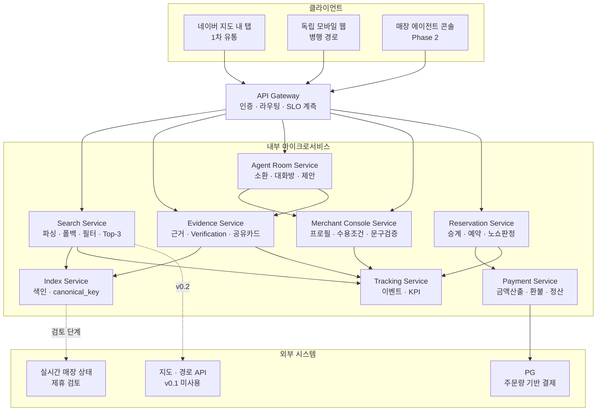
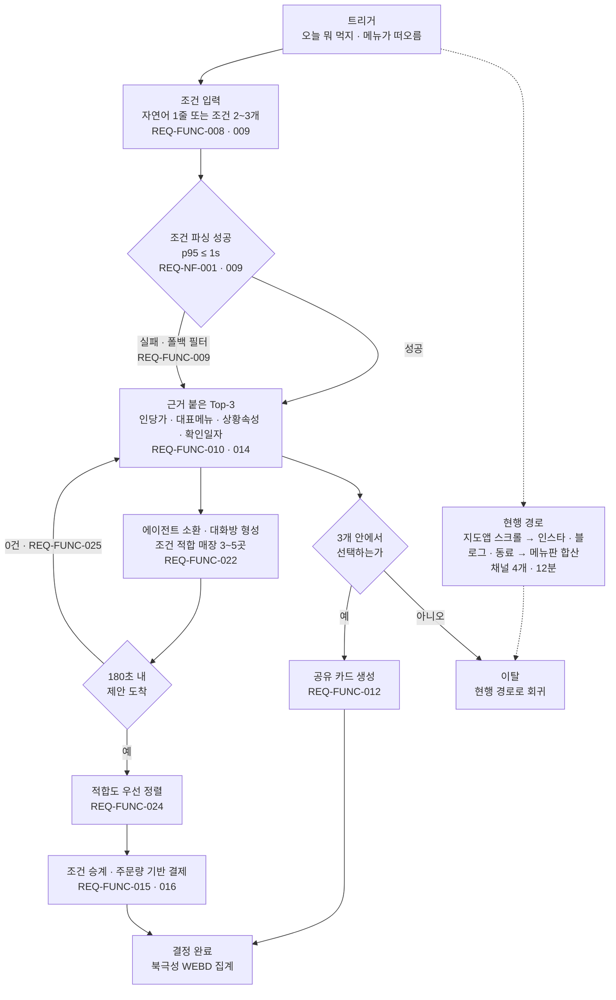
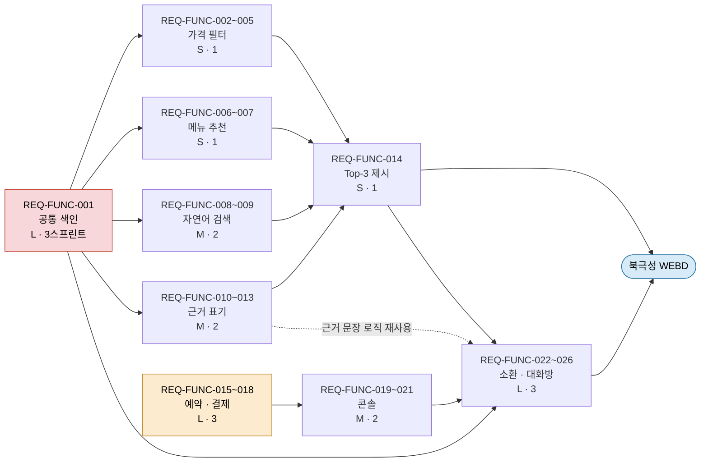
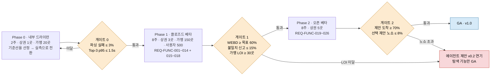
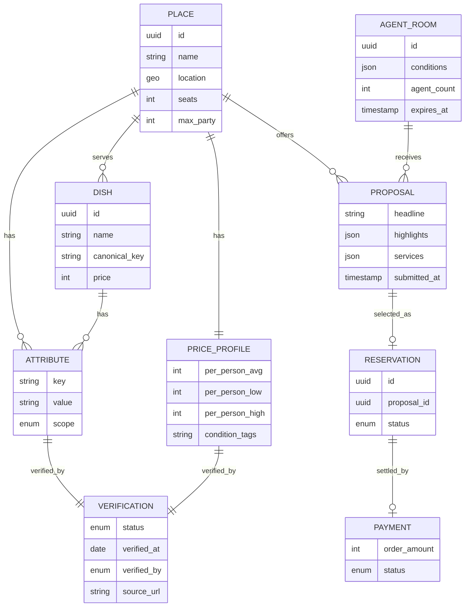
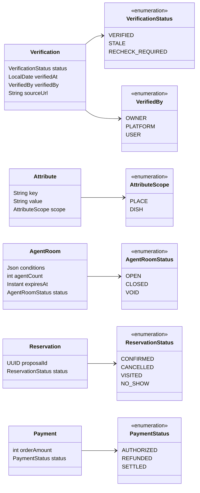

# [SRS 문서] AI-Place-Mate (한글)

# 소프트웨어 요구사항 명세서 (SRS)

**문서 ID:** SRS-AIPLACE-MVP-001

**개정 버전:** 1.8

**날짜:** 2026-08-24

**표준:** ISO/IEC/IEEE 29148:2018 (§9.6 Software requirements specification content)

**상위 문서:** PRD v0.1 (`ai-place-prd-v0.1.html`, 2026-08-20, Owner 5팀)

---

## 1. 서론

### 1.1 목적

본 문서는 ISO/IEC/IEEE 29148:2018 표준에 따라, **조건 기반 자연어 질의에 근거가 붙은 후보 3개를 반환하고 매장 에이전트의 역제안으로 결정을 완결하는 AI 장소 큐레이션 서비스**의 요구사항을 정의한다.

핵심 설계 원칙은 두 가지다. 첫째, **노출 순서를 판매하지 않는다** — 광고 상품을 도입하지 않고 조건 적합도로만 정렬한다. 둘째, **판정하지 않고 재료를 제공한다** — 시스템은 "조용하다" 같은 주관적 판정을 내리지 않고, 확인 일자와 확인 주체가 붙은 사실 속성만 노출한다.

**1.1.1 문서 구성과 표준 대응**

ISO/IEC/IEEE 29148:2018 §9.6.1은 SRS의 절 구성 순서를 프로젝트 정보관리 정책에 따라 선택할 수 있도록 허용한다. 본 문서는 사내 SRS 양식의 절 구성을 유지하고, 그 양식에 대응 절이 없는 내용은 §9.6의 해당 조항에 근거해 확장 절을 개설했다.

| 본 문서 절 | 근거 조항 (29148:2018) | 구분 |
| --- | --- | --- |
| 1.1 목적 | 9.6.2 Purpose | 양식 |
| 1.2 범위 | 9.6.3 Scope | 양식 |
| 1.3 정의, 약어, 축약어 | 9.6.20 Supporting information (b) | 양식 |
| **1.4 문제 정의 및 목표** | **9.6.20 (c) 소프트웨어가 해결할 문제의 기술** · 9.6.3 (c) 편익·목표 | **확장** |
| **1.5 가정 및 제약** | **9.6.8 Assumptions and dependencies** · **9.6.7 Limitations** | **확장** |
| 2.1 이해관계자 및 책임 | 9.6.20 (b) | 양식 |
| **2.2 이용자 클래스 및 특성** | **9.6.6 User characteristics** | **확장** |
| 3.1 인터페이스 | 9.6.4 Product perspective | 양식 |
| **3.1.1~3.1.7 인터페이스 하위 절** | **9.6.4.1~9.6.4.9** (시스템·이용자·하드웨어·통신·메모리·지역 적응·서비스) | **확장** |
| **3.2 운영 시나리오** | **9.6.4.7 Operations** · 9.6.5 Product functions | **확장** |
| 4.1 기능 요구사항 | 9.6.10 Specified requirements · 9.6.12 Functions | 양식 |
| 4.2 비기능 요구사항 | 9.6.13 Usability · 9.6.14 Performance · 9.6.15 (f) Security · 9.6.18 Software system attributes · **9.6.7 Limitations** (Cost) | 양식 |
| **4.3 요구사항 의존성 및 구현 규모** | **9.6.9 Apportioning of requirements** | **확장** |
| **4.4 표준 및 규제 준수** | **9.6.17 Standards compliance** · 9.6.16 Design constraints | **확장** |
| **4.5 기능 처리 규격** | **9.6.12 Functions** (유효성 검사·연산 순서·비정상 대응·파라미터·입출력 관계) | **확장** |
| 5.1 요구사항 → 모듈 → 테스트 | 9.6.9 (기능·소프트웨어 요소 교차 참조표) | 양식 |
| **5.2 요구사항 → 측정 지표** | **9.6.9** (동일 조항의 교차 참조 요구) | **확장** |
| **6. 검증 및 릴리스** | **9.6.19 Verification** | **확장** |
| **7. 리스크 및 설계 결정** | **9.6.16 Design constraints** · 9.6.20 (b) | **확장** |
| 8.1~8.4 부록 | 9.6.11 External interfaces · 9.6.15 (d) 엔터티와 관계 | 양식 |
| **8.6 논리 데이터베이스 요구사항** | **9.6.15 (a)(b)(c)(e)(f)(g)** 정보 유형·빈도·접근 능력·정합성·보안·보존 | **확장** |
| **8.5 근거 자료** | **9.6.20 (a) 비용 분석·사용자 조사 결과** · (b) 배경 정보 | **확장** |
| 9. 향후 개선 사항 | 9.6.9 (향후 버전으로 연기되는 요구사항의 식별) | 양식 |

도식 5개(3.1 · 3.2.0 · 4.3.0 · 6.2 · 8.2)는 §9.6.4의 "상위 시스템의 주요 요소·상호연결·외부 인터페이스를 보이는 블록 다이어그램"과 §9.6.5 b)의 "기능과 그 관계를 보이는 도해적 방법"에 근거한다. 사내 양식에는 도식이 없으나 표준이 명시적으로 권장하는 표현이다.

§9.6.20 말미의 요구에 따라 밝힌다 — **1.4 · 8.5의 내용은 배경 정보이며 요구사항의 일부가 아니다.** 요구사항은 4.1·4.2에 명시된 REQ-FUNC / REQ-NF 항목에 한한다.

### 1.2 범위

**포함 (v0.1)**

- 자연어 1줄 및 구조화 조건 입력, 파싱 실패 시 **구조화 필터 폴백**
- 인당 예상가 **범위** 표기와 예산 상한 필터
- **dish 단위 색인**을 통한 메뉴명 질의 (업종 목록이 아닌 매장 반환)
- 상황 속성(1인석·소음·체류 허용·룸·주차·단체 수용) 필터
- 후보마다 **선정 이유·근거 속성·확인 일자·확인 주체** 4항목 표기 및 공유 카드 생성
- 후보를 정확히 **3개**로 고정 제시 (페이지네이션 미제공)
- 선택·예약·**주문량 기반 선결제**와 노쇼 정산 — Phase 1 말
- 매장 에이전트 콘솔(분위기·강점·서비스·수용 조건 등록) — Phase 2
- 에이전트 소환과 **180초 마감 단체 대화방** 제안 수집 — Phase 2
- 대상 지역: 수도권 상권 3곳(Phase 1) → 5곳(Phase 2)
- 1차 유통: 네이버 지도 내 별도 탭. 독립 모바일 웹 병행

**제외 (v0.1)**

| 제외 항목 | 근거 |
| --- | --- |
| 다지점 공정 지점 산출 | 사용자가 지역을 직접 지정. 경로 API 미연동 |
| 리뷰 3축 재가공 | 리뷰량 경쟁의 수익성 한계 (Yelp 음식점·소매 광고 −6%) |
| AI 전화 예약 대행 | 매장 응대라는 제3자 행동에 품질이 달려 코드로 보증 불가. 예약 자체는 REQ-FUNC-015~018로 자체 구현 |
| 성분·접근성 데이터 커버리지 | 필드만 사전 확보. 전국 채우기를 목표로 하지 않고 미검증 구간을 명시 |
| 광고 상품 | 노출 순서를 판매하지 않는 것이 차별 가치의 전제 (ADR-004) |
| 결제·정산 자체 구축 | PCI-DSS 준수 PG 위탁 |

### 1.2.1 제품 기능 요약

> **확장 절** — 29148:2018 **§9.6.5 Product functions**("소프트웨어가 수행할 주요 기능의 요약을 제공한다… 기능 목록이 문서를 처음 읽는 사람에게 이해되도록 구성하라")에 근거해 개설했다. 1.2 범위를 기능 축으로 재정렬한 것이며 새로운 내용은 없다.

| 기능 군 | 요약 | 요구사항 | 단계 |
| --- | --- | --- | --- |
| 색인 | 장소·메뉴·가격·속성·확인 상태를 dish 단위 단일 자료구조로 색인한다 | REQ-FUNC-001 | Phase 1 |
| 조건 입력 | 자연어 1줄 또는 구조화 조건을 받고, 파싱 실패 시 필터 UI로 폴백한다 | REQ-FUNC-008 · 009 | Phase 1 |
| 후보 선별 | 인당 예상가·메뉴·운영 조건으로 걸러 후보를 정확히 3개 반환한다 | REQ-FUNC-002~007 · 014 | Phase 1 |
| 근거 제시 | 후보마다 선정 이유·근거 속성·확인 일자·확인 주체를 표기하고 공유 카드를 만든다 | REQ-FUNC-010~013 | Phase 1 |
| 예약·결제 | 선택한 제안의 조건을 승계해 주문량 기준으로 선결제하고 노쇼를 정산한다 | REQ-FUNC-015~018 | Phase 1 말 |
| 공급자 콘솔 | 매장이 분위기·강점·서비스·수용 조건을 등록·갱신한다 | REQ-FUNC-019 · 021 · 027 | Phase 2 |
| 에이전트 제안 | 조건에 맞는 매장 에이전트를 소환해 180초 대화방에서 제안을 수집·정렬한다 | REQ-FUNC-020 · 022~026 | Phase 2 |

### 1.3 정의, 약어, 축약어

| 용어 | 정의 |
| --- | --- |
| WEBD | Weekly Evidence-Backed Decisions. 조건 2개 이상 입력 → Top-3 수신 → 1곳 선택까지 완주한 주간 세션 수. 북극성 지표 |
| Top-3 | 근거 4항목이 붙은 후보 3개. 개수는 3으로 고정되며 페이지네이션을 제공하지 않는다 (ADR-003) |
| Dish | 매장이 취급하는 개별 메뉴. 색인 단위이며 place 하위가 아닌 독립 엔터티 (ADR-001) |
| canonical_key | 메뉴명 정규화 키. '물냉면/평양냉면/냉면'을 동일 키로 묶어 메뉴 질의 정답률을 확보한다 |
| PriceProfile | 인당 예상가의 하한·상한·평균과 조건 태그. 단일 값 표기를 금지하고 범위로만 노출한다 |
| Verification | 확인 상태·확인 일자·확인 주체·출처를 담는 **독립 엔터티**. 모든 노출 속성에 필수 (ADR-002) |
| Attribute scope | 속성의 적용 범위. `place`(매장 단위) 또는 `dish`(메뉴 단위) |
| AgentRoom | 조건에 맞는 매장 에이전트 3~5곳이 소환되는 대화방. 생성 후 180초에 만료 |
| Proposal | 매장 에이전트가 대화방에 제출하는 제안. 등록 Attribute를 참조하는 근거 배열을 가지며 **가격 필드가 없다** |
| 폴백 (Fallback) | 자연어 파싱 실패 시 빈 화면 대신 구조화 필터 UI로 열화 전환하는 동작 |
| 근거 표기 | 후보 카드에 선정 이유 1줄·근거 속성·확인 일자·확인 주체 4항목을 모두 표시하는 것 |
| 판정 금지 | 주관적 평가를 시스템이 내리지 않고 사실 속성과 사진만 제공하는 원칙 |
| 선결제 | 선택된 제안의 주문량 기준 금액을 예약 시점에 결제하는 방식. 노쇼 손실을 흡수한다 |
| 노쇼 (No-show) | 예약 시각 경과 후 방문 확인이 없는 상태. 선결제 금액을 매장에 정산한다 |
| MSCW | Must / Should / Could / Won't have 우선순위 체계 |
| LOI | Letter of Intent. 가맹 참여 의향서. F7 착수 게이트 조건 |
| RTO / RPO | Recovery Time Objective / Recovery Point Objective. 복구 소요 시간 / 복구 시점 목표 |
| PG | Payment Gateway. 결제 대행 사업자 |
| LCP | Largest Contentful Paint. 주요 콘텐츠 렌더 완료 시점 |
| 산정 / 외부 / 실측 | 기준선의 산출 근거 등급. 여정 지도·JTBD 기반 산정 / 외부 공개 자료 / 직접 측정 |

### 1.4 문제 정의 및 목표

> **확장 절** — 사내 양식에 대응 절이 없다. 29148:2018 **§9.6.20 (c)** "소프트웨어가 해결할 문제의 기술"과 **§9.6.3 (c)** "관련 편익·목표"에 근거해 개설했다. PRD §1.1~§1.3에 이미 작성된 Pain·실패 KPI·목표·지표만 옮겼다. §9.6.20에 따라 본 절은 배경 정보이며 요구사항의 일부가 아니다.

**1.4.1 문제 정의 — 실패 KPI를 붙인 Pain**

| Pain | 문제 | 실패 KPI (현행) | 기준선 | 근거 | 대응 요구사항 |
| --- | --- | --- | --- | --- | --- |
| C2-1 | 인당 가격이 어디에도 표기되지 않음 | 예상 지출과 실제 결제액의 오차율 | 15% | 산정 | REQ-FUNC-002 · 005 |
| C2-2 | 무한리필류 운영 조건이 검색어로 없음 | 플랫폼 내 조건 검색 성공률 | 0% | 실측 | REQ-FUNC-004 |
| C3-1 | 색인이 가게 단위라 메뉴명으로 진입 불가 | 메뉴명 질의의 정답 반환률 | 0% | 실측 | REQ-FUNC-001 · 006 |
| C3-2 | 우회 탐색이 여러 채널로 분산 | 세션당 외부 채널 수 / 소요 시간 | 4개 / 12분 | 산정 | REQ-FUNC-008 · 009 |
| C4-1 | 문장형 조건을 넣을 입력 칸이 없음 | 상황어 질의 처리율 | 0% | 실측 | REQ-FUNC-009 |
| C4-2 | 1인석·소음·체류 허용을 사전 확인 불가 | 방문 후 조건 불일치 발생률 | 35% | 산정 | REQ-FUNC-010 · 013 |
| C1-3 | 정한 곳을 정당화할 근거가 없음 | 후보 카드의 선정 근거 표기율 | 0% | 실측 | REQ-FUNC-010 · 012 |
| A2-2 | 룸·주차·법인카드·단체 수용이 필터에 없음 | 단체 조건 확인에 드는 전화 통화 수 | 3통 / 15분 | 산정 | REQ-FUNC-004 · 022 |
| N1-1·2 | 추천에 선정 근거가 없어 광고로 읽음 | 추천 결과 신뢰 응답률 | P0 측정 | 산정 | REQ-FUNC-010 · 024 |
| P5-1 | 빈 시간대에 먼저 제안할 창구가 없음 | 빈 좌석 공석률 / 고정 광고비 | 37% / 월 30만원 | 산정 | REQ-FUNC-019 · 022 |
| P5-3 | 노쇼로 좌석 회전과 준비가 이중 손실 | 단체 예약 노쇼율 | 15% | 산정 | REQ-FUNC-016 · 018 |

**1.4.2 목표 — 수치화한 Desired Outcome**

Phase 0·1 합산 10주 기준.

| 항목 | 현행 → 목표 | 정의 |
| --- | --- | --- |
| 탐색 노동 | 12분 → 60초 · 채널 4개 → 1개 | 조건 입력에서 후보 확정까지 |
| 결정 부담 | 결정 시간 −20% | 순위 나열 대신 비교 축과 근거를 미리 정리 |
| 근거 표기 | 0% → 100% | 모든 후보에 선정 이유 + 확인 일자 |
| 공급 측 고정비 | 월 30만원 → 0원 | 고정 광고비를 성사 건당 수수료로 전환 |

**1.4.3 측정 지표**

북극성은 '조건을 말하고 근거를 받아 결정까지 끝낸 세션' 하나로 정의한다. DAU나 검색 수를 지표로 쓰면 목록만 보고 이탈한 세션이 성공으로 집계되므로, 후보 수를 늘리는 방향으로는 개선되지 않는 지표를 선택했다.

| 구분 | 지표 | 기준선 | 10주 목표 | 측정 주기 | 대응 요구사항 |
| --- | --- | --- | --- | --- | --- |
| 북극성 | 주간 근거 기반 결정 완료 수 (WEBD) | 0 (미출시) | 630건/주 (GA 5,000) | 주간 | REQ-FUNC-001~014 |
| 보조 1 | 조건 입력 완료율 | 0% (신규) | 70% | 주간 | REQ-FUNC-008 · 009 |
| 보조 2 | 첫 결과 p95 응답 시간 | — (미출시) | ≤ 1,000ms | 일간 | REQ-NF-001 |
| 보조 3 | Top-3 내 선택률 | 0% (신규) | 45% | 주간 | REQ-FUNC-014 |
| 보조 4 | 근거 표기율 | 0% (실측) | 100% | 일간 | REQ-FUNC-010 |
| 보조 5 | 예상가 오차 ±10% 내 비율 | 40% (산정) | 80% | 월간 | REQ-FUNC-002 · 005 |
| 보조 6 | 방문 후 조건 불일치 신고율 | 35% (산정) | ≤ 10% | 월간 | REQ-FUNC-011 · 013 |
| 보조 7 | 공유 카드 생성률 | 0% (신규) | 60% | 주간 | REQ-FUNC-012 |
| 보조 8 | 3분 내 제안 도착률 | 0% (신규) | 85% | 일간 | REQ-FUNC-023 |
| 보조 9 | 제안 이행률 | 0% (신규) | ≥ 95% | 월간 | REQ-FUNC-026 |
| 보조 10 | 선택 제안 노쇼율 | 15% (산정) | ≤ 5% | 월간 | REQ-FUNC-018 |
| 보조 11 | 가맹점 월 제안 참여율 | 0% (신규) | 60% | 월간 | REQ-FUNC-019 |

북극성 10주 목표는 `사용자 500 × 주 4회 × 완주율 31.5%(보조 1 70% × 보조 3 45%) ≈ 630건/주`로 산출했다. GA 목표 5,000건/주는 사용자 4,000 규모를 전제한다.

보조 8·9·11은 Phase 2에서만 측정하고, 보조 10은 REQ-FUNC-018과 함께 Phase 1 말부터 측정한다. 보조 10이 목표를 넘으면 F7·F8(REQ-FUNC-019~026)을 착수하지 않는다.

### 1.5 가정 및 제약

> **확장 절** — 사내 양식에 대응 절이 없다. 29148:2018 **§9.6.8 Assumptions and dependencies**("SRS에 명시된 요구사항에 영향을 주는 요인. 설계 제약은 아니나 변경되면 요구사항이 바뀐다")와 **§9.6.7 Limitations**(규제·품질·보안 등 공급자 선택을 제한하는 항목)에 근거해 개설했다. PRD §7의 가정 A1~A5와 제약·외부 의존성만 옮겼다.

**1.5.1 가정 (Assumptions)**

| ID | 가정 | 확정 창구 | 연결 리스크 |
| --- | --- | --- | --- |
| A1 | 인당 예산 상한을 두는 이용자가 수도권 20–34세에서 과반이다 | Phase 1 세그먼트 분석 | — |
| A2 | 매장은 자기 강점·서비스를 대화방에서 제안할 의향이 있다 | 가맹 30곳 실사 | R1 |
| A3 | 후보 3개는 목록 20개보다 선택률이 높다 | 보조 3 선택률 실측 (6.1.2) 후 비교 설계 | — |
| A4 | 근거 표기가 선택률과 재방문을 올린다 | 보조 3·7 실측 (6.1.2) 후 비교 설계 | — |
| A5 | 결제 데이터로 인당가를 ±20% 내로 추정할 수 있다 | 보조 5 실측 (6.1.2) | R2 |

**1.5.2 제약 (Constraints)**

| 구분 | 제약 |
| --- | --- |
| 유통 채널 | 1차 진입점이 네이버 지도 내 탭이며 탭 노출과 정책이 자사 통제 밖에 있다 (R6 · ADR-006) |
| 데이터 커버리지 | 상권당 최소 300곳의 인당가·대표 메뉴·1인석 여부가 채워지지 않으면 Top-3가 성립하지 않는다 (R2) |
| 결제 | PCI-DSS 준수 PG에 위탁하며 카드 정보를 보관하지 않는다 |
| 가격 정책 | 제안에 가격 협상·할인폭 필드를 두지 않는다. 경쟁 축은 가격이 아니라 조건 적합도다 |
| 광고 | 노출 순서를 판매하지 않는다 (ADR-004) |
| 심사 인력 | 제안 품질 심사는 가맹점 150곳당 1 FTE를 상한으로 한다 (R7) |
| 외부 의존 | PG 계약, 가맹 온보딩 인력, 상권 3곳 데이터 확보가 선행되어야 한다 |

---

## 2. 이해관계자

### 2.1 이해관계자 및 책임

| 역할 | 이름 / 부서 | 책임 |
| --- | --- | --- |
| 기획 매니저 (PM) | 5팀 | 요구사항 우선순위 결정 및 릴리스 게이트 판정 |
| 기획 분석가 (IT) | 5팀 | 상세 요구사항 문서화 및 측정 지표 정의 |
| 개발팀 리드 | 백엔드 팀 리드 | 설계 검토·승인 및 구현 규모 산정 |
| 개발 엔지니어 | 백엔드 개발자 | 구현 및 단위 테스트 |
| 데이터 엔지니어 | 데이터팀 | 색인 파이프라인 구축 및 상권 데이터 적재 |
| 데이터 분석가 | 데이터팀 | KPI 대시보드 구축 및 실험 결과 분석 |
| 시스템 운영자 | 운영팀 | 배포·모니터링·장애 복구 |
| 서비스 운영자 | 운영팀 | 제안 품질 심사 및 조건 불일치 신고 처리 |
| 가맹 영업 담당자 | 사업팀 | 가맹 온보딩 및 LOI 확보 |
| 사업관리 및 계약 담당자 | 사업팀 | PG 계약, SLA, 정산 관리 |

### 2.2 이용자 클래스 및 특성

> **확장 절** — 사내 양식 2절은 내부 역할만 다룬다. 29148:2018 **§9.6.6 User characteristics**("의도된 사용자 집단의 일반적 특성을 기술한다. 구체적 요구사항을 명시하지 말고, 특정 요구사항이 뒤에 명시되는 이유를 기술하라")에 근거해 개설했다. PRD §2의 페르소나·JTBD만 옮겼으며, 조항의 지시대로 요구사항은 명시하지 않고 대응 요구사항 ID만 참조한다.

| 클래스 | 특성 | 여정에서 멈추는 지점 | v0.1 범위 | 대응 요구사항 |
| --- | --- | --- | --- | --- |
| C2 예산 우선 이용자 | 대학원생 · 주 3–5회 · 1차 타깃 | 고려 — 가격 역산 | Must | REQ-FUNC-002 · 003 · 005 |
| C3 메뉴 우선 이용자 | 마케터 · 점심 매일 · 1차 타깃 | 고려 — 검색 시도 | Must | REQ-FUNC-006 · 007 |
| C4 사전 판단 이용자 | 프리랜서 · 주 3–4회 · 1차 타깃 | 온보딩 — 방문 후 실패 | Must | REQ-FUNC-010 · 011 · 013 |
| C1 근거 요구 이용자 | 동아리 총무 · 월 1–2회 | 결정 — 정당화 | Must (근거만) | REQ-FUNC-010 · 012 |
| N1 추천 불신층 | 근거 요구 · 공통 | 고려 — 추천을 광고로 읽음 | Must (근거만) | REQ-FUNC-010 · 024 |
| P5 로컬 사장 | 20–40석 · 매일 · 공급 측 | 인지 — 제안 창구 부재 | Should · Could | REQ-FUNC-016 · 018 · 019 |
| A2 단체 총무 | 회식 총무 · 분기 · 확장 | 결정 — 단체 확인 | Should · Could | REQ-FUNC-004 · 015 · 022 |
| E1 식이 제약 이용자 | 스키마 자리만 확보 | 고려 — 성분 확인 | Won't (필드만) | 9.2 |
| E2 이동 제약 이용자 | 스키마 자리만 확보 | 고려 — 경로 검증 | Won't (필드만) | 9.2 |

v0.1이 정면으로 노리는 대상은 C2·C3·C4 세 클래스다. 셋 다 주 3회 이상 같은 결정을 반복하고, 혼자 또는 두 명이라 조율 비용이 없어 학습 속도를 만든다.

---

## 3. 시스템 맥락 및 인터페이스

### 3.1 인터페이스

- **클라이언트 애플리케이션**
    1. 네이버 지도 내 별도 탭 — 1차 유통 형태. 신규 앱 설치 없이 진입
    2. 독립 모바일 웹 — 채널 종속 완화를 위한 병행 경로 (동일 스프린트 개발)
    3. 매장 에이전트 콘솔 (웹) — Phase 2
- **내부 마이크로서비스**
    - Index Service : 속성·dish 단위 공통 색인, canonical_key 정규화
    - Search Service : 조건 파싱·폴백, 가격·메뉴·속성 필터, Top-3 구성
    - Evidence Service : 근거 문장 생성, Verification 상태 관리, 공유 카드 생성
    - Agent Room Service : 에이전트 소환, 대화방 수명주기, 제안 수집·정렬
    - Merchant Console Service : 매장 프로필 CRUD, 수용 조건 매칭, 문구 근거 검증
    - Reservation Service : 조건 승계, 예약 생성, 노쇼 판정
    - Payment Service : 주문량 기반 금액 산출, 환불, 매장 정산
    - Tracking Service : 이벤트 수집, KPI 집계, 대시보드 공급
- **공통 인프라**
    - API Gateway : 인증·라우팅. 응답 시간·오류율 SLO의 계측 지점 (마이크로서비스가 아닌 공통 계층)
- **외부 시스템**
    - PG (주문량 기반 결제) — 승인·취소·환불. 카드 정보 비보관
    - 지도·경로 API — v0.1 미사용. v0.2에서 접근성 가중치와 함께 도입
    - 실시간 매장 상태 공급자 — 직접 수집 대신 제휴 검토. 단가는 수수료의 15% 이하
    - 네이버 지도 플랫폼 — 탭 노출 및 정책 (자사 통제 밖)

**시스템 구성도**



실선이 v0.1 경로, 점선이 미도입 외부 연동이다. API Gateway는 마이크로서비스가 아닌 공통 계층이며 REQ-NF-001·005·008의 계측 지점이다.

**3.1.1 시스템 인터페이스** (§9.6.4.1)

| 시스템 | 담당 기능 | 인터페이스 설명 |
| --- | --- | --- |
| PG | REQ-FUNC-016 · 017 · 018 | 주문량 기준 금액의 승인·취소·환불. 카드 정보는 PG가 보유하며 본 시스템은 거래 토큰만 취급한다 (REQ-NF-016) |
| 네이버 지도 플랫폼 | 1차 유통 진입점 | 탭 진입 시 세션을 개시한다. 탭 노출·정책은 자사 통제 밖이다 (R6) |
| 지도·경로 API | v0.1 미사용 | 좌표·시각으로 대중교통 소요시간 조회. v0.2에서 접근성 가중치와 함께 도입 |
| 실시간 매장 상태 공급자 | 검토 단계 | `place_id`로 대기·좌석 상태 조회. 직접 수집 대신 제휴하며 단가는 수수료의 15% 이하 (REQ-NF-023) |

**3.1.2 이용자 인터페이스** (§9.6.4.2)

각 화면의 논리적 특성만 규정하며 시각 설계는 포함하지 않는다.

| 화면 | 논리적 특성 | 관련 요구사항 |
| --- | --- | --- |
| 조건 입력 | 자연어 1줄 입력과 구조화 필드를 하나의 진입점으로 제공한다. **필수 입력 필드가 없고 입력 단계는 1회를 넘지 않는다** | REQ-FUNC-008 |
| 폴백 필터 | 파싱 실패 시 빈 화면 대신 구조화 필터로 전환한다. 전환 사실을 이용자에게 고지한다 | REQ-FUNC-009 |
| Top-3 카드 | 후보 3개를 고정 제시한다. 각 카드는 인당 예상가 **범위**, 대표 메뉴, 상황 속성, 선정 이유 1줄, 확인 일자, 확인 주체를 노출한다. 페이지네이션을 제공하지 않는다 | REQ-FUNC-002 · 010 · 014 |
| 신선도 경고 | 90일 초과 속성에 경고를 병기한다. **판정형 문구를 쓰지 않고** 사실과 확인 일자만 노출한다 | REQ-FUNC-011 |
| 공유 카드 | 선정 이유와 근거를 담은 이미지 또는 링크를 생성한다 | REQ-FUNC-012 |
| 대화방 | 소환된 매장 수와 **마감까지 남은 시간(카운트다운)** 을 노출한다. 제안은 조건 적합도 순으로 정렬하며 가격 협상 요소를 두지 않는다 | REQ-FUNC-022 · 023 · 024 |
| 매장 콘솔 | 설정 화면 3개 이하, 필수 항목 5개 이하. 기존 항목은 1회 클릭으로 불러와 수정한다 | REQ-FUNC-019 · 027 |

**3.1.3 하드웨어 인터페이스** (§9.6.4.3)

**해당 없음.** 전용 하드웨어나 주변 장치에 접속하지 않는다. 클라이언트는 범용 모바일 브라우저를 전제하며, 성능 요구는 하드웨어 규격이 아니라 4G 네트워크 조건으로 규정한다 (REQ-NF-006).

**3.1.4 통신 인터페이스** (§9.6.4.5)

| 항목 | 규정 |
| --- | --- |
| 프로토콜 | HTTPS 상의 REST. 요청·응답 본문은 JSON |
| 전송 암호화 | TLS 1.3 (REQ-NF-026) |
| 인증 | 모든 API에 인증을 요구한다. 매장 콘솔은 2FA를 추가한다 (REQ-NF-018) |
| 대화방 갱신 | 제안 도착과 카운트다운은 서버 → 클라이언트 단방향 갱신으로 전달한다. 마감은 서버 시각(`expiresAt`)을 기준으로 판정한다 |

**3.1.5 메모리 제약** (§9.6.4.6)

**직접적인 메모리 상한은 규정하지 않는다.** 본 시스템의 자원 제약은 메모리 용량이 아니라 **처리량과 단위 비용**으로 표현된다 — 피크 3,000 RPS (REQ-NF-005), 캐시 히트율 70% 이상 (REQ-NF-020), 세션당 추론 비용 12원 이하 (REQ-NF-019). 클라이언트 측 제약은 초기 렌더 LCP 2.5초로 대체한다 (REQ-NF-006).

**3.1.6 지역 적응 요구사항** (§9.6.4.8)

배포 단위는 **상권**이다. 상권을 추가할 때 코드 변경 없이 아래 데이터만 채워 적응한다.

| 적응 항목 | 내용 |
| --- | --- |
| 상권 경계 | 대상 상권의 지리 범위. 이용자가 지역을 직접 지정하므로 경로 엔진에 의존하지 않는다 |
| 초기 적재 | 상권당 최소 300곳의 필수 필드 5개(인당가·대표 메뉴·1인석 여부·운영 조건·확인 일자) (R2) |
| 조건 카테고리 사전 | 해당 상권에서 통용되는 운영 조건 어휘 (REQ-FUNC-004) |
| 메뉴 정규화 키 | 지역 메뉴명 변형을 `canonicalKey`에 병합 (REQ-FUNC-001) |
| 가맹 온보딩 | 심사 인력은 가맹점 150곳당 1 FTE 상한 (REQ-NF-022) |

확장 규모는 Phase 1 상권 3곳 → Phase 2 상권 5곳이다.

**3.1.7 서비스 인터페이스** (§9.6.4.9)

| 서비스 | 형태 | 결합 방식 |
| --- | --- | --- |
| PG | 외부 SaaS | 결제·정산 위탁. PCI-DSS 준수 범위를 PG로 이전한다 (REQ-NF-016) |
| 추론 서비스 | 외부 API | 조건 파싱과 근거 문장 생성. 세션당 비용 12원 이하로 제한하고 초과 시 프롬프트를 축약한다 (REQ-NF-019, 6.3) |
| 실시간 매장 상태 | 외부 제휴 (검토) | 건당 단가가 수수료의 15%를 넘으면 도입하지 않는다 (REQ-NF-023) |

### 3.2 운영 시나리오

> **확장 절** — 사내 양식에 대응 절이 없다. 29148:2018 **§9.6.4.7 Operations**("사용자가 요구하는 정상 운영과 특수 운영의 각 모드")와 **§9.6.5 Product functions**("유스케이스·사용자 스토리·시나리오도 제품 기능을 기술하는 데 쓰인다")에 근거해 개설했다. PRD §2.2의 여정 도식과 이탈 분기만 옮겨 요구사항 ID에 연결했다.

**3.2.0 전체 흐름**

노란 마름모 세 개가 측정 지점이다 — 조건 파싱 성공률, Top-3 내 선택률, 180초 제안 도착률.



**3.2.1 정상 흐름 — 수요 측 탐색**

| 단계 | 동작 | 관련 요구사항 |
| --- | --- | --- |
| 1 | 트리거 발생 — '오늘 뭐 먹지' 또는 특정 메뉴가 떠오름 | — |
| 2 | 자연어 1줄 또는 조건 2~3개 입력 | REQ-FUNC-008 · 009 |
| 3 | 조건 파싱 (p95 ≤ 1,000ms) | REQ-FUNC-009 · REQ-NF-001 |
| 4 | 근거 붙은 Top-3 반환 — 인당가·대표 메뉴·상황 속성·확인 일자 | REQ-FUNC-010 · 014 |
| 5 | 후보 1곳 선택 | REQ-FUNC-014 |
| 6 | 공유 카드 생성 — '왜 이 곳인가' 1줄 | REQ-FUNC-012 |
| 7 | 결정 완료 — 북극성 지표 집계 | 1.4.3 |

**3.2.2 정상 흐름 — 에이전트 제안 (Phase 2)**

| 단계 | 동작 | 관련 요구사항 |
| --- | --- | --- |
| 1 | 카테고리·지역 지정 후 에이전트 소환. 대화방 형성 (매장 3~5곳) | REQ-FUNC-022 |
| 2 | 예산·인원·상황 입력. 에이전트가 등록 속성에 근거한 제안 제출 | REQ-FUNC-023 |
| 3 | 조건 적합도 1순위 정렬로 제안 비교 | REQ-FUNC-024 |
| 4 | 제안 선택 → 조건 자동 승계 → 주문량 기반 결제 | REQ-FUNC-015 · 016 |
| 5 | 방문 확인 또는 노쇼 판정 | REQ-FUNC-018 |

**3.2.3 이탈 분기 — 측정 지점**

| 분기 | 조건 | 시스템 동작 | 임계 |
| --- | --- | --- | --- |
| 분기 01 | 자연어 파싱 실패 | 빈 화면을 반환하지 않고 구조화 필터 UI로 전환. 폴백 후에도 Top-3를 반드시 반환 | 파싱 실패율 ≤ 1.5% |
| 분기 02 | Top-3 안에서 선택하지 않음 | 현행 경로로 이탈. 후보 수를 늘리지 않고 근거 표기로 대응 | Top-3 내 선택률 45% |
| 분기 03 | 180초 내 유효 제안 0건 | 빈 제안 화면 대신 '제안 없는 Top-3'로 회귀하고 그 사실을 고지 | 빈 제안 화면 노출 0건 |

---

## 4. 구체적 요구사항

### 4.1 기능 요구사항

| ID | 제목 | 출처 | 우선순위 | 유형 | 검증 방식 | 인수 기준 | 상태 | 담당자 |
| --- | --- | --- | --- | --- | --- | --- | --- | --- |
| **REQ-FUNC-001** | 속성·dish 단위 공통 색인 | PRD §4 F1 · Pain C3-1 | Must Have | Functional | 1) 색인 단위 스키마 테스트<br>2) canonical_key 정규화 커버리지 검증<br>3) QA 검증 | 장소·메뉴·가격·속성·확인 상태·확인 일자를 단일 자료구조로 색인해야 하며, 메뉴명은 canonical_key로 정규화되어 '물냉면/평양냉면/냉면'이 동일 키로 묶여야 한다. 조건 검색 성공률 0% → 90% | Proposed | 데이터 엔지니어 |
| **REQ-FUNC-002** | 인당 예상가 범위 표기 | US-1 AC1 · Pain C2-1 | Must Have | Functional | 1) 표기율 집계 테스트<br>2) 범위 폭 경계 검증<br>3) QA 검증 | 후보 목록 요청 시 모든 후보 카드에 인당 예상가와 오차 범위가 표시되어야 한다. 단일 값 표기는 금지한다. 표기율 100%, 범위 폭 ≤ ±20% | Proposed | 개발 엔지니어 |
| **REQ-FUNC-003** | 예산 상한 초과 매장 제외 | US-1 AC2 | Must Have | Functional | 1) 경계값 테스트<br>2) 오탐률 검증<br>3) QA 검증 | 인당 예상가 상한이 입력된 예산 상한을 넘는 매장은 기본 결과에서 제외되고 '예산 초과 N곳'으로만 요약되어야 한다. 오탐률 ≤ 3% | Proposed | 개발 엔지니어 |
| **REQ-FUNC-004** | 운영 조건 카테고리 필터 | US-1 AC3 · Pain C2-2 · A2-2 | Must Have | Functional | 1) 카테고리 사전 적중 테스트<br>2) 응답 시간 검증<br>3) QA 검증 | 조건 카테고리 사전에 등록된 운영 조건(무한리필·룸·주차·단체 수용 등)을 입력하면 해당 조건을 만족하는 매장만 반환해야 한다. 적중률 ≥ 90%, 응답 p95 ≤ 1,000ms | Proposed | 개발 엔지니어 |
| **REQ-FUNC-005** | 결제액 피드백 반영 | US-1 AC4 | Must Have | Functional | 1) 편차 기록 테스트<br>2) 재표기 반영 검증<br>3) QA 검증 | 이용자가 실제 결제액을 입력하면 표기 예상가와의 편차를 기록하고 다음 표기에 반영해야 한다. ±10% 내 비율 ≥ 80% | Proposed | 데이터 엔지니어 |
| **REQ-FUNC-006** | 메뉴명 단위 매장 반환 | US-2 AC1 · Pain C3-1 | Must Have | Functional | 1) 정답 반환률 테스트<br>2) 첫 결과 응답 시간 검증<br>3) QA 검증 | 반경 1km 내에서 메뉴명 하나만 입력하면 업종 목록이 아니라 해당 메뉴를 취급하는 매장 Top-3를 반환해야 한다. 정답 반환률 ≥ 92%, 첫 결과 p95 ≤ 1,000ms | Proposed | 개발 엔지니어 |
| **REQ-FUNC-007** | 유사 메뉴 대체 반환 | US-2 AC2 | Must Have | Functional | 1) 미등록 메뉴 대체 테스트<br>2) 빈 결과 반환률 검증<br>3) QA 검증 | 색인에 없는 메뉴는 유사 메뉴가 3건 이상 존재할 때 '찾는 메뉴가 없어 유사 메뉴로 대체했다'를 명시하고 반환해야 한다. 빈 결과 반환률 ≤ 2% | Proposed | 개발 엔지니어 |
| **REQ-FUNC-008** | 필수 입력 없는 질의 수용 | US-2 AC3 · Pain C3-2 | Must Have | Functional | 1) 필수 필드 부재 테스트<br>2) 입력 단계 수 검증<br>3) QA 검증 | 추가 조건을 입력하지 않고 바로 검색해도 결과가 반환되어야 한다. 필수 입력 필드 0개, 입력 단계 ≤ 1회 | Proposed | 개발 엔지니어 |
| **REQ-FUNC-009** | 자연어 조건 파싱 및 폴백 | PRD §2.2 분기 01 · Pain C4-1 | Must Have | Functional | 1) 파싱 정확도 테스트<br>2) 폴백 전환 및 빈 화면 부재 검증<br>3) QA 검증 | 자연어 1줄을 구조화 조건으로 파싱해야 하며, 파싱 실패 시 빈 화면 대신 구조화 필터 UI로 전환하고 폴백 후에도 Top-3를 반환해야 한다. 파싱 실패율 ≤ 1.5% | Proposed | 개발 엔지니어 |
| **REQ-FUNC-010** | 근거 4항목 표기 | US-3 AC1 · Pain C1-3 · N1-1·2 | Must Have | Functional | 1) 4항목 표기율 테스트<br>2) 미표기 후보 차단 검증<br>3) QA 검증 | 각 후보 카드에 선정 이유 1줄·근거 속성·확인 일자·확인 주체가 모두 표시되어야 한다. 4개 항목 표기율 100% | Proposed | 개발 엔지니어 |
| **REQ-FUNC-011** | 데이터 신선도 경고 | US-3 AC2 · Pain C4-2 | Must Have | Functional | 1) 90일 경계 테스트<br>2) 판정형 문구 부재 검증<br>3) QA 검증 | 90일 이상 갱신되지 않은 속성이 후보 카드에 노출되면 '확인 90일 경과' 경고를 함께 표시해야 한다. 경고 누락률 0%, 판정형 문구 0건 | Proposed | 개발 엔지니어 |
| **REQ-FUNC-012** | 공유 카드 생성 | US-3 AC3 · Pain C1-3 | Must Have | Functional | 1) 생성 응답 시간 테스트<br>2) 근거 4항목 누락 시 거부 검증<br>3) QA 검증 | 후보 선택 후 공유를 요청하면 선정 이유와 근거를 담은 카드를 이미지 또는 링크로 생성해야 한다. 생성 p95 ≤ 3,000ms, 공유 카드 생성률 ≥ 60% | Proposed | 개발 엔지니어 |
| **REQ-FUNC-013** | 조건 불일치 신고 처리 | US-3 AC4 · Pain C4-2 | Must Have | Functional | 1) 상태 전환 지연 테스트<br>2) 재확인 큐 반영 검증<br>3) QA 검증 | 방문 후 '조건이 달랐다' 신고를 받으면 해당 속성의 확인 상태를 '재확인 필요'로 즉시 전환해야 한다. 반영 지연 ≤ 60s | Proposed | 서비스 운영자 |
| **REQ-FUNC-014** | 근거 있는 Top-3 제시 | PRD §4 F6 · ADR-003 | Must Have | Functional | 1) 후보 수 고정 테스트<br>2) 근거 없는 후보 반환 차단 검증<br>3) QA 검증 | 후보를 정확히 3개 반환하고 비교 축과 근거를 함께 제시해야 한다. 근거 4항목이 없는 후보는 반환하지 않아야 하며 페이지네이션을 제공하지 않는다. Top-3 내 선택률 45% | Proposed | 개발팀 리드 |
| **REQ-FUNC-015** | 제안 조건 자동 승계 | US-4 AC1 | Should Have | Functional | 1) 승계 필드 매핑 테스트<br>2) 재입력 필드 부재 검증<br>3) QA 검증 | 제안을 선택해 예약 화면으로 넘어가면 제안에 담긴 인원·메뉴 구성·시간이 자동 승계되어야 한다. 재입력 필드 0개, 승계 누락률 ≤ 0.5% | Proposed | 개발 엔지니어 |
| **REQ-FUNC-016** | 주문량 기반 결제 | US-4 AC2 · Pain P5-3 | Should Have | Functional | 1) 금액 산출 정확도 테스트<br>2) 매장 통보 지연 검증<br>3) QA 검증 | 제안에 메뉴 구성이 포함된 경우 주문량 기준으로 금액을 산출하고 매장에 확정을 통보해야 한다. 통보 지연 ≤ 30s, 금액 산출 오류율 ≤ 0.3% | Proposed | 개발 엔지니어 |
| **REQ-FUNC-017** | 취소 및 전액 환불 | US-4 AC3 | Should Have | Functional | 1) 취소 시한 경계 테스트<br>2) 환불 처리 시간 검증<br>3) QA 검증 | 예약 2시간 전까지 취소가 접수되면 선결제 금액을 전액 환불하고 매장에 즉시 알려야 한다. 환불 처리 ≤ 24h, 환불 실패율 ≤ 0.5% | Proposed | 사업관리 및 계약 담당자 |
| **REQ-FUNC-018** | 노쇼 판정 및 정산 | US-4 AC4 · Pain P5-3 | Should Have | Functional | 1) 방문 확인 매칭 테스트<br>2) 오판정률 검증<br>3) QA 검증 | 예약 시각 경과 후 방문 확인이 없으면 노쇼로 기록하고 선결제 금액을 매장에 정산해야 한다. 선택 제안 노쇼율 ≤ 5%, 오판정률 ≤ 1% | Proposed | 서비스 운영자 |
| **REQ-FUNC-019** | 매장 프로필 등록 | US-5 AC1 · Pain P5-1 | Could Have | Functional | 1) 항목별 등록 테스트<br>2) 필수 항목 수 검증<br>3) QA 검증 | 분위기·강점·제공 가능한 서비스·수용 조건을 항목별로 등록할 수 있어야 한다. 설정 화면 ≤ 3개, 필수 항목 ≤ 5개 | Proposed | 서비스 운영자 |
| **REQ-FUNC-027** | 매장 프로필 갱신 | US-5 AC3 | Could Have | Functional | 1) 1회 클릭 수정 테스트<br>2) 기존 항목 로드 검증<br>3) QA 검증 | 등록된 프로필 항목을 1회 클릭으로 불러와 수정할 수 있어야 한다. 프로필 갱신율 ≥ 70% | Proposed | 서비스 운영자 |
| **REQ-FUNC-020** | 수용 조건 밖 소환 배제 | US-5 AC2 | Could Have | Functional | 1) 조건 밖 요청 배제 테스트<br>2) 부적합 소환률 검증<br>3) QA 검증 | 등록한 수용 조건(인원·시간·룸 등) 밖의 요청이 도착하면 해당 매장의 에이전트를 소환하지 않아야 한다. 부적합 소환률 ≤ 5%, 알림 무시율 ≤ 20% | Proposed | 개발 엔지니어 |
| **REQ-FUNC-021** | 근거 없는 문구 저장 차단 | US-5 AC4 | Could Have | Functional | 1) 속성 참조 검증 테스트<br>2) 저장 거부 및 안내 검증<br>3) QA 검증 | 등록된 사실 속성으로 뒷받침되지 않는 강점 문구는 저장하지 않고, 근거가 될 속성 등록을 안내해야 한다. 근거 없는 제안 문구 0건 | Proposed | 개발 엔지니어 |
| **REQ-FUNC-022** | 에이전트 소환 및 대화방 생성 | US-6 AC1 · Pain A2-2 | Could Have | Functional | 1) 소환 수 경계 테스트<br>2) 대화방 생성 응답 시간 검증<br>3) QA 검증 | 카테고리와 지역이 입력되면 조건에 맞는 매장 에이전트를 3~5곳 소환해 하나의 대화방을 만들어야 한다. 소환 수 3~5곳, 대화방 생성 p95 ≤ 2,000ms | Proposed | 개발 엔지니어 |
| **REQ-FUNC-023** | 제안 수집 및 180초 마감 | US-6 AC2 | Could Have | Functional | 1) 제안 도착률 테스트<br>2) 카운트다운 노출 검증<br>3) QA 검증 | 대화방에 예산·인원·상황이 입력되면 에이전트가 등록 속성에 근거한 제안을 보내고 카운트다운이 노출되어야 한다. 180초 내 제안 ≥ 1건 85%, 첫 제안 p50 ≤ 60s | Proposed | 개발 엔지니어 |
| **REQ-FUNC-024** | 적합도 우선 제안 정렬 | US-6 AC3 · Pain N1-1·2 | Could Have | Functional | 1) 정렬 기준 테스트<br>2) 가격 협상 필드 부재 검증<br>3) QA 검증 | 수집된 제안은 가격이 아니라 조건 적합도를 1순위로 정렬하고 비교 축과 근거를 함께 표시해야 한다. 근거 표기율 100%, 가격 협상 기능 0건 | Proposed | 개발팀 리드 |
| **REQ-FUNC-025** | 제안 0건 시 Top-3 회귀 | US-6 AC4 · PRD §2.2 분기 03 | Could Have | Functional | 1) 마감 후 0건 시나리오 테스트<br>2) 빈 화면 노출 부재 검증<br>3) QA 검증 | 180초가 지나고 유효 제안이 0건이면 빈 화면 대신 '제안 없는 Top-3'로 되돌리고 그 사실을 고지해야 한다. 빈 제안 화면 노출 0건 | Proposed | 개발 엔지니어 |
| **REQ-FUNC-026** | 제안 불이행 기록 및 가중치 하향 | US-6 AC5 | Could Have | Functional | 1) 신고 접수·처리 테스트<br>2) 소환 가중치 반영 검증<br>3) QA 검증 | 현장에서 제안 내용이 적용되지 않은 사실이 신고되면 불이행을 기록하고 해당 매장의 소환 가중치를 하향해야 한다. 제안 이행률 ≥ 95%, 신고 처리 ≤ 48h | Proposed | 서비스 운영자 |

### 4.2 비기능 요구사항

| ID | 제목 | 출처 | 우선순위 | 유형 | 검증 방식 | 인수 기준 | 상태 | 담당자 |
| --- | --- | --- | --- | --- | --- | --- | --- | --- |
| **REQ-NF-001** | 조건 파싱 + Top-3 응답 시간 | PRD §5 성능 | Must Have | Performance | 조건 파싱·색인 조회를 포함한 부하 테스트 | 조건 파싱부터 Top-3 렌더 완료까지 p95 ≤ 1,000ms, p99 ≤ 2,000ms를 만족해야 한다 | Proposed | 시스템 운영자 |
| **REQ-NF-002** | 메뉴 색인 질의 응답 시간 | PRD §5 성능 | Should Have | Performance | canonical_key 질의 부하 테스트 및 캐시 히트/미스 구분 측정 | 메뉴 색인 질의는 p95 ≤ 400ms, 캐시 히트 시 ≤ 120ms를 만족해야 한다 | Proposed | 시스템 운영자 |
| **REQ-NF-003** | 공유 카드 생성 시간 | PRD §5 성능 | Must Have | Performance | 이미지·링크 생성 경로 부하 테스트 | 공유 카드 생성은 p95 ≤ 3,000ms를 만족해야 한다 | Proposed | 시스템 운영자 |
| **REQ-NF-004** | 첫 제안 도착 시간 | PRD §5 성능 | Could Have | Performance | 대화방 제안 도착 시각 분포 측정 | 대화방에 조건이 입력된 시점부터 첫 제안 도착까지 p50 ≤ 60s를 만족해야 한다 | Proposed | 시스템 운영자 |
| **REQ-NF-005** | 피크 처리량 3,000 RPS | PRD §5 성능 | Should Have | Scalability | 서비스별 수평 확장 조건 부하 테스트 | 동시 세션 피크 3,000 RPS에서 REQ-NF-001~003의 응답 목표를 유지해야 한다 | Proposed | 개발팀 리드 |
| **REQ-NF-006** | 모바일 초기 렌더 | PRD §5 성능 | Should Have | Performance | 4G 세그먼트 RUM 측정 | 모바일 초기 렌더 LCP는 4G 기준 ≤ 2.5s를 만족해야 한다 | Proposed | 시스템 운영자 |
| **REQ-NF-007** | 월 가용성 99.5% | PRD §5 신뢰성 | Must Have | Availability | 5분 간격 헬스체크 및 SLA 집계 | 월 가용성은 99.5% 이상이어야 하며 월 누적 다운타임은 3시간 39분 이하여야 한다 | Proposed | 사업관리 및 계약 담당자 |
| **REQ-NF-008** | 오류율 상한 | PRD §5 신뢰성 | Must Have | Reliability | API별 5xx 집계 및 결제 경로 분리 측정 | 5xx 오류율은 0.3% 이하, 결제 API는 0.1% 이하여야 한다 | Proposed | 시스템 운영자 |
| **REQ-NF-009** | 조건 파싱 실패율 | PRD §5 신뢰성 · R3 | Must Have | Reliability | 질의 로그 5분 윈도 집계 및 폴백 전환 검증 | 조건 파싱 실패율은 1.5% 이하여야 하며, 실패 시 구조화 필터로 열화 전환해 빈 화면을 반환하지 않아야 한다 | Proposed | 개발 엔지니어 |
| **REQ-NF-010** | 빈 결과 반환률 | PRD §5 신뢰성 | Must Have | Reliability | 질의 로그 시간당 집계 | 빈 결과 반환률은 2% 이하여야 하며, 유사 메뉴 대체로 회피해야 한다 | Proposed | 개발 엔지니어 |
| **REQ-NF-011** | 데이터 신선도 | PRD §5 신뢰성 | Must Have | Reliability | 속성별 verified_at 분포 집계 및 경고 표기 검증 | 가격·속성 데이터가 90일을 초과하면 경고 표기가 필수이며, 90일 초과 속성 비율을 주간 추적해야 한다 | Proposed | 데이터 엔지니어 |
| **REQ-NF-012** | 복구 시간 목표 (RTO) | PRD §5 신뢰성 | Should Have | Reliability | 분기 복구 훈련 소요 시간 측정 | 장애 발생부터 서비스 복구까지 소요 시간은 30분 이하여야 한다 | Proposed | 시스템 운영자 |
| **REQ-NF-013** | 참석자 출발지 보관 기간 | PRD §5 보안 | Must Have | Security | 보관 기간 감사 | 참석자 출발지 정보는 세션 종료 후 30일 내 파기되어야 한다 | Proposed | 개발팀 리드 |
| **REQ-NF-031** | 출발지 정보 목적 제한 | PRD §5 보안 | Must Have | Security | 목적 외 사용 접근 로그 점검 | 참석자 출발지 정보는 후보 선별 목적 외로 사용되지 않아야 한다 | Proposed | 개발팀 리드 |
| **REQ-NF-014** | 개인 제약 정보 단말 저장 | PRD §5 보안 | Must Have | Security | 단말 저장 경로 검증 | 식이·이동 제약 정보는 본인 단말에만 저장해야 한다 | Proposed | 개발팀 리드 |
| **REQ-NF-032** | 개인 제약 정보 전송 동의 | PRD §5 보안 | Must Have | Security | 옵트인 플로우 테스트 및 미동의 전송 차단 검증 | 개인 제약 정보를 서버로 전송하려면 이용자의 옵트인을 먼저 획득해야 한다 | Proposed | 개발팀 리드 |
| **REQ-NF-015** | 참석자 취향 정보 미수집 | PRD §5 보안 | Must Have | Security | 스키마 필드 부재 검증 및 수집 경로 감사 | 회식 참석자의 비고·개인 취향 필드는 수집하지 않아야 한다 | Proposed | 기획 분석가 (IT) |
| **REQ-NF-016** | 결제 정보 비보관 | PRD §5 보안 | Must Have | Security | PCI-DSS 준수 확인 및 카드 정보 저장 여부 감사 | 결제·정산은 PCI-DSS 준수 PG에 위탁해야 하며 카드 정보를 보관하지 않아야 한다 | Proposed | 사업관리 및 계약 담당자 |
| **REQ-NF-017** | 저장 데이터 암호화 | PRD §5 보안 | Must Have | Security | 저장 암호화 설정 감사 | 결제·정산 데이터는 AES-256으로 암호화해 저장해야 한다 | Proposed | 시스템 운영자 |
| **REQ-NF-018** | 콘솔 접근 인증 | PRD §5 보안 | Must Have | Security | 2FA 강제 적용 검증 및 비인가 접근 차단 테스트 | 가맹점 콘솔 접근에는 2FA를 요구해야 한다 | Proposed | 시스템 운영자 |
| **REQ-NF-025** | 내부 조회 감사 추적 | PRD §5 보안 | Must Have | Security | 감사 로그 완전성 스캔 및 누락 탐지 | 내부 조회는 전량 감사 로그로 남겨야 한다 | Proposed | 시스템 운영자 |
| **REQ-NF-026** | 전송 구간 암호화 | PRD §5 보안 | Must Have | Security | 전송 프로토콜 스캔 | 결제·정산 데이터는 TLS 1.3으로 전송해야 한다 | Proposed | 시스템 운영자 |
| **REQ-NF-027** | 복구 시점 목표 (RPO) | PRD §5 신뢰성 | Should Have | Reliability | 백업 지연 측정 | 장애 시 유실 가능한 데이터 구간은 5분 이하여야 한다 | Proposed | 시스템 운영자 |
| **REQ-NF-028** | 탐색 노동 효율 | PRD §1.2 목표 · Pain C3-2 | Should Have | Usability | 경쟁 대안 벤치마크 (6.1.4) — 동일 과업의 소요 시간·사용 채널 수 측정 | 조건 입력에서 후보 확정까지 60초 이내에 완결되어야 하며, 사용 외부 채널 수는 1개여야 한다 | Proposed | 기획 분석가 (IT) |
| **REQ-NF-029** | 결정 부담 경감 | PRD §1.2 목표 | Should Have | Usability | `top3_render` → `candidate_select` 경과 시간 계측 (6.1.2 파생 지표) | 순위 나열 대신 비교 축과 근거를 사전에 정리해 결정 시간을 20% 단축해야 한다 | Proposed | 기획 분석가 (IT) |
| **REQ-NF-030** | 조건 불일치 피해 회피 | 보조 6 · Pain C4-2 | Must Have | Usability | 방문 후 신고 건수 / 방문 건수 월간 집계 | 방문 후 조건 불일치 신고율은 10% 이하여야 한다 | Proposed | 서비스 운영자 |
| **REQ-NF-019** | 세션당 추론 비용 | PRD §5 비용 | Must Have | Cost | 토큰 사용량 일간 집계 | 조건 파싱과 근거 문장 생성을 포함한 세션당 추론 비용은 12원 이하여야 한다 | Proposed | 개발팀 리드 |
| **REQ-NF-020** | 캐시 히트율 | PRD §5 비용 | Should Have | Cost | 속성·메뉴 조회 캐시 히트/미스 집계 | 속성·메뉴 조회의 캐시 히트율은 70% 이상이어야 한다 | Proposed | 시스템 운영자 |
| **REQ-NF-021** | 단위 경제 | PRD §5 비용 | Should Have | Cost | 성사 건당 수수료 대 처리 비용 배수 산출 | 성사 1건당 수수료는 처리 비용의 3배를 초과해야 한다 | Proposed | 사업관리 및 계약 담당자 |
| **REQ-NF-022** | 제안 품질 심사 인력 상한 | PRD §5 비용 · R7 | Should Have | Cost | 가맹점 수 대 심사 FTE 비율 월간 집계 | 제안 품질 심사는 가맹점 150곳당 1 FTE를 상한으로 하며, 상한 초과 시 신규 가맹 온보딩 속도를 조절해야 한다 | Proposed | 서비스 운영자 |
| **REQ-NF-023** | 외부 데이터 조달 단가 | PRD §5 비용 · R2 | Could Have | Cost | 제휴 계약 단가 대 수수료 비율 검토 | 외부 실시간 상태 API 도입 시 건당 단가는 수수료의 15% 이하여야 한다 | Proposed | 사업관리 및 계약 담당자 |
| **REQ-NF-024** | 속성 스키마 확장성 | ADR-001 · REQ-FUNC-001 | Must Have | Maintainability | 코드 리뷰 및 신규 속성 추가 회귀 테스트 | 성분(F1a)·접근성(F1b) 속성은 Attribute 테이블에 scope 구분으로 사전 확보되어야 하며, 신규 속성 추가 시 재색인이 발생하지 않아야 한다 | Proposed | 개발 엔지니어 |

**Singular 판정 기준** (§5.2.5) — "요구사항은 단일 능력·특성·제약·품질 인자를 진술한다"는 조항에 따라, **독립적으로 검증 가능하고 이행 수단이 서로 다른 통제**는 별도 요구사항으로 분리했다. 예: 콘솔 2FA(REQ-NF-018)와 감사 로그(REQ-NF-025), 저장 암호화(017)와 전송 암호화(026), RTO(012)와 RPO(027), 보관 기간(013)과 목적 제한(031).

반대로 §5.2.5 NOTE 2("단일 요구사항도 복수 조건을 가질 수 있다")에 따라 **하나의 인자를 여러 지표로 측정하는 경우**는 분리하지 않았다. 예: p95·p99(001), 캐시 히트/미스(002), 소요 시간·채널 수(028). 이행 수단이 하나이므로 분리하면 §5.2.6 Comprehensible을 해친다.

**유형 어휘** — 사내 양식은 `Functional` / `Performance` / `Scalability` / `Reliability` / `Security` / `Maintainability`를 쓴다. 본 문서는 세 유형을 추가했다.

| 추가 유형 | 건수 | 근거 |
| --- | --- | --- |
| `Availability` | 1 | 29148 **§9.6.18 b)** 가 Availability를 Reliability와 **별도 속성**으로 열거한다 |
| `Usability` | 3 | 29148 **§9.6.13** ("측정 가능한 효과성·효율성·만족도 기준, 그리고 사용에서 발생할 수 있는 피해의 회피"). PRD §1.2 목표와 보조 6에 이미 측정 가능한 형태로 작성되어 있다 |
| `Cost` | 5 | 29148 **§9.6.7 Limitations** ("공급자의 선택을 제한하는 항목")에 해당한다. §9.6.18 속성 목록에는 비용이 없고, §5.2.6 Feasible이 "affordable 개념을 포함한다"고만 규정하므로 제약 계열로 분류했다 |

**우선순위 판정 기준** — PRD가 비기능 요구사항에 MSCW를 지정하지 않았으므로 본 SRS에서 아래 기준으로 부여했다. PRD §4가 기능 요구사항에 적용한 기준(가치 크기가 아니라 선행 의존성과 릴리스 단계)을 비기능으로 확장한 것이다.

| 등급 | 판정 기준 | 건수 |
| --- | --- | --- |
| Must Have | ① Phase 1 Must 기능(REQ-FUNC-001~014)의 인수 기준이나 릴리스 게이트(6.2)가 직접 참조하는 항목, ② 법규·규제 준수 항목, ③ 사후 변경 비용이 전면 재작업인 항목 | 20 |
| Should Have | Phase 1에 적용되지만 게이트가 참조하지 않는 항목, 또는 Must 항목의 내부 성능 예산·달성 수단 | 10 |
| Could Have | 적용 대상이 Could 기능(Phase 2) 착수 이후에 발생하는 항목 | 2 |

경계에 놓인 5건의 판정 근거는 다음과 같다.

| ID | 판정 | 근거 |
| --- | --- | --- |
| REQ-NF-002 | Should | REQ-FUNC-006의 인수 기준이 참조하는 것은 첫 결과 p95(REQ-NF-001)다. 400ms는 그 예산의 내부 배분이며 게이트가 직접 참조하지 않는다 |
| REQ-NF-004 | Could | 제안 도착·마감은 REQ-FUNC-023(Could)의 성능 요구다. Phase 2 착수 전에는 적용 대상이 없다 |
| REQ-NF-021 | Should | 성사 건당 수수료는 REQ-FUNC-016 가동 이후에 발생한다. 사업 모델의 존립 조건이지만 Phase 1 릴리스 게이트는 아니다 |
| REQ-NF-023 | Could | 외부 실시간 상태 API는 v0.1 미도입·제휴 검토 단계다 (1.2 범위) |
| REQ-NF-024 | **Must** | REQ-FUNC-001의 스키마 확정 시점에 함께 결정해야 하며, ADR-001에 따라 사후 변경 비용이 **전면 재색인**이다. 되돌리기 비용이 최대인 항목을 Could로 둘 수 없다 |

| REQ-NF-030 | **Must** | 릴리스 게이트 1이 "불일치 신고 ≤ 15%"를 **직접 참조**한다 (6.2) |
| REQ-NF-028 · 029 | Should | PRD §1.2의 제품 목표이지만 릴리스 게이트가 참조하지 않는다. 6.1의 계측 계획으로 측정한다 |

REQ-NF-022(심사 150곳당 1 FTE)는 Phase 1 가맹 규모가 150곳이므로 Phase 1부터 상한이 구속된다 — Could가 아니라 Should로 유지했다.

### 4.3 요구사항 의존성 및 구현 규모

> **확장 절** — 사내 양식에 대응 절이 없다. 29148:2018 **§9.6.9 Apportioning of requirements**("요구사항을 소프트웨어 요소에 배분한다. 복수 요소에 걸쳐 구현되는 요구사항은 그 사실을 명시한다. 향후 버전으로 연기될 요구사항을 식별한다")에 근거해 개설했다. PRD §4.2 의존성·병목과 §4.3 규모·스프린트 분해만 옮겼다. 향후 버전으로 연기되는 요구사항은 9절에 있다.

**4.3.0 의존성 구조**

실선이 필수 선행, 점선이 품질 의존이다. 빨강이 전체의 선행(REQ-FUNC-001), 호박이 에이전트 제안의 선행(REQ-FUNC-015~018)이다.



**4.3.1 필수 선행 의존성**

| 선행 | 후행 | 성격 |
| --- | --- | --- |
| REQ-FUNC-001 (색인) | REQ-FUNC-002~013 | 필수 — 색인 스키마 미확정 시 착수 불가 |
| REQ-FUNC-002~013 | REQ-FUNC-014 (Top-3) | 필수 — 필터·근거가 모두 있어야 성립 |
| REQ-FUNC-015~018 (예약·결제) | REQ-FUNC-019~021 (콘솔) | 필수 — 선결제 없이 제안을 열면 첫 노쇼에서 가맹점 이탈 (ADR-005) |
| REQ-FUNC-019~021 (콘솔) | REQ-FUNC-022~026 (소환·제안) | 필수 — 등록된 속성이 없으면 근거 있는 제안 불가 |
| REQ-FUNC-012 (공유 카드) | REQ-FUNC-024 (제안 정렬) | 품질 — 근거 문장 생성 로직을 제안 카드에 재사용 |

**4.3.1a Must 요구사항을 단일 릴리스로 묶는 근거**

REQ-FUNC-001~014는 따로 출시하면 값이 나오지 않는다. 색인만 있고 필터가 없으면 사용자에게 닿지 않고, 필터만 있고 근거가 없으면 경쟁 플랫폼 화면과 같아진다. 북극성(WEBD)이 **열네 건을 모두 통과한 세션만** 집계하는 것도 같은 이유다.

**4.3.2 병목**

| 병목 | 영향 | 대응 |
| --- | --- | --- |
| REQ-FUNC-001 | 후행 12건이 대기 | 스키마 리뷰를 Sprint 0에 종료하고 F1a·F1b 필드를 함께 확보 |
| REQ-FUNC-015~018 | 후행 8건이 대기 | 결제 연동을 포함하므로 Phase 1 말에 착수해 Phase 2 시작 전 안정화 |

**4.3.3 구현 규모 및 스프린트 분해**

1스프린트 = 2주.

| 요구사항 군 | 기능 | 규모 | 스프린트 분해 — 각 항목이 1스프린트 수용 단위 |
| --- | --- | --- | --- |
| REQ-FUNC-001 | F1 공통 색인 | L (3) | 스키마 확정·리뷰(Sprint 0) → 색인 파이프라인·정규화 키 → 상권 1곳 300건 적재 |
| REQ-FUNC-002~005 | F2 가격 필터 | S (1) | 단일 — PriceProfile 조회 + 범위 표기 + 예산 초과 요약 |
| REQ-FUNC-006~007 | F3 메뉴 추천 | S (1) | 단일 — canonical_key 질의 + 유사 메뉴 대체 |
| REQ-FUNC-008~009 | F4 자연어 검색 | M (2) | 파서 + 폴백 필터 UI → 상황어 사전·실패율 튜닝 |
| REQ-FUNC-010~013 | F5 근거 표기 | M (2) | 근거 문장·확인 일자 렌더 → 공유 카드 생성 |
| REQ-FUNC-014 | F6 Top-3 제시 | S (1) | 단일 — 정렬·비교 축 구성 (F2~F5 완료 후) |
| REQ-FUNC-015~018 | F9 예약·결제 | L (3) | 조건 승계·예약 생성 → PG 연동·주문량 산출 → 취소·환불·노쇼 정산 |
| REQ-FUNC-019~021 | F8 콘솔 | M (2) | 프로필 CRUD·수용 조건 → 근거 없는 문구 차단 |
| REQ-FUNC-022~026 | F7 소환·대화방 | L (3) | 소환·매칭 → 대화방 수명주기(180초 만료) → 제안 수집·적합도 정렬 |

Must 요구사항(REQ-FUNC-001~014) 합계는 10스프린트다. 3개 스트림 병행으로 Phase 1(8주 = 4스프린트)에 수용하며, 전제는 REQ-FUNC-001의 스키마 확정을 Sprint 0에 종료하는 것이다.

---

### 4.4 표준 및 규제 준수

> **확장 절** — 사내 양식에 대응 절이 없다. 29148:2018 **§9.6.17 Standards compliance**("기존 표준이나 규제에서 도출된 요구사항을 명시한다 — 보고 형식, 데이터 명명, 회계 절차, **감사 추적**을 포함한다")와 **§9.6.16 Design constraints**에 근거해 개설했다. 요구사항을 새로 만들지 않고 4.2에 이미 명시된 항목을 규제 축으로 교차 참조한다.

| 표준 · 규제 | 도출된 요구사항 | 준수 방식 | 감사 추적 |
| --- | --- | --- | --- |
| PCI-DSS | REQ-NF-016 | 결제·정산을 PCI-DSS 준수 PG에 위탁하고 카드 정보를 보관하지 않는다 | PG 준수 확인서 · 카드 정보 저장 여부 감사 |
| 개인정보 — 보관 기간 | REQ-NF-013 | 참석자 출발지는 세션 종료 후 30일 내 파기한다 | 보관 기간 감사 |
| 개인정보 — 목적 제한 | REQ-NF-031 | 출발지 정보를 후보 선별 목적 외로 사용하지 않는다 | 목적 외 사용 접근 로그 점검 |
| 개인정보 — 저장 위치 | REQ-NF-014 | 개인 제약 정보는 본인 단말에만 저장한다 | 단말 저장 경로 검증 |
| 개인정보 — 전송 동의 | REQ-NF-032 | 개인 제약 정보의 서버 전송에 옵트인을 요구한다 | 옵트인 플로우 테스트 · 미동의 전송 차단 검증 |
| 개인정보 — 최소 수집 | REQ-NF-015 | 참석자의 비고·개인 취향 필드를 수집하지 않는다 | 스키마 필드 부재 검증 |
| 저장 암호화 | REQ-NF-017 | 결제·정산 데이터를 AES-256으로 암호화해 저장한다 | 저장 암호화 설정 감사 |
| 전송 암호화 | REQ-NF-026 | 결제·정산 데이터를 TLS 1.3으로 전송한다 | 전송 프로토콜 스캔 |
| 접근 통제 | REQ-NF-018 | 가맹점 콘솔 접근에 2FA를 요구한다 | 2FA 강제 적용 검증 (6.3 콘솔 접근 이상 알림) |
| **감사 추적** | REQ-NF-025 | 내부 조회를 **전량 감사 로그**로 남긴다 | 감사 로그 완전성 스캔 · 누락 탐지 |

**프로젝트 제약에서 온 설계 제약** (§9.6.16)

| 제약 | 근거 | 영향 |
| --- | --- | --- |
| 노출 순서를 판매하지 않는다 | ADR-004 | 정렬 로직에 광고 가중치를 두지 않는다 |
| 제안에 가격·할인폭 필드를 두지 않는다 | 8.3 규칙 6 · ADR-007 | Proposal 엔터티에 가격 필드가 없다 (8.2) |
| 1차 진입점이 자사 통제 밖에 있다 | R6 · ADR-006 | 독립 모바일 웹을 같은 스프린트에서 병행 개발한다 |
| 결제·정산을 자체 구축하지 않는다 | 1.2 범위 | PG 위탁으로 한정한다 |

---

### 4.5 기능 처리 규격

> **확장 절** — 사내 양식에 대응 절이 없다. 29148:2018 **§9.6.12 Functions**("입력을 받아 처리하고 출력을 생성하는 근본 동작을 정의한다 — 입력 유효성 검사, 정확한 연산 순서, 비정상 상황 대응, 파라미터의 효과, 출력과 입력의 관계")에 근거해 개설했다. 4.1의 요구사항을 처리 축으로 재정렬한 것이며 새로운 요구사항은 없다.

**4.5.1 입력 유효성 검사** (§9.6.12 a)

| 입력 | 검사 | 위반 시 |
| --- | --- | --- |
| 대화방 생성 조건 | 조건 2개 이상 | 대화방을 개시하지 않고 미개시 응답 (REQ-FUNC-022) |
| 후보 응답 | 근거 4항목 완비 | 해당 후보를 반환하지 않는다 (REQ-FUNC-010 · 014) |
| 공유 카드 요청 | 근거 4항목 완비 | `400` 반환 (8.1) |
| 매장 강점 문구 | 등록된 `Attribute` 참조 | 저장하지 않고 속성 등록을 안내 (REQ-FUNC-021) |
| 제안 등록 | 가격·할인 필드 부재 | 필드가 존재하면 `400` 반환 (8.3 규칙 6) |
| 소환 대상 매장 | 등록 수용 조건 충족 | 해당 매장을 소환하지 않는다 (REQ-FUNC-020) |
| 예상가 표기 | 하한·상한 모두 존재, 폭 ±20% 이내 | 단일 값 표기를 금지한다 (REQ-FUNC-002) |

**4.5.2 연산 순서** (§9.6.12 b)

```
[탐색]  조건 수신 → 파싱 → (실패 시 폴백 필터) → 색인 질의
        → 예산·조건 필터 → 근거 4항목 검증 → 적합도 정렬 → Top-3 반환
[제안]  카테고리·지역 수신 → 수용 조건 매칭 → 3~5곳 소환 → 대화방 개시(180초)
        → 제안 수집 → 근거 검증 → 적합도 정렬 → 제안 제시
[실행]  제안 선택 → 조건 승계 → 예약 생성 → 주문량 산출 → 결제 승인 → 매장 통보
        → (방문 확인 | 노쇼 판정) → 정산
```

근거 4항목 검증은 **정렬보다 앞에** 놓는다. 근거가 없는 후보는 정렬 대상에 들어가지 않아야 한다 (REQ-FUNC-014).

**4.5.3 비정상 상황 대응** (§9.6.12 c)

| 상황 | 대응 | 근거 |
| --- | --- | --- |
| 자연어 파싱 실패 | 구조화 필터 UI로 열화 전환. 빈 화면을 반환하지 않는다 | REQ-FUNC-009 · REQ-NF-009 |
| 색인에 메뉴 없음 | 유사 메뉴 3건 이상이면 대체 사실을 명시하고 반환 | REQ-FUNC-007 |
| 근거 4항목 누락 | 해당 후보를 응답에서 제외. 1건 발생 시 즉시 알림 | REQ-FUNC-010 · 6.3 |
| 소환 대상 0곳 | 대화방을 개시하지 않고 즉시 미개시 응답 | REQ-FUNC-022 |
| 180초 내 유효 제안 0건 | 제안 없는 Top-3로 회귀하고 사실을 고지 | REQ-FUNC-025 |
| 결제 승인 실패 | 예약을 확정하지 않는다. 결제 API 오류율 0.1% 이하 | REQ-NF-008 |
| 서비스 장애 | 이중화 전환. 복구 30분 이내, 데이터 유실 구간 5분 이내 | REQ-NF-012 · 027 |
| 이벤트 속성 누락 | 해당 KPI 집계에서 제외하고 누락률을 함께 보고 | 6.1.3 |

**4.5.4 파라미터의 효과** (§9.6.12 d)

| 파라미터 | 값 | 효과 |
| --- | --- | --- |
| 후보 수 | 3 (고정) | 페이지네이션을 제공하지 않는다. 변경은 ADR-003 재검토 대상 |
| 검색 반경 | 1km | 메뉴명 단위 질의의 후보 모집단 (REQ-FUNC-006) |
| 예산 상한 | 이용자 입력 | 초과 매장을 기본 결과에서 제외하고 건수만 요약 (REQ-FUNC-003) |
| 소환 매장 수 | 3~5 | 하한 미달 시 대화방 미개시 (REQ-FUNC-022) |
| 대화방 마감 | 180초 (고정) | `expiresAt` = 생성 + 180초 (8.3 규칙 13) |
| 신선도 임계 | 90일 | 초과 시 경고 표기 및 재확인 큐 등록 (REQ-FUNC-011) |
| 취소 시한 | 예약 2시간 전 | 이전 취소는 전액 환불 (REQ-FUNC-017) |
| 캐시 TTL | 6시간 | 메뉴·속성 조회 (8.1) |

**4.5.5 출력과 입력의 관계** (§9.6.12 e)

| 출력 | 산출식 |
| --- | --- |
| 인당 예상가 표기 | `PriceProfile.perPersonLow` ~ `perPersonHigh`. 폭 ≤ ±20%. 실제 결제액 입력 시 편차를 누적해 다음 표기에 반영 (REQ-FUNC-005) |
| 결제 금액 | `Payment.orderAmount` = 선택된 제안의 메뉴 구성 × 주문량 (REQ-FUNC-016) |
| 적합도 순위 | 조건 충족 속성 수를 1순위 키로 정렬. **가격은 정렬 키가 아니다** (REQ-FUNC-024) |
| 소환 가중치 | 제안 불이행 신고 1건당 하향 (REQ-FUNC-026) |
| 확인 상태 | 불일치 신고 수신 시 `VERIFIED`/`STALE` → `RECHECK_REQUIRED` (REQ-FUNC-013) |

---

## 5. 추적성 매트릭스

### 5.1 요구사항 → 모듈 → 테스트

구현 클래스는 설계 단계 산출물이므로 본 개정에서는 미정으로 표기한다.

29148 §5.2.6은 요구사항 집합에 TBD/TBS/TBR 절이 없어야 한다고 규정하며, 미해결 항목에는 "리스크와 의존성으로 정해진 허용 기한"을 요구한다. 본 문서의 `미정`은 **요구사항이 아니라 추적성 속성**이므로 §5.2.6의 금지 대상이 아니되, 조항의 취지에 따라 해소 기한을 밝힌다 — **구현 클래스는 상세 설계 완료 시점(Sprint 0 종료)에 채운다.** 요구사항 본문(4.1·4.2)에는 미해결 항목이 없다.

| 요구사항 ID | 모듈 | 구현 클래스 | 테스트 케이스 ID |
| --- | --- | --- | --- |
| REQ-FUNC-001 | Index Service | 미정 | TC-FUNC-001 |
| REQ-FUNC-002 | Search Service | 미정 | TC-FUNC-002 |
| REQ-FUNC-003 | Search Service | 미정 | TC-FUNC-003 |
| REQ-FUNC-004 | Search Service | 미정 | TC-FUNC-004 |
| REQ-FUNC-005 | Tracking Service · Index Service | 미정 | TC-FUNC-005 |
| REQ-FUNC-006 | Search Service | 미정 | TC-FUNC-006 |
| REQ-FUNC-007 | Search Service | 미정 | TC-FUNC-007 |
| REQ-FUNC-008 | Search Service | 미정 | TC-FUNC-008 |
| REQ-FUNC-009 | Search Service | 미정 | TC-FUNC-009 |
| REQ-FUNC-010 | Evidence Service | 미정 | TC-FUNC-010 |
| REQ-FUNC-011 | Evidence Service | 미정 | TC-FUNC-011 |
| REQ-FUNC-012 | Evidence Service | 미정 | TC-FUNC-012 |
| REQ-FUNC-013 | Evidence Service | 미정 | TC-FUNC-013 |
| REQ-FUNC-014 | Search Service | 미정 | TC-FUNC-014 |
| REQ-FUNC-015 | Reservation Service | 미정 | TC-FUNC-015 |
| REQ-FUNC-016 | Payment Service | 미정 | TC-FUNC-016 |
| REQ-FUNC-017 | Payment Service | 미정 | TC-FUNC-017 |
| REQ-FUNC-018 | Reservation Service | 미정 | TC-FUNC-018 |
| REQ-FUNC-019 | Merchant Console Service | 미정 | TC-FUNC-019 |
| REQ-FUNC-020 | Merchant Console Service | 미정 | TC-FUNC-020 |
| REQ-FUNC-021 | Merchant Console Service | 미정 | TC-FUNC-021 |
| REQ-FUNC-022 | Agent Room Service | 미정 | TC-FUNC-022 |
| REQ-FUNC-023 | Agent Room Service | 미정 | TC-FUNC-023 |
| REQ-FUNC-024 | Agent Room Service | 미정 | TC-FUNC-024 |
| REQ-FUNC-025 | Agent Room Service | 미정 | TC-FUNC-025 |
| REQ-FUNC-026 | Agent Room Service | 미정 | TC-FUNC-026 |
| REQ-FUNC-027 | Merchant Console Service | 미정 | TC-FUNC-027 |
| REQ-NF-001 | API Gateway | 미정 | TC-NF-001 |
| REQ-NF-002 | Index Service | 미정 | TC-NF-002 |
| REQ-NF-003 | Evidence Service | 미정 | TC-NF-003 |
| REQ-NF-004 | Agent Room Service | 미정 | TC-NF-004 |
| REQ-NF-005 | API Gateway | 미정 | TC-NF-005 |
| REQ-NF-006 | 클라이언트 (모바일 웹) | 미정 | TC-NF-006 |
| REQ-NF-007 | All Services | 미정 | TC-NF-007 |
| REQ-NF-008 | API Gateway · Payment Service | 미정 | TC-NF-008 |
| REQ-NF-009 | Search Service | 미정 | TC-NF-009 |
| REQ-NF-010 | Search Service | 미정 | TC-NF-010 |
| REQ-NF-011 | Evidence Service | 미정 | TC-NF-011 |
| REQ-NF-012 | All Services | 미정 | TC-NF-012 |
| REQ-NF-013 | Search Service · Tracking Service | 미정 | TC-NF-013 |
| REQ-NF-014 | 클라이언트 (모바일 웹) | 미정 | TC-NF-014 |
| REQ-NF-015 | Reservation Service | 미정 | TC-NF-015 |
| REQ-NF-016 | Payment Service | 미정 | TC-NF-016 |
| REQ-NF-017 | Payment Service | 미정 | TC-NF-017 |
| REQ-NF-018 | Merchant Console Service | 미정 | TC-NF-018 |
| REQ-NF-019 | Tracking Service | 미정 | TC-NF-019 |
| REQ-NF-020 | Index Service | 미정 | TC-NF-020 |
| REQ-NF-021 | Tracking Service | 미정 | TC-NF-021 |
| REQ-NF-022 | Merchant Console Service | 미정 | TC-NF-022 |
| REQ-NF-023 | Index Service | 미정 | TC-NF-023 |
| REQ-NF-024 | Index Service | 미정 | TC-NF-024 |
| REQ-NF-025 | All Services | 미정 | TC-NF-025 |
| REQ-NF-026 | API Gateway · Payment Service | 미정 | TC-NF-026 |
| REQ-NF-027 | All Services | 미정 | TC-NF-027 |
| REQ-NF-028 | Search Service | 미정 | TC-NF-028 |
| REQ-NF-029 | Search Service · Evidence Service | 미정 | TC-NF-029 |
| REQ-NF-030 | Evidence Service | 미정 | TC-NF-030 |
| REQ-NF-031 | Search Service · Tracking Service | 미정 | TC-NF-031 |
| REQ-NF-032 | 클라이언트 (모바일 웹) | 미정 | TC-NF-032 |

**모듈 구성** — 마이크로서비스 8개(Index · Search · Evidence · Agent Room · Merchant Console · Reservation · Payment · Tracking)와 공통 계층 1개(API Gateway)로 확정했다. `All Services`는 전 서비스 공통 적용을, `클라이언트 (모바일 웹)`는 서버 측 모듈이 아닌 클라이언트 책임을 뜻한다. 구성 근거는 PRD §6.3 내부 API 5개와 §6 엔터티 9개다.

### 5.2 요구사항 → 측정 지표

> **확장 절** — 사내 양식에 대응 절이 없다. 29148:2018 **§9.6.9**가 요구하는 "기능과 소프트웨어 요소별 교차 참조표"를 측정 지표 축으로 확장한 것이다. PRD §1.3의 KPI 12건을 요구사항 ID에 역방향 연결했다.

| 지표 | 목표 | 검증 요구사항 | 측정 모듈 |
| --- | --- | --- | --- |
| WEBD (북극성) | 630건/주 | REQ-FUNC-001~014 | Tracking Service |
| 조건 입력 완료율 | 70% | REQ-FUNC-008 · 009 | Tracking Service |
| 첫 결과 p95 | ≤ 1,000ms | REQ-NF-001 | API Gateway |
| Top-3 내 선택률 | 45% | REQ-FUNC-014 | Tracking Service |
| 근거 표기율 | 100% | REQ-FUNC-010 | Evidence Service |
| 예상가 오차 ±10% 내 | 80% | REQ-FUNC-002 · 005 | Tracking Service |
| 조건 불일치 신고율 | ≤ 10% | REQ-FUNC-011 · 013 | Evidence Service |
| 공유 카드 생성률 | 60% | REQ-FUNC-012 | Evidence Service |
| 3분 내 제안 도착률 | 85% | REQ-FUNC-023 | Agent Room Service |
| 제안 이행률 | ≥ 95% | REQ-FUNC-026 | Agent Room Service |
| 선택 제안 노쇼율 | ≤ 5% | REQ-FUNC-018 | Reservation Service |
| 가맹점 월 제안 참여율 | 60% | REQ-FUNC-019 | Merchant Console Service |

---

## 6. 검증 및 릴리스

> **확장 절** — 사내 양식에 대응 절이 없다. 29148:2018 **§9.6.19 Verification**("소프트웨어를 인증하기 위해 계획된 검증 접근법과 방법을 제시한다. 검증 정보 항목은 §9.6.10~§9.6.18의 정보 항목과 병렬로 제시할 것을 권장한다")에 근거해 개설했다. 4.1·4.2의 요구사항별 검증 방식 열과 병렬 구조를 이룬다. PRD §8의 Phase 게이트와 §5.5 모니터링을 옮겼고, PRD §8의 A/B 실험 설계는 **MVP 단계에서 사전 확정이 시기상조**이므로 KPI 계측 계획(6.1)으로 대체했다 — 조항은 검증 "접근법과 방법"을 요구하며, 기준선이 없는 단계의 방법은 실험 설계가 아니라 계측 설계다.

### 6.1 KPI 계측 계획

**MVP 단계에서 A/B 실험 설계를 미리 확정하지 않는다.** 기준선이 실측으로 확보되기 전에는 표본 크기와 성공 임계를 산출할 근거가 없고, 미리 정한 설계는 실측 분산이 드러나는 순간 폐기된다. 본 절은 그 대신 **각 KPI를 어떤 사용자 행동으로 어떻게 세는지**를 규정한다. 가설 검증 실험은 6.1.4의 기준선이 확보된 뒤에 설계한다.

**6.1.1 이벤트 정의**

계측의 단위는 아래 이벤트다. 모든 이벤트는 `session_id`, `anon_user_id`, `occurred_at`, `schema_version`을 공통 속성으로 갖는다.

| 이벤트 | 발생 시점 (트리거) | 고유 속성 | 계측 지점 |
| --- | --- | --- | --- |
| `session_start` | 탭 또는 모바일 웹 진입 | `entry_channel` (탭 / 웹) | API Gateway |
| `query_input_start` | 조건 입력 필드 최초 포커스 또는 최초 타이핑 | `input_mode` (자연어 / 구조화) | Search Service |
| `query_condition_set` | 조건 1건 확정 (필드 단위로 1건씩 발생) | `condition_key`, `ordinal` | Search Service |
| `query_submit` | 검색 실행 | `condition_count` | Search Service |
| `parse_result` | 파싱 종료 | `success` (bool), `fallback_used` (bool) | Search Service |
| `top3_render` | Top-3 렌더 완료 | `candidate_ids[3]`, `evidence_complete[3]` (bool 배열), `latency_ms` | Search Service |
| `card_expand` | 후보 카드 확장 | `candidate_id`, `dwell_ms` | Evidence Service |
| `evidence_expand` | 근거 문장 확장 | `candidate_id` | Evidence Service |
| `candidate_select` | 후보 1건 선택 | `candidate_id`, `intent` (예약 / 저장) | Search Service |
| `share_card_create` | 공유 카드 생성 완료 | `candidate_id`, `latency_ms` | Evidence Service |
| `share_card_send` | 외부 전송 | `channel` | Evidence Service |
| `visit_confirm` | 방문 확인 | `candidate_id` | Reservation Service |
| `payment_amount_input` | 실제 결제액 입력 | `quoted_low`, `quoted_high`, `actual_amount`, `party_size` | Tracking Service |
| `mismatch_report` | 조건 불일치 신고 | `attribute_key` | Evidence Service |
| `room_create` | 대화방 생성 | `room_id`, `summoned_count`, `expires_at` | Agent Room Service |
| `proposal_receive` | 제안 수신 | `room_id`, `merchant_id`, `elapsed_ms` | Agent Room Service |
| `proposal_select` | 제안 선택 | `room_id`, `proposal_id` | Agent Room Service |
| `no_show_mark` | 노쇼 판정 | `reservation_id` | Reservation Service |
| `fulfillment_report` | 제안 이행 / 불이행 신고 | `proposal_id`, `fulfilled` (bool) | Agent Room Service |
| `merchant_profile_update` | 매장 프로필 항목 변경 | `merchant_id`, `fields_changed` | Merchant Console Service |
| `merchant_proposal_submit` | 매장이 제안 제출 | `merchant_id`, `room_id` | Merchant Console Service |
| `merchant_summon_ignore` | 소환 알림 미응답 (만료) | `merchant_id`, `room_id` | Agent Room Service |

**6.1.2 KPI 산출식**

| KPI (1.4.3) | 분자 — 카운트 대상 | 분모 | 중복 제거 단위 | 주기 |
| --- | --- | --- | --- | --- |
| **북극성 WEBD** | `query_condition_set` ≥ 2 **AND** `top3_render` **AND** `candidate_select` 를 모두 만족한 세션 수 (절대수) | — | 세션 | 주간 |
| 보조 1 조건 입력 완료율 | `query_condition_set` ≥ 2 인 세션 | `query_input_start` 가 있는 세션 | 세션 | 주간 |
| 보조 2 첫 결과 p95 | `query_submit` → `top3_render` 지연의 p95 (`top3_render.latency_ms` 분포) | — | 요청 | 일간 |
| 보조 3 Top-3 내 선택률 | `candidate_select` 가 있는 세션 | `top3_render` 가 있는 세션 | 세션 | 주간 |
| 보조 4 근거 표기율 | `top3_render.evidence_complete` 가 true 인 카드 수 | 렌더된 전체 카드 수 (`top3_render` × 3) | 카드 | 일간 |
| 보조 5 예상가 오차 ±10% 내 | `payment_amount_input` 중 \|중앙값 − 실제\| / 중앙값 ≤ 10% 인 건 | `payment_amount_input` 전체 | 결제 건 | 월간 |
| 보조 6 조건 불일치 신고율 | `mismatch_report` 건수 | `visit_confirm` 건수 | 방문 건 | 월간 |
| 보조 7 공유 카드 생성률 | `share_card_create` 가 있는 세션 | `candidate_select` 가 있는 세션 | 세션 | 주간 |
| 보조 8 3분 내 제안 도착률 | `room_create` 후 180초 내 `proposal_receive` ≥ 1 건인 대화방 | `room_create` 전체 | 대화방 | 일간 |
| 보조 9 제안 이행률 | `fulfillment_report.fulfilled = true` 건수 | `fulfillment_report` 전체 | 제안 건 | 월간 |
| 보조 10 선택 제안 노쇼율 | `no_show_mark` 건수 | `proposal_select` 중 예약이 생성된 건수 | 예약 건 | 월간 |
| 보조 11 가맹점 월 제안 참여율 | 해당 월에 `merchant_proposal_submit` ≥ 1 건인 가맹점 수 | 활성 가맹점 수 | 가맹점 | 월간 |

파생 지표 두 건은 요구사항 검증에만 쓴다 — **탐색 노동**(REQ-NF-028)은 `query_input_start` → `candidate_select` 경과 시간, **결정 시간**(REQ-NF-029)은 `top3_render` → `candidate_select` 경과 시간으로 계측한다.

**6.1.3 계측 운영 규칙**

| 규칙 | 정의 |
| --- | --- |
| 세션 정의 | `session_start` 부터 30분 무활동까지. 무활동 초과 시 새 세션으로 분리한다 |
| 이용자 식별 | `anon_user_id` (단말 기반 익명 ID). 로그인을 전제하지 않는다 |
| 중복 제거 | 세션 단위 지표는 `session_id`, 이용자 단위 지표는 `anon_user_id`, 건 단위 지표는 해당 도메인 ID로 유일성을 보장한다 |
| 제외 트래픽 | 내부 계정·부하 테스트·자동화 User-Agent는 집계에서 제외하고 제외량을 별도 기록한다 |
| 결측 처리 | 고유 속성이 누락된 이벤트는 해당 KPI 집계에서 제외하고, **누락률을 지표와 함께 보고**한다. 누락률 5% 초과 시 그 주 지표를 신뢰 구간 없이 공표하지 않는다 |
| 스키마 버전 | 고유 속성이 변경되면 `schema_version` major를 올리고 시계열을 분리한다. 정의가 바뀐 지표를 이전 값과 이어 붙이지 않는다 |
| 정의 고정 시점 | Phase 0 종료 시 위 산출식을 고정한다. 이후 변경은 버전을 올리고 변경 이유를 남긴다 |
| 실험 착수 조건 | A/B 실험은 **실측 기준선과 분산이 확보된 뒤** 설계한다. 표본 크기·성공 임계는 실측 분산에서 산출하며 사전에 확정하지 않는다 |

**6.1.4 기준선 확보 계획**

1.4.3의 기준선 중 `산정` 9건과 `0% (신규)` 6건을 실측으로 전환하는 것이 Phase 0의 산출물이다.

| 활동 | 대상 | 산출 | 시점 |
| --- | --- | --- | --- |
| 이벤트 파이프라인 가동 | 6.1.1 전체 이벤트 | 수집 누락률 5% 이하 확인 | Phase 0 |
| 산정 기준선 실측 전환 | 보조 5·6·10 및 Pain 실패 KPI | `산정` → `실측` 갱신 후 1.4.3 목표값 확정 | Phase 0 종료 |
| 신규 지표 초기값 확보 | 보조 1·3·7·8·9·11 | 첫 실측값을 기준선으로 등록 | Phase 0 종료 |
| 경쟁 대안 벤치마크 | 탐색 노동 (REQ-NF-028) | 동일 과업을 기존 대안에서 수동 수행해 소요 시간·사용 채널 수 기준선 확보 | Phase 0 |
| 가맹점 실사 | A2 (대화방 제안 의향) | 30곳 인터뷰 결과 및 LOI | Phase 1 |

**확보 우선순위**

| 순위 | 활동 | 미달 시 조치 |
| --- | --- | --- |
| ① | 이벤트 파이프라인 가동 및 기준선 실측 전환 | 목표값이 크게 어긋나면 1.4.3 KPI 표를 먼저 고친다 |
| ② | 경쟁 대안 벤치마크 | 차별 가치의 배수를 실증하지 못하면 그 주장을 문서에서 내린다 |
| ③ | 가맹점 30곳 실사 | A2가 성립하지 않으면 REQ-FUNC-019~026을 v0.2로 연기한다 |

**셋 중 ③이 최우선이다.** ①·②는 제품을 고치는 문제이고, ③은 사업 모델이 성립하는지의 문제다.

### 6.2 릴리스 게이트



| Phase | 기간 · 규모 | 포함 요구사항 | 통과 게이트 | 미달 시 |
| --- | --- | --- | --- | --- |
| Phase 0 내부 드라이런 | 2주 · 상권 1곳 · 가맹 20곳 | REQ-FUNC-001 (부분) | 파싱 실패율 ≤ 3% · Top-3 p95 ≤ 1.5s | Phase 0 반복 |
| Phase 1 클로즈드 베타 | 8주 · 상권 3곳 · 가맹 150곳 · 사용자 500 | REQ-FUNC-001~014 (Must) + REQ-FUNC-015~018 (Should, 후반) | WEBD ≥ 목표 60% · 불일치 신고 ≤ 15% · 가맹 LOI ≥ 30곳 | LOI 미달 시 에이전트 제안을 v0.2로 연기하고 탐색 기능만 GA |
| Phase 2 오픈 베타 | 8주 · 상권 5곳 | REQ-FUNC-019~026 (Could) | 제안 도착률 ≥ 70% · 선택 제안 노쇼 ≤ 8% | 노쇼 초과 시 REQ-FUNC-019~026 노출 중단 |
| GA v1.0 | — | 전체 | — | — |

Phase 1 게이트의 '가맹 LOI 30곳'은 R1의 완화 장치다. 미달 시 에이전트 제안을 열지 않고 탐색 기능만 GA한다.

**Could 요구사항 착수 조건**

REQ-FUNC-019~026(Could)은 **세 조건이 모두 충족될 때만** 착수한다.

| 조건 | 내용 |
| --- | --- |
| ① | Phase 1의 북극성(WEBD)이 목표의 60% 이상 |
| ② | 가맹점 LOI 30곳 이상 |
| ③ | P5의 대화방 제안 참여 의향이 **실측으로 확인** |

③이 확인되지 않으면 에이전트 제안을 v0.2로 넘긴다.

### 6.3 모니터링 및 알림

아래 알림 임계는 **경보 발동선**이다. 4.2의 인수 기준이 달성 목표이고, 경보선은 목표의 약 2배로 두어 목표 미달과 장애를 구분한다.

| 항목 | 수집 방식 | 알림 임계 | 채널 | 대응 |
| --- | --- | --- | --- | --- |
| 조건 파싱 실패율 | 질의 로그 · 5분 윈도 | 5분 > 3% | Slack + PagerDuty | 폴백 필터 강제 전환, 파서 모델 롤백 |
| Top-3 p95 응답 | APM 트레이스 | 10분 > 1,500ms | Slack | 캐시 워밍, 색인 샤드 확인 |
| 근거 표기 누락 | 렌더 이벤트 검증 | 1건 발생 | Slack | 해당 카드 노출 차단 — 표기 없는 후보는 내보내지 않음 |
| 빈 결과 반환률 | 질의 로그 · 시간당 | 시간당 > 4% | Slack | 유사 메뉴 임계 완화, 색인 커버리지 점검 |
| 제안 도착률 | 대화방 형성 → 제안 매칭 | 일간 < 70% | Slack + 가맹 영업 | 대상 매장 재선정, 알림 적합도 점검 |
| 선택 제안 노쇼율 | 방문 확인 · 결제 매칭 | 주간 > 8% | Slack + 경영 리포트 | REQ-FUNC-019~026 신규 노출 중단, 선결제 정책 재검토 |
| 세션당 추론 비용 | 토큰 사용량 집계 | 일간 > 18원 | Slack | 프롬프트 축약, 캐시 정책 조정 |
| 월 가용성 | 헬스체크 · 5분 간격 | 월 누적 다운 > 3h39m | Slack + PagerDuty | 이중화 전환, 사후 원인 보고 |
| 복구 목표 준수 | 분기 복구 훈련 · 백업 지연 | RTO > 30분 / RPO > 5분 | Slack + 경영 리포트 | 백업 주기 단축, 복구 훈련 재실시 |
| 콘솔 접근 이상 (REQ-NF-018 · 025) | 2FA 실패 · 감사 로그 스캔 | 동일 계정 5회 실패 / 감사 로그 누락 1건 | Slack + 보안 담당 | 계정 일시 잠금, 감사 로그 파이프라인 점검 |
| 모바일 초기 렌더 | RUM · 4G 세그먼트 | 일간 p75 > 2.5s | Slack | 번들 분할, 이미지 지연 로드 |

---

## 7. 리스크 및 설계 결정

> **확장 절** — 사내 양식에 대응 절이 없다. 29148:2018 **§9.6.16 Design constraints**("외부 표준·규제 요구·프로젝트 제약이 시스템 설계에 부과하는 제약")와 **§9.6.20 (b)**(SRS 독자를 돕는 배경 정보)에 근거해 개설했다. PRD §7.2의 리스크 R1~R7과 ADR만 옮겼다.

### 7.1 리스크 및 완화

| ID | 리스크 | 영향도 · 가능성 | 영향 요구사항 | 완화 |
| --- | --- | --- | --- | --- |
| R1 | 매장의 제안 참여가 목표에 미달 | 치명 · 高 | REQ-FUNC-019~026 | 가맹 30곳 사전 인터뷰 + LOI 확보를 착수 게이트로 설정. 제안 도착률 70% 미달 시 에이전트 제안을 v0.2로 연기하고 탐색 기능만 출시 |
| R2 | 속성 데이터 커버리지 부족 | 치명 · 高 | REQ-FUNC-001 · 014 | 상권 3곳 집중(전국 확장 금지). 결제 데이터 기반 인당가 추정. 외부 실시간 상태 공급자 제휴 검토. 가맹 온보딩 시 필수 필드 5개로 제한 |
| R3 | 자연어 조건 파싱 정확도 미달 | 중대 · 中 | REQ-FUNC-009 | 파싱 실패 시 구조화 필터 UI로 즉시 폴백(빈 화면 금지). 애매한 조건은 판정하지 않고 재료만 노출. 실패율 3% 초과 시 파서 롤백 자동화 |
| R4 | 선결제가 예약 전환을 떨어뜨림 | 중대 · 中 | REQ-FUNC-016 · 017 | 4인 이상 단체 제안에만 선결제 적용. 취소 시 24시간 내 전액 환불. 보조 10 노쇼율과 예약 전환율을 함께 계측해 교환비를 실측 (6.1.2) |
| R5 | 플랫폼 사업자의 '검색에서 실행으로' 전략과 정면 충돌 | 중대 · 中 | 전체 | 기능 경쟁을 피하고 공급자 역제안으로 차별화. 광고를 팔지 않는 구조를 지켜 근거 있는 추천의 신뢰 확보. 상권 3곳에서 깊이로 먼저 확보 후 확장 |
| R6 | 유통 채널이 자사 통제 밖에 있다 | 치명 · 中 | 전체 | 독립 진입 경로(모바일 웹 링크)를 같은 스프린트에서 병행 개발. 채널 의존 지표를 주간 추적. 탭 유입이 80%를 넘기면 독립 경로 투자 확대 |
| R7 | 제안 품질 심사 비용이 선형 증가 | 보통 · 中 | REQ-FUNC-021 · REQ-NF-022 | 가맹점 150곳당 1 FTE 상한을 비기능 요구사항으로 고정. 규칙 위반 자동 탐지 후 사람이 예외만 처리. 상한 초과 시 신규 가맹 온보딩 속도 조절 |

### 7.2 설계 결정 기록 (ADR)

| ID | 결정 | 근거 | 되돌리기 비용 |
| --- | --- | --- | --- |
| ADR-001 | 색인 단위를 place가 아니라 **dish + attribute**로 한다 | 메뉴명 질의가 업종 목록으로 떨어지는 문제(Pain C3-1)를 색인 단위에서 해결 | 전면 재색인 |
| ADR-002 | Verification을 **별도 엔터티**로 분리한다 | 확인 상태·일자·주체를 속성마다 따로 붙이면 근거 4항목 표기(REQ-FUNC-010)가 성립하지 않음 | 근거 표기 기능 전면 재설계 |
| ADR-003 | 후보 수를 **3개로 고정**하고 페이지네이션을 제공하지 않는다 | 후보를 늘리는 것이 아니라 근거를 붙이는 것으로 선택률을 올린다는 전제 | 화면·정렬 재설계, 선택률·결정 시간 재계측 |
| ADR-004 | v0.1은 광고 상품을 **도입하지 않는다** | 노출 순서를 판매하지 않는 것이 근거 있는 추천의 신뢰 전제 | 차별 가치 주장 철회 |
| ADR-005 | F9(예약·결제)를 **F7·F8보다 먼저** 배치한다 | 선결제 없이 제안을 열면 첫 노쇼에서 가맹점이 이탈 (Pain P5-3) | 가맹 재확보 비용 |
| ADR-006 | 1차 유통을 **네이버 지도 내 탭**으로 한다 | 신규 앱 설치 장벽 회피 | 채널 종속(R6)을 독립 모바일 웹 병행으로 상쇄 |
| ADR-007 | 별도 보증금을 두지 않고 **선결제**로 노쇼를 흡수한다 | 결제가 이미 흐름 안에 있어 보증금을 추가하면 전환율만 깎인다. P5의 이중 손실은 보증이 아니라 선결제로 해소한다 | 전환율·노쇼 교환비 재계측 |

---

## 8. 부록

### 8.1 API 엔드포인트 목록

| 서비스 유형 | 메서드 | 엔드포인트 | 설명 |
| --- | --- | --- | --- |
| **Search Service** | POST | `/v1/query` | 자연어 1줄 또는 구조화 조건·지역·인원으로 Top-3 조회. 근거 문장과 Verification 포함. p95 ≤ 1,000ms, 후보 정확히 3개, 근거 없는 후보 반환 금지 |
| **Index Service** | GET | `/v1/places/{id}/dishes` | place id와 canonical_key 필터로 Dish 목록과 PriceProfile 조회. p95 ≤ 400ms, 캐시 TTL 6시간 |
| **Evidence Service** | POST | `/v1/share-cards` | 선택한 후보 id와 조건 요약으로 공유 카드(이미지 URL + 딥링크) 생성. p95 ≤ 3,000ms, 근거 4항목 누락 시 400 반환 |
| **Agent Room Service** | POST | `/v1/agent-rooms` | 카테고리·지역·조건 json으로 대화방 생성(만료 180s). 소환 3~5곳, 0곳이면 즉시 미개시 응답, 조건 2개 이상 필수 |
| **Agent Room Service** | POST | `/v1/proposals` | room id·headline·highlights·services로 제안 등록. 등록 속성으로 뒷받침되지 않는 문구는 400 반환. 가격 협상 필드 없음 |
| **PG (외부)** | POST | 주문량 기반 결제 | 금액과 예약 id로 승인·취소·환불 처리. 오류율 ≤ 0.1%, 카드 정보 비보관, 환불 ≤ 24h |
| **지도·경로 API (외부)** | GET | 대중교통 소요시간 | 좌표와 시각으로 소요시간 조회. **v0.1 미사용** — 지역을 직접 지정. v0.2에서 접근성 가중치와 함께 도입 |
| **실시간 매장 상태 (외부)** | GET | 대기·좌석 상태 | place id로 실시간 상태 조회. **검토 단계** — 직접 수집 대신 제휴. 단가 ≤ 수수료의 15% |

**8.1.1 인터페이스 상세 규격**

> §9.6.11은 각 인터페이스에 목적·출처/목적지·유효 범위·단위·타이밍·데이터 형식·포함 항목을 요구하며, 3.1.1~3.1.5의 설명을 **반복하지 말고 보완**하라고 규정한다.

| 인터페이스 | 목적 | 출처 → 목적지 | 유효 범위 · 정확도 | 단위 | 타이밍 | 포함 항목 |
| --- | --- | --- | --- | --- | --- | --- |
| `POST /v1/query` | 조건으로 Top-3 조회 | 클라이언트 → Search Service | 후보 정확히 3개. 조건 0개 허용(필수 입력 없음) | 금액 원, 거리 m, 지연 ms | 동기, p95 ≤ 1,000ms | 후보 id, 인당가 범위, 대표 메뉴, 상황 속성, 근거 문장, 확인 일자·주체 |
| `GET /v1/places/{id}/dishes` | 메뉴·가격 조회 | 클라이언트 → Index Service | `canonicalKey` 일치 항목 | 금액 원 | 동기, p95 ≤ 400ms, 캐시 TTL 6h | Dish 목록, PriceProfile |
| `POST /v1/share-cards` | 공유 카드 생성 | 클라이언트 → Evidence Service | 근거 4항목 완비 시에만 성공. 누락 시 `400` | — | 동기, p95 ≤ 3,000ms | 이미지 URL, 딥링크 |
| `POST /v1/agent-rooms` | 대화방 개시 | 클라이언트 → Agent Room Service | 조건 2개 이상, 소환 3~5곳. 0곳이면 미개시 | 인원 명, 만료 s | 동기 개시, p95 ≤ 2,000ms | room id, 소환 매장 수, `expiresAt` |
| `POST /v1/proposals` | 제안 등록 | Merchant Console → Agent Room Service | 등록 속성 미참조 문구는 `400`. 가격 필드 없음 | — | 비동기, 마감 180s 이내 | headline, highlights, services |
| PG 결제 | 승인·취소·환불 | Payment Service → PG | 오류율 ≤ 0.1%. 환불 ≤ 24h | 금액 원 | 동기 승인 / 비동기 환불 | 거래 토큰, 금액, 예약 id |
| 지도·경로 API | 소요시간 조회 | Search Service → 외부 | **v0.1 미사용** | 시간 분 | — | — |
| 실시간 매장 상태 | 대기·좌석 조회 | Index Service → 외부 | **검토 단계.** 단가 ≤ 수수료 15% | 좌석 수, 대기 분 | 폴링 (주기 미정) | place id, 대기·좌석 상태 |

**입출력 상호 관계** — `POST /v1/query`의 후보 id는 `POST /v1/share-cards`의 입력이 되고, `POST /v1/agent-rooms`의 room id는 `POST /v1/proposals`의 필수 입력이다. PG 결제의 예약 id는 `Reservation`에서 발급된다.

### 8.2 데이터 모델 정의

**엔터티 관계도**

Verification이 독립 엔터티인 것이 핵심이다 (ADR-002) — 확인 상태·일자·주체를 속성마다 따로 붙이면 REQ-FUNC-010(근거 4항목 표기)이 성립하지 않는다.



**열거형 정의**



**열거형 값의 의미**

| 열거형 | 값 | 의미 |
| --- | --- | --- |
| `VerificationStatus` | `VERIFIED` | 확인 완료 — `verified_at` 기준 90일 이내 |
| | `STALE` | 확인 90일 경과 — 경고 표기 필수, 노출은 허용 (REQ-FUNC-011) |
| | `RECHECK_REQUIRED` | 재확인 필요 — 조건 불일치 신고로 즉시 전환 (REQ-FUNC-013) |
| `VerifiedBy` | `OWNER` / `PLATFORM` / `USER` | 매장 등록 / 플랫폼 확인 / 이용자 신고 |
| `AttributeScope` | `PLACE` | 매장 단위 — 룸·주차·1인석·소음·체류 허용 |
| | `DISH` | 메뉴 단위 — 무한리필 등 운영 조건·성분 |
| `AgentRoomStatus` | `OPEN` | 제안 수집 중 — 생성 후 180초 (8.3 규칙 13) |
| | `CLOSED` | 마감 — 유효 제안 1건 이상 |
| | `VOID` | 미개시 — 소환 0곳 또는 유효 제안 0건. Top-3로 회귀 (REQ-FUNC-025) |
| `ReservationStatus` | `CONFIRMED` | 확정 — 제안 조건 승계 완료 (REQ-FUNC-015) |
| | `CANCELLED` | 취소 — 예약 2시간 전까지, 전액 환불 (REQ-FUNC-017) |
| | `VISITED` | 방문 확인 |
| | `NO_SHOW` | 노쇼 — 선결제 금액을 매장에 정산 (REQ-FUNC-018) |
| `PaymentStatus` | `AUTHORIZED` / `REFUNDED` / `SETTLED` | 승인 / 환불 완료(24시간 내) / 매장 정산 완료 |

**필드 제약**

| 엔터티 | 필드 | 제약 |
| --- | --- | --- |
| `Dish` | `canonicalKey` | 메뉴명 정규화 키. '물냉면/평양냉면/냉면'을 동일 키로 묶는다 (REQ-FUNC-001) |
| `PriceProfile` | `perPersonLow` / `perPersonHigh` | **단일 값 표기 금지** — 범위로만 노출하며 폭은 ±20% 이내 (REQ-FUNC-002) |
| `Verification` | `verifiedAt` | 모든 노출 속성에 **필수**. 90일 초과 시 경고 표기 (REQ-NF-011) |
| `AgentRoom` | `conditions` | 조건 2개 이상 필수 |
| | `agentCount` | 3~5곳 (REQ-FUNC-022) |
| | `expiresAt` | 생성 시각 + 180초 (8.3 규칙 13) |
| `Proposal` | `highlights` | 등록된 `Attribute`를 참조하는 배열. **근거 없는 문구 저장 금지** (REQ-FUNC-021) |
| | — | **가격 필드 없음** — 가격 흥정 미지원 (8.3 규칙 6) |
| `Reservation` | `proposalId` | 인원·메뉴 구성·시간을 자동 승계 (REQ-FUNC-015) |
| `Payment` | `orderAmount` | 선택된 제안의 **주문량 기준**으로 산출 (REQ-FUNC-016) |

**엔터티 타입 정의**

```java
// 확인 상태 — 모든 노출 속성에 필수 (ADR-002)
public enum VerificationStatus {
    VERIFIED("확인 완료", "verified_at 기준 90일 이내"),
    STALE("확인 90일 경과", "경고 표기 필수, 노출은 허용"),
    RECHECK_REQUIRED("재확인 필요", "조건 불일치 신고로 즉시 전환");
}

public enum VerifiedBy {
    OWNER("매장 등록"),
    PLATFORM("플랫폼 확인"),
    USER("이용자 신고");
}

// 속성 적용 범위 — 성분·접근성 필드를 같은 테이블에 사전 확보 (REQ-NF-024)
public enum AttributeScope {
    PLACE("매장 단위", "룸·주차·1인석·소음·체류 허용"),
    DISH("메뉴 단위", "무한리필 등 운영 조건·성분");
}

// 예약·결제 상태
public enum ReservationStatus {
    CONFIRMED("확정", "제안 조건 승계 완료"),
    CANCELLED("취소", "예약 2시간 전까지, 전액 환불"),
    VISITED("방문 확인"),
    NO_SHOW("노쇼", "선결제 금액을 매장에 정산");
}

public enum PaymentStatus {
    AUTHORIZED("승인"),
    REFUNDED("환불 완료", "24시간 내 처리"),
    SETTLED("매장 정산 완료");
}

// 대화방 수명주기
public enum AgentRoomStatus {
    OPEN("제안 수집 중", "생성 후 180초"),
    CLOSED("마감", "유효 제안 1건 이상"),
    VOID("미개시", "소환 0곳 또는 유효 제안 0건 — Top-3로 회귀");
}

// 핵심 엔터티
public class Place {
    UUID id;
    String name;
    Geo location;
    int seats;
    int maxParty;
}

public class Dish {
    UUID id;
    String name;
    String canonicalKey;   // '물냉면/평양냉면/냉면'을 동일 키로 묶는 정규화 키
    int price;
}

public class PriceProfile {
    int perPersonAvg;
    int perPersonLow;      // 단일 값 표기 금지 — 범위로만 노출
    int perPersonHigh;     // 폭 <= +-20%
    String conditionTags;
    Verification verification;
}

public class Attribute {
    String key;
    String value;
    AttributeScope scope;
    Verification verification;
}

public class Verification {
    VerificationStatus status;
    LocalDate verifiedAt;  // 모든 노출 속성에 필수. 90일 초과 시 경고 표기
    VerifiedBy verifiedBy;
    String sourceUrl;
}

public class AgentRoom {
    UUID id;
    Json conditions;       // 조건 2개 이상 필수
    int agentCount;        // 3~5곳
    Instant expiresAt;     // 생성 + 180초
    AgentRoomStatus status;
}

public class Proposal {
    String headline;
    Json highlights;       // 등록된 Attribute를 참조하는 배열. 근거 없는 문구 저장 금지
    Json services;
    Instant submittedAt;
    // 가격 필드 없음 — 가격 흥정 미지원
}

public class Reservation {
    UUID id;
    UUID proposalId;       // 인원·메뉴 구성·시간 자동 승계
    ReservationStatus status;
}

public class Payment {
    int orderAmount;       // 선택된 제안의 주문량 기준으로 산출
    PaymentStatus status;
}
```

### 8.3 비즈니스 규칙 요약

1. **근거 없는 후보 반환 금지**: 선정 이유·근거 속성·확인 일자·확인 주체 4항목이 없는 후보는 응답에 포함하지 않아야 한다
2. **후보 수 고정**: 후보는 항상 정확히 3개이며 페이지네이션을 제공하지 않아야 한다 (ADR-003)
3. **판정 금지**: 주관적 평가를 시스템이 내리지 않고 사실 속성과 사진만 제공해야 한다. 애매한 조건은 판정하지 않고 재료만 노출한다
4. **신선도 경고**: 모든 노출 속성은 verified_at을 가져야 하며, 90일을 초과하면 경고를 함께 표기해야 한다
5. **빈 화면 금지**: 파싱 실패 시 구조화 필터로, 제안 0건 시 '제안 없는 Top-3'로 회귀해야 한다. 어느 경로에서도 빈 화면을 반환하지 않는다
6. **가격 흥정 미지원**: 제안에 가격·할인폭 필드를 두지 않으며, 정렬 1순위는 조건 적합도다
7. **제안 근거 강제**: 등록된 Attribute로 뒷받침되지 않는 강점 문구는 저장하지 않아야 한다
8. **가격 범위 표기**: 인당 예상가는 단일 값이 아니라 하한·상한 범위로 표기하며 폭은 ±20% 이내여야 한다
9. **선결제와 환불**: 4인 이상 단체 제안에 선결제를 적용하고, 예약 2시간 전까지 취소 시 24시간 내 전액 환불해야 한다
10. **노쇼 정산**: 방문 확인이 없으면 노쇼로 기록하고 선결제 금액을 매장에 정산해야 한다
11. **광고 미도입**: 노출 순서를 판매하지 않아야 한다 (ADR-004)
12. **소프트 전환**: 조건 불일치 신고는 데이터를 삭제하지 않고 확인 상태만 '재확인 필요'로 전환해 이력을 보존해야 한다
13. **제안 마감 상수**: 대화방의 제안 마감 시간은 **180초로 고정**한다. 요청별로 조정하지 않으며, AgentRoom의 `expiresAt`은 생성 시각 + 180초로 설정해야 한다

### 8.4 데이터베이스 스키마 개요

```sql
-- 핵심 테이블 요약
places                     -- 매장 기본 정보 · 좌석 · 최대 수용 인원
dishes                     -- 메뉴 단위 색인 (canonical_key 정규화)
price_profiles             -- 인당 예상가 범위 · 조건 태그
attributes                 -- 매장/메뉴 속성 (scope 구분, 성분·접근성 필드 사전 확보)
verifications              -- 확인 상태 · 일자 · 주체 · 출처 (독립 엔터티)
agent_rooms                -- 대화방 · 조건 json · 만료 시각 (180초)
proposals                  -- 제안 · highlights(속성 참조 배열) · 가격 필드 없음
reservations               -- 예약 · 제안 조건 승계 · 노쇼 판정
payments                   -- 주문량 기반 결제 · 환불 · 매장 정산
tracking_events            -- 조건 입력 · 후보 소비 · 근거 상호작용 · 방문 후 (파티셔닝)
kpi_weekly_snapshot        -- 주간 KPI 집계 (WEBD 퍼널 · 커버리지 · 신선도)
```

### 8.6 논리 데이터베이스 요구사항

> **확장 절** — 사내 양식의 데이터 모델·스키마 절(8.2 · 8.4)은 엔터티와 테이블만 다룬다. 29148:2018 **§9.6.15 Logical database requirements**가 요구하는 7개 항목(정보 유형 · 사용 빈도 · 접근 능력 · 엔터티와 관계 · 정합성 제약 · 보안 · 보존)을 채우기 위해 개설했다. d) 엔터티와 관계는 8.2에 있다.

**8.6.1 기능별 정보 유형** (§9.6.15 a)

| 정보 유형 | 사용 기능 | 저장 |
| --- | --- | --- |
| 장소·메뉴 마스터 | REQ-FUNC-001 · 006 | `places` · `dishes` |
| 가격 프로파일 | REQ-FUNC-002 · 003 · 005 | `price_profiles` |
| 상황·운영 속성 | REQ-FUNC-004 · 010 | `attributes` |
| 확인 상태 | REQ-FUNC-010 · 011 · 013 | `verifications` |
| 대화방·제안 | REQ-FUNC-022~026 | `agent_rooms` · `proposals` |
| 예약·결제 | REQ-FUNC-015~018 | `reservations` · `payments` |
| 행동 이벤트 | 6.1.1 전체 | `tracking_events` |
| KPI 집계 | 6.1.2 | `kpi_weekly_snapshot` |

**8.6.2 사용 빈도와 접근 능력** (§9.6.15 b · c)

| 정보 | 접근 패턴 | 빈도 | 접근 능력 |
| --- | --- | --- | --- |
| 메뉴 색인 (`canonicalKey`) | 읽기 편중 | 최고 — 모든 질의 | 캐시 TTL 6시간, 히트율 70% 이상. p95 ≤ 400ms (캐시 히트 ≤ 120ms) |
| 속성·확인 상태 | 읽기 편중, 갱신은 재확인 시 | 높음 | Top-3 구성 시 후보별 일괄 조회 |
| 가격 프로파일 | 읽기 + 결제 피드백 쓰기 | 높음 | 장소 1:1 조회 |
| 대화방·제안 | 쓰기 집중, 180초 수명 | 중간 (Phase 2) | 만료 후 읽기 전용 전환 |
| 예약·결제 | 쓰기 후 상태 전이 | 낮음 | 상태 기준 조회 |
| 행동 이벤트 | 대량 append | 최고 | 시간 기준 파티셔닝. 집계는 배치 |

**8.6.3 정합성 제약** (§9.6.15 e)

| 제약 | 내용 |
| --- | --- |
| 확인 상태 필수 | 노출되는 모든 `Attribute`·`PriceProfile`은 `Verification`을 1:1로 가져야 한다. 없으면 응답에 포함하지 않는다 (ADR-002) |
| 가격 범위 | `perPersonLow` ≤ `perPersonAvg` ≤ `perPersonHigh`, 폭 ≤ ±20% |
| 속성 범위 | `Attribute.scope`는 `PLACE` 또는 `DISH` 중 하나여야 한다 |
| 제안 근거 | `Proposal.highlights`의 모든 항목은 존재하는 `Attribute`를 참조해야 한다 |
| 제안 가격 부재 | `Proposal`에 가격·할인 필드를 두지 않는다 |
| 대화방 수명 | `expiresAt` = 생성 + 180초. 만료 후 제안 등록을 거부한다 |
| 소환 수 | `agentCount`는 3 이상 5 이하여야 한다 |
| 예약-제안 연결 | `Reservation.proposalId`는 선택된 `Proposal`을 참조해야 한다 |
| 결제-예약 연결 | `Payment`는 `Reservation` 없이 존재할 수 없다 |
| 상태 전이 | `Reservation`은 `CONFIRMED` → (`CANCELLED` \| `VISITED` \| `NO_SHOW`) 로만 전이한다 |

**8.6.4 데이터 보안** (§9.6.15 f)

| 대상 | 통제 | 요구사항 |
| --- | --- | --- |
| 결제·정산 데이터 | AES-256 저장, TLS 1.3 전송 | REQ-NF-017 · 026 |
| 카드 정보 | 저장하지 않는다 (PG 위탁) | REQ-NF-016 |
| 개인 제약 정보 | 본인 단말에만 저장. 서버 전송은 옵트인 | REQ-NF-014 · 032 |
| 참석자 취향·비고 | 필드를 두지 않는다 | REQ-NF-015 |
| 내부 조회 | 전량 감사 로그 | REQ-NF-025 |
| 콘솔 접근 | 2FA | REQ-NF-018 |

**8.6.5 데이터 보존** (§9.6.15 g)

| 데이터 | 보존 정책 | 요구사항 |
| --- | --- | --- |
| 참석자 출발지 | 세션 종료 후 30일 내 파기. 목적 외 사용 금지 | REQ-NF-013 · 031 |
| 속성 확인 상태 | 삭제하지 않는다. 90일 초과 시 `STALE`, 불일치 신고 시 `RECHECK_REQUIRED`로 전이해 **이력을 보존**한다 | REQ-NF-011 · 8.3 규칙 12 |
| 예약·결제 | 정산·환불 분쟁 대응을 위해 보존한다 | REQ-FUNC-017 · 018 |
| 행동 이벤트 | 파티션 단위로 보존. KPI 집계 후에도 재집계 가능하도록 유지한다 | 6.1.3 |
| 백업 | 유실 가능 구간 5분 이내 (RPO) | REQ-NF-027 |

---

### 8.5 근거 자료

> **확장 절** — 사내 양식에 대응 절이 없다. 29148:2018 **§9.6.20 (a)** "비용 분석 연구의 기술 또는 사용자 조사 결과"와 **(b)** "SRS 독자를 돕는 배경 정보"에 근거해 부록에 배치했다. PRD §9의 인터뷰·시장 통계·수집 이벤트·주간 리포트만 옮겼다. §9.6.20에 따라 본 절은 배경 정보이며 요구사항의 일부가 아니다.

**8.5.1 인터뷰 (JTBD 11건 · 모의 · Phase 0 실사 예정)**

| 클래스 | 발화 | 반영된 요구사항 |
| --- | --- | --- |
| C2 | "메뉴판 사진 확대해서 더하기를 해요" · "범위로 나오면 믿을 것 같아요" | REQ-FUNC-002 (PriceProfile 범위 표기) |
| C3 | "인스타, 블로그, 동료 — 채널이 네 개예요. 십이 분쯤" | Pain C3-2 기준선 · REQ-FUNC-008 |
| C4 | "사진이랑 1인석 개수가 같이 나오면 제가 판단할 수 있어요" | REQ-FUNC-011 (판정 금지 원칙) |
| E1 | "등록해 놓은 건 기록이잖아요" | REQ-NF-024 (필드만 확보, 판정 없이) |
| P5 | "광고 영업 오면 저는 듣기만 하잖아요. 이건 내가 조건을 거는 거네요" | REQ-FUNC-019 — 에이전트 제안 모델의 단일 전제, 가맹 30곳 실사로 확정 |
| P5 | "노쇼 한 번이면 끝이에요" | ADR-005 (F9를 F7·F8보다 선행) |

**8.5.2 시장 통계 (외부 공개 자료 · 2025 실적 기준)**

| 관찰 | 수치 | 출처 | 반영 |
| --- | --- | --- | --- |
| 노출 판매 모델의 정체 | 서치플랫폼 4Q −0.5% vs 커머스 +36% | NAVER 2025 4Q·연간 실적 발표 | ADR-004 (광고 미도입) |
| 리뷰량 경로의 한계 | Yelp 음식점·소매 광고 −6% ($4.44억), 누적 리뷰 3.3억건 | Yelp IR 2025 · SEC Form 10-K FY2025 | 9.1 (리뷰 3축 재가공 제외) |
| 가격 규격화의 수익성 | 메이투안 핵심 로컬커머스 RMB 2,502억 (+20.9%) | SCMP — value for money 전략 | REQ-FUNC-002 |
| 노쇼 관리의 판매 가능성 | 예약 고객이 워크인보다 인당 23% 더 지출, 노쇼율 낮음 | OpenTable Diner Network | REQ-FUNC-016 · 018 |
| 예약 SaaS의 커버리지 경쟁 | 가맹 7,000–8,000곳, 매출 성장 속 영업적자 유지 | 머니투데이 | R2 (상권 3곳 집중) |

**8.5.3 수집 이벤트 (Phase 0부터)**

| 구분 | 수집 항목 |
| --- | --- |
| 조건 입력 | 입력 시작, 필드별 확정, 중단 지점, 파싱 성공 여부 |
| 후보 소비 | Top-3 렌더 시각, 카드별 체류·확장, 선택 또는 이탈 |
| 근거 상호작용 | 근거 문장 확장률, 확인 일자 확인율, 공유 카드 생성·전송 |
| 방문 후 | 결제액 입력, 조건 불일치 신고, 재방문 여부(7·30일) |
| 공급 측 | 소환 수신·열람·제안·무시, 프로필 항목 변경·갱신, 노쇼 발생 |

**8.5.4 주간 리포트 항목 (대시보드)**

| 구분 | 리포트 항목 | 연결 |
| --- | --- | --- |
| 퍼널 | 진입 → 조건 확정 → Top-3 수신 → 선택 → 방문 확인. 단계별 이탈률 | 1.4.3 북극성·보조 1·3 |
| 커버리지 | 상권별 필수 필드 5개 충족 매장 수 / 목표 300곳 | R2 추적 |
| 신선도 | 90일 초과 속성 비율, 재확인 처리 대기 건수 | REQ-NF-011 · REQ-FUNC-011 |
| 공급 | 활성 가맹점, 월 제안 참여율, 제안 도착률, 노쇼율, 제안 이행률 | 보조 8~11 |
| 단위 경제 | 세션당 추론 비용, 성사당 수수료 대 처리 비용 배수 | REQ-NF-019 · 021 |

---

## 9. 향후 개선 사항

현재 MVP 설계는 조건 기반 탐색과 근거 표기, 단체 제안의 결정 완결에 초점을 두고 있다. 다음 개선 사항은 향후 버전에서 계획된다.

### 9.1 데이터 확장

- **다지점 공정 지점 산출**: 지도·경로 API를 연동해 참석자 출발지 기반 공정 지점을 산출한다. 접근성 가중치를 함께 설계한다 (v0.2)
- **리뷰 3축 재가공**: 리뷰 수집·분류 파이프라인을 구축한다. 리뷰량 경쟁이 아니라 축 단위 재가공으로 접근한다 (v0.2+)
- **실시간 매장 상태 연동**: 외부 공급자 제휴로 대기·좌석 상태를 반영한다. 건당 단가는 수수료의 15% 이하를 유지한다

### 9.2 제약 조건 대응 확장

- **성분·접근성 커버리지**: Attribute 테이블에 사전 확보한 성분(F1a)·접근성(F1b) 필드를 실제 데이터로 채운다. 등록 정보를 그대로 노출하고 시스템이 판정하지 않는 원칙을 유지한다
- **E1·E2 사용자 클래스 활성화**: 식이 제약·이동 제약 이용자를 스키마 자리에서 실제 대상 클래스로 승격한다
- **AI 전화 예약 대행**: 매장 응대라는 제3자 행동에 품질이 달려 v0.1에서 제외했다. 예약 자체는 REQ-FUNC-015~018로 자체 구현되어 있으므로, 전화 대행만 별도 검토 대상이다 (v0.2+)

### 9.3 유통 경로 확장

- **네이티브 앱**: 채널 종속(R6)을 낮추기 위한 독립 진입 경로를 완성한다 (v0.2)
- **탭 유입 의존도 관리**: 탭 유입 비율이 80%를 넘으면 독립 경로 투자를 확대한다

### 9.4 어트리뷰션 및 측정 확장

- **퍼널 이탈 분석 심화**: 8.5.3의 수집 이벤트와 8.5.4의 퍼널 리포트를 연결해 단계별 이탈 원인을 분해한다. 현재는 7·30일 재방문까지 측정한다
- **기준선 실측 전환**: Phase 0 종료 시 `산정` 기준선 9개를 전량 `실측`으로 갱신하고 목표값을 확정한다

이들 확장은 v0.1이 확보한 근거 표기 체계와 조건 색인 위에 얹히며, 색인 단위(ADR-001)와 Verification 분리(ADR-002)를 바꾸지 않고 진행할 수 있다.

---

*작성자: 기획 분석가 (IT), 검토자: 개발팀 리드, 승인자: 기획 매니저 (PM)*
