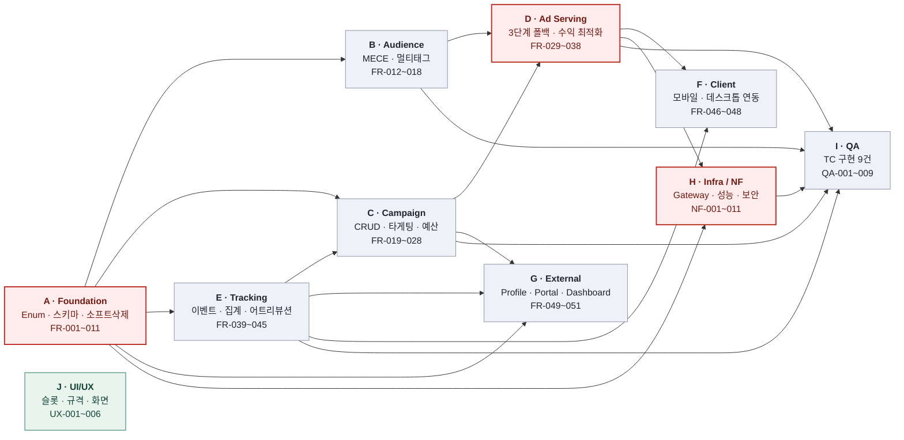
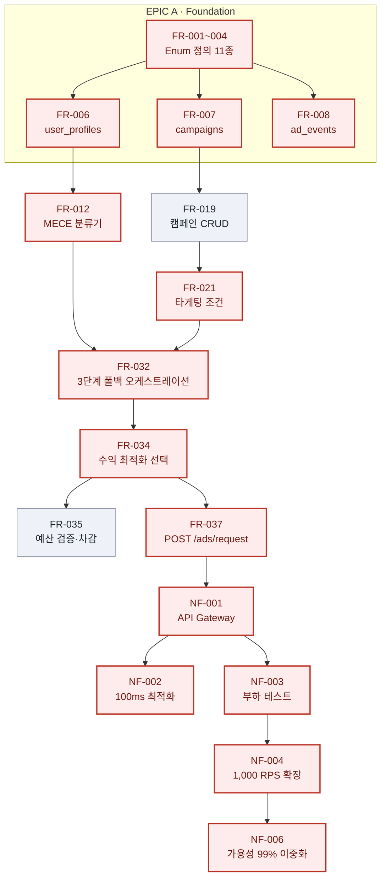
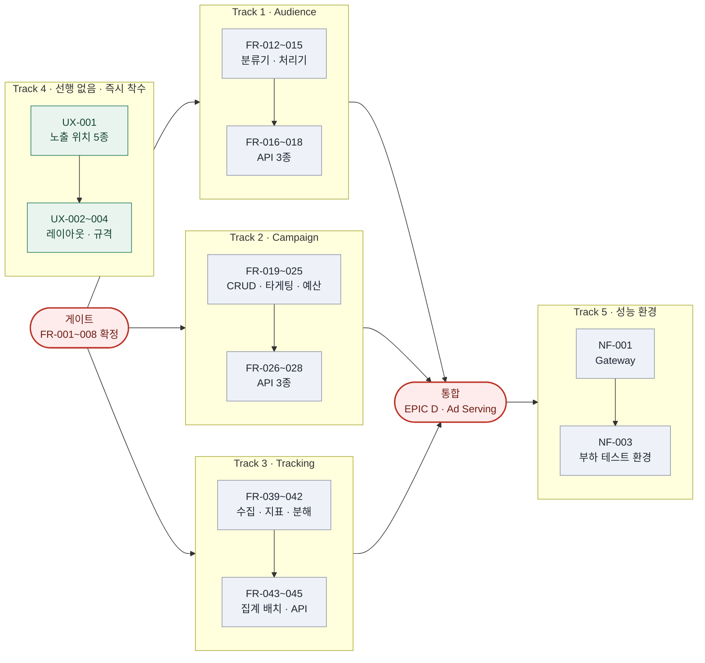
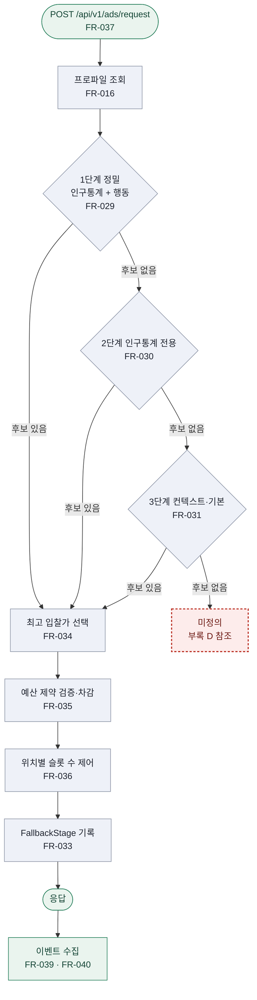
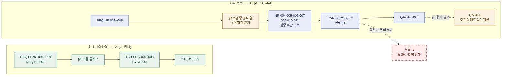

# 개발 태스크 리스트 — AD-Core-Platform MVP

**출처 문서:** SRS-ADTECH-MVP-001 v1.0 (`reference/SRS-example-AD-Core-Platform.md`)
**표준:** ISO/IEC/IEEE 29148:2018
**작성 관점:** Technical Project Manager / System Architect
**총 태스크:** 82건 — FR 51 · NF 11 · QA 14 · UX 6

---

## 0. 도출 원칙

| 원칙 | 적용 |
| --- | --- |
| **SRS 명시 범위만** | 원문에 문장·표·enum·스키마·규칙으로 존재하는 항목만 태스크화. §7 향후 개선 사항은 제외 |
| **관점 분리** | `FR/NF/QA` = 백엔드·프론트엔드·인프라 개발 / `UX` = UI·UX 디자인. ID 접두어로 분리 |
| **최소 실행 단위** | 단일 담당자가 착수·완료·검증할 수 있는 Feature 단위로 분해. 원문의 복합 조항(REQ-FUNC-003)은 분리 |
| **추적성 유지** | 모든 태스크에 SRS 섹션 및 §5 추적성 매트릭스의 구현 클래스명을 연결 |
| **커버리지 증명** | 정방향(요구사항→태스크)·역방향(태스크→근거)·검증(요구사항→TC) 3축으로 누락 검사. 부록 B |

### ID 체계

| 접두어 | 관점 | 범위 |
| --- | --- | --- |
| `FR-` | 기능 개발 (백엔드/프론트엔드) | FR-001 ~ FR-051 |
| `NF-` | 비기능 · 인프라 · 보안 | NF-001 ~ NF-011 |
| `QA-` | 검증 · 테스트 케이스 구현 | QA-001 ~ QA-014 |
| `UX-` | UI/UX 디자인 | UX-001 ~ UX-006 |

---

## EPIC A · Foundation (공통 기반)

> 4개 서비스 전체의 선행 조건. §6.2 데이터 모델과 §6.4 스키마가 확정되지 않으면 어떤 서비스도 착수할 수 없다.

| Task ID | Epic (도메인) | Feature (기능명) | 관련 SRS 섹션 | 선행 태스크 (Dependencies) | 복잡도 (H/M/L) |
|---|---|---|---|---|---|
| FR-001 | Foundation | 인구통계 Enum 정의 (AgeSegment / IncomeSegment / GeographySegment) | 6.2 데이터 모델 · REQ-FUNC-001 | None | L |
| FR-002 | Foundation | 행동 신호 Enum 정의 (PurchaseIntent / EngagementBehavior / DevicePreference) | 6.2 데이터 모델 · REQ-FUNC-002 | None | L |
| FR-003 | Foundation | 캠페인 Enum 정의 (BiddingStrategy / CampaignStatus) | 6.2 데이터 모델 · REQ-FUNC-003 | None | L |
| FR-004 | Foundation | 노출·이벤트 Enum 정의 (AdPosition / EventType / FallbackStage) | 6.2 데이터 모델 · REQ-FUNC-004·006·008 | None | L |
| FR-005 | Foundation | Enum 확장 패턴 설계 (신규 값 추가 시 코드 변경 최소화) | REQ-NF-005 · 6.2 | FR-001, FR-002, FR-003, FR-004 | M |
| FR-006 | Foundation | DB 스키마 구축 — `user_profiles` / `user_behavioral_signals` | 6.4 스키마 개요 · REQ-FUNC-001·002 | FR-001, FR-002 | M |
| FR-007 | Foundation | DB 스키마 구축 — `campaigns` / `campaign_targeting`(비정규화) / `campaign_creatives` | 6.4 스키마 개요 · REQ-FUNC-003 | FR-003 | M |
| FR-008 | Foundation | DB 스키마 구축 — `ad_events` (대용량 파티셔닝) | 6.4 스키마 개요 · REQ-FUNC-008 · REQ-NF-002 | FR-004 | H |
| FR-009 | Foundation | DB 스키마 구축 — `campaign_performance_realtime` (구체화 뷰) | 6.4 스키마 개요 · 6.3 규칙 8 | FR-008 | H |
| FR-010 | Foundation | 공통 소프트 삭제 컴포넌트 `SoftDeleteService` (`deleted_at` 갱신 + 조회 제외 필터) | REQ-FUNC-007 · 6.3 규칙 5 · §5 | FR-006, FR-007, FR-008 | M |
| FR-011 | Foundation | 4개 서비스 전체에 소프트 삭제 적용 및 데이터 무결성·이력 보존 검증 | REQ-FUNC-007 · §5 (All Services) | FR-010 | M |

---

## EPIC B · Audience Service

| Task ID | Epic (도메인) | Feature (기능명) | 관련 SRS 섹션 | 선행 태스크 (Dependencies) | 복잡도 (H/M/L) |
|---|---|---|---|---|---|
| FR-012 | Audience Service | MECE 복합 세그먼트 분류기 `DemographicSegmentClassifier` (연령×소득×지역 36조합) | REQ-FUNC-001 · 6.3 규칙 1 · §5 | FR-001, FR-006 | H |
| FR-013 | Audience Service | 세그먼트 식별자 포맷 생성·파싱 (`AGE_XX_INCOME_XX_GEOGRAPHY_XX`) | REQ-FUNC-001 · 1.3 정의 | FR-012 | L |
| FR-014 | Audience Service | MECE 제약 강제 — 차원별 정확히 1값, 중복·누락 차단 | REQ-FUNC-001 · 6.3 규칙 1 | FR-012 | M |
| FR-015 | Audience Service | 멀티 태그 행동 신호 처리기 `BehavioralSignalProcessor` (카테고리 간 복수 태그) | REQ-FUNC-002 · 6.3 규칙 2 · §5 | FR-002, FR-006 | H |
| FR-016 | Audience Service | API — `GET /api/v1/audience/profiles/{userId}` 프로파일 조회 | 6.1 API 목록 | FR-012, FR-015 | M |
| FR-017 | Audience Service | API — `POST /api/v1/audience/profiles/{userId}/segments` 세그먼트 갱신 | 6.1 API 목록 | FR-012, FR-014 | M |
| FR-018 | Audience Service | API — `POST /api/v1/audience/profiles/{userId}/behavioral-signals` 행동 신호 추가 | 6.1 API 목록 | FR-015 | M |

---

## EPIC C · Campaign Service

> 원문 REQ-FUNC-003은 "생성 · 타게팅 조건 설정 · 예산 관리"를 한 조항에 담고 있어 단일성 위반이다. 진척 측정이 가능하도록 FR-019 / FR-021 / FR-022로 분리했다.

| Task ID | Epic (도메인) | Feature (기능명) | 관련 SRS 섹션 | 선행 태스크 (Dependencies) | 복잡도 (H/M/L) |
|---|---|---|---|---|---|
| FR-019 | Campaign Service | 캠페인 CRUD `CampaignManager` | REQ-FUNC-003 · §5 | FR-007 | H |
| FR-020 | Campaign Service | 캠페인 상태 전이 관리 (DRAFT → ACTIVE → PAUSED → COMPLETED) | REQ-FUNC-003 · 6.2 CampaignStatus | FR-003, FR-019 | M |
| FR-021 | Campaign Service | 타게팅 조건 설정·저장 (인구통계 + 행동 조건) | REQ-FUNC-003 · 1.2 범위 | FR-001, FR-002, FR-019 | H |
| FR-022 | Campaign Service | 예산 관리 — 총예산·일일 상한 설정 및 잔액 추적 | REQ-FUNC-003 · 6.3 규칙 7 | FR-019 | H |
| FR-023 | Campaign Service | 예산 소진 시 캠페인 자동 일시중지 | 6.3 규칙 7 · REQ-FUNC-003 | FR-020, FR-022 | M |
| FR-024 | Campaign Service | 입찰 전략 설정 (CPC / CPM / CPA) | 6.2 BiddingStrategy · REQ-FUNC-005 | FR-003, FR-019 | M |
| FR-025 | Campaign Service | 크리에이티브 자산 등록·관리 | 6.4 `campaign_creatives` | FR-007, FR-019 | M |
| FR-026 | Campaign Service | API — `POST /api/v1/campaigns` 신규 캠페인 생성 | 6.1 API 목록 | FR-019 | M |
| FR-027 | Campaign Service | API — `PUT /api/v1/campaigns/{campaignId}/targeting` 타게팅 갱신 | 6.1 API 목록 | FR-021 | M |
| FR-028 | Campaign Service | API — `GET /api/v1/campaigns/{campaignId}/performance` 성과 조회 | 6.1 API 목록 | FR-019, FR-041 | M |

---

## EPIC D · Ad Serving Engine

| Task ID | Epic (도메인) | Feature (기능명) | 관련 SRS 섹션 | 선행 태스크 (Dependencies) | 복잡도 (H/M/L) |
|---|---|---|---|---|---|
| FR-029 | Ad Serving Engine | 1단계 정밀 타게팅 후보 조회 (인구통계 + 행동 신호) | REQ-FUNC-004 1단계 | FR-016, FR-021 | H |
| FR-030 | Ad Serving Engine | 2단계 인구통계 전용 후보 조회 | REQ-FUNC-004 2단계 | FR-016, FR-021 | M |
| FR-031 | Ad Serving Engine | 3단계 컨텍스트·기본 광고 후보 조회 (위치 기반) | REQ-FUNC-004 3단계 · 6.2 FallbackStage | FR-004, FR-021 | M |
| FR-032 | Ad Serving Engine | 3단계 폴백 오케스트레이션 `ThreeStageRecommendationEngine` (1→2→3 순서 보장) | REQ-FUNC-004 · 6.3 규칙 3 · §5 | FR-029, FR-030, FR-031 | H |
| FR-033 | Ad Serving Engine | 폴백 단계 기록 — `FallbackStage`를 응답·로그에 부착 (성과 분석용) | 6.2 FallbackStage · REQ-FUNC-004 | FR-004, FR-032 | L |
| FR-034 | Ad Serving Engine | 수익 최적화 캠페인 선택 `YieldOptimizer` (타게팅 조건 내 최고 입찰가) | REQ-FUNC-005 · 6.3 규칙 4 · §5 | FR-024, FR-032 | H |
| FR-035 | Ad Serving Engine | 예산 제약 검증 및 차감 연동 | REQ-FUNC-005 · 6.3 규칙 4·7 | FR-022, FR-034 | H |
| FR-036 | Ad Serving Engine | 노출 위치별 광고 슬롯 수 제어 `PositionBasedAdSelector` | REQ-FUNC-006 · 6.2 AdPosition · §5 | FR-004, FR-034 | M |
| FR-037 | Ad Serving Engine | API — `POST /api/v1/ads/request` 3단계 폴백 포함 광고 요청 | 6.1 API 목록 | FR-032, FR-034, FR-036 | H |
| FR-038 | Ad Serving Engine | API — `POST /api/v1/ads/events/click` 클릭 이벤트 추적 | 6.1 API 목록 | FR-004 | M |

---

## EPIC E · Tracking Service

| Task ID | Epic (도메인) | Feature (기능명) | 관련 SRS 섹션 | 선행 태스크 (Dependencies) | 복잡도 (H/M/L) |
|---|---|---|---|---|---|
| FR-039 | Tracking Service | 이벤트 수집·저장 (IMPRESSION / CLICK / CONVERSION) | REQ-FUNC-008 · 6.2 EventType | FR-008 | H |
| FR-040 | Tracking Service | API — `POST /api/v1/tracking/events` 대용량 일괄 수집 | 6.1 API 목록 · REQ-NF-002 | FR-039 | H |
| FR-041 | Tracking Service | 성과 지표 산출 `PerformanceTracker` (CTR / CPC / eCPM) | REQ-FUNC-008 · §5 | FR-039 | H |
| FR-042 | Tracking Service | 인구통계 세그먼트·행동 태그 기준 지표 분해 집계 | REQ-FUNC-008 | FR-012, FR-015, FR-041 | H |
| FR-043 | Tracking Service | 5분 주기 실시간 집계 배치 (구체화 뷰 갱신) | 6.3 규칙 8 | FR-009, FR-041 | M |
| FR-044 | Tracking Service | Last-click 어트리뷰션 처리 | 6.3 규칙 6 · REQ-FUNC-008 | FR-039 | H |
| FR-045 | Tracking Service | API — `GET /api/v1/tracking/campaigns/{campaignId}/metrics` 실시간 지표 조회 | 6.1 API 목록 | FR-041, FR-043 | M |

---

## EPIC F · Client Integration (웹/모바일 분리 API)

| Task ID | Epic (도메인) | Feature (기능명) | 관련 SRS 섹션 | 선행 태스크 (Dependencies) | 복잡도 (H/M/L) |
|---|---|---|---|---|---|
| FR-046 | Client Integration | 모바일 웹 앱 연동 엔드포인트 (`api.adtech.example.com/mobile`) | 1.2 범위 · 3 시스템 맥락 | FR-037 | M |
| FR-047 | Client Integration | 데스크톱 웹 앱 연동 엔드포인트 (`api.adtech.example.com/desktop`) | 1.2 범위 · 3 시스템 맥락 | FR-037 | M |
| FR-048 | Client Integration | 클라이언트 측 노출·클릭 이벤트 전송 모듈 | 3 시스템 맥락 · REQ-FUNC-008 | FR-038, FR-040 | M |

---

## EPIC G · External System Integration

| Task ID | Epic (도메인) | Feature (기능명) | 관련 SRS 섹션 | 선행 태스크 (Dependencies) | 복잡도 (H/M/L) |
|---|---|---|---|---|---|
| FR-049 | External Integration | User Profile Service 연동 (프로필 원천 데이터 수신) | 3 외부 시스템 | FR-006 | H |
| FR-050 | External Integration | Advertiser Portal 연동 인터페이스 | 3 외부 시스템 | FR-026, FR-027, FR-028 | M |
| FR-051 | External Integration | Logging & Performance Dashboard System 연동 | 3 외부 시스템 | FR-045 | M |

---

## EPIC H · Non-Functional / Infrastructure

| Task ID | Epic (도메인) | Feature (기능명) | 관련 SRS 섹션 | 선행 태스크 (Dependencies) | 복잡도 (H/M/L) |
|---|---|---|---|---|---|
| NF-001 | Infra / Gateway | API Gateway 구축 + `PerformanceMonitor` 계측 | REQ-NF-001 · §5 (API Gateway) | FR-037 | H |
| NF-002 | Performance | E2E 응답시간 최적화 — 차원 조회 포함 95% 시나리오 100ms 이하 | REQ-NF-001 | NF-001, FR-037 | H |
| NF-003 | Performance / QA | 부하 테스트 프로그램 구축 (차원 쿼리 포함) | REQ-NF-001 검증 방식 | NF-001 | H |
| NF-004 | Scalability | 1,000+ RPS 처리 — 서비스 간 수직·수평 확장 구성 | REQ-NF-002 | NF-003 | H |
| NF-005 | Scalability / QA | 다중 서비스 아키텍처 기반 부하 테스트 프로그램 | REQ-NF-002 검증 방식 | NF-003 | M |
| NF-006 | Reliability | 가용성 99% — 서비스 수준 이중화 구성 (연 다운타임 ≤ 3.65일) | REQ-NF-003 | NF-004 | H |
| NF-007 | Reliability / Ops | 마이크로서비스 전반 모니터링 및 SLA 검증 체계 | REQ-NF-003 검증 방식 | NF-006 | M |
| NF-008 | Security | 전체 API 기본 인증 적용 | REQ-NF-004 | NF-001 | H |
| NF-009 | Security | 인가 처리 — 비인가 접근 차단 | REQ-NF-004 | NF-008 | H |
| NF-010 | Security / QA | 보안 감사 및 접근 제어 테스트 | REQ-NF-004 검증 방식 | NF-009 | M |
| NF-011 | Maintainability | Enum 확장성 코드 리뷰 및 확장성 테스트 | REQ-NF-005 검증 방식 | FR-005 | L |

---

## EPIC I · QA · 추적성 (§5 테스트 케이스 구현)

| Task ID | Epic (도메인) | Feature (기능명) | 관련 SRS 섹션 | 선행 태스크 (Dependencies) | 복잡도 (H/M/L) |
|---|---|---|---|---|---|
| QA-001 | QA | `TC-FUNC-001` — MECE 준수 테스트 + 차원 커버리지 검증 | §5 · REQ-FUNC-001 검증 방식 | FR-012, FR-013, FR-014 | M |
| QA-002 | QA | `TC-FUNC-002` — 태그 할당 테스트 + 다중 카테고리 검증 | §5 · REQ-FUNC-002 검증 방식 | FR-015, FR-018 | M |
| QA-003 | QA | `TC-FUNC-003` — 캠페인 CRUD 테스트 + 타게팅 로직 검증 | §5 · REQ-FUNC-003 검증 방식 | FR-019, FR-021, FR-022 | M |
| QA-004 | QA | `TC-FUNC-004` — 폴백 순서 테스트 + 단계 검증 | §5 · REQ-FUNC-004 검증 방식 | FR-032, FR-033 | H |
| QA-005 | QA | `TC-FUNC-005` — 입찰 최적화 테스트 + 수익 검증 | §5 · REQ-FUNC-005 검증 방식 | FR-034, FR-035 | H |
| QA-006 | QA | `TC-FUNC-006` — 위치 기반 테스트 + 슬롯 수 검증 | §5 · REQ-FUNC-006 검증 방식 | FR-036 | M |
| QA-007 | QA | `TC-FUNC-007` — 삭제 로직 테스트 + 데이터 무결성 검증 | §5 · REQ-FUNC-007 검증 방식 | FR-010, FR-011 | M |
| QA-008 | QA | `TC-FUNC-008` — 지표 정확성 테스트 + 어트리뷰션 검증 | §5 · REQ-FUNC-008 검증 방식 | FR-041, FR-042, FR-044 | H |
| QA-009 | QA | `TC-NF-001` — E2E 응답시간 성능 검증 | §5 · REQ-NF-001 검증 방식 | NF-002, NF-003 | H |
| QA-010 | QA | `TC-NF-002`† — 1,000+ RPS 처리량 검증 (다중 서비스 부하) | §4.2 REQ-NF-002 검증 방식 | NF-004, NF-005 | H |
| QA-011 | QA | `TC-NF-003`† — 가용성 99% 검증 (연 다운타임 ≤ 3.65일 · 이중화 동작) | §4.2 REQ-NF-003 검증 방식 | NF-006, NF-007 | M |
| QA-012 | QA | `TC-NF-004`† — 인증 적용 및 비인가 접근 차단 검증 | §4.2 REQ-NF-004 검증 방식 | NF-009, NF-010 | H |
| QA-013 | QA | `TC-NF-005`† — Enum 확장성 검증 (신규 값 추가 시 변경 범위 측정) | §4.2 REQ-NF-005 검증 방식 | FR-005, NF-011 | L |
| QA-014 | QA | §5 추적성 매트릭스 갱신 — TC-NF-002~005 행 및 담당 모듈 등재 | §5 · REQ-NF-002~005 | QA-010, QA-011, QA-012, QA-013 | L |

> **† 4건은 §5 추적성 매트릭스에 존재하지 않는 TC ID로, 본 문서에서 신설했다.**
> 도출 근거는 §4.2 **검증 방식 열**이다 — 원문이 검증 수단(부하 테스트 프로그램 / 모니터링 및 SLA 검증 /
> 보안 감사 및 접근 제어 테스트 / 코드 리뷰 및 확장성 테스트)을 명시하고 있어 케이스 도출이 가능하다.
> 누락된 것은 **ID와 §5 등재**이며, 그 복구가 QA-014다.
>
> **NF- 태스크와의 관계 — 중복이 아니다.** `NF-005·007·010·011`은 검증 **수단**(환경·도구·체계)의 구축이고,
> `QA-010~013`은 그 수단으로 실행하는 **케이스 정의 및 합격 판정**이다.
> 기존 `NF-003`(부하 테스트 프로그램) ↔ `QA-009`(TC-NF-001)와 동일한 분리 방식을 따른다.
>
> **합격 기준은 4건 모두 원문에 없다.** 특히 REQ-NF-002의 인수 기준 *"1k+ RPS를 처리할 수 있어야 한다"* 에는
> **유지해야 할 응답 시간**이 빠져 있어 그대로는 불합격을 낼 수 없다. 각 TC의 통과선 확정은 부록 D에 선행 과제로 기록했다.

---

## EPIC J · UI/UX 디자인 (개발 관점과 분리)

> SRS는 UI 요구사항을 별도 조항으로 규정하지 않는다. 아래 태스크는 §3 클라이언트 애플리케이션과 §6.2 `AdPosition`에서 도출 가능한 범위에 한정한다.
> **UX-005 · UX-006 주의** — Advertiser Portal과 Logging & Performance Dashboard System은 §3에서 **외부 시스템**으로 분류되어 있다. 화면 설계가 본 프로젝트 범위인지 **착수 전 확정 필요**.

| Task ID | Epic (도메인) | Feature (기능명) | 관련 SRS 섹션 | 선행 태스크 (Dependencies) | 복잡도 (H/M/L) |
|---|---|---|---|---|---|
| UX-001 | UI/UX Design | 광고 노출 위치 5종 배치 정의 (MAIN_TOP / MIDDLE / BOTTOM / LEFT_SIDEBAR / RIGHT_SIDEBAR) | 6.2 AdPosition · REQ-FUNC-006 | None | M |
| UX-002 | UI/UX Design | 모바일 웹 광고 슬롯 반응형 레이아웃 | 3 클라이언트 애플리케이션 · REQ-FUNC-006 | UX-001 | M |
| UX-003 | UI/UX Design | 데스크톱 웹 광고 슬롯 레이아웃 | 3 클라이언트 애플리케이션 · REQ-FUNC-006 | UX-001 | M |
| UX-004 | UI/UX Design | 위치별 크리에이티브 규격 정의 (사이즈·형식) | 6.4 `campaign_creatives` · REQ-FUNC-006 | UX-001 | M |
| UX-005 | UI/UX Design | 캠페인 관리 화면 설계 (생성 · 타게팅 조건 · 예산) ※범위 확인 필요 | REQ-FUNC-003 · 3 외부 시스템 | None | H |
| UX-006 | UI/UX Design | 캠페인 성과 조회 화면 설계 (세그먼트·태그별 지표) ※범위 확인 필요 | REQ-FUNC-008 · 6.1 · 3 외부 시스템 | UX-005 | H |

---

## 부록 A · 의존 관계도

### A-1. Epic 레벨 의존 그래프

> `J · UI/UX`는 태스크 상 선행 의존이 없어 그래프에서 분리되어 있습니다. **즉시 착수 가능** 구간입니다.
> `E → C` 간선은 FR-028(캠페인 성과 조회 API)이 FR-041(지표 산출)을 선행으로 갖는 데서 발생합니다.

### A-2. 크리티컬 패스 — Feature 레벨

| 구간 | 근거 |
| --- | --- |
| **Enum·스키마 확정** (FR-001~008) | 전체 태스크의 최상위 선행. 미확정 시 병렬 개발 불가 |
| **FR-032 → FR-034 → FR-037** | Ad Serving Engine은 Audience·Campaign 양쪽 산출물이 모두 있어야 통합 가능 |
| **NF-002 이후 체인** | 성능·확장·가용성은 통합 이후에만 측정 가능. 후반 집중 시 회복 불가 |

### A-3. 병렬 착수 트랙

| 트랙 | 태스크 | 착수 조건 |
| --- | --- | --- |
| Track 1 | FR-012 ~ FR-018 (Audience) | FR-001, FR-002, FR-006 완료 |
| Track 2 | FR-019 ~ FR-028 (Campaign) | FR-003, FR-007 완료 |
| Track 3 | FR-039 ~ FR-045 (Tracking) | FR-008 완료 |
| Track 4 | UX-001 ~ UX-004 (디자인) | **선행 없음 — 즉시 착수** |
| Track 5 | NF-003 (부하 테스트 환경) | NF-001 완료 후 **조기 착수 권장** |

> 일정(기간·날짜) 기반 간트 차트는 작성하지 않았습니다. SRS에 공정 기간·인력 배정 정보가 없어
> 임의 추정 없이는 산출할 수 없습니다 — 도출 원칙("SRS 명시 범위만")에 따른 제외입니다.

### A-4. 3단계 폴백 처리 흐름 (FR-029 ~ FR-037)

> **점선 붉은 노드**는 SRS에 동작이 규정되지 않은 지점입니다(3단계에서도 후보가 없는 경우).
> 각 단계의 실패 판정 기준 역시 미정의이며, 부록 D에 미결 항목으로 기록했습니다.

---

## 부록 B · 요구사항 커버리지 검증

> 태스크 리스트가 **누락 없이** 도출되었음을 증명하는 절이다. 세 방향으로 검증한다.
> ① 정방향 — 모든 요구사항이 태스크로 전개되었는가 ② 역방향 — 근거 없는 태스크가 없는가 ③ 검증 — 각 요구사항에 합격 판정 수단이 있는가

### B-1. 정방향 커버리지 — 요구사항 → 태스크 (13 / 13 · 100%)

| 요구사항 ID | 우선순위 | 전개된 태스크 | 태스크 수 | 커버 |
| --- | --- | --- | --- | --- |
| REQ-FUNC-001 | Must | FR-001, FR-006, FR-012, FR-013, FR-014, QA-001 | 6 | ✅ |
| REQ-FUNC-002 | Must | FR-002, FR-006, FR-015, FR-018, QA-002 | 5 | ✅ |
| REQ-FUNC-003 | Must | FR-003, FR-007, FR-019, FR-020, FR-021, FR-022, FR-023, FR-026, FR-027, QA-003 | 10 | ✅ |
| REQ-FUNC-004 | Must | FR-004, FR-029, FR-030, FR-031, FR-032, FR-033, QA-004 | 7 | ✅ |
| REQ-FUNC-005 | Must | FR-024, FR-034, FR-035, QA-005 | 4 | ✅ |
| REQ-FUNC-006 | Should | FR-036, UX-001, UX-002, UX-003, UX-004, QA-006 | 6 | ✅ |
| REQ-FUNC-007 | Should | FR-010, FR-011, QA-007 | 3 | ✅ |
| REQ-FUNC-008 | Must | FR-008, FR-028, FR-039, FR-040, FR-041, FR-042, FR-043, FR-044, FR-045, QA-008 | 10 | ✅ |
| REQ-NF-001 | Must | NF-001, NF-002, NF-003, QA-009 | 4 | ✅ |
| REQ-NF-002 | Should | FR-008, FR-040, NF-004, NF-005, QA-010 | 5 | ✅ |
| REQ-NF-003 | Must | NF-006, NF-007, QA-011 | 3 | ✅ |
| REQ-NF-004 | Must | NF-008, NF-009, NF-010, QA-012 | 4 | ✅ |
| REQ-NF-005 | Could | FR-005, NF-011, QA-013 | 3 | ✅ |

**미전개 요구사항 0건.** REQ-FUNC-003·008은 원문이 복합 조항이어서 각각 10개 태스크로 분해되었다.

### B-2. 부속 명세 커버리지 — 요구사항 표 밖의 구성 요소

| SRS 구성 요소 | 원문 항목 수 | 커버된 수 | 매핑 |
| --- | --- | --- | --- |
| §1.2 범위 항목 | 7 | 7 | FR-012 / FR-015 / FR-019·021·022 / FR-032·034 / FR-039~045 / FR-010·011 / FR-046·047 |
| §3 클라이언트 애플리케이션 | 2 | 2 | FR-046(mobile), FR-047(desktop) |
| §3 내부 마이크로서비스 | 4 | 4 | EPIC B / C / D / E |
| §3 외부 시스템 | 3 | 3 | FR-049(User Profile), FR-050(Advertiser Portal), FR-051(Dashboard) |
| §5 구현 클래스 | 9 | 9 | FR-012, FR-015, FR-019, FR-032, FR-034, FR-036, FR-010, FR-041, NF-001 |
| §6.1 API 엔드포인트 | 10 | 10 | FR-016~018, FR-026~028, FR-037, FR-038, FR-040, FR-045 |
| §6.2 Enum 타입 | 11 | 11 | FR-001(3) + FR-002(3) + FR-003(2) + FR-004(3) |
| §6.3 비즈니스 규칙 | 8 | 8 | 아래 B-2a 참조 |
| §6.4 테이블 | 7 | 7 | FR-006(2), FR-007(3), FR-008(1), FR-009(1) |
| **합계** | **61** | **61** | **100%** |

#### B-2a. §6.3 비즈니스 규칙 8건 개별 매핑

| 규칙 | 내용 | 태스크 |
| --- | --- | --- |
| 1 | MECE 준수 — 차원별 정확히 하나 | FR-014 |
| 2 | 멀티 태그 할당 | FR-015 |
| 3 | 폴백 순서 1→2→3 | FR-032 |
| 4 | 수익 최적화 — 최고 입찰가 | FR-034, FR-035 |
| 5 | 소프트 삭제 — 물리 삭제 금지 | FR-010, FR-011 |
| 6 | 어트리뷰션 — Last-click | FR-044 |
| 7 | 예산 관리 — 일일 상한, 소진 시 자동 일시중지 | FR-022, FR-023 |
| 8 | 성과 추적 — 5분 단위 집계 | FR-043 |

### B-3. 역방향 커버리지 — 태스크 → SRS 근거 (82 / 82 · 고아 태스크 0)

제약 조건 *"SRS에 명시되지 않은 기능을 임의로 추가하지 마십시오"* 의 준수 여부를 검증한다.

| 태스크 군 | 건수 | 근거 유형 | 고아 |
| --- | --- | --- | --- |
| FR-001 ~ FR-011 | 11 | §6.2 enum 정의 · §6.4 스키마 · REQ-FUNC-007 · REQ-NF-005 | 0 |
| FR-012 ~ FR-018 | 7 | REQ-FUNC-001·002 · §6.1 · §6.3 규칙 1·2 · §1.3 포맷 정의 | 0 |
| FR-019 ~ FR-028 | 10 | REQ-FUNC-003 · §6.1 · §6.2 CampaignStatus·BiddingStrategy · §6.3 규칙 7 · §6.4 | 0 |
| FR-029 ~ FR-038 | 10 | REQ-FUNC-004·005·006 · §6.1 · §6.2 FallbackStage·AdPosition · §6.3 규칙 3·4 | 0 |
| FR-039 ~ FR-045 | 7 | REQ-FUNC-008 · §6.1 · §6.2 EventType · §6.3 규칙 6·8 | 0 |
| FR-046 ~ FR-051 | 6 | §1.2 범위 · §3 시스템 맥락 및 인터페이스 | 0 |
| NF-001 ~ NF-011 | 11 | REQ-NF-001~005 본문 및 **검증 방식 열** · §5 API Gateway | 0 |
| QA-001 ~ QA-014 | 14 | §5 TC ID(TC-FUNC-001~008, TC-NF-001) · §4.2 검증 방식 열(QA-010~013 †) · §5 갱신(QA-014) | 0 |
| UX-001 ~ UX-006 | 6 | §6.2 AdPosition · §3 클라이언트 애플리케이션 · §6.4 creatives · REQ-FUNC-003·008 | 0 |

**임의 추가 태스크 0건.** §7 향후 개선 사항(RTB·동적 태깅·고급 타게팅)에서 도출한 태스크는 없으며, 부록 C에 제외 근거를 기록했다.

> **단, UX-005·UX-006은 근거 강도가 약하다.** REQ-FUNC-003·008이 기능 요구사항으로 존재하나
> 해당 화면의 소유 주체(Advertiser Portal · Dashboard)가 §3에서 **외부 시스템**으로 분류되어 있다.
> 범위 판정 결과에 따라 삭제 가능한 2건으로 표시했다.

### B-4. 검증 커버리지 — TC 태스크 기준 13 / 13 (100%)

| 요구사항 | TC ID | 출처 | 검증 수단 태스크 | 케이스 태스크 |
| --- | --- | --- | --- | --- |
| REQ-FUNC-001 ~ 008 | TC-FUNC-001 ~ 008 | §5 등재 | — | QA-001 ~ QA-008 |
| REQ-NF-001 | TC-NF-001 | §5 등재 | NF-002, NF-003 | QA-009 |
| REQ-NF-002 | `TC-NF-002` † | **본 문서 신설** (§4.2 검증 방식) | NF-004, NF-005 | QA-010 |
| REQ-NF-003 | `TC-NF-003` † | **본 문서 신설** (§4.2 검증 방식) | NF-006, NF-007 | QA-011 |
| REQ-NF-004 | `TC-NF-004` † | **본 문서 신설** (§4.2 검증 방식) | NF-009, NF-010 | QA-012 |
| REQ-NF-005 | `TC-NF-005` † | **본 문서 신설** (§4.2 검증 방식) | FR-005, NF-011 | QA-013 |

**§5 등재 기준으로는 여전히 9 / 13이다.** 원문 추적성 매트릭스에 4개 행을 추가하는 문서 작업이 `QA-014`이며,
그것이 완료되어야 SRS 자체의 추적성이 복구된다.

**남은 격차는 ID가 아니라 통과선이다.** TC ID는 신설로 메웠으나 4건 모두 **합격 기준이 원문에 없다.**
REQ-NF-002는 유지 응답 시간이, REQ-NF-003은 계획 점검 시간 포함 여부와 측정 주체가,
REQ-NF-004는 인증 방식과 자원 소유자 판정 규칙이, REQ-NF-005는 "최소화"의 정량 기준이 각각 빠져 있다.
**QA-010~013은 착수는 가능하나 통과선 확정 없이는 완료 판정이 불가능하다** — 부록 D 참조.

### B-5. 커버리지 종합

| 검증 축 | 대상 | 커버 | 비율 | 판정 |
| --- | --- | --- | --- | --- |
| 정방향 — 요구사항 전개 | 13 | 13 | 100% | ✅ 통과 |
| 부속 명세 — API·enum·규칙·스키마·인터페이스 | 61 | 61 | 100% | ✅ 통과 |
| 역방향 — 태스크 근거 추적 | 82 | 82 | 100% | ✅ 통과 (고아 0) |
| 검증 — TC 태스크 배정 | 13 | 13 | 100% | ✅ 통과 (4건은 신설 †) |
| 검증 — §5 원문 등재 | 13 | 9 | 69% | ⚠️ **QA-014로 복구 대상** |
| 인수 판정 가능성 — 부록 D 기준 | 13 | 8 | 62% | ⚠️ **통과선 미정의 13항목** |

> 마지막 두 축은 태스크 도출의 결함이 아니라 **원문 SRS의 미완성 상태**에서 비롯된 것이다.
> 태스크는 전개했으나 합격선이 없어 완료 판정이 불가능한 상태이며, 상세는 부록 D에 기록했다.

---

## 부록 C · 범위 외 (Won't Have)

§7 향후 개선 사항에 해당하며 **본 태스크 리스트에서 의도적으로 제외**했다. SRS에 요구사항 조항(REQ ID)이 부여되지 않았으므로 태스크로 도출하지 않는다.

| 항목 | SRS 근거 |
| --- | --- |
| RTB / OpenRTB 연동, DSP·SSP 입찰 통신, 예산 페이싱 | 7.1 |
| 동적 태깅 파이프라인, 규칙·ML 기반 태그 생성 | 7.2 |
| 컨텍스트·행동·리타게팅, 성별·위치정보·요일/시간대 타게팅 | 7.3 |
| Multi-touch 어트리뷰션 | 6.3 규칙 6 (향후 확장) |

---

## 부록 D · 태스크 도출 불가 항목 (착수 전 확정 필요)

아래는 SRS에 값·규칙이 정의되지 않아 **태스크로 확정할 수 없는** 항목이다. 임의 보완 없이 미결로 남긴다.

| 관련 태스크 | 미정의 항목 | 영향 |
| --- | --- | --- |
| FR-036 | REQ-FUNC-006의 "정의된 슬롯 수" — 위치별 슬롯 수 표가 원문에 없음 | 인수 기준 판정 불가 |
| FR-013 | 세그먼트 포맷이 §1.3(`AGE_25_34_MID_URBAN`)과 §4.1(`AGE_XX_INCOME_XX_GEOGRAPHY_XX`)에서 불일치 | 구현 분기 발생 |
| FR-001 | `IncomeSegment` 금액 단위(통화) 미표기 | 분류 기준 확정 불가 |
| FR-012, FR-014 | 차원 값 미상 사용자의 분류 대상 (enum에 `UNKNOWN` 없음) | MECE 전체 포괄 원칙 성립 불가 |
| FR-032 | 각 폴백 단계의 실패 판정 기준, 3단계 실패 시 응답 | 단계 통계 비교 불가 |
| FR-034 | 입찰가 동점 시 선택 규칙 | 구현 임의성 발생 |
| FR-035 | 예산 확인·차감의 동시성 처리 방식 | 초과 집행 위험 |
| FR-043, FR-045 | REQ-FUNC-008 "실시간"과 §6.3 규칙 8 "5분 주기"의 정의 충돌 | 인수 기준 상충 |
| FR-044 | 어트리뷰션 윈도우(인정 기간) | 정산 기준 미확정 |
| NF-002, QA-009 | REQ-NF-001의 측정 구간·부하 조건·데이터 조건·캐시 상태 | 성능 검증 불가 |
| NF-008, NF-009 | REQ-NF-004의 "기본 인증" 구체 방식, 자원 소유자 기준 접근 제어 규칙 | 보안 설계 착수 불가 |
| NF-011 | REQ-NF-005 "코드 변경 최소화"의 정량 기준 | 합격선 부재 |
| QA-010 ~ QA-013 | REQ-NF-002~005의 **합격 기준(통과선)** 미정의. TC ID는 QA-010~013으로 신설했으나 원문에 판정 수치가 없음 — REQ-NF-002는 유지 응답 시간, REQ-NF-003은 계획 점검 시간 포함 여부·측정 주체, REQ-NF-004는 인증 방식·자원 소유자 판정 규칙, REQ-NF-005는 "최소화"의 정량 기준이 각각 부재 | 착수는 가능하나 완료 판정 불가 |
| QA-014 | REQ-NF-002~005가 §5 추적성 매트릭스에 미등재 — 담당 모듈도 미지정 | 원문 추적성 단절 |

---

*근거 문서: SRS-ADTECH-MVP-001 v1.0 · 2025-06-13 · ISO/IEC/IEEE 29148:2018*
