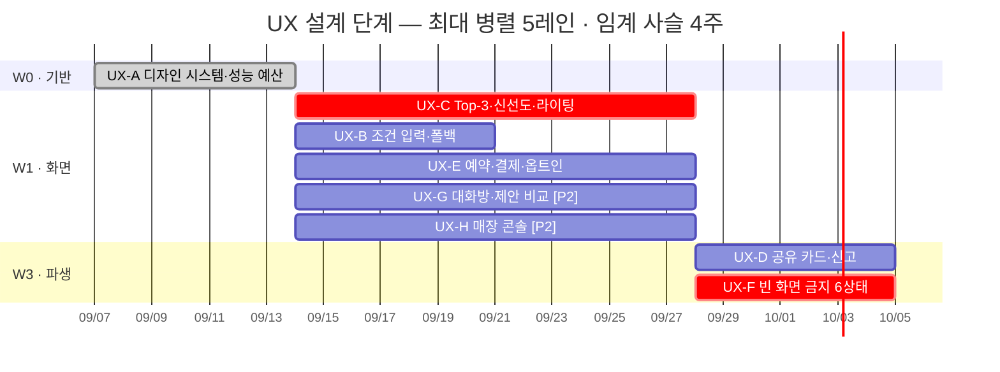

# UX 설계 단계 진행 원장

WAVE: W0
LANES_DONE: 1
LANES_TOTAL: 8
DECISIONS: 0
STOP REASON:

## 웨이브 기록

| 웨이브 | 레인 | 상태 | 합류 게이트 |
| --- | --- | --- | --- |
| W0 | UX-A | DONE | PASS — PM 승인 2026-08-27 |
| W1 | UX-C · UX-B · UX-E · UX-G · UX-H | READY | — |
| W3 | UX-D · UX-F | PENDING | — |

## 계획 대비 실제 Gantt

## 결정 로그

- 결정 없음. UX-001 인정 여부, 접근성 기준, 판정형 어휘 기준, 개인정보 보존 기간은 각 산출물에 `(미정 — 확정 필요)`로 남긴다.
- W0 합류 게이트: UX-A 산출물 형식·금지 어휘 검증을 통과했다. PM이 UX-001을 2026-08-27에 승인했으며, 지도 앱 내 탭 실측은 `CLI-E` 구현 인계로 유지한다.
