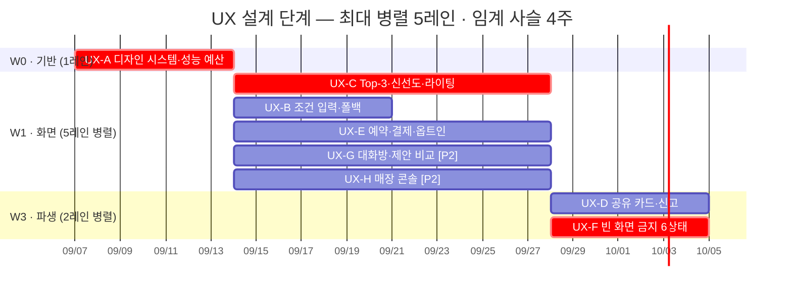

/goal

## 1) 작업 핵심 목표 및 범위
- 목표: UX 설계 태스크 8건(`UX-A`~`UX-H`)의 산출물을 `docs/design/ux/` 아래 문서로 완성하고 해당 GitHub 이슈를 종료한다.
- 시작 지점: `main` 브랜치. 코드는 0줄이며 이 단계는 문서만 만든다. Node 가 설치돼 있지 않다.
- 작업 방식: **오케스트레이션.** 웨이브는 순차, 웨이브 안의 레인은 병렬이다. 규격은 `.claude/skills/103-stage-orchestration/SKILL.md` 를 읽고 그대로 적용한다.
- 작업 대상 — 웨이브 3개 · 레인 8개:
  - `W0` 1레인: `UX-A`(#140)
  - `W1` 5레인 병렬: `UX-C`(#142) `UX-B`(#141) `UX-E`(#144) `UX-G`(#146) `UX-H`(#147)
  - `W3` 2레인 병렬: `UX-D`(#143) `UX-F`(#145)
- 작업 자율성: 사용자 승인 없이 문서 작성·커밋·브랜치 생성·draft PR 생성·이슈 종료·서브에이전트 디스패치까지 진행한다.
  **`main` 머지, force push, 이슈 신규 생성, 프로젝트 필드 스키마 변경은 사용자 확인이 필요하다.**

## 2) 작업 세부 규칙
- 오케스트레이터는 **직접 문서를 쓰지 않는다.** 레인을 디스패치하고 합류 게이트를 검증하고 원장을 갱신한다.
- 레인 디스패치는 `ux-design-system` 서브에이전트로 한다. **한 응답에서 그 웨이브의 전 레인을 동시에 호출한다** — 응답을 나누면 순차가 된다.
- 각 레인에 전달할 것: 태스크 ID · 이슈번호 · 산출 파일 경로 1개 · 규격 스킬 `102-ux-stage-deliverables` · 읽을 선행 산출물.
- 산출물 규격은 `.claude/skills/102-ux-stage-deliverables/SKILL.md` 를 따른다 — 파일 경로, 6개 절 구조, 판정형 어휘 금지 목록.
- **레인 격리** — 레인 1개는 자기 산출 파일 1개만 쓴다. 공유 파일(`WRITING-GUIDE.md` · 원장 · 인덱스)은 웨이브 종료 후 오케스트레이터가 갱신한다.
- **브랜치 1개 = PR 1개 = 웨이브 1개.** 브랜치명 `ux/w0-foundation` · `ux/w1-screens` · `ux/w3-derived`. 레인마다 브랜치를 만들지 않는다.
- `W1` 디스패치 순서는 `UX-C` 를 먼저 놓는다 — 2주로 가장 길고 `UX-D`·`UX-F` 둘의 선행이며 임계 사슬에 있다.
- `UX-G`·`UX-H` 산출물은 `docs/design/ux/phase2/` 에 격리한다. Phase 2 조건부 이월 단위이므로 게이트 미통과 시 그 디렉터리만 통째로 버린다.
- 웨이브 시작 전 선행 웨이브 이슈가 전부 CLOSED 인지 `/task-start` 로 기계 검증한다. 하나라도 OPEN 이면 시작하지 않는다.
- 합류 게이트를 통과해야 다음 웨이브로 간다 — §3 종료 방법의 검증 명령과 같은 것을 웨이브마다 실행한다.
- 레인이 실패하면 **그 레인만** 재시도한다. 같은 레인이 2회 실패하면 웨이브를 중단하고 사유를 원장에 남긴다.
- 진행 원장은 `docs/goals/ux-design-stage-LEDGER.md` 한 파일이며 **오케스트레이터만 쓴다.**
  `WAVE:` `LANES_DONE:` `LANES_TOTAL:` `DECISIONS:` 카운터 줄을 grep 가능하게 유지하고, 웨이브 종료마다 계획 대비 실제 Gantt 를 갱신한다.
- 확정되지 않은 항목(`UX-001` 인정 여부, 접근성 기준, 판정형 어휘 기준, 개인정보 보존 기간)은 문서에 `(미정 — 확정 필요)` 로 명시하고 진행한다. 임의로 정하지 않는다.
- 임의 결정이 필요해질 때마다 원장 결정 로그에 한 줄로 기록하고 `DECISIONS:` 카운터를 올린다.

## 3) 종료 조건 및 종료 방법
- 종료 조건 (아래 중 하나라도 충족되는 순간 루프를 즉시 멈춘다):
  - 이슈 `#140`~`#147` 8건이 전부 CLOSED → STOP REASON: ALL_UX_CLOSED
  - `DECISIONS:` 카운터가 10에 도달 → STOP REASON: DECISION_BUDGET
  - 같은 레인이 2회 실패 → STOP REASON: LANE_FAILED
  - 합류 게이트가 2회 실패 → STOP REASON: JOIN_GATE_FAILED
  - 평가-진행 라운드(turn = /goal 평가자가 진행 상태를 한 번 점검하는 메인 에이전트 응답 사이클)가 누적 30회에 도달 → STOP REASON: TURN_CAP (= or stop after 30 turns)
- 종료 방법:
  1) `docs/goals/ux-design-stage-LEDGER.md` 의 `STOP REASON:` 줄에 원인 코드를 채운다.
  2) `find docs/design/ux -maxdepth 1 -name 'UX-*.md' | wc -l` 을 실행해 `6` 이 보이는 출력을 대화에 남긴다.
  3) `find docs/design/ux/phase2 -name 'UX-*.md' | wc -l` 을 실행해 `2` 가 보이는 출력을 대화에 남긴다.
  4) `grep -rniE '조용|아늑|분위기 (좋|나쁨)|추천|최고|훌륭|괜찮|무난|가성비|인기|핫한|강추|별로' docs/design/ux/ --include='*.md' | grep -v WRITING-GUIDE | wc -l` 을 실행해 `0` 이 보이는 출력을 대화에 남긴다.
  5) `grep -cE '^\| (폴백표시|근거대기|근거생략|유사메뉴대체|제안없음|재시도안내)' docs/design/ux/UX-F-empty-states.md` 를 실행해 `6` 이 보이는 출력을 대화에 남긴다.
  6) `for f in docs/design/ux/UX-*.md docs/design/ux/phase2/UX-*.md; do echo "$f $(grep -cE '^## [1-6]\. ' "$f")"; done` 을 실행해 각 파일이 `6` 인 출력을 대화에 남긴다.
  7) `gh issue list --state open --json number -q '[.[].number] | map(select(. >= 140 and . <= 147)) | length'` 을 실행해 `0` 이 보이는 출력을 대화에 남긴다.
  8) `grep -E '^(WAVE|LANES_DONE|LANES_TOTAL|DECISIONS|STOP REASON):' docs/goals/ux-design-stage-LEDGER.md` 를 실행해 카운터 5줄이 보이는 출력을 대화에 남긴다.
  9) `gh pr list --state open` 을 실행해 이번 루프가 연 웨이브 PR 목록을 대화에 남긴다.

## 4) 기타 제약조건
- 어떤 PR도 `main` 에 머지하지 않는다. force push 하지 않는다.
- 새 GitHub 이슈를 만들지 않는다. 기존 이슈 본문은 `docs/issues-aiplace/tasks/<ID>.md` 를 고친 뒤 `gh issue edit --body-file` 로만 반영한다.
- 다음 파일을 수정하지 않는다:
  `[SRS]ai-place -mate-SRSv1.0.md`, `SRS-ai-place-nextjs-v1.0.md`, `[DIAGRAMS]DESIGN-ai-place-v1.0.md`, `DESIGN-ai-place-nextjs-v1.0.md`, `TASKS-ai-place-v1.0.md`, `EXEC-ai-place-v1.0.md`, `EXEC-ai-place-compressed-v1.0.md`, `docs/issues-aiplace/P*.md`
- `docs/design/ux/`, `docs/goals/ux-design-stage-LEDGER.md`, `docs/issues-aiplace/tasks/UX-*.md` 밖의 파일을 수정하지 않는다.
  단 `.claude/skills/102-ux-stage-deliverables/SKILL.md` 와 `103-stage-orchestration/SKILL.md` 는 규격 보완이 필요할 때 수정할 수 있다.
- `npm`·`pnpm`·`node` 를 호출하지 않는다. 이 환경에 설치돼 있지 않으며 이 단계는 코드를 만들지 않는다.
- 레인을 순차로 돌리지 않는다. 웨이브 안의 레인은 반드시 한 응답에서 동시에 디스패치한다.
- 판정형 어휘를 화면 카피에 쓰지 않는다 (§8.3 규칙 3). 어떤 상태에서도 빈 화면을 설계하지 않는다 (§8.3 규칙 5).

## 5) 계획 Gantt — 원장에서 갱신한다

- `crit` = UX 단계 임계 사슬 `UX-A` → `UX-C` → `UX-F` = **4주.** 5레인을 다 굴려도 이 아래로 안 내려간다.
- `[P2]` = Phase 2 조건부. `docs/design/ux/phase2/` 에 격리한다.
- `UX-F` 는 `UX-B`·`UX-C` 둘의 합류 지점이다. Gantt 에는 최장 선행(`UX-C`)만 표기했다.

## 6) 보고 형식
- 웨이브 PR 본문에 다음을 포함한다:
  - 이 웨이브의 레인 목록과 각 레인이 만든 문서
  - 합류 게이트 검증 결과 (명령 출력)
  - 4대 불변 규칙 중 건드린 것과 어떻게 지켰는지
  - `(미정 — 확정 필요)` 로 남긴 항목과 확정 담당자
  - 대응 `CLI-` 태스크에 인계할 사항
- 웨이브 종료마다 원장의 Gantt 를 `done`·`active` 로 갱신한다.
