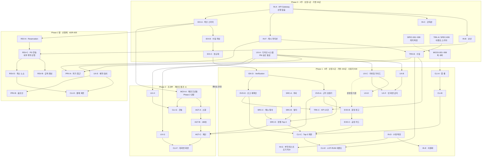

# P4b · 의존 관계 재계산 및 착수 판정

**웨이브:** 제작 순서 15번 (최종) · **전 Phase**
**근거:** `[SRS]ai-place -mate-SRSv1.0.md` v1.9 · **원장** v1.1 · 본문 문서 14종
**정본** [`task-extraction-assessment-aiplace.md`](../task-extraction-assessment-aiplace.md) Step 4

> **이 문서는 새 이슈를 만들지 않는다.** 앞의 14개 문서에서 드러난 사실을 모아
> **① 실제 의존 관계 ② Phase 배분의 성립 여부 ③ 착수 전 확정해야 할 것** 을 판정한다.

## 작성된 문서 전체

| # | 문서 | 이슈 | Phase (라벨 기준) |
| --- | --- | --- | --- |
| 1 | [`P1a-contracts.md`](P1a-contracts.md) | `SPEC-001`~`009` (9) | 0 (7) · **2** (2 — `005`·`006`) |
| 2 | [`P1b-data.md`](P1b-data.md) | `IDX-A`~`E` (5) | 0 (3) · 1 (2) |
| 3 | [`P1c-mock.md`](P1c-mock.md) | `MOCK-001`~`008` (8) | 0 (1) · 1 (5) · **2** (2 — `006`·`008`) |
| 4 | [`P2a-search.md`](P2a-search.md) | `SRC-A`~`D` (4) | 1 |
| 5 | [`P2b-evidence.md`](P2b-evidence.md) | `EVD-A`~`D` (4) | 1 |
| 6 | [`P2c-tracking.md`](P2c-tracking.md) | `TRK-A`~`E` (5) | 0 (2) · 1 (3) |
| 7 | [`P2d-reservation-privacy.md`](P2d-reservation-privacy.md) | `RSV-A`~`D` `PRV-A`~`B` (6) | 1말 |
| 8 | [`P2e-client.md`](P2e-client.md) | `CLI-A`~`E` (5) | 1 (4) · 1말 (1) |
| 9 | [`P2f-ux.md`](P2f-ux.md) | `UX-A`~`F` (6) | 0 (1) · 1 (4) · 1말 (1) |
| 10 | [`P2g-phase2.md`](P2g-phase2.md) | `MCH-A` `AGT-A~C` `CLI-F~G` `UX-G~H` (8) | **2** |
| 11 | [`P3a`](P3a-tests-search.md) · [`P3b`](P3b-tests-evidence.md) · [`P3c`](P3c-tests-phase2-nf.md) | `TEST-001`~`014d` (17) | 0 (1) · 1 (10) · 1말 (3) · **2** (3) |
| 12 | [`P4a-infra.md`](P4a-infra.md) | `IN-A`~`G` (7) | 0 (4) · 1 (3) |

**총 84건** — 원장 50건 + `SPEC-` 9 + `MOCK-` 8 + `TEST-` 17(`TEST-014` 4분할 반영).
정본 §3·§2가 최종 구성으로 기록한 **원장 50 + 신규 34 = 84** 와 일치한다.

---

## 1. 실제 의존 관계도

원장 §5의 도식을 본문 작성 중 드러난 사실로 보정한 것이다.



### 도식에서 보정된 것 — 3건

| # | 원장 v1.1 | 본문 작성 후 |
| --- | --- | --- |
| 1 | `UX-C` → `CLI-C` (구현 선행) | **`UX-C` → `EVD-B` 판정형 기준 의존이 추가** (`P2f` `P2b`) |
| 2 | `TRK-A` 존재 | **`SPEC-009`와 중복** — 하나가 사라져야 한다 (`P2c`) |
| 3 | `IN-F` → `TRK-B` | **`IN-F` → `EVD-D` 캐시 무효화 의존이 추가** (`P4a` 1번) |

**1번이 가장 중요하다.** 디자인 산출물이 백엔드 검증 규격이 되는 의존은 원장에 없었다.
`UX-015` 라이팅 가이드가 지연되면 **`EVD-B` · `CLI-C` · `MCH-A` · `TEST-007` · `TEST-011` 5건이 막힌다.**

---

## 2. Phase 배분 재계산

### 2.1 확장 후 Phase별 건수

이슈 라벨(`phase-0` · `phase-1` · `phase-1-late` · `phase-2`) 기준이다.

| Phase | 원장 50건 기준 | +`SPEC` | +`MOCK` | +`TEST` | **합계** |
| --- | --- | --- | --- | --- | --- |
| **Phase 0** | 10 | 7 (`001`~`004` `007`~`009`) | 1 (`MOCK-001`) | 1 (`TEST-001`) | **19** |
| **Phase 1** | 24 | — | 5 (`002`~`005` `007`) | 10 (`TEST-002`~`008` `014a` `014b` `014d`) | **39** |
| **Phase 1 말** | 8 | — | — | 3 (`TEST-009` `010` `014c`) | **11** |
| **Phase 2** | 8 | 2 (`SPEC-005` `006`) · (`SPEC-010` 신설 시 +1) | 2 (`MOCK-006` `008`) | 3 (`TEST-011`~`013`) | **15** |
| **합계** | 50 | 9 | 8 | 17 | **84** |

> `SPEC-005`·`006`(대화방·제안 계약)과 `MOCK-006`·`008`(대화방·콘솔 Mock)은 **Phase 2에서만 쓰인다.**
> `MOCK-002`~`005`·`007`은 소비처인 클라이언트 태스크와 같은 Phase 1이다.

### 2.2 Phase 0가 10건 → 19건이 됐다

**2주에 19건이다.** 그러나 성격을 보면 다르다.

| 성격 | 건수 | 비고 |
| --- | --- | --- |
| **계약 문서** (`SPEC-`) | 7 | 코드가 아니다. 합의가 산출물 |
| **목 서버** (`MOCK-`) | 1 | 기반 구성만 Phase 0. 나머지 7건은 계약에서 파생 |
| **인프라·데이터** | 10 | 실제 구축 |
| **검증** | 1 | 평가셋 구축 포함 |

**`SPEC-`은 2주 안에 **쓰는** 것이 아니라 **정하는** 것이다.**
`P1a`가 지적한 대로, 계약이 얼어야 Phase 1의 병렬 작업이 가능하다.
**Phase 0의 실질 병목은 인프라 10건이 아니라 계약 합의 7건이다.**

### 2.3 Phase 1의 H 14건 문제 — 미해소

원장 §7이 최대 위험으로 지목한 항목이며 **본 웨이브에서도 해소되지 않았다.**

| 항목 | 값 |
| --- | --- |
| Phase 1 기간 | **8주** |
| Phase 1 태스크 (확장 후) | **39건** |
| 그중 복잡도 H | **14건** |
| `TEST-014a` `014b` `014d` (비기능 4분할 중 3건) | 포함 · `014c`는 Phase 1 말 |

**`TEST-014` 4분할을 적용해 39건이 됐다.** 분할 전 37건 대비 +2이며, 보안·개인정보 묶음이 Phase 1 말로 빠졌다.

원장의 완화 선택지 — `IDX-A` · `SRC-A` · `CLI-C` 분리(53건) — 는 **복잡도를 나눌 뿐 총량을 줄이지 않는다.**
실질 완화는 **Phase 1 범위 축소**이며, 후보는 다음과 같다.

| 후보 | 근거 | 위험 |
| --- | --- | --- |
| `CLI-E`(LCP·RUM) Phase 1 말로 | 게이트 판정에 LCP가 직접 쓰이지 않는다 | 이벤트 계측이 늦어져 KPI 표본 감소 |
| `TRK-E`(비용·단위경제) Phase 1 말로 | 게이트 조건에 없다 | 비용 초과를 늦게 발견 |
| `IN-E`(이중화) Phase 1 말로 | 클로즈드 베타는 500명 | 장애 시 복구 수단 부재 |

**셋 다 위험을 동반한다.** PM 판단 사항으로 남긴다.

### 2.4 Phase 2 이월의 정합성 — 검증됨

축약안 병합 원칙 #1(**Phase 경계를 넘지 않는다**)이 실제로 작동하는지 확인했다.

**Phase 2 15건을 전부 제거해도 Phase 1이 완결되는가?**

| 검사 항목 | 결과 |
| --- | --- |
| Phase 1 태스크가 Phase 2를 선행으로 갖는가 | **`UX-F` 하나 있었으나 v1.1에서 정정** ✓ |
| `RSV-A`의 `proposalId` 참조 | **`Proposal`이 Phase 2 · 미정 항목으로 남음** ⚠ |
| `TRK-E`의 `FR-082` 심사 FTE | **`MCH-A`가 Phase 2 · 모순 미해소** ⚠ |
| `UX-F`의 제안 0건 회귀 | Phase 2 발동 시 적용 · Phase 1 화면은 완결 ✓ |
| `TEST-014`의 Phase 배치 | **4분할로 해소** — `TEST-014c`(보안·개인정보)만 `phase-1-late` ✓ |

**2건이 남아 있다.** 둘 다 원장 부록 C에 기록됐고 PM 확정 대기 중이다. 세 번째였던 `TEST-014`는 분할로 해소됐다.

> `TEST-014`는 `phase-1`이면서 선행 `PRV-A`·`PRV-B`·`RSV-C`(`phase-1-late`)를 기다려 **Phase 1 안에서 판정을 끝낼 수 없었다.**
> `REQ-NF` 32건을 성격별 4묶음으로 나누고 보안·개인정보 10건을 `TEST-014c`로 분리해 Phase를 맞췄다. 배정 누락·중복은 0건이다.

---

## 3. 착수 전 확정해야 할 항목 — 전 문서 통합

본문 14개 문서에서 드러난 미정 항목을 **성격별로** 모았다.

### 3.1 착수를 막는 것 — 12건

| # | 항목 | 막는 대상 | 담당 | 출처 |
| --- | --- | --- | --- | --- |
| 1 | **`SPEC-008` `STALE` 후보 유효성** | `EVD-A` `TEST-006` + 네 소비처 | 개발팀 리드 | P1a·P2b·P3b |
| 2 | **판정형 어휘 기준** (`UX-015`) | `EVD-B` `CLI-C` `MCH-A` `TEST-007` `TEST-011` | PM + 디자인 | P2b·P2f·P3b |
| 3 | **정규화 평가셋** (92% 정답셋) | `IDX-C` `TEST-001` · **Phase 0 게이트** | PM + 데이터 | P1b·P3a |
| 4 | **예산 판정 기준값** | `SRC-B` `TEST-002` | PM | P2a·P3a |
| 5 | **정렬 동점 규칙** | `SRC-D` · §1.1 원칙 검증 | 개발팀 리드 | P2a |
| 6 | **방문 확인·노쇼 판정·정산 규칙** | `RSV-D` `TEST-010` | PM + 사업팀 | P2d·P3b |
| 7 | **PG사 선정 · 멱등키 규약** | `RSV-C` + 후행 8건 | 사업 계약 | P2d·P3b |
| 8 | **세션 정의 · 제외 트래픽** | `TRK-B` + **KPI 12건 전부** | 개발팀 리드 + PM | P2c |
| 9 | **기준선 15건 실측** | `TRK-C` · **게이트 판정** | PM (Phase 0 종료 시) | P2c |
| 10 | **인앱 브라우저 제약 실측** | `CLI-A` `CLI-C` `CLI-D` `PRV-B` `AGT-B` | 개발팀 리드 | P2e·P2g |
| 11 | **캐시 무효화 경로** | `IN-F` `EVD-D` — `REQ-FUNC-013` 충족 불가 | 개발팀 리드 | P4a |
| 12 | **소환 선정 · 적합도 산출식 · 가중치 하향** | `AGT-A` `AGT-C` `TEST-012` `TEST-013` | PM | P2g·P3c |

### 3.2 계획·구조 확정 — 6건

| # | 항목 | 영향 | 담당 |
| --- | --- | --- | --- |
| 13 | **`SPEC-009` ↔ `TRK-A` 중복 해소** | 원장 건수 변동 | 개발팀 리드 |
| 14 | **`SPEC-010` 콘솔 API 계약 신설** | Phase 2 직렬화 방지 | 개발팀 리드 |
| 15 | **`FR-082` Phase 모순** (온보딩 P1 ↔ 프로필 등록 P2) | `TRK-E` `MCH-A` | PM |
| 16 | **`UX-001` 인정 여부** (SRS 근거 없는 유일 항목) | `UX-A` 착수 | PM |
| 17 | **`TEST-014` 분할** — **완료.** `014a`~`014d` 4건으로 분할 | 81 → 84건 | — |
| 18 | **3,000 RPS 적용 시점** (Phase 1은 사용자 500명) | `IN-D` `IN-G` 비용 | PM |

### 3.3 법령·정책 — 3건

| # | 항목 | 담당 |
| --- | --- | --- |
| 19 | **백업본의 개인정보 파기 처리** — RPO 5분 체계와 30일 파기의 충돌 | PM + 법무 |
| 20 | **동의 이력 저장 위치** — 서버에 남기면 단말 저장 원칙과 충돌 | PM + 법무 |
| 21 | **§8.6.5 보존 기간 상세** — 없으면 `UX-E` 동의 카피를 쓸 수 없다 | PM + 법무 |

### 3.4 일괄 규약으로 해소 가능 — 1건

| # | 항목 | 대체하는 개별 미정 |
| --- | --- | --- |
| 22 | **임계값 경계 규약** — "모든 임계값은 이하/이상을 포함한다" | 파싱 실패율 3% · 누락률 5% · 신선도 90일 · 취소 2시간 · 예산 기준값 · 수용 조건 상한 · 유사도 기준 — **최소 7건** |

**22번이 가장 효율이 높다.** 개별 확정은 7번의 논의가 필요하지만 규약 하나로 정리된다.

---

## 4. 판정 — 지금 착수 가능한 것

### 4.1 확정 없이 착수 가능 — **즉시**

| 대상 | 근거 |
| --- | --- |
| **`IN-A`** API Gateway | 선행 없음 · 미정 항목이 레이트 리밋뿐(후속 추가 가능) |
| **`SPEC-001`~`009`** 계약 작성 | 미정을 **드러내는 것이 산출물** |
| **`UX-A`** 디자인 시스템 | **단, `UX-001` PM 승인 후** |
| **`IN-B` `IN-C` `IN-F`** | `IN-A` 직후 · 각자의 미정은 구성 중 확정 가능 |

### 4.2 확정 후 착수 — 우선순위

```
1순위 (Phase 0 게이트가 걸림)
   ├─ 정규화 평가셋 (#3)      → IDX-C · TEST-001
   ├─ 세션 정의 (#8)          → TRK-B · KPI 전부
   └─ SPEC-009 ↔ TRK-A (#13)  → 원장 정합

2순위 (Phase 1 착수 전)
   ├─ STALE 유효성 (#1)       → EVD-A + 네 소비처
   ├─ 판정형 기준 (#2)        → 5건 차단 해제
   ├─ 예산 기준값 (#4)        → SRC-B
   ├─ 정렬 동점 규칙 (#5)     → SRC-D · §1.1 원칙
   ├─ 캐시 무효화 (#11)       → REQ-FUNC-013 충족
   └─ 인앱 제약 실측 (#10)    → 클라이언트 5건

3순위 (Phase 1 말 착수 전)
   ├─ PG 선정·멱등키 (#7)     → 리드타임 김 · 지금 시작
   ├─ 노쇼·정산 규칙 (#6)     → RSV-D · TEST-010
   └─ 법령 3건 (#19~21)       → 법무 리드타임 고려

4순위 (Phase 2 게이트 통과 후)
   └─ 소환·적합도·가중치 (#12) · SPEC-010 (#14)
```

### 4.3 리드타임이 긴 것 — 지금 시작해야 하는 것

| 항목 | 이유 |
| --- | --- |
| **PG사 선정** (#7) | 외부 계약 · 자사 통제 밖 · 후행 8건 |
| **법령 3건** (#19~21) | 법무 검토 리드타임 · `UX-E` 카피가 막힘 |
| **정규화 평가셋** (#3) | 레이블링 작업 자체에 시간이 든다 · Phase 0 게이트 |

**세 건은 Phase 0 착수와 동시에 시작해야** 각 Phase 경계에서 병목이 되지 않는다.

---

## 5. 이 작성 과정이 드러낸 것

**미정 항목이 원장 수준에서 14건이었는데, 본문을 쓰자 34건이 됐다.**

| 단계 | 미정 항목 |
| --- | --- |
| 원장 v1.1 (50건 표) | 14건 |
| 본문 81건 작성 후 | **34건** |

**차이는 새로 생긴 문제가 아니라 원래 있던 공백이다.**
표에 한 줄로 적혀 있을 때는 보이지 않다가, **인수 조건 4개를 실제로 쓰려 하면** 드러난다.

특히 검증 웨이브(`P3a`~`P3c`)에서 **7건이 착수 차단 항목으로** 나타난 것이 결정적이다.
구현은 규칙이 모호해도 만들 수 있지만, **테스트는 무엇이 통과인지 모르면 첫 줄을 쓸 수 없다.**

원장에 검증 태스크가 0건이었던 것이 **이 공백들이 오래 남아 있던 이유**다.
`REQ-` 옆에 `TC-` ID가 붙어 있어도, **그것을 실행하는 태스크가 없으면 아무도 판정하지 않는다.**

---

## 부록 · 본문 문서별 미정 항목 원출처

| 문서 | 신규 발견 미정 |
| --- | --- |
| `P1a-contracts.md` | 파싱 실패 `422` · `STALE` 유효성 · 3개 고정 ↔ 근거 제외 충돌 · 캐시 6h ↔ 신선도 90d |
| `P1b-data.md` | **정규화 92% 평가셋 부재** |
| `P1c-mock.md` | **매장 콘솔 API 계약 부재** (`SPEC-010`) |
| `P2a-search.md` | **예산 판정 기준값** · **정렬 동점 규칙** · 후보 0곳 완화 · 추론 타임아웃 |
| `P2b-evidence.md` | **판정형 문구 기준** · **재확인 SLA** · 추론 장애 대체 문안 · 신고 사유 분류 |
| `P2c-tracking.md` | **`SPEC-009`↔`TRK-A` 중복** · **세션 정의** · **기준선 15건** · `FR-082` Phase 모순 |
| `P2d-reservation-privacy.md` | **방문 확인 주체** · **노쇼·정산 규칙** · **PG 멱등키** · 매장 통보 실패 · **동의 이력 위치** |
| `P2e-client.md` | **인앱 브라우저 제약** · **4G 실측 방법** · 이벤트 22종 분담 |
| `P2f-ux.md` | `UX-001` 인정 여부 · 보존 기간 → 동의 카피 차단 |
| `P2g-phase2.md` | **소환 선정 규칙** · **가중치 하향 규칙** · 적합도 산출식 · `SPEC-010` |
| `P3a`~`P3c` | **경계 판정 일괄 규약** · `TEST-014` 분할 |
| `P4a-infra.md` | **캐시 무효화 경로** · **백업 ↔ 파기 충돌** · 3,000 RPS 시점 · 감사 로그 "목적" |
