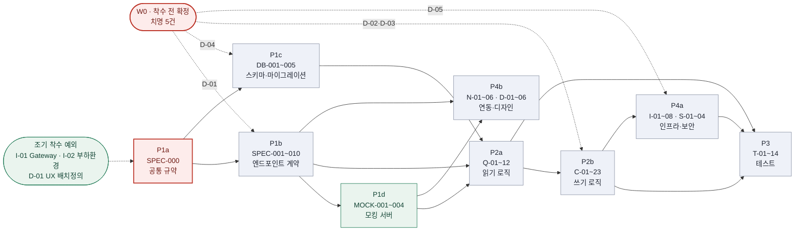
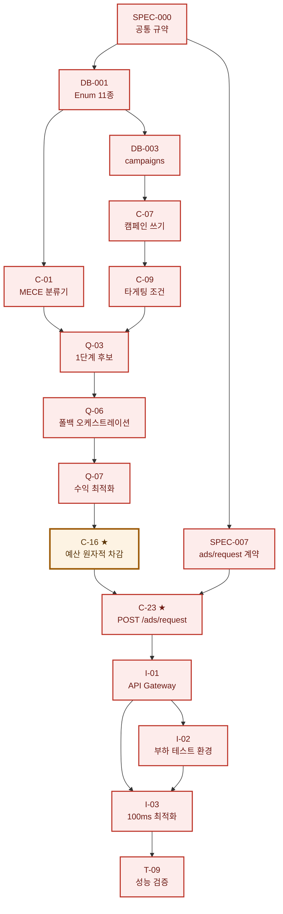

# P4c — 의존성 최종 매핑 및 GitHub Project 등재

**Phase:** P4c (최종)
**원장:** `TASKS-adtech-mvp-v1.0.md` v1.1
**이슈 본문:** `docs/issues/P1ab` · `P1cd` · `P2a` · `P2b` · `P3` · `P4a` · `P4b`

---

## 1. 산출물 총람

| Phase | 파일 | 이슈 | 원장 태스크 |
| --- | --- | --- | --- |
| P0 | `TASKS-adtech-mvp-v1.0.md` (v1.1) | — | 99건 원장 |
| P1a·P1b | `P1ab-contracts.md` | **11** | SPEC-000~010 |
| P1c | `P1cd-database-mocks.md` | **5** | FR-001~011 (묶음) |
| P1d | `P1cd-database-mocks.md` | **4** | MOCK-001~004 |
| P2a | `P2a-queries.md` | **12** | Query 12건 |
| P2b | `P2b-commands.md` | **23** | Command 21 · Util 1 · Q+C 1 |
| P3 | `P3-tests.md` | **14** | QA-001~014 |
| P4a | `P4a-infra-security.md` | **12** | NF-001~012 |
| P4b | `P4b-integration-design.md` | **12** | FR-046~051 · UX-001~006 |
| **합계** | 7개 파일 | **93 이슈** | **99 태스크** |

**태스크 99건이 이슈 93건이 된 이유** — P1c에서 `FR-001~011`(11건)을 5개 이슈로 묶었다.
복잡도 `L`인 인접 태스크를 개별 이슈로 만들면 관리 비용이 산출 가치를 넘는다. 원장 ID는 유지되어 추적성은 보존된다.

---

## 2. 의존성 매핑 — 전체 그래프

### 2-1. Phase 레벨



### 2-2. 착수 가능 시점별 분류

| 구간 | 이슈 | 차단 |
| --- | --- | --- |
| **지금 즉시** | `SPEC-000` · `DB-001` · `I-01`(NF-001) · `D-01`(UX-001) | **없음** |
| SPEC-000 직후 | `SPEC-001~005` · `SPEC-007~009` | — |
| **D-01 회신 후** | `SPEC-006` · `SPEC-010` · `S-01·02·03` | D-01 |
| **D-04 회신 후** | `DB-002` · `S-04` · `N-04` | D-04 |
| I-01 직후 | `I-02`(NF-003) — **조기 착수 권고** | — |
| SPEC 완료 후 | `MOCK-001~004` · `DB-003·004·005` | — |
| MOCK 후 | `Q-03·04·05` · `N-01·02·03` · `D-02·03` | — |
| **D-02·D-03 회신 후** | `C-10·11·12` · `Q-07` · **`C-16`** | D-02·D-03 |
| **D-05 회신 후** | `I-03`(NF-002) · `T-09` | D-05 |
| 범위 판정 후 | `D-05·D-06`(UX-005·006) · `N-05·06` 일부 | 범위 |

---

## 3. 이슈별 의존성 원장

> `Depends on`은 착수 조건, `Blocks`는 이 이슈가 지연될 때 함께 지연되는 대상이다.
> **`Blocks`가 많은 이슈가 크리티컬 패스에 가깝다.**

### 3-1. P1a·P1b — 계약

| 이슈 | Depends on | Blocks | 차단 |
| --- | --- | --- | --- |
| SPEC-000 | — | **SPEC-001~010 전부 · S-01** | — |
| SPEC-001 | SPEC-000 | Q-01, MOCK-001 | — |
| SPEC-002 | SPEC-000 | C-05, MOCK-001 | 부록 D |
| SPEC-003 | SPEC-000 | C-06, MOCK-001 | E-09 |
| SPEC-004 | SPEC-000 | C-14, MOCK-002 | E-04 |
| SPEC-005 | SPEC-000 | C-15, MOCK-002, **Q-03, Q-04, C-09** | E-02 |
| SPEC-006 | SPEC-000 | Q-11, MOCK-002, SPEC-010, D-06 | **D-01** |
| **SPEC-007** | SPEC-000 | **C-23, MOCK-003, I-01, T-04, T-09** | D-05 |
| SPEC-008 | SPEC-000 | C-18, MOCK-003, **SPEC-009** | 멱등성 |
| SPEC-009 | SPEC-000, SPEC-008 | C-20, MOCK-004, T-08, T-10 | E-05 |
| SPEC-010 | SPEC-000, SPEC-006 | Q-12, MOCK-004, N-06, D-06 | **D-01** |

### 3-2. P1c·P1d — 데이터베이스 · 모킹

| 이슈 | Depends on | Blocks | 차단 |
| --- | --- | --- | --- |
| **DB-001** | — | **DB-002·003·004 · C-01·04·08·12 · Q-05·08 · C-18 · I-08 · T-13** | 통화 단위 |
| DB-002 | DB-001 | DB-005, C-01, C-04, N-04, S-04 | **D-04** |
| DB-003 | DB-001, SPEC-005 | DB-005, C-07, Q-02, C-13, **C-16** | E-02 |
| DB-004 | DB-001, SPEC-008·009 | DB-005, C-19, Q-09, C-21, C-22, Q-11, Q-12 | 보존 기간 |
| DB-005 | DB-002·003·004, SPEC-000 | T-07, **이후 모든 조회 경로** | D-04, 연쇄 규칙 |
| MOCK-001 | SPEC-001·002·003 | Q-03, Q-04 | — |
| MOCK-002 | SPEC-004·005·006 | Q-03, Q-04, Q-05, Q-07 | D-01(일부) |
| MOCK-003 | SPEC-007·008 | N-01, N-02, N-03, D-02, D-03 | — |
| MOCK-004 | SPEC-009·010 | Q-11, N-06, D-06 | D-01(일부) |

### 3-3. P2a — 읽기 로직

| 이슈 | Depends on | Blocks | 차단 |
| --- | --- | --- | --- |
| Q-01 (FR-016) | SPEC-001, DB-002, C-01, C-04 | Q-03, Q-04 | E-01 |
| Q-02 (FR-019b) | DB-003 | Q-11, Q-03, Q-04 | D-01 |
| Q-03 (FR-029) | SPEC-005, DB-003, Q-01, C-09 *(MOCK-001·002)* | Q-06 | E-02 |
| Q-04 (FR-030) | 동일 | Q-06 | **E-10** |
| Q-05 (FR-031) | DB-001, DB-003, C-09 *(MOCK-002)* | Q-06 | **E-11** |
| **Q-06 (FR-032)** | Q-03, Q-04, Q-05, SPEC-007 | **C-17, Q-07, C-23, T-04** | 단계 실패 기준 |
| **Q-07 (FR-034)** | Q-06, C-12, DB-003 *(MOCK-002)* | **C-16, Q-08, C-23, T-05** | **D-03** |
| Q-08 (FR-036) | DB-001, Q-07, **D-01(UX-001)** | C-23, T-06 | 슬롯 수 |
| Q-09 (FR-041) | DB-004, C-19 | Q-11, Q-10, C-21, Q-12 | E-12 |
| Q-10 (FR-042) | DB-004, Q-09, C-01, C-04 | T-08 | E-14 |
| Q-11 (FR-028) | SPEC-006, Q-02, Q-09, C-21, DB-004 *(MOCK-004)* | N-05, D-06 | **D-01** |
| Q-12 (FR-045) | SPEC-010, Q-09, C-21, DB-004 *(MOCK-004)* | N-06, D-06 | **D-01** |

### 3-4. P2b — 쓰기 로직

| 이슈 | Depends on | Blocks | 차단 |
| --- | --- | --- | --- |
| **C-01 (FR-012)** | DB-001, DB-002, SPEC-002 | **C-02, C-03, Q-01, C-05, Q-10, T-01** | 부록 D 다수 |
| C-02 (FR-013) | C-01 | T-01, Q-01, Q-10 | 포맷 불일치 |
| C-03 (FR-014) | C-01, DB-002 | C-05, T-01 | `UNKNOWN` |
| **C-04 (FR-015)** | DB-001, DB-002, SPEC-003 | **Q-01, C-06, Q-03, Q-10, T-02** | E-09 |
| C-05 (FR-017) | SPEC-002, C-01, C-03, DB-002 | T-01 | 부록 D |
| C-06 (FR-018) | SPEC-003, C-04, DB-002 | T-02 | **E-09, E-19** |
| **C-07 (FR-019a)** | DB-003, DB-005 | **C-08, C-09, C-10, C-12, C-13, C-14, T-03** | E-16 |
| C-08 (FR-020) | DB-001, C-07 | C-11, T-03 | **E-04** |
| **C-09 (FR-021)** | DB-001, DB-003, C-07, SPEC-005 | **C-15, Q-03, Q-04, Q-05, T-03** | **E-02, E-20** |
| C-10 (FR-022) | DB-003, C-07 | C-11, **C-16**, T-05 | **D-02, E-15** |
| C-11 (FR-023) | C-08, C-10 | T-03, T-05 | **D-02, E-17** |
| C-12 (FR-024) | DB-001, DB-003, C-07 | Q-07, T-05 | **D-03** |
| C-13 (FR-025) | DB-003, C-07, **D-04(UX-004)** | C-23 | E-22 |
| C-14 (FR-026) | SPEC-004, C-07 | N-05, T-03 | E-04 |
| C-15 (FR-027) | SPEC-005, C-09, DB-003 | N-05, T-03 | E-02, D-01 |
| **C-16 (FR-035)** ★ | C-10, Q-07, DB-003 | **C-23, C-11, T-05** | **D-02** |
| C-17 (FR-033) | DB-001, DB-004, Q-06, SPEC-007 | T-04, Q-09 | E-21 |
| C-18 (FR-038) | SPEC-008, DB-001, DB-004, C-23 | Q-09, C-22, N-03, T-08 | 멱등성 |
| **C-19 (FR-039)** | DB-004, SPEC-008·009 | **C-20, Q-09, C-22** | 멱등성 |
| C-20 (FR-040) | SPEC-009, C-19, DB-004 | N-03, T-08, T-10 | 유실률 |
| C-21 (FR-043) | DB-004, Q-09 | Q-11, Q-12, T-08 | "실시간" 충돌 |
| C-22 (FR-044) | DB-004, C-19, C-18 | T-08 | **윈도우 미정** |
| **C-23 (FR-037)** ★ | SPEC-007, Q-06, Q-07, **C-16**, Q-08, C-13 | **N-01, N-02, N-03, I-01, I-03, T-04, T-09** | **D-05** |

### 3-5. P3 — 테스트

| 이슈 | Depends on | AC 차단 |
| --- | --- | --- |
| T-01 | C-01, C-02, C-03, C-05 | 경계값·통화·포맷·`UNKNOWN` |
| T-02 | C-04, C-06 | **태그 개수 미정 (판정 불가)** |
| T-03 | C-07, Q-02, C-08~C-11, C-14, C-15 | D-01, E-04, E-02, E-15, E-16 |
| T-04 | Q-06, C-17, C-23, MOCK-001·002 | 단계 기준, D-05, E-10, E-11 |
| **T-05** | Q-07, **C-16**, I-02, MOCK-002 | **D-03** (단, T-05-01·02는 즉시 가능) |
| T-06 | Q-08, D-01(UX-001) | **슬롯 수 (판정 불가)** |
| **T-07** | DB-005 | D-04, 연쇄 규칙 — **대부분 판정 가능** |
| T-08 | C-19~C-22, N-03 | 윈도우, "실시간", E-05, E-12, E-18 |
| T-09 | I-01, I-03, I-02, C-23 | **D-05 (판정 불가)** |
| T-10 | I-04, I-05, C-20, DB-004 | **REQ-NF-002 응답 시간 조건 부재** |
| **T-11** | I-06, I-07 | 계획 점검 여부 — **대부분 판정 가능** |
| T-12 | S-01, S-02, S-03, S-04 | **D-01 (판정 불가)** |
| T-13 | DB-001, I-08 | **"최소화" 기준 부재** |
| T-14 | T-10, T-11, T-12, T-13 | — (문서 작업, 초안 선행 가능) |

### 3-6. P4a — 인프라 · 보안

| 이슈 | Depends on | Blocks | 차단 |
| --- | --- | --- | --- |
| **I-01 (NF-001)** | SPEC-000, C-23 | **I-02, I-03, S-01, T-09** | E-23 — **조기 착수** |
| **I-02 (NF-003)** | I-01 | **I-03, I-04, I-05, T-09, T-10, T-05** | — **조기 착수** |
| I-03 (NF-002) | I-01, I-02, C-23, SPEC-007 | T-09 | **D-05** |
| I-04 (NF-004) | I-02 | I-06, T-10 | — |
| I-05 (NF-005) | I-02 | T-10 | — |
| I-06 (NF-006) | I-04 | I-07, T-11 | E-26 |
| I-07 (NF-007) | I-06, I-01, C-17 | T-11 | E-24, E-25 |
| I-08 (NF-011) | DB-001 | T-13 | "최소화" 기준 |
| **S-01 (NF-008)** | I-01, SPEC-000 | **S-02, T-12** | **D-01** |
| **S-02 (NF-009)** | S-01, DB-003 | **S-03, T-12, N-05, N-06** | **D-01** |
| S-03 (NF-010) | S-02, S-04 | T-12 | **D-01** |
| S-04 (NF-012) | S-01, DB-002, I-07 | S-03, T-12 | **D-04** |

### 3-7. P4b — 연동 · 디자인

| 이슈 | Depends on | Blocks | 차단 |
| --- | --- | --- | --- |
| N-01 (FR-046) | SPEC-007, C-23 *(MOCK-003)* | D-02 | **E-29, E-30** |
| N-02 (FR-047) | SPEC-007, C-23 *(MOCK-003)* | D-03 | E-29 |
| N-03 (FR-048) | SPEC-008·009, C-18, C-20 *(MOCK-003·004)* | T-08 | **E-31** |
| N-04 (FR-049) | DB-002, C-01, C-04 | C-01·C-04 데이터 공급 | **D-04, E-32, E-09** |
| N-05 (FR-050) | C-14, C-15, Q-11, S-02 | D-05 | 범위 판정, D-01 |
| N-06 (FR-051) | Q-12, S-02 *(MOCK-004)* | D-06 | 범위 판정, E-33 |
| **D-01 (UX-001)** | — | **D-02, D-03, D-04, Q-08, T-06** | — **즉시 착수** |
| D-02 (UX-002) | D-01, MOCK-003 | N-01 | SPEC-007 후보 없음 |
| D-03 (UX-003) | D-01, MOCK-003 | N-02 | E-34 |
| D-04 (UX-004) | D-01 | **C-13** | E-35 |
| D-05 (UX-005) | 범위 판정, SPEC-005, C-07 | D-06 | **범위** |
| D-06 (UX-006) | 범위 판정, D-05, Q-12 *(MOCK-004)* | — | **범위** |

---

## 4. 크리티컬 패스 — 이슈 레벨 확정



**주황 노드 `C-16`이 v1.1의 발견이다.** v1.0의 크리티컬 패스에는 없었고,
CQRS 절단을 적용하자 **읽기 경로 안의 유일한 쓰기**로 드러나 경로에 편입되었다.
D-02가 확정되지 않으면 이 노드에서 막히고, **그 뒤의 C-23·I-01·I-03·T-09가 전부 지연된다.**

### `Blocks` 수 상위 이슈 — 지연 시 영향 최대

| 순위 | 이슈 | Blocks 수 | 성격 |
| --- | --- | --- | --- |
| 1 | **SPEC-000** | 11 | 계약 전체 |
| 2 | **DB-001** | 11+ | 데이터 모델 전체 |
| 3 | **C-07** (FR-019a) | 7 | 캠페인 도메인 |
| 4 | **C-23** (FR-037) | 7 | 광고 요청 |
| 5 | **C-01** (FR-012) | 6 | 세그먼트 분류 |
| 6 | **I-02** (NF-003) | 6 | 성능 검증 기반 |
| 7 | **Q-06** (FR-032) | 4 | 폴백 |
| 8 | **D-01** (UX-001) | 5 | 배치 정의 — **차단 없이 즉시 착수 가능** |

**8위 `D-01`이 실무적으로 중요하다.** Blocks가 5개인데 **선행 의존이 없다.**
지금 시작하면 5개 이슈의 대기가 사라지고, 그중 `Q-08`·`T-06`은 **판정 불가 상태가 해소된다.**

---

## 5. GitHub Project 등재 절차

### 5-1. 라벨 체계

```
# Type (원장 Type 열과 1:1)
spec · mock · db · feature · query · command · util
integration · infra · security · test · design

# Epic
contract · audience-service · campaign-service · ad-serving
tracking-service · foundation · client · external · qa · ux

# 우선순위 (MoSCoW)
priority:high    ← Must
priority:medium  ← Should
priority:low     ← Could

# 상태 표시
critical-path · early-start · no-blocker · scope-check
blocked-d01 · blocked-d02 · blocked-d03 · blocked-d04 · blocked-d05 · blocked-ac
```

**`blocked-*` 라벨이 이 프로젝트의 핵심 관리 장치다.** 부록 D의 미결 항목이 어느 이슈를 막고 있는지
라벨로 필터링할 수 있어야 한다. 안건이 해소되면 라벨을 일괄 제거한다.

### 5-2. Project 필드

| 필드 | 타입 | 값 |
| --- | --- | --- |
| Status | Single select | Backlog · Blocked · Ready · In Progress · In Review · Done |
| Phase | Single select | P1a · P1b · P1c · P1d · P2a · P2b · P3 · P4a · P4b |
| Type | Single select | 위 Type 라벨과 동일 |
| Epic | Single select | 위 Epic 라벨과 동일 |
| Complexity | Single select | H · M · L |
| 원장 Task ID | Text | `FR-012` 등 — **원장과의 추적 링크** |
| AC 준비도 | Single select | ✅ 가능 · ⚠️ 부분 · 🔴 불가 |
| 차단 안건 | Text | `D-01` · `E-02` 등 |

**`원장 Task ID` 필드가 추적성의 핵심이다.** 이슈 번호는 GitHub이 부여하고,
원장 ID는 SRS와 연결된다. 두 축을 함께 두어야 "REQ-FUNC-005는 지금 어디까지 됐나"에 답할 수 있다.

### 5-3. Project 뷰

| 뷰 | 필터·그룹 | 용도 |
| --- | --- | --- |
| **Ready Now** | `Status != Blocked` AND `Depends on 완료` | **오늘 착수 가능한 것** |
| Blocked by Decision | `blocked-d01`~`blocked-d05` | 안건별 차단 현황 — 회의 안건 |
| By Phase | Phase 그룹 | 진행 순서 확인 |
| Critical Path | `critical-path` 라벨 | 지연 감시 |
| AC 준비도 | AC 준비도 그룹 | **판정 불가 이슈 현황** |
| By Epic | Epic 그룹 | 팀별 작업 |
| 요구사항 커버리지 | 원장 Task ID 정렬 | REQ별 진척 |

### 5-4. 등재 순서

1. 라벨 생성 (위 체계)
2. Project 생성 및 필드 정의
3. **`P1ab-contracts.md`의 11건부터 이슈 생성** — 크리티컬 패스 시작점
4. `P1cd` 9건 → `P2a` 12건 → `P2b` 23건 → `P3` 14건 → `P4a` 12건 → `P4b` 12건
5. 이슈 번호 확보 후 **`Depends on` / `Blocks`를 실제 이슈 번호로 교체**
6. 원장 `TASKS-adtech-mvp-v1.0.md`에 이슈 번호 열 추가
7. `blocked-*` 라벨 부여 및 Blocked 뷰 확인

**5단계가 중요하다.** 현재 이슈 본문의 의존성은 원장 ID(`FR-012`)로 적혀 있다.
GitHub이 이슈 번호를 부여한 뒤 `#42` 형태로 교체해야 자동 연결이 동작한다.

---

## 6. 착수 권고 — 지금 당장 할 수 있는 것

### 6-1. 차단 없는 4건 — 즉시 착수

| 이슈 | Blocks | 왜 지금인가 |
| --- | --- | --- |
| **SPEC-000** | 11 | 계약 전체의 관문. 하루면 끝난다 |
| **DB-001** | 11+ | 데이터 모델 전체의 어휘 확정 |
| **I-01** (NF-001) | 4 | 인증·계측의 기반. S-01·I-02가 여기 붙는다 |
| **D-01** (UX-001) | 5 | **선행 없음. 그리고 FR-036·QA-006의 판정 불가를 해소한다** |

### 6-2. 병렬 착수 — W0 회신을 기다리는 동안

| 트랙 | 이슈 | 조건 |
| --- | --- | --- |
| 계약 | SPEC-001~005 · SPEC-007~009 | SPEC-000 직후 (SPEC-006·010은 D-01 대기) |
| 데이터 | DB-003 · DB-004 | DB-001 직후 (DB-002는 D-04 대기) |
| 성능 환경 | **I-02** (NF-003) | I-01 직후 — **조기 착수 권고** |
| 디자인 | D-02·D-03·D-04 | D-01 직후 |

### 6-3. 판정 가능한 고가치 테스트 6건 — 조기 작성 권고

P3 요약에서 뽑은 것이다. **통과선이 이미 명확해 지금 쓸 수 있고, 구조적 위험을 검증한다.**

| 케이스 | 검증 대상 |
| --- | --- |
| `T-05-01·02` | 예산 동시 차감 초과 0건 — **금액 손실 직결** |
| `T-07-02` | 전 조회 경로 소프트 삭제 필터 |
| `T-08-04` | 세그먼트 분해 합계 = 전체 (MECE) |
| `T-01-02` | 사용자 수 = 세그먼트별 합계 |
| `T-11-03` | Tracking 장애 시 광고 응답 계속 |
| `T-04-04` | 세 단계 후보 존재 시 1단계 선택 |

---

## 7. 부록 D 추가 대상 — 본문 작성 중 발견한 36건

원장 부록 D는 14건이었다. **이슈 본문을 쓰는 과정에서 36건이 추가로 드러났다.**
확정 난도로 분류했다.

### 7-1. 계약 리뷰 한 번으로 해소 — 12건

| # | 항목 | 제기 |
| --- | --- | --- |
| E-01 | 프로파일 미존재 시 응답 (`404` vs 빈 `200`) | SPEC-001 |
| E-02 | **타게팅 조건 결합 규칙** (차원 내 OR · 차원 간 AND) | SPEC-005 |
| E-03 | SPEC-006 ↔ SPEC-010 스키마 통일 | SPEC-006·010 |
| E-04 | 캠페인 기간 필드 부재 → `COMPLETED` 진입 불가 | SPEC-004 |
| E-05 | 배치 상한 및 부분 실패 정책 | SPEC-009 |
| E-06 | 동일 지면 캠페인 중복 배제 규칙 | SPEC-007 |
| E-07 | 오류 응답 형식 · 요청 추적 ID · 속도 제한 | SPEC-000 |
| E-08 | 소프트 삭제 필터 강제 지점 | SPEC-000 |
| E-14 | 미상 세그먼트 리포트 표기 | Q-10 |
| E-17 | 예산 소진 감지 시점 (동기 vs 배치) | C-11 |
| E-19 | 프로파일 없는 사용자의 태그 저장 | C-06 |
| E-34 | 데스크톱 5개 위치 동시 노출 상한 | D-03 |

### 7-2. 사업·계약 판단 필요 — 12건

| # | 항목 | 제기 | 영향 |
| --- | --- | --- | --- |
| **E-09** | **행동 신호 API의 MVP 호출 주체** | SPEC-003 | **1단계 타게팅 동작 여부** |
| **E-10** | 2단계에서 행동 조건 보유 캠페인 취급 | Q-04 | Fill Rate vs 광고주 의도 |
| **E-11** | "컨텍스트" 매칭 범위 (§7.3과 충돌) | Q-05 | 범위 판정 |
| **E-12** | **Fill Rate가 인수 기준에서 누락** | Q-09 | 폴백 효과 측정 불가 |
| E-13 | 3단계 광고 최소 단가 | Q-05 | eCPM 보호 |
| **E-15** | **일일 예산의 "하루" 기준 시간대** | C-10 | 금액 직결 |
| E-16 | `ACTIVE` 상태 입찰가 변경 허용 | C-07 | 지표 해석 |
| E-18 | 클릭 없는 전환 처리 (view-through) | C-22 | 정산 규칙 |
| E-21 | 폴백 단계별 목표 비율 | C-17 | KPI 부재 |
| E-26 | 목표 가용성 재확인 (99% vs 99.9%) | I-06 | 계약·비용 |
| **E-31** | **노출의 정의 (뷰어빌리티)** | N-03 | **청구 근거** |
| E-36 | 예상 도달 규모 기능 | D-05 | 광고주 경험 |

### 7-3. 설계·문서 보완 — 12건

| # | 항목 | 제기 |
| --- | --- | --- |
| E-20 | 인구통계 없는 타게팅 조건 허용 | C-09 |
| E-22 | 소재 규격·형식·용량·심사 절차 | C-13 |
| **E-23** | **§3 시스템 맥락에 API Gateway 부재** (§5에만 등장) | I-01 |
| E-24 | SLI 정의 부재 (SLA만 있음) | I-07 |
| E-25 | 로그·메트릭 보존 기간 | I-07 |
| E-27 | 마스킹 대상의 원시값·구간값 구분 | S-04 |
| E-28 | 기존 로그 소급 마스킹 여부 | S-04 |
| **E-29** | **"웹/모바일 분리 API"의 구체적 의미** | N-01 |
| E-30 | `DevicePreference` vs 실제 접속 기기 | N-01 |
| **E-32** | **User Profile Service 연동 방식·항목·주기** (§3에 이름만) | N-04 |
| E-33 | Dashboard의 "Logging" 연동 범위 | N-06 |
| E-35 | 크리에이티브 용량 상한 | D-04 |

### 7-4. 즉시 처리 권고 5건

| # | 왜 최우선인가 |
| --- | --- |
| **E-02** | 확정 없으면 `Q-03`·`Q-04`·`C-09`의 매칭이 개발자마다 달라진다 |
| **E-09** | 확정 없으면 **REQ-FUNC-004의 1단계가 죽은 코드**가 된다 |
| **E-15** | 금액 직결이고 사업 측 한 문장으로 정해진다 |
| **E-31** | **청구의 근거**인데 SRS에 없다. 나중에 뒤집히면 재작업이 크다 |
| **E-32** | 인구통계 데이터의 유일한 출처인데 §3에 이름만 있어 설계 착수 불가 |

---

## 8. 최종 상태

| 항목 | 수치 |
| --- | --- |
| 원장 태스크 | **99** |
| 이슈 본문 | **93** (L 복잡도 11건을 5건으로 묶음) |
| 요구사항 커버리지 (정방향) | 13 / 13 · **100%** |
| 부속 명세 커버리지 | 61 / 61 · **100%** |
| 역방향 근거 추적 | 95 / 99 · 96% (MOCK 4건은 방법론 파생) |
| 차단 없이 즉시 착수 가능 | **4 이슈** |
| W0 치명 안건에 차단 | 14 이슈 |
| AC 판정 불가 (통과선 부재) | 테스트 케이스 약 24건 |
| 본문 작성 중 발견한 미정의 항목 | **36건** (E-01 ~ E-36) |

**본문 작성의 실질적 성과는 태스크 93건이 아니라 미정의 항목 36건의 발견이다.**
원장 수준에서는 14건이었고, 이슈 본문에서 Acceptance Criteria를 실제로 쓰려고 하자
**"이 Then 절에 무엇을 쓸 수 있는가"** 를 묻게 되면서 나머지가 드러났다.

방법론 Step 3이 *"AC를 테스트 Task로 변환"* 을 요구한 이유가 여기 있다.
**AC를 쓸 수 없는 요구사항은 완료 판정도 할 수 없고, 그 사실은 AC를 실제로 쓰기 전까지 보이지 않는다.**

---

## 9. 이슈 번호 매핑 — GitHub 등재 완료

**등재일:** 2026-08-25 · **저장소:** `STERNYUL/AI_PLACE_MATE` · **이슈 93건 · 라벨 45종**

이슈 번호는 Phase 순서대로 `#1`~`#93`에 배정되었다. 원장 Task ID가 SRS와 연결되고,
이슈 번호가 실행과 연결된다. **두 축을 함께 두어야 "REQ-FUNC-005는 지금 어디까지 됐나"에 답할 수 있다.**

| 이슈 | 이슈 코드 | 원장 Task ID | 제목 |
| --- | --- | --- | --- |
| #1 | `SPEC-000` | `SPEC-000` | 공통 규약 확정 |
| #2 | `SPEC-001` | `SPEC-001` | 프로파일 조회 계약 |
| #3 | `SPEC-002` | `SPEC-002` | 세그먼트 갱신 계약 |
| #4 | `SPEC-003` | `SPEC-003` | 행동 신호 추가 계약 |
| #5 | `SPEC-004` | `SPEC-004` | 캠페인 생성 계약 |
| #6 | `SPEC-005` | `SPEC-005` | 타게팅 갱신 계약 · 조건 결합 규칙 |
| #7 | `SPEC-006` | `SPEC-006` | 캠페인 성과 조회 계약 |
| #8 | `SPEC-007` | `SPEC-007` | 광고 요청 계약 — 최우선 |
| #9 | `SPEC-008` | `SPEC-008` | 클릭 이벤트 계약 · 멱등키 규약 |
| #10 | `SPEC-009` | `SPEC-009` | 이벤트 일괄 수집 계약 |
| #11 | `SPEC-010` | `SPEC-010` | 실시간 지표 조회 계약 |
| #12 | `DB-001` | `DB-001` | Enum 타입 정의 11종 및 확장 패턴 |
| #13 | `DB-002` | `DB-002` | Audience 도메인 스키마 및 마이그레이션 |
| #14 | `DB-003` | `DB-003` | Campaign 도메인 스키마 및 마이그레이션 |
| #15 | `DB-004` | `DB-004` | 이벤트 원본 및 실시간 집계 뷰 |
| #16 | `DB-005` | `DB-005` | 소프트 삭제 컴포넌트 및 전 서비스 적용 |
| #17 | `MOCK-001` | `MOCK-001` | Audience Service 모킹 |
| #18 | `MOCK-002` | `MOCK-002` | Campaign Service 모킹 |
| #19 | `MOCK-003` | `MOCK-003` | Ad Serving 모킹 |
| #20 | `MOCK-004` | `MOCK-004` | Tracking 모킹 |
| #21 | `Q-01` | `FR-016` | 사용자 프로파일 조회 |
| #22 | `Q-02` | `FR-019b` | 캠페인 조회 |
| #23 | `Q-03` | `FR-029` | 1단계 정밀 타게팅 후보 조회 |
| #24 | `Q-04` | `FR-030` | 2단계 인구통계 전용 후보 조회 |
| #25 | `Q-05` | `FR-031` | 3단계 컨텍스트·기본 광고 후보 조회 |
| #26 | `Q-06` | `FR-032` | 3단계 폴백 오케스트레이션 |
| #27 | `Q-07` | `FR-034` | 수익 최적화 캠페인 선택 |
| #28 | `Q-08` | `FR-036` | 노출 위치별 슬롯 수 제어 |
| #29 | `Q-09` | `FR-041` | 성과 지표 산출 |
| #30 | `Q-10` | `FR-042` | 세그먼트·태그 기준 지표 분해 |
| #31 | `Q-11` | `FR-028` | 캠페인 성과 조회 API |
| #32 | `Q-12` | `FR-045` | 실시간 지표 조회 API |
| #33 | `C-01` | `FR-012` | MECE 복합 세그먼트 분류기 |
| #34 | `C-02` | `FR-013` | 세그먼트 식별자 포맷 생성·파싱 |
| #35 | `C-03` | `FR-014` | MECE 제약 강제 |
| #36 | `C-04` | `FR-015` | 멀티 태그 행동 신호 처리기 |
| #37 | `C-05` | `FR-017` | 세그먼트 갱신 API 구현 |
| #38 | `C-06` | `FR-018` | 행동 신호 추가 API 구현 |
| #39 | `C-07` | `FR-019a` | 캠페인 생성·수정·삭제 |
| #40 | `C-08` | `FR-020` | 캠페인 상태 전이 관리 |
| #41 | `C-09` | `FR-021` | 타게팅 조건 설정·저장 |
| #42 | `C-10` | `FR-022` | 예산 관리 — 상한 설정 및 잔액 추적 |
| #43 | `C-11` | `FR-023` | 예산 소진 시 자동 일시중지 |
| #44 | `C-12` | `FR-024` | 입찰 전략 설정 |
| #45 | `C-13` | `FR-025` | 크리에이티브 자산 등록·관리 |
| #46 | `C-14` | `FR-026` | 캠페인 생성 API 구현 |
| #47 | `C-15` | `FR-027` | 타게팅 갱신 API 구현 |
| #48 | `C-16` | `FR-035` | 예산 검증 및 원자적 차감 ★ |
| #49 | `C-17` | `FR-033` | 폴백 단계 기록 |
| #50 | `C-18` | `FR-038` | 클릭 이벤트 추적 API 구현 |
| #51 | `C-19` | `FR-039` | 이벤트 수집·저장 |
| #52 | `C-20` | `FR-040` | 이벤트 일괄 수집 API 구현 |
| #53 | `C-21` | `FR-043` | 5분 주기 실시간 집계 배치 |
| #54 | `C-22` | `FR-044` | Last-click 어트리뷰션 처리 |
| #55 | `C-23` | `FR-037` | 광고 요청 API 구현 ★ |
| #56 | `T-01` | `QA-001` | TC-FUNC-001 — MECE 준수 및 차원 커버리지 |
| #57 | `T-02` | `QA-002` | TC-FUNC-002 — 태그 할당 및 다중 카테고리 |
| #58 | `T-03` | `QA-003` | TC-FUNC-003 — 캠페인 CRUD 및 타게팅 로직 |
| #59 | `T-04` | `QA-004` | TC-FUNC-004 — 폴백 순서 및 단계 검증 |
| #60 | `T-05` | `QA-005` | TC-FUNC-005 — 입찰 최적화 및 예산 동시성 |
| #61 | `T-06` | `QA-006` | TC-FUNC-006 — 위치별 슬롯 수 검증 |
| #62 | `T-07` | `QA-007` | TC-FUNC-007 — 소프트 삭제 및 데이터 무결성 |
| #63 | `T-08` | `QA-008` | TC-FUNC-008 — 지표 정확성 및 어트리뷰션 |
| #64 | `T-09` | `QA-009` | TC-NF-001 — E2E 응답시간 성능 검증 |
| #65 | `T-10` | `QA-010` | TC-NF-002 † — 처리량 1,000 RPS 검증 |
| #66 | `T-11` | `QA-011` | TC-NF-003 † — 가용성 99% 검증 |
| #67 | `T-12` | `QA-012` | TC-NF-004 † — 인증 및 비인가 접근 차단 |
| #68 | `T-13` | `QA-013` | TC-NF-005 † — Enum 확장성 검증 |
| #69 | `T-14` | `QA-014` | §5 추적성 매트릭스 갱신 |
| #70 | `I-01` | `NF-001` | API Gateway 구축 및 성능 계측 |
| #71 | `I-02` | `NF-003` | 부하 테스트 환경 구축 |
| #72 | `I-03` | `NF-002` | E2E 응답시간 최적화 |
| #73 | `I-04` | `NF-004` | 1,000+ RPS 확장 구성 |
| #74 | `I-05` | `NF-005` | 다중 서비스 부하 테스트 프로그램 |
| #75 | `I-06` | `NF-006` | 가용성 99% 이중화 구성 |
| #76 | `I-07` | `NF-007` | 모니터링 및 SLA 검증 체계 |
| #77 | `I-08` | `NF-011` | Enum 확장성 코드 리뷰 및 테스트 |
| #78 | `S-01` | `NF-008` | 전체 API 인증 적용 |
| #79 | `S-02` | `NF-009` | 인가 처리 — 자원 소유자 검증 |
| #80 | `S-03` | `NF-010` | 보안 감사 및 접근 제어 테스트 |
| #81 | `S-04` | `NF-012` | 개인정보 로깅 마스킹 파이프라인 ★ |
| #82 | `N-01` | `FR-046` | 모바일 웹 앱 연동 엔드포인트 |
| #83 | `N-02` | `FR-047` | 데스크톱 웹 앱 연동 엔드포인트 |
| #84 | `N-03` | `FR-048` | 클라이언트 이벤트 전송 모듈 |
| #85 | `N-04` | `FR-049` | User Profile Service 연동 |
| #86 | `N-05` | `FR-050` | Advertiser Portal 연동 인터페이스 |
| #87 | `N-06` | `FR-051` | Logging & Performance Dashboard 연동 |
| #88 | `D-01` | `UX-001` | 광고 노출 위치 5종 배치 정의 |
| #89 | `D-02` | `UX-002` | 모바일 웹 광고 슬롯 반응형 레이아웃 |
| #90 | `D-03` | `UX-003` | 데스크톱 웹 광고 슬롯 레이아웃 |
| #91 | `D-04` | `UX-004` | 위치별 크리에이티브 규격 정의 |
| #92 | `D-05` | `UX-005` | 캠페인 관리 화면 설계 ※범위 확인 필요 |
| #93 | `D-06` | `UX-006` | 캠페인 성과 조회 화면 설계 ※범위 확인 필요 |

### 9-1. Phase별 이슈 번호 구간

| Phase | 이슈 번호 | 건수 |
| --- | --- | --- |
| P1a · P1b — 계약 | `#1` ~ `#11` | 11 |
| P1c — 데이터베이스 | `#12` ~ `#16` | 5 |
| P1d — 모킹 | `#17` ~ `#20` | 4 |
| P2a — 읽기 로직 | `#21` ~ `#32` | 12 |
| P2b — 쓰기 로직 | `#33` ~ `#55` | 23 |
| P3 — 테스트 | `#56` ~ `#69` | 14 |
| P4a — 인프라 · 보안 | `#70` ~ `#81` | 12 |
| P4b — 연동 · 디자인 | `#82` ~ `#93` | 12 |

### 9-2. 즉시 착수 4건 — 차단 없음

| 이슈 | 대상 | Blocks |
| --- | --- | --- |
| **`#1`** | SPEC-000 공통 규약 | 11 |
| **`#12`** | DB-001 Enum 11종 | 11+ |
| **`#70`** | I-01 API Gateway (조기 착수) | 4 |
| **`#88`** | D-01 UX-001 광고 위치 배치 정의 | 5 |

### 9-3. 크리티컬 패스 — 이슈 번호

```
#1 SPEC-000 → #8 SPEC-007 ─┐
#1 → #12 DB-001 → #14 DB-003 → #39 C-07 → #41 C-09 ─┤
#12 → #33 C-01 ─────────────────────────────────────┤
                                                     ├→ #23 Q-03 → #26 Q-06
                                                        → #27 Q-07 → #48 C-16 ★
                                                        → #55 C-23 ★ → #70 I-01
                                                        → #71 I-02 → #72 I-03 → #64 T-09
```

★ `#48`(C-16 예산 원자적 차감)이 v1.1에서 크리티컬 패스에 편입된 노드다.
**D-02가 확정되지 않으면 여기서 막히고 `#55`·`#70`·`#72`·`#64`가 전부 지연된다.**

### 9-4. 차단 라벨별 필터

| 라벨 | 차단 안건 | 대상 |
| --- | --- | --- |
| `blocked-d01` | 광고주 간 데이터 격리 | `#7` `#11` `#31` `#32` `#78` `#79` `#80` `#67` |
| `blocked-d02` | 예산 초과 집행 | `#42` `#43` `#48` `#60` |
| `blocked-d03` | 캠페인 선택 기준 | `#27` `#44` `#60` |
| `blocked-d04` | 개인정보 수집·파기 | `#13` `#81` `#85` |
| `blocked-d05` | 100ms 근거·측정 조건 | `#72` `#64` |
| `blocked-ac` | 통과선 부재 | `#57` `#61` `#65` `#68` `#77` |
| `scope-check` | 범위 판정 필요 | `#92` `#93` |

GitHub에서 `label:blocked-d01` 로 필터하면 D-01 회신 대기 이슈만 볼 수 있다.
**안건이 해소되면 해당 라벨을 일괄 제거하는 것이 진척 관리의 최소 단위다.**

### 9-5. 남은 작업 — GitHub Project 보드

**Project 생성은 수행되지 않았다.** 현재 인증 토큰에 `project` 스코프가 없다.

```
gh auth refresh -s project,read:project
```

위 명령은 브라우저 인증이 필요해 대화형이다. 스코프를 부여한 뒤
§5-2의 필드(Status · Phase · Type · Epic · Complexity · 원장 Task ID · AC 준비도 · 차단 안건)와
§5-3의 뷰(Ready Now · Blocked by Decision · By Phase · Critical Path · AC 준비도 · By Epic · 요구사항 커버리지)를 구성한다.

**Project 없이도 라벨 필터로 대체 가능하다** — `label:critical-path`, `label:blocked-d01`, `label:no-blocker` 등.

---

## 10. 문서 재편 (v1.2)

**축약 실행에 따라 이슈 본문 파일을 46건 기준으로 재편했다.**

### 10-1. 파일 구조 변경

| 이전 (93건 기준) | 이후 (46건 기준) | 수록 |
| --- | --- | --- |
| `P1ab-contracts.md` (11) | **`P1-contracts-data.md`** | 계약 6 + 데이터·모킹 6 = **12** |
| `P1cd-database-mocks.md` (9) | ↑ 통합 | — |
| `P2a-queries.md` (12) | **`P2-logic.md`** | Audience 3 · Campaign 4 · Ad Serving 5 · Tracking 3 = **15** |
| `P2b-commands.md` (23) | ↑ 통합 | — |
| `P3-tests.md` (14) | **`P3-tests.md`** | **6** |
| `P4a-infra-security.md` (12) | **`P4a-infra-security.md`** | Infra 4 · Sec 2 = **6** |
| `P4b-integration-design.md` (12) | **`P4b-integration-design.md`** | Integration 4 · Design 3 = **7** |
| `P4c-dependency-map.md` | **유지** | 의존성 원장 · 이슈 매핑 |

**7개 파일 → 5개 파일 + 매핑 1개.** `P2a`/`P2b`를 합친 이유는 병합 결과 Query·Command가
한 이슈에 섞인 경우가 생겨(예: `AUD-C` = FR-016 Query + FR-017·018 Command) 파일 단위 분리가 무의미해졌기 때문이다.

### 10-2. 정보 손실 없음 — 흡수 상세 보존 방식

**GitHub 이슈 본문에는 흡수된 이슈의 상세가 없다.** 대표 이슈 본문 + 축약 반영 절만 있다.
문서에서는 그것을 보완했다.

```
# SPEC-B: Audience 계약 3종
  이슈 #2 · 신규 ID SPEC-B · 원장 태스크 SPEC-001 · SPEC-002 · SPEC-003
  원장 태스크 체크리스트
  ---
  [대표 #2 의 전체 상세]
  ---
  <details> 흡수 · #3 SPEC-002 상세 </details>
  ---
  <details> 흡수 · #4 SPEC-003 상세 </details>
```

흡수된 47건의 상세(Task Breakdown · Acceptance Criteria · Constraints · DoD · Dependencies)가
**접힌 블록으로 전량 보존**된다. GitHub에서는 Close된 이슈에 남고, 문서에서는 대표 섹션 안에 남는다.

### 10-3. 재편 검증

| 항목 | 결과 |
| --- | --- |
| 섹션 수 | **46** (12 + 15 + 6 + 6 + 7) |
| 원장 ID 체크박스 | **99개 · 각 1회 · 중복 0** |
| 흡수 상세 블록 | **47** · `<details>` 태그 짝 일치 |
| 총 행수 | 8,710 (재편 전 7개 파일 대비 상세 보존) |

**원장 ID 99개가 정확히 한 번씩 나타남을 검증했다.** 축약이 추적성을 훼손하지 않았다는 증거다.

### 10-4. SRS v1.1 반영

`reference/SRS-example-AD-Core-Platform.md`를 **v1.1로 개정**했다. W0 결정 5건의 결과다.

| 조항 | 변경 | 상태 |
| --- | --- | --- |
| REQ-FUNC-005 | eCPM 환산 · 3단 계단식 CTR · 동점 규칙 | `Proposed` → **`Approved`** |
| REQ-NF-001 | 측정 5항목 · G1 200ms / G2 100ms · 단계별 타임아웃 | `Proposed` → **`Approved`** |
| REQ-NF-002 | 응답 시간 조건 추가 · 유실률 0.1% | `Proposed` → **`Approved`** |
| REQ-NF-004 | Bearer 토큰 · 소유자 검증 · **`404` 정책** · 역할 3종 | `Proposed` → **`Approved`** |
| §5 매트릭스 | `TC-NF-002`~`005` 4행 신설 + 단일 책임자 지정 | 9행 → **13행** |
| §6.2 enum | `UNKNOWN` 3종 · 통화 단위 KRW 명시 | 격자 36 → **80칸** |
| §6.3 규칙 5·7·8 | 개인정보 삭제 예외 · 원자 갱신 · 기록/집계 분리 | 개정 |

**13개 조항 중 4건이 `Approved`로 전환됐다.** 나머지 9건은 여전히 `Proposed`이며 승인 회의 대상이다.
