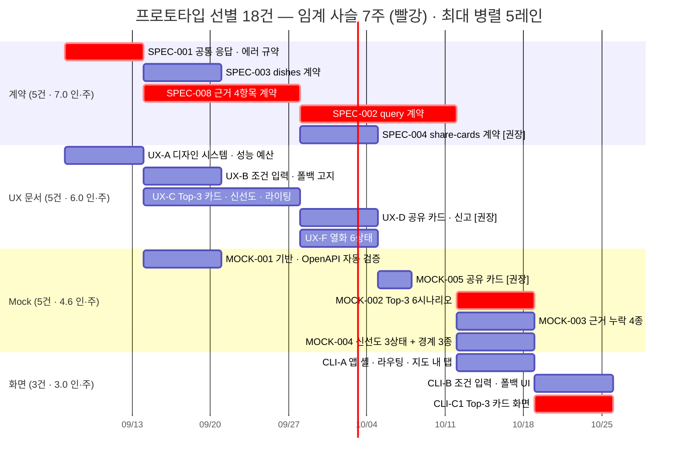

# [프로토타입 선별] AI-Place-Mate — 시각 확인 우선 착수 범위

**문서 ID:** PROTO-AIPLACE-001
**개정 버전:** 1.0
**날짜:** 2026-08-26
**기준 일정:** [`EXEC-ai-place-compressed-v1.0.md`](../EXEC-ai-place-compressed-v1.0.md) (EXEC-AIPLACE-COMPRESSED-001 · 압축 **91건** · 임계 경로 12주)
**태스크 본문:** [`docs/issues-aiplace/tasks/`](issues-aiplace/tasks/) · GitHub 이슈 `#94`~`#178`
**작성 관점:** Technical Project Manager / System Architect

> **이 문서의 목적** — 압축 일정 91건 중 **"화면으로 확인하는 것이 산출물"인 것만** 골라, 개발의 첫 단계로 세운다.
> 프로토타입은 버리는 물건이 아니라 **이후 기능 개발이 올라탈 코드베이스의 첫 층**이다. 그래서 선별 기준이 "빨리 보이는 것"이 아니라 **"나중에 다시 만들지 않는 것"** 이다.

---

## 0. 한 장 요약

| 항목 | 값 |
| --- | --- |
| 선택 | **18건** — 필수 15 · 권장 3 |
| 제외 | **73건** |
| 공수 | **20.6 인·주** — 전체 120.5의 **17.1%** |
| 임계 사슬 | **7주** — `SPEC-001` → `SPEC-008` → `SPEC-002` → `MOCK-002` → `CLI-C1` |
| 최소 병렬도 | **약 3명** (계약 리드 1 · 디자이너 1 · 프론트엔드 1, Mock은 겸임) |
| 최대 병렬 폭 | **5레인** (1~2주 구간) |
| 의도적 의존 절단 | **1건** — `CLI-A` ← `IN-A` |
| 압축 문서가 이미 승인한 재배선 | **1건** — `CLI-C1` ← `EVD-C`·`SRC-D` 제거 |
| 해소되는 미정·블로커 | **9건** (`EXEC` §6.2 블로커 **#5**·**#8** 포함) |
| 착수 전 확정 필요 | **4건** — §9 |

**세 가지 판단**

1. **이 선별은 새 계획이 아니다.** 압축 일정 §2.3(Mock 기반 분리)이 이미 `CLI-C1`의 선행에서 `EVD-C`·`SRC-D`를 떼어냈다. 이 문서는 **그 재배선이 만든 공간을 실제로 쓰는 것**이다.
2. **임계 사슬 7주는 계약이 만든다.** 화면 코드는 3주뿐이고, 앞의 5주는 `SPEC-001`→`SPEC-008`→`SPEC-002` 계약 사슬이다. **프로토타입을 서두르려면 계약을 서둘러야 한다** — 코드를 서둘러도 안 줄어든다.
3. **프로토타입이 임계 경로상의 블로커 2건을 해소한다.** `EXEC` §6.2 **#5 판정형 어휘 기준**(임계 경로)과 **#8 인앱 브라우저 제약 실측**은 문서로 정할 수 없고 **화면과 실기기가 있어야 정해진다.** 프로토타입을 먼저 하는 진짜 이유가 이것이다.

---

## 1. 선별 기준 — '시각 확인이 산출물'을 무엇으로 볼 것인가

**세 기준을 모두 만족하는 티켓만 넣었다.**

| # | 기준 | 떨어지는 예 |
| --- | --- | --- |
| **1** | 산출물이 **화면·플로우·카피**이거나, 그것을 **렌더하는 코드**다 | `IDX-B` 정규화 — 정확도 92%는 화면으로 확인할 수 없다 |
| **2** | **백엔드 구현 없이 Mock만으로 완주**된다 | `CLI-D` 결제 화면 — PG 승인 없이 확인하면 잘못된 안심을 준다 |
| **3** | **Phase 2 조건부 이월 단위가 아니다** | `UX-G`·`UX-H`·`CLI-F`·`CLI-G` — 게이트 미통과 시 통째로 버려진다 |

**추가로 하나를 뺐다** — 기준 1·2를 만족하지만 **미정 항목 때문에 카피를 완성할 수 없는 것**은 넣지 않았다.
`UX-E`(예약·결제·옵트인)가 여기 걸린다. `PRV-A`의 **개인정보 보존 기간이 미정**이라 동의 화면 카피를 쓸 수 없다(태스크 본문 Blockers 명시). 지금 그리면 확정 후 다시 그린다.

---

## 2. 선택 18건

### 2.1 필수 15건 — 이것이 빠지면 프로토타입이 성립하지 않는다

주차는 압축 일정 부록 A의 주차 오프셋(2026-09-07 기준)이다.

| 계열 | 티켓 | 이슈 | 주차 | 공수 | 이 프로토타입에서 하는 일 |
| --- | --- | --- | --- | --- | --- |
| 계약 | **`SPEC-001`** 공통 응답·에러 규약 | [#94](https://github.com/STERNYUL/AI_PLACE_MATE/issues/94) | 0~1 | 1 | **열화 6상태의 입력.** 상태 코드 체계가 없으면 `UX-F`의 오류·타임아웃 화면을 어디에 붙일지 정할 수 없다 |
| 계약 | **`SPEC-008`** 근거 4항목 계약 | [#101](https://github.com/STERNYUL/AI_PLACE_MATE/issues/101) | 1~3 | 2 | **카드의 데이터 구조 그 자체.** 불변 규칙 1의 계약 |
| 계약 | **`SPEC-003`** `GET /v1/places/{id}/dishes` | [#96](https://github.com/STERNYUL/AI_PLACE_MATE/issues/96) | 1~2 | 1 | 카드에 올라가는 메뉴·가격의 출처. 유사 메뉴 대체 고지의 형상 |
| 계약 | **`SPEC-002`** `POST /v1/query` | [#95](https://github.com/STERNYUL/AI_PLACE_MATE/issues/95) | 3~5 | 2 | Top-3 응답 형상. `MOCK-002`·`003`·`004` 셋 전부의 선행 |
| Mock | **`MOCK-001`** Mock 서버 기반 구성 | [#108](https://github.com/STERNYUL/AI_PLACE_MATE/issues/108) | 1~2 | 1 | **OpenAPI 자동 검증.** 압축 §5 조건 2 — 이게 없으면 화면이 계약과 어긋난 채 굳는다 |
| Mock | **`MOCK-002`** Top-3 조회 Mock | [#109](https://github.com/STERNYUL/AI_PLACE_MATE/issues/109) | 5~6 | 1 | 6시나리오 — 정상 3 · 폴백 전환 · 예산 초과 요약 · 유사 대체 · **후보 없음** · 1,500ms 지연 |
| Mock | **`MOCK-003`** 근거 4항목 완비/누락 Mock | [#110](https://github.com/STERNYUL/AI_PLACE_MATE/issues/110) | 5~6 | 1 | 항목별 누락 4종. **불변 규칙 1을 화면에서 검증하는 유일한 수단** |
| Mock | **`MOCK-004`** 신선도 3상태 Mock | [#111](https://github.com/STERNYUL/AI_PLACE_MATE/issues/111) | 5~6 | 1 | `VERIFIED`·`STALE`·`RECHECK_REQUIRED` + 89/90/91일 경계 3종 |
| UX | **`UX-A`** 디자인 시스템·모바일 성능 가이드 | [#140](https://github.com/STERNYUL/AI_PLACE_MATE/issues/140) | 0~1 | 1 | 토큰·공통 컴포넌트·LCP 숫자 예산·지도 내 탭 안전 영역. **후보 카드에 근거 4항목 슬롯을 내장** |
| UX | **`UX-B`** 조건 입력·폴백 필터 설계 | [#141](https://github.com/STERNYUL/AI_PLACE_MATE/issues/141) | 1~2 | 1 | 전환 고지 카피. **파싱 실패가 오류로 읽히지 않게** |
| UX | **`UX-C`** Top-3 카드·신선도 경고·근거 라이팅 | [#142](https://github.com/STERNYUL/AI_PLACE_MATE/issues/142) | 1~3 | 2 | **제품 정체성이 화면 언어가 되는 지점.** 라이팅 가이드가 `EVD-B` 판정형 사전의 정본이 된다 |
| UX | **`UX-F`** 빈 화면 금지 상태 설계 | [#145](https://github.com/STERNYUL/AI_PLACE_MATE/issues/145) | 3~4 | 1 | 열화 6상태와 각 상태의 **다음 행동.** 프로토타입의 주 검증 대상 |
| 화면 | **`CLI-A`** 앱 셸·라우팅·지도 내 탭 진입 | [#135](https://github.com/STERNYUL/AI_PLACE_MATE/issues/135) | 5~6 | 1 | 셸·라우팅·API 클라이언트·오류 경계. **인앱 브라우저 제약 실측** |
| 화면 | **`CLI-B`** 조건 입력·폴백 필터 UI | [#136](https://github.com/STERNYUL/AI_PLACE_MATE/issues/136) | 6~7 | 1 | 자연어 입력 → 폴백 전환 고지 |
| 화면 | **`CLI-C1`** Top-3 카드 화면 (Mock 기반) ◨ | [#137](https://github.com/STERNYUL/AI_PLACE_MATE/issues/137) | 6~7 | 1 | **사용자가 실제로 보는 제품.** 근거 4항목 렌더 · 신선도 경고 · 근거 누락 후보 렌더 차단 |
| | **소계** | | **0~7주** | **18.0** | |

◨ = 압축 일정 §2.1의 분할 태스크. `CLI-C`(#137)를 `CLI-C1`(Mock 기반 화면) / `CLI-C2`(실 API 통합·공유·신고)로 나눈 앞쪽이다.

### 2.2 권장 추가 3건 — 공유 카드까지 눈으로 본다

| 계열 | 티켓 | 이슈 | 주차 | 공수 | 왜 권장인가 |
| --- | --- | --- | --- | --- | --- |
| 계약 | `SPEC-004` `POST /v1/share-cards` | [#97](https://github.com/STERNYUL/AI_PLACE_MATE/issues/97) | 3~4 | 1 | 근거 누락 `400` 경로의 계약 |
| Mock | `MOCK-005` 공유 카드 Mock | [#112](https://github.com/STERNYUL/AI_PLACE_MATE/issues/112) | 4~4 | 0.6 | 성공 / 근거 누락 `400` 두 경로 |
| UX | `UX-D` 공유 카드 템플릿·신고 플로우 | [#143](https://github.com/STERNYUL/AI_PLACE_MATE/issues/143) | 3~4 | 1 | **압축 §2.3이 선언한 `CLI-C1`의 선행이다.** 문서로는 필수, 화면 구현은 선택 |
| | **소계** | | | **2.6** | |

**공유 카드는 앱 밖에서 혼자 읽힌다.** 확인 일자·주체가 이미지 안에 없으면 근거 없는 정보로 유통된다 — **회수가 불가능한 유일한 산출물**이라 템플릿을 눈으로 보는 값이 크다.
다만 압축 일정은 **공유·신고 UI를 `CLI-C2`(실 API 통합)에 두었다.** 그래서 이 프로토타입에서는 **템플릿 정적 렌더까지**만 하고, 실제 생성·전송은 범위 밖이다.

### 2.3 4개 계열이 각각 무엇을 담당하는가

| 계열 | 건수 | 성격 | 이 계열이 없으면 |
| --- | --- | --- | --- |
| **계약 5** | `SPEC-001`·`002`·`003`·`008`(+`004`) | 합의. 코드 산출물 없음 | Mock이 계약을 앞서 나가고, 화면이 실 API와 어긋난 채 굳는다 |
| **Mock 5** | `MOCK-001`~`005` | 스텁 + **자동 검증** | 정상 경로만 보인다. **누락·`STALE`·0건·지연을 재현할 방법이 없다** |
| **UX 5** | `UX-A`·`B`·`C`·`F`(+`D`) | 문서 — 화면·상태·카피 | 화면을 만들 때마다 카피를 즉석에서 정하게 되고, 판정형 문구가 새어 들어온다 |
| **화면 3** | `CLI-A`·`B`·`C1` | 코드 — **본 코드베이스의 첫 층** | 시각 확인이 없다 |

---

## 3. 제외 73건 — 왜 빼는가

| 트랙 | 제외 | 대체 방법 · 사유 |
| --- | --- | --- |
| **A 계약·Mock** 잔여 | 7 | `SPEC-005`·`006`(Phase 2) · `SPEC-007`(PG) · `SPEC-009`(계측) · `MOCK-006`·`007`·`008` — 프로토타입 화면이 소비하지 않는다 |
| **B 플랫폼** | 8 | `IN-A1`~`IN-G`. **Next.js Route Handler(`app/api/mock/`)와 Vercel Preview 배포가 대체한다.** §4 |
| **C 데이터** | 11 | `IDX-*`·`TRK-*`. Mock 고정 응답이 대체. 정규화 정확도·KPI 집계는 화면으로 판정 불가 |
| **D 도메인 로직** | 20 | `SRC`·`EVD`·`RSV`·`PRV`·`MCH`·`AGT`. Mock이 대체. **단 `EVD-B`는 프로토타입이 판정형 기준을 만들어 넘긴다** |
| **E 제품 표면** 잔여 | 9 | `UX-E`(보존 기간 미정) · `UX-G`·`UX-H`(Phase 2) · `CLI-C2`(실 API) · `CLI-D`(결제) · `CLI-E1`·`E2`(계측·RUM) · `CLI-F`·`CLI-G`(Phase 2) |
| **F 검증** | 18 | `TEST-*`. 인수 검증은 구현 완료를 전제한다. 프로토타입은 검증 **대상**이 아니라 **판정 근거를 만드는 단계** |

### 판단이 갈릴 수 있는 4건 — 명시적으로 뺀 이유

| 티켓 | 왜 넣고 싶어지는가 | 왜 뺐는가 |
| --- | --- | --- |
| `UX-E` (#144) 예약·결제·옵트인 | 플로우 문서라 Mock 없이도 쓸 수 있다 | **`PRV-A` 개인정보 보존 기간이 미정이라 동의 카피를 완성할 수 없다.** 확정 후 재작업 |
| `CLI-D` (#138) 예약·결제 화면 | Mock으로 `MOCK-007`이 이미 있다 | **결제 화면은 오조작이 곧 금전 사고다.** Mock 위에서 "동작한다"는 확인이 잘못된 안심이 된다 |
| `CLI-E2` (#139) RUM·LCP 최적화 | 프로토타입이 있으면 4G 실측이 가능해진다 | 본 작업은 제외하되 **§9의 실측 1회는 프로토타입 중에 한다** — `UX-A` 예산 숫자를 역산하기 위해 |
| `UX-G`·`UX-H` (#146·#147) | 이미 UX 단계 오케스트레이션에 편성돼 있다 | **Phase 2 조건부 이월 단위.** 문서는 `docs/design/ux/phase2/`에 격리되지만, **프로토타입 코드에 넣으면 폐기 단위가 코드로 오염된다** |

> **`UX-G`·`UX-H` 문서 작업 자체는 막지 않는다.** [`docs/goals/ux-design-stage.md`](goals/ux-design-stage.md)의 `W1` 레인으로 병렬 진행 중이며, 담당이 디자이너이므로 프로토타입 일정에 영향이 없다. **선을 긋는 것은 코드다.**

---

## 4. 의존 절단 — 무엇을 끊고 무엇으로 대체하나

**두 가지를 구분해야 한다.** 하나는 압축 일정이 **이미 승인한 재배선**이고, 하나는 이 프로토타입이 **새로 끊는 것**이다.

| # | 관계 | 지위 | 대체물 |
| --- | --- | --- | --- |
| **1** | `CLI-C1` ← ~~`EVD-C`~~ ~~`SRC-D`~~ | **압축 §2.3이 승인한 재배선.** 절단이 아니다 | `UX-C`·`UX-D`·`UX-F` + `MOCK-002`~`005` + `SPEC-003`·`004`·`008` |
| **2** | `CLI-A` ← ~~`IN-A`~~ (#168) | **이 문서가 새로 끊는 것** | Next.js 로컬 개발 서버 + `app/api/mock/` Route Handler + Vercel Preview |
| **3** | `CLI-B` ← `SPEC-002` | **끊지 않는다** | — 계약 초안으로 앞세우면 §10의 대가를 진다 |

### ⚠️ 절단 2번이 `/task-start`의 기계 검증에 걸린다

`CLI-A`(#135)의 본문은 `Depends on` `IN-A`(#168)를 선언하고 있고, `/task-start`는 **선행 이슈가 CLOSED인지 기계 검증**한다.
`IN-A`는 프로토타입 범위 밖이므로 OPEN이다. **따라서 `CLI-A`를 `/task-start`로 착수하려 하면 막힌다.**

**세 가지 처리 방법이 있고, 하나를 골라야 한다** (→ §9 확정 항목 3번).

| 안 | 방법 | 대가 |
| --- | --- | --- |
| **①** | 프로토타입을 **별도 레인**으로 돌리고 `/task-start`를 우회. 절단 사실을 이 문서와 진행 원장에 기록 | 이슈 상태와 실제 진행이 어긋난다 |
| **②** | `CLI-A`를 **분할**해 `CLI-A1`(셸·라우팅·토큰 — `IN-A` 무관) / `CLI-A2`(API 클라이언트·세션·계측 — `IN-A` 의존)로 나누고 `CLI-A1`만 착수 | 태스크 본문·이슈 수정. 압축 91건 → 92건 |
| **③** | `IN-A1`(계측·인증 규약 확정 · 1주)을 프로토타입에 **포함** | 공수 +1 인·주. 규약 문서만 필요하고 게이트웨이 구축은 여전히 불필요 |

> **②가 압축 일정의 방법론과 가장 정합적이다.** §2.1이 이미 7건을 같은 방식으로 쪼갰고, 분할 기준(*"앞부분 산출물만으로 후행이 착수 가능"*)에 정확히 들어맞는다. 부수 효과로 **2주차부터 화면이 존재하게 된다** — 사용자가 볼 것이 3주 앞당겨진다.

---

## 5. 부분 인수 — 닫히는 티켓과 열어두는 티켓

**프로토타입은 티켓 15건을 다 닫지 못한다.** 각 티켓의 인수 기준에 프로토타입이 만족시킬 수 없는 항목이 섞여 있다.
**이 구분을 미리 못박지 않으면 `/task-done`이 미완 티켓을 닫는다.**

| 티켓 | 프로토타입 종료 시 | 남는 것 |
| --- | --- | --- |
| `SPEC-001`·`002`·`003`·`008`(·`004`) | **CLOSED 가능** | — 산출물이 합의 문서다 |
| `MOCK-001`~`004`(·`005`) | **CLOSED 가능** | — OpenAPI 자동 검증 통과가 곧 완료 |
| `UX-A` | **CLOSED 가능** *(단 `UX-001` PM 승인 선행)* | 접근성 기준 **(미정 — SRS에 없다)** |
| `UX-B` | **CLOSED 가능** | 부분 파싱 표시 방식 — **프로토타입이 정한다** |
| `UX-C` | **CLOSED 가능** | 판정형 어휘 기준 · 후보 3개 미만 화면 — **프로토타입이 정한다** |
| `UX-F`(·`UX-D`) | **CLOSED 가능** | 후보 0건 시 조건 완화 제안 여부(`SRC-B` 연동) |
| **`CLI-A`** | **OPEN 유지** | `MOCK`↔실서버 전환 스위치 · `session_id` ↔ `TRK-B` 세션 정의 정합 · 4G 실측 |
| **`CLI-B`** | **OPEN 유지** | 실 API(`SRC-A`) 연동 · 입력 이벤트 계측(`CLI-E1`) |
| **`CLI-C1`→`CLI-C2`** | **`CLI-C1`만 완료 · #137 OPEN 유지** | 실 API 통합 · 공유 카드 생성·전송 · 신고 등록 |

> **`CLI-` 3건은 프로토타입으로 닫지 않는다.** 대신 각 티켓 본문에 *"`CLI-C1` 완료 — `CLI-C2` 잔여"* 를 체크박스 단위로 남긴다.
> 압축 일정이 `CLI-C`를 두 조각으로 선언했으므로, **이슈 1건이 두 단계에 걸친다는 것 자체는 이미 계획된 상태**다.

---

## 6. 이 프로토타입이 해소하는 미정 9건

**프로토타입을 먼저 하는 진짜 이유가 여기 있다.** 아래 항목들은 문서 검토로는 결론이 나지 않고, **화면과 실기기가 있어야 정해진다.**

| # | 미정 항목 | 출처 | 무엇으로 판정하나 |
| --- | --- | --- | --- |
| **1** | **판정형 어휘 기준** | **`EXEC` §6.2 블로커 #5 — 임계 경로상** | `UX-C` 라이팅 가이드를 실제 카드 카피로 써 보고, `MOCK-004` 3상태 문안에 대조. **`EVD-B` 서버 사전의 정본이 된다** |
| **2** | **인앱 브라우저 제약 실측** | **`EXEC` §6.2 블로커 #8** | 프로토타입을 지도 앱 내 탭에 올려 **스토리지 · 외부 전송 · 안전 영역 · 클립보드**를 실측. `PRV-B`·`CLI-C`·`CLI-D` 4건이 이것에 걸려 있다 |
| **3** | 신선도 경고의 시각 위계 | `UX-C` DoD | `MOCK-004` 3상태 + 경계 3종을 실제로 그려 **경고가 묻히는지** 확인. `REQ-NF-011` 누락률 0%는 **화면에 나온 것으로만 판정된다** |
| **4** | 후보 3개 미만 화면 | `UX-C` · `SRC-D` · `SPEC-002` Scenario 4 | `MOCK-002` "후보 없음"·2건 응답으로 두 안(3개 고정 / 근거 미비 제외)을 나란히 놓고 판정 |
| **5** | 부분 파싱 시 필드 이월 | `UX-B` · `CLI-B` | 이월 / 미이월 두 화면을 만들어 비교 |
| **6** | 후보 0건 시 조건 완화 제안 여부 | `UX-F` · `SRC-B` | 열화 6상태 화면에서 판정 |
| **7** | `STALE` 후보의 근거 유효성 | `SPEC-008` · `EXEC` §6.2 #4 | `STALE` 카드를 그려 보고 **제외인지 경고 병기인지** 판정. 불변 규칙 3(*경고이며 제외 사유가 아니다*)의 화면 근거 |
| **8** | LCP 숫자 예산 | `UX-A` DoD · `REQ-NF-006` | 실제 셸을 4G 프로파일로 측정해 **첫 화면 이미지 N KB · 웹폰트 N종**을 역산 |
| **9** | 신고 사유 분류 체계 | `UX-D` · `EXEC` §6.2 (P2b #4) | *(권장 3건 포함 시)* 신고 플로우 화면에서 선택지 설계 |

> **1번과 2번이 임계 경로에 있다.** `EXEC` §6.2는 *"5번이 늦어지면 전체 일정이 그만큼 밀린다"* 고 적었다.
> **프로토타입은 일정을 쓰는 것이 아니라, 임계 경로상의 확정 대기를 앞당겨 사는 것이다.**

---

## 7. 4대 불변 규칙 — 프로토타입에서도 예외가 없다

**"프로토타입이니까"가 예외 사유가 되지 않는다.** 오히려 프로토타입이 이 넷을 **처음으로 코드에 새기는 자리**다.

| # | 규칙 | 프로토타입에서의 구현 |
| --- | --- | --- |
| **1** | 근거 4항목 없는 후보는 반환하지 않는다 | 서버 `EvidenceGate`(`EVD-A`)가 아직 없으므로 **`lib/evidence`에 클라이언트 게이트를 먼저 둔다.** `MOCK-003` 4종 누락 응답에서 해당 후보가 렌더되지 않아야 한다. 나중에 서버 게이트가 오면 **이중 방어가 된다** — `CLI-C` 본문이 요구하는 바로 그것 |
| **2** | 어느 경로에서도 빈 화면을 반환하지 않는다 | **프로토타입의 주 검증 대상.** `UX-F` 6상태 × `MOCK-002` 후보 없음·1,500ms 지연으로 전수 확인 |
| **3** | 주관적 판정을 내리지 않는다 | `UX-C` 라이팅 가이드가 정본. **화면 카피 전체에 판정형 어휘 grep 0건** |
| **4** | 노출 순서를 판매하지 않는다 | 정렬 구현(`SRC-D`)은 범위 밖이지만, **화면이 Mock 응답 순서를 재정렬하지 않는다.** **가격순·거리순 정렬 토글을 UI에 두지 않는다** — 프로토타입에서 만든 UI는 지워지지 않는다 |

---

## 8. 실행 순서 — 4레인 · 7주



**임계 사슬 5마디 7주** — `SPEC-001`(1) → `SPEC-008`(2) → `SPEC-002`(2) → `MOCK-002`(1) → `CLI-C1`(1).

| 관찰 | 내용 |
| --- | --- |
| **화면 코드는 3주뿐이다** | 앞의 5주는 계약 사슬이다. **코드를 서둘러도 7주는 안 줄어든다** |
| **UX 문서 레인은 임계 사슬에 없다** | `UX-A`~`UX-F` 4주는 계약 5주 안에 통째로 들어간다. **디자이너가 병목이 아니다** |
| **5레인 피크는 1~2주 구간** | `SPEC-003` · `SPEC-008` · `MOCK-001` · `UX-B` · `UX-C`. 담당이 계약 리드 · 백엔드 · 디자이너로 갈려 병렬이 실제로 가능하다 |
| **화면 3건은 순차다** | `CLI-A` → `CLI-B`·`CLI-C1`. 프론트엔드 1명이면 5~7주에 붙는다 |

> **UX 문서 5건은 이미 편성돼 있다.** [`docs/goals/ux-design-stage.md`](goals/ux-design-stage.md)의 `W0`(`UX-A`) · `W1`(`UX-B`·`UX-C`) · `W3`(`UX-D`·`UX-F`) 레인이 정확히 이 5건을 만든다.
> **프로토타입은 그 단계를 다시 하지 않는다** — 산출물을 소비한다. `UX-E`·`UX-G`·`UX-H` 3레인만 프로토타입 범위 밖이다.

---

## 9. 착수 전 확정 필요 — 4건

**넷 다 프로토타입 첫 주 전에 정해져야 한다.** 셋은 결정이고 하나는 환경 구축이다.

| # | 항목 | 무엇을 막는가 | 담당 |
| --- | --- | --- | --- |
| **1** | **`UX-001` 인정 여부 PM 승인** | **`UX-A`가 0주차 최선행이고, 승인 없이 착수하면 범위 확장이 된다.** SRS §3.1.2가 시각 설계를 범위 밖에 두므로 SRS에 근거가 없는 유일 항목 | PM |
| **2** | **Node·pnpm 툴체인 및 배포 경로** | **이 환경에 `node`·`npm`·`pnpm`이 없다.** 프로토타입은 돌아가야 시각 확인이 되므로 로컬 실행 + Vercel Preview URL이 필요하다. `/setup-env` | 개발팀 리드 |
| **3** | **`CLI-A` ← `IN-A` 절단 처리 방법** | §4의 ①·②·③ 중 하나. 정하지 않으면 5주차에 `/task-start`가 막힌다. **②(분할) 권고** | 개발팀 리드 |
| **4** | **프로토타입 코드의 지위** | 폐기 대상인지 본 코드베이스인지. **본 코드베이스로 삼는 것이 이 문서의 전제**이므로, `app/api/mock/`·`lib/mock/`만 폐기 대상으로 격리하고 나머지는 존속시킨다 | 개발팀 리드 |

### 4번의 구현상 의미 — 경계를 코드 구조로 못박는다

```
app/(search)/page.tsx         존속 — 화면
components/candidate-card.tsx 존속 — 근거 4항목 필수 props
lib/evidence/gate.ts          존속 — 클라이언트 근거 게이트 (나중에 서버와 이중 방어)
lib/search/client.ts          존속 — API 클라이언트. MOCK↔실서버 전환 스위치 한 곳
app/api/mock/**               폐기 — MOCK-001~005의 응답
lib/mock/**                   폐기 — 시나리오 스위칭·지연 주입
```

**`MOCK-` 8건의 제약이 "실구현 완료 후 폐기 대상 — 영구 자산으로 취급하지 않는다"이므로, 폐기 단위가 디렉터리로 분리돼 있어야 한다.**
전환 스위치가 두 곳 이상으로 흩어지면 폐기 시점에 화면 코드를 만지게 된다.

---

## 10. 단축 선택지 — 계약 초안 선행 (권장하지 않음)

임계 사슬 7주 중 5주가 계약이므로, **계약을 초안(draft)으로 앞세우면 4주로 줄어든다.**

| 안 | 임계 사슬 | 방법 | 대가 |
| --- | --- | --- | --- |
| **A · 권장** | **7주** | 계약 확정 → Mock → 화면 | 없음 |
| **B** | **4주** | `SPEC-002`·`008` 초안으로 `MOCK-002`~`004`를 먼저 만들고 화면 착수 | **압축 §5 조건 2 위반.** 계약 확정 시 `CLI-C1` 재작업 · Mock 재작성 |

> **B는 압축 일정이 명시적으로 경계한 지점이다.** §2.3의 대가가 *"Mock과 실 API가 어긋나면 `CLI-C1`을 다시 만진다"* 이고, §5 조건 2가 *"Mock의 OpenAPI 자동 검증 가동"* 을 압축 성립의 전제로 걸었다.
> **초안 계약으로 시작하면 그 자동 검증이 검증할 정본이 없다.** 3주를 사고 재작업 위험을 지는 거래이며, **프로토타입을 본 코드베이스로 삼겠다는 전제와 상충한다.**

---

## 11. 완료 판정 명령

**`gh`·`git`·텍스트 도구로 판정한다.** 화면 확인은 사람이 하지만, **불변 규칙 준수는 기계가 판정한다.**

```bash
# UX 문서 5건 존재 (UX-E·G·H 제외)
ls docs/design/ux/UX-{A,B,C,D,F}-*.md | wc -l                    # equals 5

# 판정형 어휘 0건 — 문서와 화면 카피 양쪽 (SRS 8.3 규칙 3)
grep -rniE '조용|아늑|분위기 (좋|나쁨)|추천|최고|훌륭|괜찮|무난|가성비|인기|핫한|강추|별로' \
  docs/design/ux/ app/ components/ --include='*.md' --include='*.tsx' \
  | grep -v 'WRITING-GUIDE'                                       # returns 0 matches

# 열화 6상태가 전부 화면으로 존재 (SRS 8.3 규칙 5)
grep -cE '^\| (폴백표시|근거대기|근거생략|유사메뉴대체|제안없음|재시도안내)' \
  docs/design/ux/UX-F-empty-states.md                             # equals 6

# 근거 4항목이 카드 컴포넌트의 필수 props (SRS 8.3 규칙 1)
grep -cE 'selectionReason|evidenceAttribute|verifiedAt|verifiedBy' \
  components/candidate-card.tsx                                   # equals 4

# 정렬 판매 금지 — 가격순·거리순 정렬 UI 부재 (SRS 8.3 규칙 4 · ADR-004)
grep -rniE '가격순|거리순|sortByPrice|sortByDistance' app/ components/ | wc -l   # equals 0

# MOCK↔실서버 전환 스위치가 한 곳
grep -rl 'USE_MOCK' lib/ app/ | wc -l                             # equals 1

# 프로토타입 대상 이슈 상태 — SPEC·MOCK·UX 12건 CLOSED, CLI 3건 OPEN
gh issue list --state closed --json number \
  -q '[.[].number] | map(select(IN(94,95,96,97,101,108,109,110,111,112,140,141,142,143,145))) | length'
gh issue list --state open --json number \
  -q '[.[].number] | map(select(IN(135,136,137))) | length'        # equals 3
```

---

## 12. 이 문서 다음

| 상황 | 다음 행동 |
| --- | --- |
| **1주 안에 눈으로 먼저 보고 싶다** | [`prototype-visual-spike.md`](prototype-visual-spike.md) (PROTO-AIPLACE-LITE-001) — 이 18건에서 **로컬 시각 확인만** 남긴 6건 부분 착수 · 종료 0건 · 4.5일 |
| §9의 확정 4건 | **먼저 정한다.** 넷 다 프로토타입 0주차를 막는다 |
| UX 문서 5건 착수 | [`docs/goals/ux-design-stage.md`](goals/ux-design-stage.md) 그대로 실행 — `UX-E`·`G`·`H` 레인은 프로토타입과 무관하게 병렬 진행 |
| 계약 5건 착수 | `/task-start 94` → `SPEC-001`. 나머지 4건은 `SPEC-001` 종료 후 |
| `CLI-A` 분할 결정 시 | `docs/issues-aiplace/tasks/CLI-A.md`를 `CLI-A1`/`CLI-A2`로 나누고 `gh issue edit --body-file`로 반영 |
| 선별 범위를 바꿨을 때 | **§0의 공수·임계 사슬·병렬도를 다시 계산한다.** 압축 부록 A의 주차 오프셋이 근거다 |

---

*작성: Technical Project Manager / System Architect*
*근거: EXEC-AIPLACE-COMPRESSED-001 §2.1·2.3·5 · EXEC-AIPLACE-MVP-001 §6.2 · SRS-AIPLACE-MVP-001 v1.9 §8.3 · `docs/issues-aiplace/tasks/` 18건 본문*
*선별 방법: 압축 91건 전수 → 3기준 필터 → `CLI-C1` 선행 폐포(closure) 산출 → 부분 인수 경계 판정*
